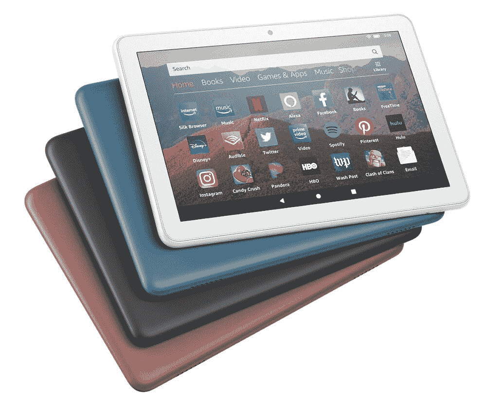
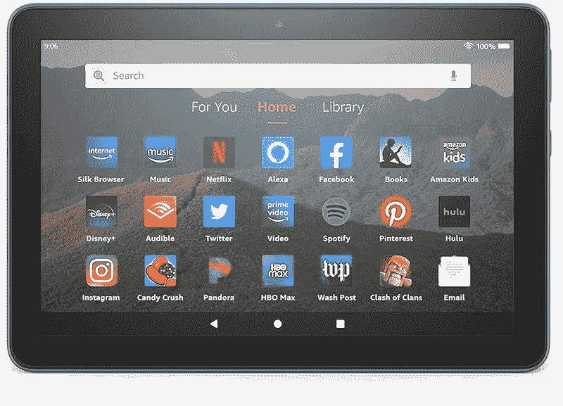

# 这些是亚马逊 Fire 平板电脑上最好的黄金日交易

> 原文：<https://www.xda-developers.com/amazon-fire-tablets-prime-day-deals/>

黄金日是购买亚马逊设备的最佳时机。除了现在，你可以以折扣价买一堆。如果你想给自己或孩子买一台 Fire 平板电脑，那么亚马逊现在就有一批在售。你可能会发现，由于大量的上市，找到正确的一个有点势不可挡，但我们在这里提供帮助。我们收集了亚马逊 Fire 平板电脑上的一些[最佳 Prime Day 交易](https://www.xda-developers.com/amazon-prime-day/)，供您在下面查看。

对于那些不知道的人，亚马逊的 Fire 平板电脑有三种尺寸——Fire 7 有 7 英寸的显示屏，Fire HD 8 有 8 英寸的显示屏，Fire HD 10 有 10.1 英寸的面板。随着尺寸越来越大，这些平板电脑的功能越来越强大，价格也越来越高。然而，即使是 Fire HD 10，与你的 iPads 或[最好的安卓平板电脑](https://www.xda-developers.com/best-android-tablets/)相比，也相对便宜。

## 亚马逊 Fire HD 8

 <picture></picture> 

Amazon Fire HD 8 tablet

如果你在这个黄金时段只有 50 美元买平板电脑，那就买 Fire HD 8 吧。它配备了 8 英寸的显示屏，与较小的 Fire 7 相比，它看起来更现代。8 英寸面板还支持更高的分辨率，这意味着与较小的平板电脑相比，您可以获得更清晰的视觉效果。你可以选择 32GB 和 64GB 的型号，也可以选择花更多的钱购买没有锁屏广告的型号。所有 Fire HD 8 型号都采用四核联发科 MT8168 芯片组，支持最大 1TB 的 microSD 卡。

如果你正在考虑给你的孩子买一台这样的平板电脑作为他们的第一台平板电脑，那么也许值得看看 Fire Kids 版本。它们本质上与标准的 Fire HD 8 平板电脑相同，但它们带有额外的家长控制、保护壳、两年保修和一年亚马逊 Kids+订阅。如果您想知道，Kids+订阅提供了适合儿童的视频、游戏、书籍等。还有 Fire HD 8 Plus 型号，它配备了更多内存和无线充电支持。

 <picture></picture> 

Amazon Fire HD 8

##### 亚马逊 Fire HD 8

如果你不想在平板电脑上花费超过 50 美元，亚马逊 Fire HD 8 平板电脑是一个值得考虑的可靠选择。这款平板电脑配备了 8 英寸显示屏，与较小的 Fire 7 平板电脑相比，内部结构更好。

Fire HD 8 平板电脑的基本版本有 32GB 的存储空间和锁屏广告，现在售价为 45 美元。您可以查看下表中的其他可用型号:

| 

火 HD 8 车型

 | 

亚马逊购买链接

 |
| --- | --- |
| **亚马逊 Fire HD 8 - 64GB，带锁屏广告** | [$74.99](https://www.amazon.com/dp/B0839MQ8Y8?tag=xda-27g8mdv-20&ascsubtag=UUxdaUeUpU42447&asc_refurl=https%3A%2F%2Fwww.xda-developers.com%2Famazon-fire-tablets-prime-day-deals%2F&asc_campaign=Affiliate) |
| **亚马逊 Fire HD 8 儿童平板电脑——32GB，无广告** | [$69.99](https://www.amazon.com/dp/B07WDDT3G5?tag=xda-27g8mdv-20&ascsubtag=UUxdaUeUpU42447&asc_refurl=https%3A%2F%2Fwww.xda-developers.com%2Famazon-fire-tablets-prime-day-deals%2F&asc_campaign=Affiliate) |
| **亚马逊 Fire HD 8 儿童专业平板电脑——32GB，无广告** | [$69.99](https://www.amazon.com/dp/B08H5PY8RM?tag=xda-27g8mdv-20&ascsubtag=UUxdaUeUpU42447&asc_refurl=https%3A%2F%2Fwww.xda-developers.com%2Famazon-fire-tablets-prime-day-deals%2F&asc_campaign=Affiliate) |
| **亚马逊 Fire HD 8 Plus - 32GB，带锁屏广告** | [$64.99](https://www.amazon.com/dp/B0839NDRB2?tag=xda-27g8mdv-20&ascsubtag=UUxdaUeUpU42447&asc_refurl=https%3A%2F%2Fwww.xda-developers.com%2Famazon-fire-tablets-prime-day-deals%2F&asc_campaign=Affiliate) |
| **亚马逊 Fire HD 8 Plus - 32GB，无锁屏广告** | [$79.99](https://www.amazon.com/dp/B0839NHZGL?tag=xda-27g8mdv-20&ascsubtag=UUxdaUeUpU42447&asc_refurl=https%3A%2F%2Fwww.xda-developers.com%2Famazon-fire-tablets-prime-day-deals%2F&asc_campaign=Affiliate) |
| **亚马逊 Fire HD 8 Plus - 64GB，带锁屏广告** | [$94.99](https://www.amazon.com/dp/B07YH1ZJBR?tag=xda-27g8mdv-20&ascsubtag=UUxdaUeUpU42447&asc_refurl=https%3A%2F%2Fwww.xda-developers.com%2Famazon-fire-tablets-prime-day-deals%2F&asc_campaign=Affiliate) |
| **亚马逊 Fire HD 8 Plus - 64GB，不带锁屏广告** | [109.99 美元](https://www.amazon.com/dp/B07VWXTFRY?tag=xda-27g8mdv-20&ascsubtag=UUxdaUeUpU42447&asc_refurl=https%3A%2F%2Fwww.xda-developers.com%2Famazon-fire-tablets-prime-day-deals%2F&asc_campaign=Affiliate) |

* * *

## 亚马逊 Fire HD 10

 <picture></picture> 

Amazon Fire HD 10

亚马逊 Fire HD 10 是该系列中最贵的选择，理所当然如此。它由八核联发科 MT8183 芯片组驱动，配有 3GB 内存和至少 32GB 的存储空间。Fire HD 10 也有一个 10.1 英寸的 1080p 面板，这意味着它比 Fire 系列的两款平板电脑更大，支持更高的分辨率。Fire HD 10 还支持亚马逊所谓的“显示模式”,你可以将它变成各种各样的 Echo Show 智能显示器。启用显示模式后，该平板电脑可以显示天气信息、日历事件、新闻报道等。

就像亚马逊 Fire HD 8 系列一样，您可以获得 Fire HD 10 儿童版本，它具有我们上面提到的所有好处。值得注意的是，还有 Fire HD 10 Plus，它支持无线充电，内存为 4GB，而不是 3GB。

 <picture></picture> 

Amazon Fire HD 10 tablet

##### 亚马逊 Fire HD 10

亚马逊 Fire HD 10 是该系列中最大、最强大的平板电脑。它配备了 10.1 英寸的 FHD 显示屏，更适合观看视频或进行视频通话。

您可以在下表中找到购买所有 Fire HD 10 型号的链接，因此请务必四处看看，选择符合您预算的型号:

| 

火 HD 10 型号

 | 

亚马逊购买链接

 |
| --- | --- |
| **亚马逊 Fire HD 10 - 32GB，无锁屏广告** | [$89.99](https://www.amazon.com/dp/B08BX7FV5L?tag=xda-27g8mdv-20&ascsubtag=UUxdaUeUpU42447&asc_refurl=https%3A%2F%2Fwww.xda-developers.com%2Famazon-fire-tablets-prime-day-deals%2F&asc_campaign=Affiliate) |
| **亚马逊 Fire HD 10 - 64GB，带锁屏广告** | [$95](https://www.amazon.com/dp/B08BX8CW9V?tag=xda-27g8mdv-20&ascsubtag=UUxdaUeUpU42447&asc_refurl=https%3A%2F%2Fwww.xda-developers.com%2Famazon-fire-tablets-prime-day-deals%2F&asc_campaign=Affiliate) |
| **亚马逊 Fire HD 10 - 64GB，不带锁屏广告** | [$109.99](https://www.amazon.com/dp/B08F6HDRWN?tag=xda-27g8mdv-20&ascsubtag=UUxdaUeUpU42447&asc_refurl=https%3A%2F%2Fwww.xda-developers.com%2Famazon-fire-tablets-prime-day-deals%2F&asc_campaign=Affiliate) |
| **亚马逊 Fire HD 10 儿童平板电脑——32GB，无广告** | [$119.99](https://www.amazon.com/dp/B08F62DV1Z?tag=xda-27g8mdv-20&ascsubtag=UUxdaUeUpU42447&asc_refurl=https%3A%2F%2Fwww.xda-developers.com%2Famazon-fire-tablets-prime-day-deals%2F&asc_campaign=Affiliate) |
| **亚马逊 Fire HD 10 Kids Pro 平板电脑——32GB，无广告** | [$119.99](https://www.amazon.com/dp/B08F5LWB6R?tag=xda-27g8mdv-20&ascsubtag=UUxdaUeUpU42447&asc_refurl=https%3A%2F%2Fwww.xda-developers.com%2Famazon-fire-tablets-prime-day-deals%2F&asc_campaign=Affiliate) |
| **亚马逊 Fire HD 10 Plus - 32GB，带锁屏广告** | [$104.99](https://www.amazon.com/dp/B08F6FYN6B?tag=xda-27g8mdv-20&ascsubtag=UUxdaUeUpU42447&asc_refurl=https%3A%2F%2Fwww.xda-developers.com%2Famazon-fire-tablets-prime-day-deals%2F&asc_campaign=Affiliate) |
| **亚马逊 Fire HD 10 Plus - 64GB，带锁屏广告** | [$144.99](https://www.amazon.com/dp/B08BX6B43K?tag=xda-27g8mdv-20&ascsubtag=UUxdaUeUpU42447&asc_refurl=https%3A%2F%2Fwww.xda-developers.com%2Famazon-fire-tablets-prime-day-deals%2F&asc_campaign=Affiliate) |
| **亚马逊 Fire HD 10 Plus - 64GB，不带锁屏广告** | [$159.99](https://www.amazon.com/dp/B08BX6B43K?tag=xda-27g8mdv-20&ascsubtag=UUxdaUeUpU42447&asc_refurl=https%3A%2F%2Fwww.xda-developers.com%2Famazon-fire-tablets-prime-day-deals%2F&asc_campaign=Affiliate) |

* * *

## 新款 Fire 7 平板不打折

亚马逊对其最近发布的 Fire 7 (2022 款)不提供任何折扣。相反，你可以购买一些大折扣的 2019 年款。我们最近评测的 [Fire 7 平板电脑(2022 型号)](https://www.xda-developers.com/amazon-fire-7-review/)配备了更好的内部部件和新的 Fire OS 8 软件。但如果你不介意购买较旧的硬件，那么你可以选择 2019 年的 Fire 7 型号，并节省一些钱。您可以在下面找到以折扣价购买部分 Fire 7 平板电脑的链接:

| 

火 7 (2019)款

 | 

亚马逊购买链接

 |
| --- | --- |
| **亚马逊 Fire 7 (2019 款)- 16GB，带锁屏广告** | [$29.99](https://www.amazon.com/dp/B07FKR6KXF?tag=xda-27g8mdv-20&ascsubtag=UUxdaUeUpU42447&asc_refurl=https%3A%2F%2Fwww.xda-developers.com%2Famazon-fire-tablets-prime-day-deals%2F&asc_campaign=Affiliate) |
| **亚马逊 Fire 7 (2019 款)——16GB，不带锁屏广告** | [$49.99](https://www.amazon.com/dp/B07JQP283M?tag=xda-27g8mdv-20&ascsubtag=UUxdaUeUpU42447&asc_refurl=https%3A%2F%2Fwww.xda-developers.com%2Famazon-fire-tablets-prime-day-deals%2F&asc_campaign=Affiliate) |
| **亚马逊 Fire 7 (2019 款)——32GB，带锁屏广告** | [$32.98](https://www.amazon.com/dp/B07FMPZNQQ?tag=xda-27g8mdv-20&ascsubtag=UUxdaUeUpU42447&asc_refurl=https%3A%2F%2Fwww.xda-developers.com%2Famazon-fire-tablets-prime-day-deals%2F&asc_campaign=Affiliate) |

亚马逊的 Fire 平板电脑，如你所见，都相当实惠。我们建议在这个黄金时间购买 Fire HD 8 或 Fire HD 10 平板电脑，因为 Fire 7 对于实际用途来说仍然太小。那么，你打算买哪一款亚马逊 Fire 平板呢？请在下面的评论中留言告诉我们。