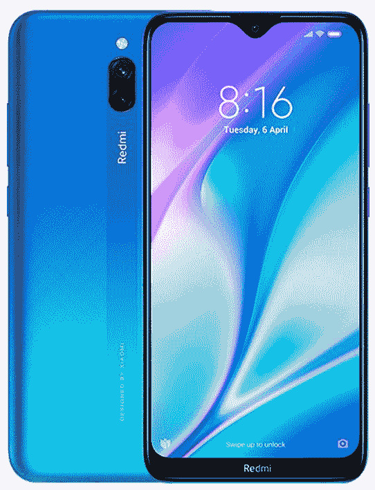
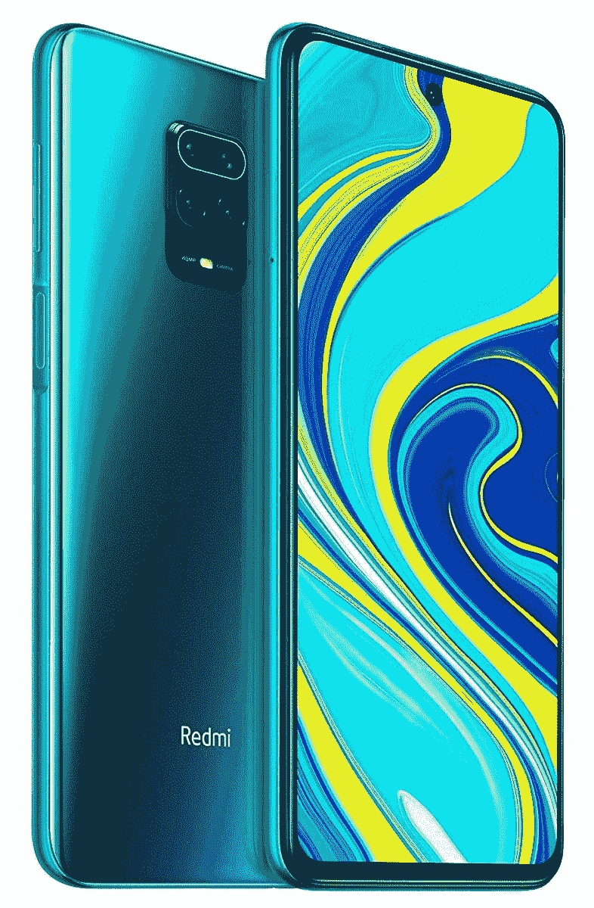
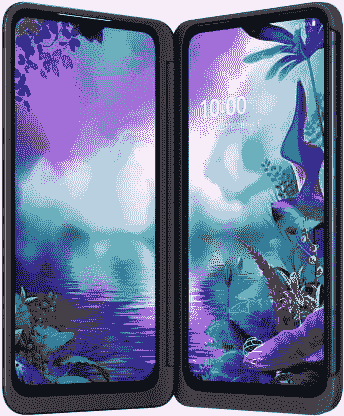
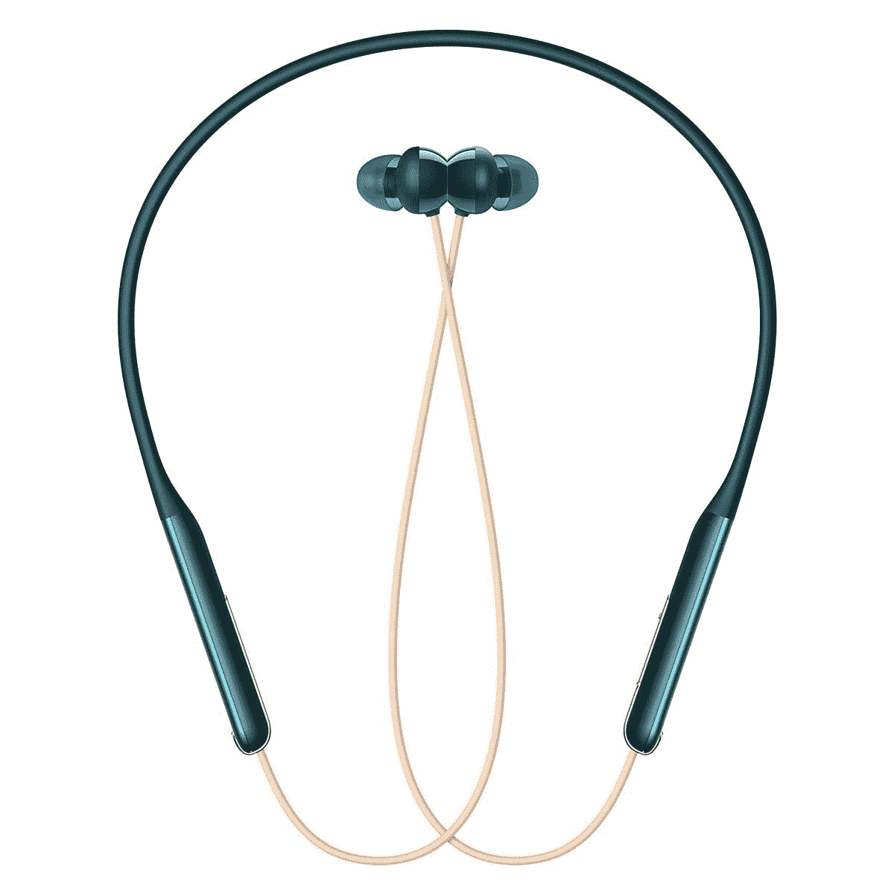
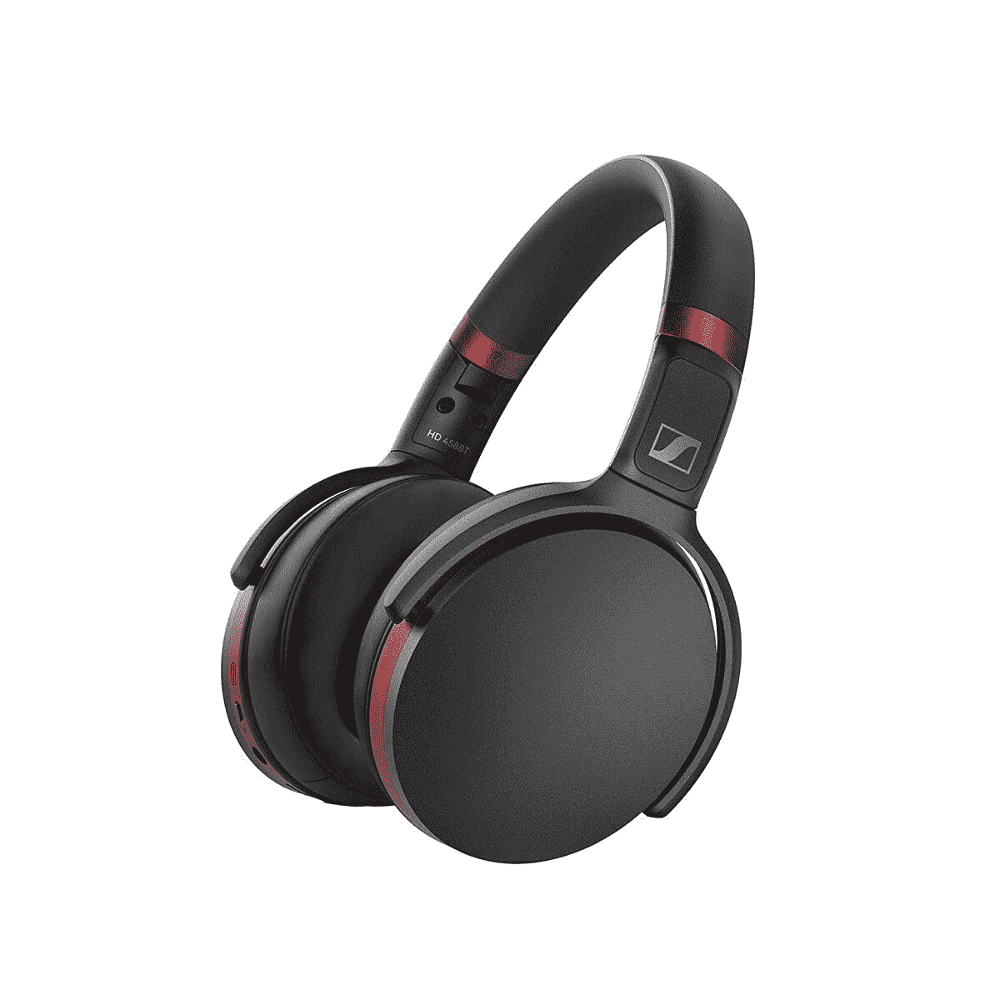
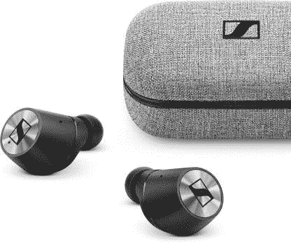
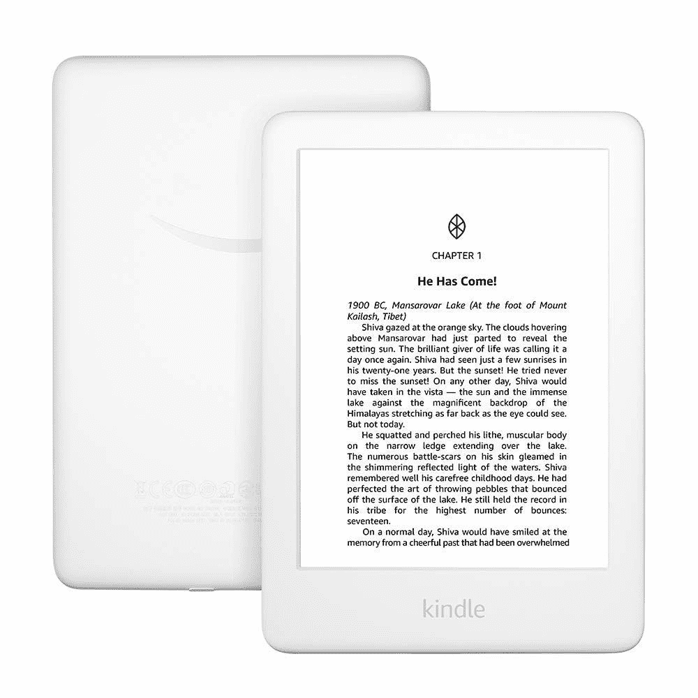
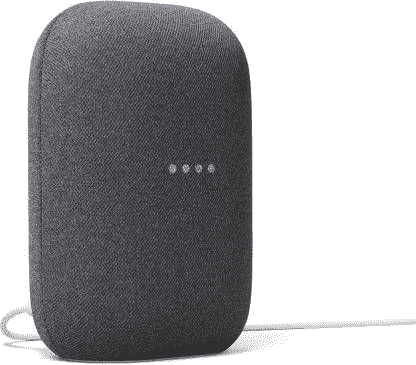

# 印度的 Flipkart 和亚马逊销售节:智能手机的最佳交易

> 原文：<https://www.xda-developers.com/amazon-flipkart-sales-festival-india-best-deals-smartphones-smart-accessories-more/>

# 印度亚马逊和 Flipkart 销售节:智能手机、智能配件等的最佳交易

这里是智能手机、配件和更多来自亚马逊印度节和印度 Flipkart Big Billion Days 的最佳交易。

Techtember 刚刚结束，Techtober 正在进行中。在过去的一个月里，我们已经看到了一系列智能手机和其他小工具的发布，现在，印度最大的两个在线平台正在该国即将到来的节日季之前举办他们的销售节。Flipkart Big Billion Days 2020 将于 10 月 16 日至 10 月 21 日举行，Flipkart Plus 会员的早期销售将于 10 月 15 日中午开始。亚马逊大印度节 2020 将于 10 月 17 日举行，亚马逊 Prime 客户的早期销售将于 10 月 16 日开始。以下是这两个平台上智能手机、可穿戴设备、音频配件、智能家居产品等的一些最佳交易。

## flipkart 2020 年大十亿天

*   开始时间:2020 年 10 月 16 日(2020 年 10 月 15 日中午，针对 Flipkart Plus 客户)
*   结束时间:2020 年 10 月 21 日
*   全平台优惠:**SBI 借记卡和信用卡 10%即时折扣(最高上限适用)**

## 亚马逊大印度节 2020

*   开始时间:2020 年 10 月 17 日(2020 年 10 月 16 日，适用于亚马逊 Prime 客户)
*   结局:未提及，但预计持续一个月
*   全平台优惠:**HDFC 借记卡和信用卡 10%即时折扣(最高上限适用)**

* * *

## 最佳交易和 XDA 的建议

 <picture></picture> 

Xiaomi Redmi 8A Dual

##### 小米 Redmi 8A Dual

Redmi 8A Dual 是一款不错的经济型手机，非常适合基本使用和儿童电子学习。

 <picture></picture> 

Xiaomi Redmi Note 9 Pro

##### 小米 Redmi Note 9 Pro

小米的 Redmi Note 9 Pro 是该公司超受欢迎的 Note 系列的一部分，对每个人来说都是一个很好的购买品。

 <picture></picture> 

POCO X3

POCO X3 对印度来说是一款新产品，但对于普通消费者来说，这是一款预算合理的最佳选择。

 <picture></picture> 

LG G8X

##### LG G8X

如果你想买一个双屏“可折叠”，这绝对是骁龙 855 有史以来最便宜的。

 <picture></picture> 

OnePlus Nord

##### 北一加

尽管这款手机没有折扣，但一加诺德仍然是一款价格实惠、值得推荐的手机。

 <picture></picture> 

Google Pixel 4a

##### 谷歌像素 4a

谷歌 Pixel 4a 是印度的新产品，以合理的价格带来了谷歌的最佳相机体验。

 <picture></picture> 

Oppo Enco M31

##### OPPO Enco M31

OPPO Enco M31 的价格听起来很惊人(你会惊讶的！)，现在更便宜了。

 <picture></picture> 

Sennheiser HD458 Headphones

##### 森海塞尔 HD 458BT

森海塞尔 HD458 是一副很好的耳机，价格是平时的一半，非常超值！

 <picture></picture> 

Sennheiser Momentum TWS

##### 森海塞尔势头真无线

森海塞尔动量 TWS 是一个伟大的一对耳机，现在是他们有史以来最低的价格。

 <picture></picture> 

Mi TV Stick

##### 小米电视棒

如果你正在寻找给你的哑电视添加一些 Android TV 和 PatchWall 的智能，小米的 mi 电视棒是有史以来最低的价格！

 <picture></picture> 

Kindle 10th Gen with Wi-Fi

##### 亚马逊 Kindle(第十代)

配备 6 英寸显示屏的第十代 Kindle 现在价格合理，非常适合回到阅读状态。

 <picture></picture> 

Google Nest Audio

##### 谷歌巢音频

Google Nest Audio 将出色的扬声器系统与 Google Assistant 的智能相结合，看起来很棒，但做得很好。

* * *

## 新品发布和预订优惠

这些是我们可以在两个领先平台上找到的新发布产品。查看各个列表，了解发布优惠！

### 智能手机

| 

没有。

 | 

产品

 | 

发布价格/ MRP

 | 

平台/购买链接

 |
| --- | --- | --- | --- |
|  | **苹果** |  |  |
| 1. | [iPhone 12](https://www.xda-developers.com/apple-iphone-12-series/) (64GB) | ₹79,900 | [Flipkart](https://www.flipkart.com/apple-iphone-12-white-64-gb/p/itm8b88bdc03cd79) |
| 2. | iPhone 12 (128GB) | ₹84,900 | [Flipkart](https://www.flipkart.com/apple-iphone-12-white-128-gb/p/itm95393f4c6cc59?pid=MOBFWBYZBTZFGJF9) |
| 3. | iPhone 12 (256GB) | ₹94,900 | [翻转式](https://www.flipkart.com/apple-iphone-12-white-256-gb/p/itmcfbcb621e6326?pid=MOBFWBYZMNGZVMJE) |
| 4. | [iPhone 12 Pro](https://www.xda-developers.com/apple-iphone-12-series/) (128GB) | ₹1,19,900 | [翻转车](https://www.flipkart.com/apple-iphone-12-pro-graphite-128-gb/p/itm03e5f2595d843) |
| 5. | iPhone 12 Pro (256GB) | ₹1,29,900 | [翻转车](https://www.flipkart.com/apple-iphone-12-pro-graphite-256-gb/p/itm4fa4da575698c) |
| 6. | iPhone 12 Pro (512GB) | ₹1,49,900 | [翻转车](https://www.flipkart.com/apple-iphone-12-pro-graphite-512-gb/p/itmdf0ffb4f2150f?pid=MOBFWBYZ4ZZ5VUQD) |
|  |  |  |  |
|  | **华硕** |  |  |
| 1. | [ROG 手机 3](https://www.xda-developers.com/asus-rog-phone-3-gaming-smartphone-snapdragon-865-plus-144hz-display-6000mah-battery-launch/) (8GB + 128GB) | ₹49,999 | [翻转车](https://www.flipkart.com/asus-rog-phone-3-black-128-gb/p/itm93ba84fa7cce9?pid=MOBFTHGZEYPWHGHE) |
| 2. | [ROG 手机 3](https://www.xda-developers.com/asus-rog-phone-3-gaming-smartphone-snapdragon-865-plus-144hz-display-6000mah-battery-launch/) (12GB + 128GB) | ₹52,999 | [翻转车](https://www.flipkart.com/asus-rog-phone-3-black-128-gb/p/itmf8623d755871d) |
| 3. | [ROG 手机 3](https://www.xda-developers.com/asus-rog-phone-3-gaming-smartphone-snapdragon-865-plus-144hz-display-6000mah-battery-launch/) (12GB + 256GB) | ₹57,999 | [翻转车](https://www.flipkart.com/asus-rog-phone-3-black-256-gb/p/itm6afca808c4251) |
|  |  |  |  |
|  | **谷歌** |  |  |
| 1. | [像素 4a](https://www.xda-developers.com/google-pixel-4a-specs-features-pricing-availability/) (6GB + 128GB) | ₹29,999 | [翻转型车](https://www.flipkart.com/google-pixel-4a-just-black-128-gb/p/itm023b9677aa45d) |
|  |  |  |  |
|  | **一加** |  |  |
| 1. | [OnePlus 8T](https://www.xda-developers.com/oneplus-8t-review/) (8GB + 128GB) | ≈42,999 | [亚马逊。在](https://www.amazon.in/OnePlus-Mirror-Black-128GB-Storage/dp/B085J17VVP/?tag=xdaportalin-21)中 |
| 2. | OnePlus 8T(12GB + 256GB) | ≈45,999 | [亚马逊。在](https://www.amazon.in/OnePlus-Mirror-Black-128GB-Storage/dp/B085J19V4P/?tag=xdaportalin-21)中 |
|  |  |  |  |
|  | **少** |  |  |
| 1. | [【少许 x3】](https://www.xda-developers.com/poco-x3-launched-india/)(6gb+64gb) | ≈16,999 | (T10)旋转木马(T11) |
| 2. | 小 X3 (6GB + 128GB) | ¥18,499 |  |
| 3. | 小 X3 (8GB + 128GB) | ≈19,999 | (T14)旋转木马(T15) |
| 4. | [少量 C3](https://www.xda-developers.com/poco-c3-mediatek-helio-g35-5000mah-battery-triple-cameras-launched-india/) (3GB + 32GB) | ¥7.499 |  |
| 5. | 低 C3 (4GB + 64GB) | ≈8.999 | [翻转(T21)](https://www.flipkart.com/poco-c3-arctic-blue-64-gb/p/itm7f632fdb49b3b?pid=MOBFVQJ5NV9ZSYEF) |
|  |  |  |  |
|  | (T22)实数(T23) |  |  |
| 1. | [Narzo 20 Pro](https://www.xda-developers.com/realme-narzo-20-narzo-20-pro-narzo-20a-launched-india/) (6GB + 64GB) | ≈14,999 | (T26)旋转木马(T27) |
| 2. | Narzo 20 Pro(8GB + 128GB) | ≈16,999 | (T28)旋转木马(T29) |
| 3. | Narzo 20 (T31) (4GB + 64GB) | ¥10.499 | (T32)旋转木马(T33) |
| 4. | Narzo 20 (6GB + 128GB) | ¥11,499 | (T34)旋转木马(T35) |
|  |  |  |  |
|  | **三星(T37)** |  |  |
| 1. | galaxy f14(t39)(6 GB+64gb) | ≈15.499 | (T40)旋转木马(T41) |
| 2. | galaxy f14(6gb+128 GB) | ¥16.499 | (T42)旋转木马(T43) |
| 3. | [三星 galaxy s2fe](https://www.xda-developers.com/samsung-galaxy-s20-fe-review/)(8gb+128 GB) | ≈49,999 | [亚马逊网站](https://www.amazon.in/Test-Exclusive-2000-Multi-Storage/dp/B086KF8DL1?tag=xdaportalin-21) |
|  |  |  |  |
|  | **活着** |  |  |
| 1. | [活着 V20](https://www.xda-developers.com/vivo-v20-snapdragon-720g-44mp-selfie-camer-android-11-launched-india/) (8GB + 128GB) | ₹24,990 | [翻转式](https://www.flipkart.com/vivo-v20-sunset-melody-128-gb/p/itm3c6e689e97959) |
| 2. | v20 live(8gb+256 GB) | ₹27,990 | [翻转车](https://www.flipkart.com/vivo-v20-midnight-jazz-256-gb/p/itm3c6e689e97959?pid=MOBFVWB4ZGHFQPGG) |
|  |  |  |  |
|  | **小米** |  |  |
| 1. | [米 10T](https://www.xda-developers.com/xiaomi-mi-10t-pro-snapdragon-865-144-hz-refresh-rate-launch-india/) (6GB + 128GB) | ₹35,999 | [翻转车](https://www.flipkart.com/mi-10t-lunar-silver-128-gb/p/itmfda83f4425f80?pid=MOBFWAFZQUEQYPFG) |
| 2. | 米 10T (8GB + 128GB) | ₹37,999 | [翻转车](https://www.flipkart.com/mi-10t-lunar-silver-128-gb/p/itmdbebb315db61a?pid=MOBFWAFZNAFJN8YA) |
| 3. | [米 10T Pro](https://www.xda-developers.com/xiaomi-mi-10t-pro-snapdragon-865-144-hz-refresh-rate-launch-india/) (8GB + 128GB) | ₹39,999 | -什么 |

### 配件、平板电脑、智能手表、耳机

* * *

## 折扣

这些都是我们可以在不同类别中找到的折扣！

### 智能手机

| 

没有。

 | 

产品

 | 

发布价格/ MRP

 | 

折扣价格

 | 

平台折扣

 |
| --- | --- | --- | --- | --- |
|  | 苹果 |  |  |  |
| 1. | iPhone 11 Pro (64GB) | ₹1,06,900 | ₹79,999 | [₹26,901 在 Flipkart 上关机](https://www.flipkart.com/apple-iphone-11-pro-space-grey-64-gb/p/itm7e24c1c560208) |
| 2. | iPhone 11 Pro (128GB) | ₹1,21,900 | ₹92,999 | ₹28,901 在 Flipkart 上关机 |
| 3. | iPhone 11 Pro (256GB) | ₹1,40,900 | ₹1,09,999 | ₹30,901 在 Flipkart 上关机 |
| 4. | iPhone 11 (64GB) | ₹61,990 | ₹47,999 | [₹13,991 在亚马逊上下线](https://www.amazon.in/dp/B07XVKG5XV?tag=xdaportalin-21) |
| 5. | iPhone 11 (128GB) | ₹69,990 | ₹54,999 | [₹14,991 在亚马逊上下线](https://www.amazon.in/dp/B07XVLMXYH?tag=xdaportalin-21) |
| 6. | iPhone XR (64GB) | ₹47,900 | ₹37,999 | [₹9,901 在 Flipkart 上关机](https://www.flipkart.com/apple-iphone-xr-black-64-gb/p/itmf9z7zxu4uqyz2) |
| 7. | iPhone XR (128GB) | ₹52,900 | ₹42,999 | [₹9,901 在 Flipkart 上关机](https://www.flipkart.com/apple-iphone-xr-black-128-gb/p/itmf9z7zhdgzwmzm) |
| 8. | iPhone SE (64GB) | ₹39,900 | ₹25,999 | [₹13,901 在 Flipkart 上关机](https://www.flipkart.com/apple-iphone-se-black-64-gb/p/itm832dd5963a08d) |
| 9. | iPhone SE (128GB) | ₹44,900 | ₹30,999 | [₹13,901 在 Flipkart 上关闭](https://www.flipkart.com/apple-iphone-se-black-128-gb/p/itm82fa36b77c804) |
| 10. | iPhone SE (256GB) | ₹54,900 | ₹40,999 | [₹13,901 在 Flipkart 上关机](https://www.flipkart.com/apple-iphone-se-black-256-gb/p/itm904337fdd4d7f) |
|  |  |  |  |  |
|  | **iqo** |  |  |  |
| 1. | [iQOO 3](https://www.xda-developers.com/iqoo-3-5g-review-one-of-the-fastest-but-not-smoothest-smartphones/) 4G (8GB + 128GB) | ₹34,990 | ₹29,990 | [₹5,000 在 Flipkart 上关闭](https://www.flipkart.com/iqoo-3-tornado-black-128-gb/p/itm7d075bc17be11) |
| 2. | iqooo 3 4g(8gb+256 GB) | ₹37,990 | ₹32,990 | [₹5,000 在 Flipkart 上关闭](https://www.flipkart.com/iqoo-3-tornado-black-256-gb/p/itm7d075bc17be11?pid=MOBFP4P2KYWUHFQU) |
|  |  |  |  |  |
|  | **LG** |  |  |  |
| 1. | [LG G8X](https://www.xda-developers.com/lg-g8x-with-dual-screen-first-impressions-a-fun-gimmick/) (6GB + 128GB) | ₹54,990 | ₹19,990 | [₹35,000 在 Flipkart 上关闭](https://www.flipkart.com/lg-g8x-black-128-gb/p/itme8a4f5f473aa4?pid=MOBFZKQWFRFMHKQK) |
|  |  |  |  |  |
|  | **摩托罗拉** |  |  |  |
| 1. | [摩托罗拉 E7 Plus](https://www.xda-developers.com/moto-e7-plus-snapdragon-460-5000mah-battery-launched/) (4GB + 64GB) | ₹9,499 | ₹8,999 | [₹500 在 Flipkart 上关机](https://www.flipkart.com/motorola-e7-plus-misty-blue-64-gb/p/itm5c34115d6c501) |
| 2. | [摩托罗拉 G9](https://www.xda-developers.com/motorola-moto-g9-snapdragon-662-5000mah-battery-launched-india/) (4GB + 64GB) | ₹11,499 | ₹9,999 | [₹1,500 在 Flipkart 上关机](https://www.flipkart.com/motorola-g9-forest-green-64-gb/p/itm5920e4dbd0c87) |
| 3. | [摩托罗拉一融合+](https://www.xda-developers.com/motorola-one-fusion-plus-review/) (6GB + 128GB) | ₹17,499 | ₹15,999 | ₹1,500 在 Flipkart 上关机 |
|  |  |  |  |  |
|  | **诺基亚** |  |  |  |
| 1. | 诺基亚 5.3 (4GB + 64GB) | ₹13,999 | ₹12,999 | [₹1,000 在亚马逊上下线](https://www.amazon.in/Nokia-5-3-Android-Smartphone-64/dp/B08GT299NQ?tag=xdaportalin-21) |
| 2. | 诺基亚 5.3 (6GB + 64GB) | ₹15,499 | ₹14,499 | [₹1,000 在亚马逊上下线](https://www.amazon.in/Nokia-5-3-Android-Smartphone-64/dp/B08GT28WQQ?tag=xdaportalin-21) |
|  |  |  |  |  |
|  | **一加** |  |  |  |
| 1. | [一加 8](https://www.xda-developers.com/oneplus-8-xda-review/) (6GB + 128GB) | ₹41,999 | ₹39,999 | [亚马逊上的₹2,000 关](https://www.amazon.in/Test-Exclusive-547/dp/B078BNQ318/?tag=xdaportalin-21) |
| 2. | 一加 8 (8GB + 128GB) | ₹44,999 | ₹41,999 | [亚马逊上的₹3,000 关闭](https://www.amazon.in/Test-Exclusive-547/dp/B077Q42GD8/?tag=xdaportalin-21) |
| 3. | 一加 8 (12GB + 256GB) | ₹49,999 | ₹44,999 | [亚马逊上的₹5,000 关闭](https://www.amazon.in/Test-Exclusive-547/dp/B077PWJQZM/?tag=xdaportalin-21) |
| 4. | [one plus north](https://www.xda-developers.com/oneplus-nord-review/) (6gb+64gb) | ₹24,999 | ₹24,999 | [亚马逊。在](https://www.amazon.in/OnePlus-Mirror-Black-128GB-Storage/dp/B085J1JDB7/?tag=xdaportalin-21)中 |
| 5. | one plus north(8 GB+128 GB) | ₹27,999 | ₹27,999 | [亚马逊。在](https://www.amazon.in/OnePlus-Nord-Marble-128GB-Storage/dp/B086977J3K?tag=xdaportalin-21)中 |
| 6. | one plus north(12gb+256 GB) | ₹29,999 | ₹29,999 | [亚马逊。在](https://www.amazon.in/OnePlus-Nord-Gray-256GB-Storage/dp/B08697MJD8?tag=xdaportalin-21)中 |
|  |  |  |  |  |
|  | **鸦片** |  |  |  |
| 1. | O Find X2 (12GB + 256GB) | ₹64,990 | ₹64,990 | [亚马逊。在](https://www.amazon.in/Ocean-256GB-Storage-Additional-Offers/dp/B08695Z3GR?tag=xdaportalin-21)中 |
|  |  |  |  |  |
|  | **少** |  |  |  |
| 1. | [小 M2 Pro](https://www.xda-developers.com/poco-m2-pro-review/) (4GB + 64GB) | ₹13,999 | ₹12,999 | [关于旋转木马](https://www.flipkart.com/poco-m2-pro-out-blue-64-gb/p/itm9fa1bcc61b2c1?pid=MOBFT7MKRQXK9KKF) |
| 2. | Pro 小型 m2(6gb+64gb) | ₹14,999 | ₹13,999 | [关于旋转木马](https://www.flipkart.com/poco-m2-pro-out-blue-64-gb/p/itmca92df4f824d5?pid=MOBFT7MKV4EZTNRS) |
| 3. | Pro 小型 m2(6gb+128 GB) | ₹16,999 | ₹15,999 | [关于弹性体](https://www.flipkart.com/poco-m2-pro-out-blue-128-gb/p/itm151565feac420?pid=MOBFT7MKCGTQTBBU) |
| 4. | [【少许 m2】](https://www.xda-developers.com/poco-m2-mediatek-helio-g80-5000mah-battery-launched-india/)(6gb+64gb) | ₹10,999 | ₹9,999 | [关于旋转木马](https://www.flipkart.com/poco-m2-pitch-black-64-gb/p/itm630300707d0a5?pid=MOBFV9V92KHMFCVF) |
| 5. | 小 M2 (6GB + 128GB) | ₹12,999 | ₹11,999 | [关于旋转木马](https://www.flipkart.com/poco-m2-slate-blue-128-gb/p/itmf3c6e76492ff5?pid=MOBFV9V9XZJJ9NUV) |
| 6. | [【少许 x2】](https://www.xda-developers.com/poco-x2-review-better-than-poco-f1/)(6gb+64gb) | ₹17,499 | ₹16,499 | [关于挂车](https://www.flipkart.com/poco-x2-atlantis-blue-64-gb/p/itmbe7b58e0378b8?pid=MOBFZGJ6ZGMD7GEZ) |
| 7. | 小 X2 (6GB + 128GB) | ₹18,499 | ₹17,499 | [关于旋转木马](https://www.flipkart.com/poco-x2-atlantis-blue-128-gb/p/itm36af4a9c20dd5?pid=MOBFZGJ6GQRXFZGT) |
| 8. | 小 X2 (8GB + 256GB) | ₹21,499 | ₹20,499 | [在旋转木马上关机](https://www.flipkart.com/poco-x2-atlantis-blue-256-gb/p/itm57a8dd0ea482a?pid=MOBFZGJ6FZK2Y4K4) |
|  |  |  |  |  |
|  | **实数** |  |  |  |
| 1. | [Realme 7 Pro](https://www.xda-developers.com/realme-7-realme-7-pro-launched-india/) (6GB + 128GB) | ₹19,999 | ₹19,999 | [翻转车](https://www.flipkart.com/realme-7-pro-mirror-blue-128-gb/p/itm72f96fb9b13c3?pid=MOBFUYUNYA4FWDRE) |
| 2. | Realme 7 Pro (8GB + 128GB) | ₹21,999 | ₹21,999 | [翻转车](https://www.flipkart.com/realme-7-pro-mirror-blue-128-gb/p/itm72f96fb9b13c3?pid=MOBFUYUNRDGSC4XF) |
| 3. | [Realme 7](https://www.xda-developers.com/realme-7-realme-7-pro-launched-india/) (6GB + 64GB) | ₹14,999 | ₹14,999 | [翻转车](https://www.flipkart.com/realme-7-mist-white-64-gb/p/itme55d08631f19b) |
| 4. | Realme 7 (8GB + 128GB) | ₹16,999 | ₹16,999 | [翻转车](https://www.flipkart.com/realme-7-mist-blue-128-gb/p/itme55d08631f19b?pid=MOBFUYUN2YDKVEHE) |
| 5. | [实数 X3](https://www.xda-developers.com/realme-x3-superzoom-120hz-display-snapdragon-855-plus-india-launch-june-25/) (6GB + 128GB) | ₹24,999 | ₹21,999 | [₹3,000 在 Flipkart 上关闭](https://www.flipkart.com/realme-x3-arctic-white-128-gb/p/itm325a6e0c17b0a) |
| 6. | Realme X3 (8GB + 128GB) | ₹25,999 | ₹22,999 | [₹3,000 在 Flipkart 上关闭](https://www.flipkart.com/realme-x3-arctic-white-128-gb/p/itm325a6e0c17b0a?pid=MOBFSS3QVKCSJY9P) |
| 7. | [Realme X3 超级变焦](https://www.xda-developers.com/realme-x3-superzoom-review-an-actual-flagship-killer/) (8GB + 128GB) | ₹27,999 | ₹24,999 | [₹3,000 在 Flipkart 上关闭](https://www.flipkart.com/realme-x3-superzoom-glacier-blue-128-gb/p/itm7e4d21f06e37e) |
| 8. | Realme X3 超级变焦(12GB + 256GB) | ₹32,999 | ₹29,999 | [₹3,000 在 Flipkart 上关闭](https://www.flipkart.com/realme-x3-superzoom-arctic-white-256-gb/p/itm7e4d21f06e37e?pid=MOBFSS3QVJQSCW4R) |
| 9. | [realme x50 pro](https://www.xda-developers.com/realme-x50-pro-5g-review/)(8gb+128 GB) | ₹41,999 | ₹36,999 | [₹5,000 在 Flipkart 上关机](https://www.flipkart.com/realme-x50-pro-moss-green-128-gb/p/itm13d1770db35a3) |
| 10. | Realme X50 Pro (12GB + 256GB) | ₹47,999 | ₹42,999 | [₹5,000 在 Flipkart 上关机](https://www.flipkart.com/realme-x50-pro-moss-green-256-gb/p/itm13d1770db35a3?pid=MOBFP6WYFBVHDHY8) |
|  |  |  |  |  |
|  | **三星** |  |  |  |
| 1. | [银河 50s](https://www.xda-developers.com/samsung-galaxy-m30s-galaxy-a50s-review-comparison/) (4GB + 128GB) | ₹22,999 | ₹13,999 | [₹9,000 在 Flipkart 上关机](https://www.flipkart.com/samsung-galaxy-a50s-prism-crush-violet-128-gb/p/itme505f5f410d1c) |
| 2. | [银河 70s](https://www.xda-developers.com/samsung-galaxy-a70s-64mp-samsung-gw1-india/) (6GB + 128GB) | ₹28,999 | ₹22,999 | [₹6,000 在 Flipkart 上关机](https://www.flipkart.com/samsung-galaxy-a70s-prism-crush-white-128-gb/p/itmab708ad714abe) |
| 3. | 70s galaxy(8gb+128 GB) | ₹30,999 | ₹25,999 | [₹5,000 在 Flipkart 上关机](https://www.flipkart.com/samsung-galaxy-a70s-prism-crush-white-128-gb/p/itm57a85273f03b6?pid=MOBFKKGRJCHHRJS5) |
| 4. | Galaxy M31 Prime 版(6GB + 128GB) | ₹16,499 | ₹16,499 | [亚马逊上的₹1,000 返现](https://www.amazon.in/OnePlus-Mirror-Black-128GB-Storage/dp/B085J3GN6M?tag=xdaportalin-21) [给 Prime 客户](https://www.amazon.in/OnePlus-Mirror-Black-128GB-Storage/dp/B085J3GN6M?tag=xdaportalin-21) |
| 5. | [银河 M31s](https://www.xda-developers.com/samsung-galaxy-m31s-review/) (6GB + 128GB) | ₹19,499 | ₹18,499 | [亚马逊上的₹1,000 关闭](https://www.amazon.in/Test-Exclusive-712/dp/B07DJCJBB3?tag=xdaportalin-21) |
| 6. | Galaxy M31s (8GB + 128GB) | ₹21,999 | ₹20,499 | [₹1,000 在亚马逊上下线](https://www.amazon.in/Test-Exclusive-712/dp/B07DJCJBBN?tag=xdaportalin-21) |
| 7. | [银河 M51](https://www.xda-developers.com/samsung-galaxy-m51-review/) (6GB + 128GB) | ₹24,999 | ₹22,499 | [亚马逊上的₹2,500](https://www.amazon.in/Samsung-Galaxy-Electric-128GB-Storage/dp/B085J1J32G?tag=xdaportalin-21) |
| 8. | Galaxy M51 (8GB + 128GB) | ₹26,999 | ₹24,999 | [亚马逊上的₹2,000](https://www.amazon.in/Samsung-Galaxy-Electric-128GB-Storage/dp/B085J1868F?tag=xdaportalin-21) |
| 9. | [银河笔记 10+](https://www.xda-developers.com/samsung-galaxy-note-10-review/) (12GB+256 GB) | ₹84,999 | ₹54,999 | [₹30,000 在 Flipkart 上关闭](https://www.flipkart.com/samsung-galaxy-note-10-plus-aura-black-256-gb/p/itmefb5b0451a4bd) |
| 10. | [银河 S10](https://www.xda-developers.com/samsung-galaxy-s10-camera-review-updates/) (8GB + 128GB) | ₹49,999 | ₹39,999 | [₹10,000 在亚马逊上下线](https://www.amazon.in/Samsung-Galaxy-Storage-Additional-Exchange/dp/B07KXCK8S6?tag=xdaportalin-21) |
| 11. | [银河 S10+](https://www.xda-developers.com/samsung-galaxy-s10-s10-and-s10e-launch-with-the-snapdragon-855-ultrasonic-in-display-fingerprint-scanners-reverse-wireless-charging-and-a-whole-lot-more/) (8GB + 128GB) | ₹52,999 | ₹44,999 | [₹7,000 在亚马逊上下线](https://www.amazon.in/Samsung-Galaxy-Storage-Additional-Exchange/dp/B07KXC7QS4?tag=xdaportalin-21) |
| 12. | [银河 S20+](https://www.xda-developers.com/samsung-galaxy-s20-plus-review/) (8GB + 128GB) | ₹77,999 | ₹49,999 | [₹28,000 在 Flipkart 上关机](https://www.flipkart.com/samsung-galaxy-s20-cosmic-gray-128-gb/p/itm7087be7ae167c) |
|  |  |  |  |  |
|  | **活着** |  |  |  |
| 1. | [Vivo V17](https://www.xda-developers.com/vivo-v17-hole-punch-48mp-snapdragon-675-india/) | ₹22,990 | ₹17,990 | [₹5,000 在亚马逊上下线](https://www.amazon.in/Vivo-Midnight-Storage-Additional-Exchange/dp/B07XD2G5C7/?tag=xdaportalin-21) |
| 2. | Vivo Y30 | ₹14,990 | ₹13,990 | [₹1,000 在 Flipkart 上关闭](https://www.flipkart.com/vivo-y30-emerald-black-128-gb/p/itm1791342f24d04) |
|  |  |  |  |  |
|  | **小米** |  |  |  |
| 1. | [米 10](https://www.xda-developers.com/xiaomi-mi-10-review/) (8GB + 128GB) | ₹49,999 | ₹44,999 | [₹5,000 在亚马逊上下线](https://www.amazon.in/Test-A6010-Dummy-Asin_40/dp/B07X1KT6MR?tag=xdaportalin-21) |
| 2. | 小米 10 (8GB + 256GB) | ₹54,999 | ₹49,999 | [亚马逊上的₹5,000 关闭](https://www.amazon.in/Test-A6010-Dummy-Asin_40/dp/B07X4R4F4G?tag=xdaportalin-21) |
| 3. | [红米 8A 双](https://www.xda-developers.com/xiaomi-redmi-8a-dual-rear-cameras-redmi-power-bank-india/) (2GB + 32GB) | ₹7,499 | ₹7,299 | [亚马逊上的₹200](https://www.amazon.in/Redmi-8A-Dual-Blue-Storage/dp/B07X4R63DF?tag=xdaportalin-21) |
| 4. | 红米 8A 双(3GB + 32GB) | ₹8,299 | ₹7,999 | [亚马逊上的₹300 关闭了](https://www.amazon.in/Redmi-8A-Dual-Blue-Storage/dp/B07WPVLKPW?tag=xdaportalin-21) |
| 5. | 红米 8A 双(3GB + 64GB) | ₹8,999 | ₹8,499 | [亚马逊上的₹500](https://www.amazon.in/Redmi-8A-Dual-Blue-Storage/dp/B08698559Z?tag=xdaportalin-21) |
| 6. | 红米 9 Prime (4GB + 64GB) | ₹9,999 | ₹9,999 | [亚马逊网站](https://www.amazon.in/Redmi-Prime-Storage-Display-Camera/dp/B08697MJDK?tag=xdaportalin-21) |
| 7. | 红米 9 Prime (4GB + 128GB) | ₹11,999 | ₹10,999 | [₹1,000 在亚马逊上下线](https://www.amazon.in/Redmi-Prime-Storage-Display-Camera/dp/B086984LJ4?tag=xdaportalin-21) |
| 8. | [红米 Note 9](https://www.xda-developers.com/xiaomi-redmi-note-9-mediatek-helio-g85-soc-launched-india/) (4GB + 64GB) | ₹11,999 | ₹10,999 | [₹1,000 在亚马逊上下线](https://www.amazon.in/Redmi-Note-Pebble-Grey-Storage/dp/B086977TR6?tag=xdaportalin-21) |
| 9. | 红米 Note 9 (4GB + 64GB) | ₹13,499 | ₹12,499 | [₹1,000 在亚马逊上下线](https://www.amazon.in/Redmi-Note-Pebble-Grey-Storage/dp/B08695YRKV?tag=xdaportalin-21) |
| 10. | 红米 Note 9 (4GB + 64GB) | ₹14,999 | ₹13,999 | [₹1,000 在亚马逊上下线](https://www.amazon.in/Redmi-Note-Pebble-Grey-Storage/dp/B08697KLYV?tag=xdaportalin-21) |
| 11. | [红米 Note 9 Pro](https://www.xda-developers.com/xiaomi-redmi-note-9-pro-review-snapdragon-720g-48mp/) (4GB + 64GB) | ₹13,999 | ₹12,999 | [亚马逊上的₹1,000 关闭](https://www.amazon.in/Test-Exclusive-550/dp/B077Q7GW9V?tag=xdaportalin-21) |
| 12. | 红米 Note 9 Pro (4GB + 128GB) | ₹15,999 | ₹14,499 | [亚马逊上的₹1,500 关闭](https://www.amazon.in/Test-Exclusive-550/dp/B08695ZKFF?tag=xdaportalin-21) |
| 13. | 红米 Note 9 Pro (6GB + 128GB) | ₹16,999 | ₹15,999 | [₹1,000 在亚马逊上下线](https://www.amazon.in/Test-Exclusive-550/dp/B0784D7NFQ?tag=xdaportalin-21) |
| 14. | [红米 Note 9 Pro Max](https://www.xda-developers.com/redmi-note-9-pro-max-hands-on-video/) (6GB + 64GB) | ₹16,999 | ₹15,999 | [亚马逊上的₹1,000](https://www.amazon.in/Test-Exclusive-557/dp/B077PWJ8RS?tag=xdaportalin-21) |
| 15. | 红米 Note 9 Pro Max (6GB + 128GB) | ₹18,499 | ₹17,999 | [亚马逊上的₹500](https://www.amazon.in/Test-Exclusive-557/dp/B07HGBMHTR?tag=xdaportalin-21) |
| 16. | 红米 Note 9 Pro Max (8GB + 128GB) | ₹19,999 | ₹18,999 | [亚马逊上的₹1,000 关闭了](https://www.amazon.in/Test-Exclusive-557/dp/B07X4PW616?tag=xdaportalin-21) |
| 17. | [红米 Note 8](https://www.xda-developers.com/redmi-note-8-review/) (4GB + 64GB) | ₹13,999 | ₹11,499 | [₹1,500 在 Flipkart 上关机](https://www.flipkart.com/redmi-note-8-moonlight-white-64-gb/p/itmd9fd42df891ce) |
| 18. | 红米 Note 8 (6GB + 128GB) | ₹15,999 | ₹13,499 | [₹1,500 在 Flipkart 上关机](https://www.flipkart.com/redmi-note-8-space-black-128-gb/p/itm6b33a12abb221?pid=MOBFHHQRQF2A4PS2) |

### 配件、平板电脑、智能手表、耳机

| 

没有。

 | 

产品

 | 

发布价格/ MRP

 | 

最大值折扣

 | 

平台/购买链接

 |
| --- | --- | --- | --- | --- |
|  | **Amazfit** |  |  |  |
| 1. | [GTS 42 毫米](https://www.xda-developers.com/huami-amazfit-gts-review-surprisingly-different-apple-watch-fitness-tracker-smartwatch/) | ₹9,999 | ₹7,999 | [₹2,000 在亚马逊上下线](https://www.amazon.in/Huami-Amazfit-Smart-Watch-Obsidian/dp/B07XLMY2HW?tag=xdaportalin-21) |
|  |  |  |  |  |
|  | **亚马逊** |  |  |  |
| 1. | 回声点(第三代) | ₹3,499 | ₹1,999 | [₹1,500 在亚马逊上下线](https://www.amazon.in/All-new-Echo-Dot-3rd-Gen/dp/B07PFFMP9P?tag=xdaportalin-21) |
| 2. | 带时钟的回声点(第三代) | ₹4,499 | ₹2,499 | [₹2,000 在亚马逊上下线](https://www.amazon.in/Echo-Dot-with-clock-3rd-Gen/dp/B07NQLKYS3?tag=xdaportalin-21) |
| 3. | [回显圆点](https://www.xda-developers.com/amazon-announces-echo-echo-dot-echo-show-powered-az1-neural-edge-processor/)(第四代) | ₹4,499 | ₹3,249 | [亚马逊上的₹1,250 关闭](https://www.amazon.in/All-new-Echo-Dot/dp/B084DWH53T?tag=xdaportalin-21) |
| 4. | 带时钟的回显点(第四代) | ₹5,499 | ₹4,249 | [亚马逊上的₹1,250 关闭](https://www.amazon.in/All-new-Echo-Dot-with-clock/dp/B085M5R82K?tag=xdaportalin-21) |
| 5. | [Echo](https://www.xda-developers.com/amazon-announces-echo-echo-dot-echo-show-powered-az1-neural-edge-processor/) (第三代) | ₹9,749 | ₹5,999 | [亚马逊上的₹3,750 关闭](https://www.amazon.in/Staging-Product-Not-Retail-Sale/dp/B07P9B3W1G?tag=xdaportalin-21) |
| 6. | 回声工作室 | ₹22,999 | ₹18,999 | [亚马逊上的₹4,000](https://www.amazon.in/Echo-Studio/dp/B07NQH4Q45?tag=xdaportalin-21) |
| 7. | Fire 电视棒 Lite | ₹2,999 | ₹1,999 | [亚马逊上的₹1,000](https://www.amazon.in/dp/B07ZZW86G4?tag=xdaportalin-21) |
| 8. | Fire 电视棒(第二代) | ₹2,999 | ₹2,399 | [亚马逊上的₹600 关闭了](https://www.amazon.in/dp/B0791YHVMK?tag=xdaportalin-21) |
| 9. | Fire 电视棒(第三代) | ₹3,999 | ₹2,499 | [亚马逊上的₹1,500](https://www.amazon.in/dp/B07ZZX5ZSW?tag=xdaportalin-21) |
| 10. | 火电视棒 4K | ₹5,999 | ₹3,599 | [₹2,400 在亚马逊上下线](https://www.amazon.in/dp/B079QQZZJK?tag=xdaportalin-21) |
| 11. | Kindle(第十代)6 英寸，带无线网络 | ₹7,999 | ₹6,499 | [₹1,500 在亚马逊上下线](https://www.amazon.in/gp/product/B07FQ4Q5DH?tag=xdaportalin-21) |
|  |  |  |  |  |
|  | 苹果 |  |  |  |
| 1. | 苹果 AirPods Pro | ₹21,999 | ₹17,999 | ₹4,000 在 Flipkart 上关机 |
| 2. | 苹果 AirPods 带无线充电盒 | ₹16,499 | ₹13,999 | [₹2,500 在亚马逊上下线](https://www.amazon.in/Apple-AirPods-Wireless-Charging-Case/dp/B07QDRYVCZ?tag=xdaportalin-21) |
| 3. | 苹果 AirPods | ₹13,499 | ₹10,999 | [₹2,500 在亚马逊上下线](https://www.amazon.in/Apple-AirPods-with-Charging-Case/dp/B07Q6153FQ?tag=xdaportalin-21) |
| **玻色** |  |  |  | 1. |
| QuietComfort 35 II ANC 耳机 | ₹29,363 | ₹19,980 | [亚马逊上的₹9,383 关闭](https://www.amazon.in/gp/product/B0756CYWWD?tag=xdaportalin-21) |  |
| 1. | QuietComfort 35 II ANC 耳机 | ₹29,363 | ₹19,980 | [亚马逊上的₹9,383 关闭](https://www.amazon.in/gp/product/B0756CYWWD?tag=xdaportalin-21) |
| **华为** |  |  |  | 1. |
| [华为手表 GT2e](https://www.xda-developers.com/huawei-watch-gt-2e-review/) | ₹11,990 | ₹9,990 | [₹2,000 在 Flipkart 上关闭](https://www.flipkart.com/huawei-watch-gt-2e-active-smartwatch/p/itm3b8761fb05d1f) | 2. |
| [华为手表 GT 2](https://www.xda-developers.com/huawei-watch-gt-2-kirin-a1-chip-india/) | ₹14,990 | ₹12,990 | [₹2,000 在 Flipkart 上关闭](https://www.flipkart.com/huawei-watch-gt-2-46-mm-smartwatch/p/itmeb4699343097a) | 3. |
| [华为 Band 4](https://www.xda-developers.com/huawei-band-4-sale-india-%e2%82%b91999-28/) | ₹1,899 | ₹1,799 | [₹100 在 Flipkart 上关闭](https://www.flipkart.com/huawei-band-4/p/itmb459e9dc5c542) | [₹2,000 在 Flipkart 上关闭](https://www.flipkart.com/huawei-watch-gt-2-46-mm-smartwatch/p/itmeb4699343097a) |
| 3. | [华为 Band 4](https://www.xda-developers.com/huawei-band-4-sale-india-%e2%82%b91999-28/) | ₹1,899 | ₹1,799 | [₹100 在 Flipkart 上关闭](https://www.flipkart.com/huawei-band-4/p/itmb459e9dc5c542) |
| **荣誉** |  |  |  | 1. |
| [荣誉魔表 2](https://www.xda-developers.com/honor-magic-watch-2-review/) (46mm 炭黑色) | ₹11,999 | ₹9,999 | [₹2,000 在亚马逊上下线](https://www.amazon.in/Charcoal-14-Days-Playback-Personalized-Assistant/dp/B082DZD1BV/?tag=xdaportalin-21) | 2. |
| 荣誉魔法手表 2(46 毫米亚麻棕色) | ₹13,999 | ₹11,999 | [₹2,000 在亚马逊上下线](https://www.amazon.in/14-Days-Battery-Playback-Personalized-Assistant/dp/B082DZF5RQ/?tag=xdaportalin-21) | 3. |
| 荣誉魔力手表 2(42 毫米玛瑙黑) | ₹10,999 | ₹8,999 | [₹2,000 在亚马逊上下线](https://www.amazon.in/Display-Workout-Playback-Storage-Personalized/dp/B082549PM1/?tag=xdaportalin-21) | 4. |
| 荣誉手表魔法(熔岩黑) | ₹6,999 | ₹4,999 | [₹2,000 在亚马逊上下线](https://www.amazon.in/Honor-Watch-Magic-Lava-Black/dp/B07MTKF77H/?tag=xdaportalin-21) | 5. |
| 荣誉手表魔术(月光银) | ₹7,999 | ₹5,999 | [₹2,000 在亚马逊上下线](https://www.amazon.in/Honor-Watch-Magic-Moonlight-Silver/dp/B07MTKRM2K/?tag=xdaportalin-21) | 6. |
| [荣誉乐队 5](https://www.xda-developers.com/honor-band-5-fitness-tracker-review/) | ₹2,199 | ₹1,999 | [₹200 在亚马逊上下线](https://www.amazon.in/HONOR-Band-5-Meteorite-Black/dp/B07WTHFBQS/?tag=xdaportalin-21) | [亚马逊上的₹2,000](https://www.amazon.in/Honor-Watch-Magic-Moonlight-Silver/dp/B07MTKRM2K/?tag=xdaportalin-21) |
| 6. | [荣誉乐队 5](https://www.xda-developers.com/honor-band-5-fitness-tracker-review/) | ₹2,199 | ₹1,999 | [亚马逊上的₹200 关闭了](https://www.amazon.in/HONOR-Band-5-Meteorite-Black/dp/B07WTHFBQS/?tag=xdaportalin-21) |
| **摩托罗拉** |  |  |  | 1. |
| 摩托罗拉 Tech3 三合一耳机 | ₹9,999 | ₹5,999 | [₹4,000 在 Flipkart 上关机](https://www.flipkart.com/motorola-tech3-tws-bluetooth-headset/p/itmacbd717f74464?pid=ACCFM2NKC8AMSKHF) |  |
| 1. | 摩托罗拉 Tech3 三合一耳机 | ₹9,999 | ₹5,999 | [₹4,000 在 Flipkart 上关闭](https://www.flipkart.com/motorola-tech3-tws-bluetooth-headset/p/itmacbd717f74464?pid=ACCFM2NKC8AMSKHF) |
| **OPPO** |  |  |  | 1. |
| [OPPO Enco M31 无线耳机](https://www.xda-developers.com/oppo-enco-m31-review/) | ₹1,999 | ₹1,799 | [亚马逊上的₹200 关闭](https://www.amazon.in/OPPO-Wireless-Bluetooth-Earphones-Green/dp/B085YG9X8Q?tag=xdaportalin-21) | 2. |
| OPPO Enco W31 TWS | ₹3,499 | ₹2,999 | [亚马逊上的₹500 关闭](https://www.amazon.in/OPPO-ENCO-Wireless-Earphone-Black/dp/B085YG21WG?tag=xdaportalin-21) | [₹200 在亚马逊上下线](https://www.amazon.in/OPPO-Wireless-Bluetooth-Earphones-Green/dp/B085YG9X8Q?tag=xdaportalin-21) |
| 2. | OPPO Enco W31 TWS | ₹3,499 | ₹2,999 | [₹500 在亚马逊上下线](https://www.amazon.in/OPPO-ENCO-Wireless-Earphone-Black/dp/B085YG21WG?tag=xdaportalin-21) |
| **现实** |  |  |  | 1. |
| Realme Buds 经典有线耳机 | ₹399 | ₹379 | [₹20 在亚马逊上下线](https://www.amazon.in/realme-Classic-Wired-Earphones-Microphone/dp/B08G28Z33M?tag=xdaportalin-21) |  |
| 1. | Realme Buds 经典有线耳机 | ₹399 | ₹379 | [₹20 在亚马逊上下线](https://www.amazon.in/realme-Classic-Wired-Earphones-Microphone/dp/B08G28Z33M?tag=xdaportalin-21) |
| **三星** |  |  |  | 1. |
| Galaxy Tab A 8.0 (2GB + 32GB) | ₹9,999 | ₹8,999 | [₹1,000 在 Flipkart 上关闭](https://www.flipkart.com/samsung-galaxy-tab-8-0-wifi-2gb-ram-32-gb-rom-8-inch-wi-fi-only-tablet-silver/p/itmf595b9a1659ac) | 2. |
| Galaxy 手表(46 毫米蓝牙+ LTE) | ₹19,990 | ₹11,990 | [₹8,000 在 Flipkart 上关闭](https://www.flipkart.com/samsung-galaxy-watch-46-mm-smartwatch/p/itmbcf755afad1a8) | ₹1,000 在 Flipkart 上关机 |
| 2. | Galaxy 手表(46 毫米蓝牙+ LTE) | ₹19,990 | ₹11,990 | [₹8,000 在 Flipkart 上关机](https://www.flipkart.com/samsung-galaxy-watch-46-mm-smartwatch/p/itmbcf755afad1a8) |
| **森海塞尔** |  |  |  | 一.. |
| HD 458 ANC 耳机 | ₹14,990 | ₹7,490 | [亚马逊上的₹7,500](https://www.amazon.in/Sennheiser-HD-Headphones-Cancellation-Headphone/dp/B08D1CD3Q9?tag=xdaportalin-21) | 2. |
| 动量 TWS | ₹23,740 | ₹12,990 | [₹10,750 在 Flipkart 上关机](https://www.flipkart.com/sennheiser-momentum-true-wireless-bluetooth-headset/p/itm4431d07442296) | [₹7,500 在亚马逊上下线](https://www.amazon.in/Sennheiser-HD-Headphones-Cancellation-Headphone/dp/B08D1CD3Q9?tag=xdaportalin-21) |
| 2. | 动量 TWS | ₹23,740 | ₹12,990 | [₹10,750 在 Flipkart 上关机](https://www.flipkart.com/sennheiser-momentum-true-wireless-bluetooth-headset/p/itm4431d07442296) |
| **索尼** |  |  |  | 1. |
| MDR-XB55 入耳式耳机(不带话筒) | ₹1,999 | ₹1,499 | [₹500 在亚马逊上下线](https://www.amazon.in/Sony-MDR-XB55-Extra-Bass-Ear-Headphones/dp/B0756ZZPWL?tag=xdaportalin-21) | 2. |
| WF-1000XM3 | ₹19,990 | ₹14,990 | [₹5,000 在亚马逊上下线](https://www.amazon.in/Sony-WF-1000XM3-Wireless-Bluetooth-Earbuds/dp/B07T81554H?tag=xdaportalin-21) | 3. |
| WF-SP800N | ₹16,990 | ₹14,990 | [₹2,000 在亚马逊上下线](https://www.amazon.in/Sony-WF-SP800N-Cancellation-Bluetooth-Headphones/dp/B087NHX6ZR?tag=xdaportalin-21) | 4. |
| WH-1000XM3 | ₹24,990 | ₹21,990 | [₹3,000 在亚马逊上下线](https://www.amazon.in/Sony-WH-1000XM3-Wireless-Cancellation-Headphones/dp/B07HZ8JWCL?tag=xdaportalin-21) | 5. |
| WH-1000XM4 | ₹29,990 | ₹26,990 | [₹3,000 在亚马逊上下线](https://www.amazon.in/Sony-WH-1000XM4-Cancelling-Headphones-Bluetooth/dp/B0863TXGM3?tag=xdaportalin-21) | [₹3,000 在亚马逊上下线](https://www.amazon.in/Sony-WH-1000XM3-Wireless-Cancellation-Headphones/dp/B07HZ8JWCL?tag=xdaportalin-21) |
| 5. | WH-1000XM4 | ₹29,990 | ₹26,990 | [亚马逊上的₹3,000 关闭](https://www.amazon.in/Sony-WH-1000XM4-Cancelling-Headphones-Bluetooth/dp/B0863TXGM3?tag=xdaportalin-21) |
| **小米** |  |  |  | 1. |
| 小米空气净化器 2C | ₹6,999 | ₹5,999 | [亚马逊上的₹1,000 关闭](https://www.amazon.in/Mi-Purifier-True-Filter-White/dp/B07YTZ7NCH?tag=xdaportalin-21) | 2. |
| 米空气净化器 3 | ₹10,999 | ₹9,999 | [亚马逊上的₹1,000 关闭](https://www.amazon.in/Mi-Purifier-Filter-Smart-Connectivity/dp/B0811VCGL5?tag=xdaportalin-21) | 3. |
| 小米电源 3i 10，000 毫安 18W | ₹899 | ₹749 | [₹150 在亚马逊上下线](https://www.amazon.in/Power-10000mAh-Midnight-Output-Charging/dp/B08HVL8QN3?tag=xdaportalin-21) | 4. |
| 小米电源 3i 20，000 毫安 18W | ₹1,499 | ₹1,349 | [亚马逊上的₹150 关闭](https://www.amazon.in/20000mAh-Sandstone-Triple-Charging-Delivery/dp/B08HV83HL3?tag=xdaportalin-21) | 5. |
| [小米电视棒](https://www.xda-developers.com/xiaomi-mi-tv-stick-india-launch-challenges-amazon-fire-tv-stick/) | ₹2,799 | ₹1,999 | [₹800 在 Flipkart 上关闭](https://www.flipkart.com/mi-tv-stick-built-chromecast/p/itmcc1b9852308a3) | [亚马逊上的₹150 关闭](https://www.amazon.in/20000mAh-Sandstone-Triple-Charging-Delivery/dp/B08HV83HL3?tag=xdaportalin-21) |
| 5. | [米电视棒](https://www.xda-developers.com/xiaomi-mi-tv-stick-india-launch-challenges-amazon-fire-tv-stick/) | ₹2,799 | ₹1,999 | [₹800 在 Flipkart 上关闭](https://www.flipkart.com/mi-tv-stick-built-chromecast/p/itmcc1b9852308a3) |