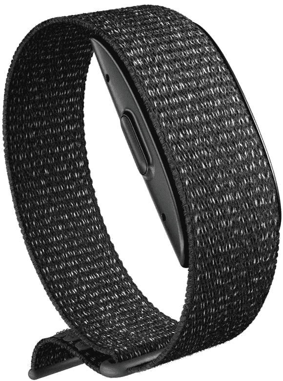

# 用亚马逊的 Halo Band 追踪你的活动、睡眠等，只需 55 美元

> 原文：<https://www.xda-developers.com/amazon-halo-band-deal-november-2021/>

新的一年即将来临，更好地照顾自己的健康是一个明智的决定。亚马逊的黑色星期五交易比以往任何时候都更加实惠，让这一切成为现实。光环乐队目前仅售 55 美元，比通常 100 美元的价格低 45%。这项优惠活动只在有限的时间内提供，所以确保你在他们脱销之前抓住一个。这款腕带有三种颜色，通过其先进的传感器帮助您跟踪您的活动、睡眠等。它是防水的，没有屏幕，所以你可以游泳和淋浴，而不必担心损坏它。

 <picture></picture> 

Amazon Halo Band

##### 亚马逊光环

这支来自亚马逊的乐队会让你离实现健康目标更近一步。现在只需 55 美元就可以拥有它，只要交易持续且有货。

Halo Band 包括访问基本功能，如步数、心率、睡眠时间和睡眠跟踪。它支持身体成分测量，基于强度的活动跟踪，以及来自 Lifesum 和 SWEAT 等专家的不断增长的健身程序库。它还可以与 Alexa 配合使用——所以你可以让一个支持 Alexa 的设备告诉你你的健康总结、活动分数、睡眠质量等等。

不确定你给别人的感觉如何？通过音调分析，这个光环带可以分析你的声音音调，从而变得更加自我意识。由于其不断扩展的资源，您可以获得数百种按需定制的高级锻炼、日常冥想、睡眠和营养支持等。值得一提的是，有些功能需要订阅，价格为每月 3.99 美元。然而，你可以在前 6 个月免费试用高级服务。

*你会设定新的健康目标，并通过购买亚马逊 Halo Band 来追踪它们吗？请在下面的评论区告诉我们。*