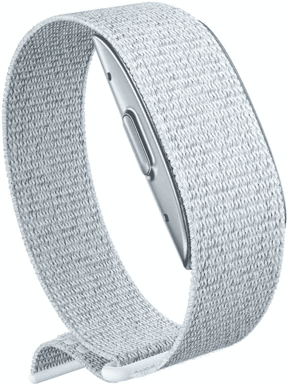

# 在亚马逊光环上节省 25 美元，并获得简约的健身跟踪！

> 原文：<https://www.xda-developers.com/amazon-halo-deal/>

# 购买 Amazon Halo 可节省 25 美元，并且无需智能手表的麻烦即可获得出色的跟踪功能

喜欢轻松跟踪你的健康状况，但对智能手表的“手表”功能不感兴趣？你会喜欢亚马逊光环的。

老实说，我是那种没有真正“得到”智能手表的人。我完全明白，对于那些可能整天不在手机旁但仍需要获取通知的人来说，它们是有帮助的，但大多数人整天都可以使用他们的手机。人们真的喜欢一整天每条短信都有两件事在他们耳边嗡嗡作响吗？对我来说，智能手表的最佳用途是健身追踪——随身携带计步器和心率监测器非常好，但我可以不具备所有其他功能。我远不是唯一一个有这种感觉的人，因为亚马逊创造了亚马逊光环，这是一个有用而独特的健身追踪器。

看一眼亚马逊光环，你会注意到一些非常不同的东西——没有屏幕！从本质上来说，这不是一款智能手表，因为它缺少了科技中最重要的“手表”部分。不过，光环仍然会追踪你的所有健康状况！当然，你有计步器和心率监测器，但亚马逊光环还可以跟踪你的压力水平、睡眠质量，甚至估计你的身体质量指数。Halo 还与 Headspace 和 Lifesum 等应用程序兼容，因此您可以正确跟踪您需要的一切。它非常适合那些想要一个不是智能手表的简约追踪器的人！

为了庆祝新年和一年中大多数人都在考虑自己健康的时候，亚马逊将光环打折 25 美元，使总价格降至 75 美元。即使您没有 Prime Rewards 签证，您也可以注册一个五个月的付款计划。

 <picture></picture> 

Amazon Halo

##### 亚马逊光环

有三种颜色可供选择，您可以跟踪您的健身情况，而不会像带亚马逊光环的智能手表那样分心！节省 25 美元并开始跟踪。

寻找更多的健身装备来启动你的新年计划？亚马逊有一个专为你设计的[登陆页面](https://www.amazon.com/Exercise-Equipment-Gym-Equipment/b?tag=xda-fktq6m7-20&ascsubtag=UUxdaUeUpU31322&asc_refurl=https%3A%2F%2Fwww.xda-developers.com%2Famazon-halo-deal%2F&asc_campaign=Short-Term)！浏览健身装备、智能手表选项和其他任何你可能需要的东西，把健身房带到你家。