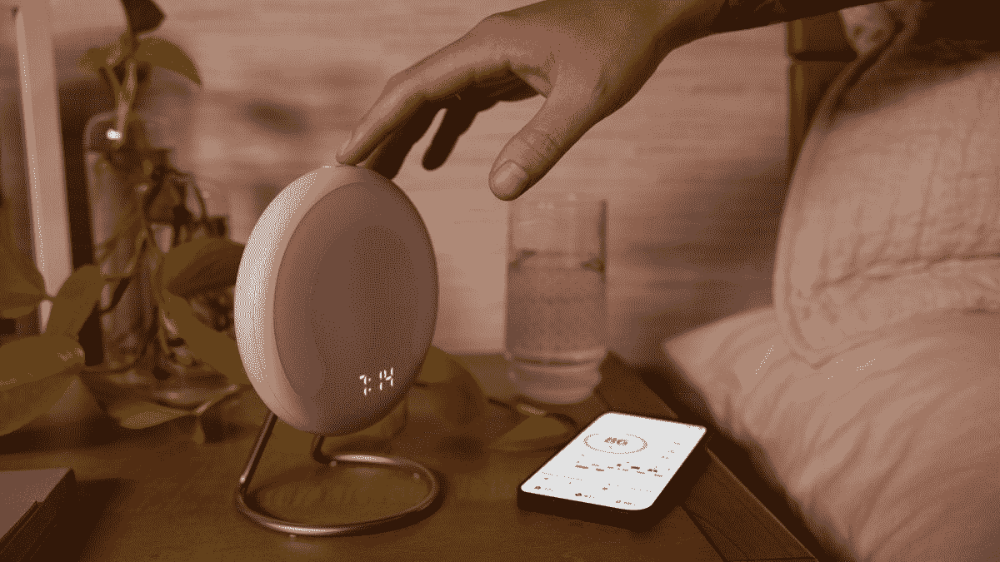

# 亚马逊光环崛起是一个睡眠追踪器-闹钟，你不需要佩戴

> 原文：<https://www.xda-developers.com/amazon-halo-rise-launch/>

在其仅限受邀者的虚拟活动期间，亚马逊今天推出了各种各样的产品。首次亮相的有趣设备之一是 Halo Rise 睡眠追踪器和闹钟。亚马逊已经成功开发了一款在后台工作的产品，用于跟踪与睡眠相关的指标并进行分析。有趣的是，它不需要你依赖任何可穿戴设备就能工作。

## 光环崛起了

Halo Rise 可以在你睡觉的时候感知你的动作和呼吸。它还可以检测到你旁边是否有其他人或宠物在睡觉。一旦您醒来，您会收到它收集的相关数据的详细摘要。这些包括 REM 数、室温、湿度等等。说到醒来，这个设备还兼做床头灯。它通过精确的灯光色调模拟日出，你也可以出于其他目的调整它，例如阅读。更不用说它会根据你睡眠周期的阶段叫醒你。亚马逊智能家居和健康副总裁 Melissa Cha 表示:

> 高质量的睡眠是我们整体健康和幸福的一个极其重要的因素。在当今忙碌的世界中，获得更多更好的睡眠是客户问我们最多的问题之一，这也是我们为什么要正面解决睡眠问题的原因。Halo Rise 旨在智能地在后台工作，为您提供一种全新而轻松的方式来管理您的睡眠，实现睡眠与生活的和谐。

正如你所料，光环崛起完全支持 Alexa，但有一个陷阱。你需要一个兼容的回声设备来发出请求。然后，灯与回声分享相关数据，回声再向你宣布。你还可以在你的 Alexa 程序中加入这个睡眠跟踪设备，并将你选择的歌曲设置为起床闹钟铃声。

亚马逊的 Halo Rise 将于今年晚些时候向美国客户发货。它的价格为 139.99 美元，包括该公司六个月的光环会员资格。这一额外的优惠让感兴趣的用户可以获得更多的服务，比如睡眠资源目录。

 <picture></picture> 

Amazon Halo Rise

##### 亚马逊光环崛起

亚马逊 Halo Rise 是一款混合床头灯，包括一个睡眠追踪器和一个智能闹钟。

你会点一份《光环崛起》吗？为什么或为什么不？请在下面的评论区告诉我们。