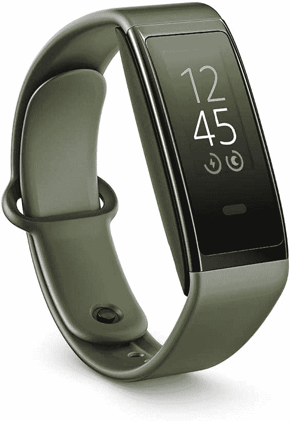

# 亚马逊 Halo View 健身追踪器取消了麦克风，但增加了彩色显示屏

> 原文：<https://www.xda-developers.com/amazon-halo-view-fitness-tracker-launched/>

去年，亚马逊推出了其最奇怪的产品之一，[光环乐队](https://www.xda-developers.com/amazon-halo-fitness-tracker-track-emotional-state-listening-voice/)。这是一个无屏幕的健身带，它有一个麦克风，可以通过一个名为“音调”的选择性加入功能，通过佩戴者的声音来跟踪他们的情绪状态。虽然它有一些其他健身带常见的其他功能，但它明显缺少一个屏幕。今天，亚马逊发布了一款名为 Halo View 的新 Halo 产品，纠正了原有模式的一些错误。

亚马逊的 Halo View 对 Halo Band 进行了一些改进。首先，它有一个 AMOLED 显示屏，可以显示健康指标，如您的当前活动、睡眠分数、血氧水平、实时锻炼信息、保持活跃警报等。第二，它抛弃了麦克风，所以你不必担心你的健身追踪器会监视你。由于这两个变化，Halo View 不仅看起来像其他健身追踪器，而且还消除了让许多人对第一款产品犹豫不决的争议性功能。

与 Halo Band 一样，Halo View 包含多个健康传感器，包括光学心率和血氧传感器、皮肤温度传感器和加速度计。它还很轻便，防水能力高达 5 个大气压，一次充电可持续 7 天，充满电不到 90 分钟。

除了新的 Halo View，亚马逊还扩展了 Halo 会员中包含的健康跟踪功能套件。根据亚马逊的新闻稿，Halo Fitness 增加了“数百种独家的工作室级健身程序”，会员可以在健身时从中选择。与此同时，Halo Nutrition 提供“个性化、省时的工具来发现美味、营养丰富的食谱”或有益的建议来“计划一周的健康饮食”光环健身功能将于今年晚些时候开始向光环应用程序内的成员推出。另一方面，光环营养功能将于 2022 年 1 月开始上市。

亚马逊提供了三种购买 Halo View 的 sport band 颜色选择——活性黑、灰绿色和薰衣草梦，所有这些颜色都显示在本文顶部的英雄图像中。下面嵌入的图片显示了一些也将提供的可选配件带选项。运动表带每条售价 14.99 美元，而织物表带、皮革表带和金属表带每条售价 29.99 美元。

你很快就可以从亚马逊上买到 Halo View。一旦上市，售价为 79.99 美元。为了利用 Halo 应用程序中的所有健康见解，你需要[成为 Halo 会员](https://www.amazon.com/b?tag=xda-1p1jgk0-20&ascsubtag=UUxdaUeUpU5427&asc_refurl=https%3A%2F%2Fwww.xda-developers.com%2Famazon-halo-view-fitness-tracker-launched%2F&asc_campaign=Short-Term)，每月花费 3.99 美元。亚马逊为每一次 Halo View 购买提供一整年的 Halo 会员资格，尽管不清楚这是否是一个有限的时间捆绑。

 <picture></picture> 

Halo View

##### 亚马逊光环视图

Halo View 是亚马逊最新的健身追踪器，它不仅看起来像零件，还拥有你对这种产品的大多数健康和健身功能。

*这篇文章编辑于美国东部时间 2021 年 9 月 29 日晚上 10:28，以澄清最初光环乐队的“音调”功能是自愿加入的。*