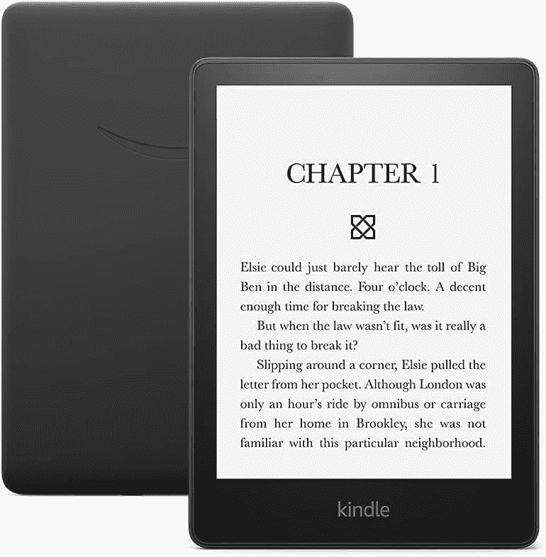

# 最新的 Kindle 已经降到了 75 美元

> 原文：<https://www.xda-developers.com/amazon-kindle-2022-75-deal/>

##### 亚马逊 Kindle (2022 年)

2022 年的 Kindle 电子阅读器可能比以前的版本更小，但这只是让你更容易随身携带。电子墨水屏幕尺寸为 6 英寸，具有你已经习惯的 300 ppi 高分辨率。这是新的广告支持的 Kindle 首次获得 25 美元的折扣。

当你通勤上班或上学时，你可以像其他人一样浏览手机，或者你可以利用这段时间阅读一本新书。新的 Kindle 使事情变得比以往任何时候都更容易，因为你可以随身携带它去任何地方，加载你的书，并迷失在页面中。由于建议零售价为 100 美元，这款新的 Kindle 版本更具吸引力，因为它的折扣降至 75 美元。我们要注意，这是广告支持的版本。如果你想要无广告服务，那就要花 95 美元，比正常价格低 25 美元。

## 为什么你会喜欢 2022 亚马逊 Kindle

2022 年的亚马逊 Kindle 轻而易举地登上了我们目前市场上最好的电子阅读器名单。有太多的理由喜欢这款基本款 Kindle，包括无眩光显示屏、易于阅读和长达六周的电池寿命。

虽然我们真的很喜欢[最新的 Kindle Paperwhite](https://www.xda-developers.com/kindle-paperwhite-11th-gen-review/) ，它的边框下有更多的 led，但我们不禁发现获得 2022 版 Kindle 也有很多好处，首先是它的尺寸。Kindle 只有 6 英寸，你没有理由说你不能在离开家的时候把它放进包里。即使你在家，你也可以看你最喜欢的小说，甚至关灯休息。

注意，你可以在亚马逊上以 75 美元的价格获得三个月的 Kindle Unlimited。确保你在购买 Kindle 时点击了该选项，这样你就可以访问成千上万的书籍。

如果你更喜欢 Paperwhite，你应该知道它也在打折，尽管我们不得不提到，我们在过去看到过价格更好的。尽管如此，还是便宜了 35 美元！

 <picture></picture> 

Amazon Kindle Paperwhite 11th Gen

##### 亚马逊 Kindle Paperwhite(第 11 代)

新的 Kindle Paperwhite(第 11 代)拥有 6.8 英寸的大型电子墨水显示屏和长达 10 周的电池寿命。这是迄今为止最好的中端 Kindle，也可以说是该公司最好的电子阅读器。