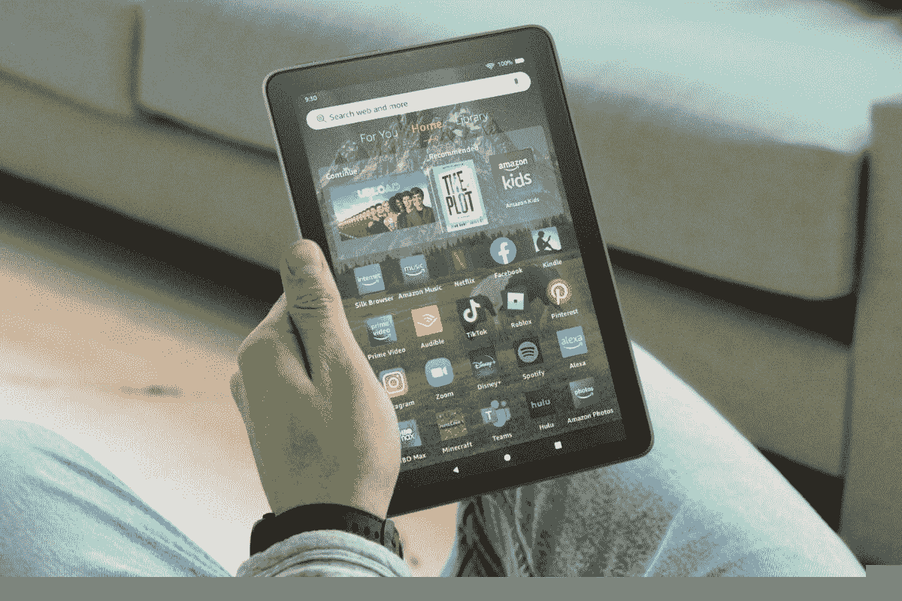

# 在圣诞节前的最后一刻，在亚马逊智能家居设备和平板电脑上达成一些交易

> 原文：<https://www.xda-developers.com/amazon-kindle-and-echo-deals-for-christmas/>

我们离假期周末只有几天了，看起来亚马逊已经准备好运送你最后一分钟的礼物，这样如果你是 Prime 会员，你就可以及时收到它们。从 Kindle 设备到 Fire 平板电脑、Echos 等等，亚马逊有各种各样的产品可供选择，应该是给你购物清单上的人的完美礼物。

##### 亚马逊 Kindle (2022 年)

最新的亚马逊 Kindle 提供了高分辨率显示屏，存储容量是上一款的两倍，USB-C 充电，内置灯可以让你在弱光区域阅读。

亚马逊 Kindle 是一款很棒的设备，价格实惠，功能丰富。Kindle 售价 100 美元，提供 6 英寸 300 PPI 高分辨率显示屏，像素是上一代的三倍。它还配有 16GB 的内部存储空间，是之前型号的两倍。此外，它的电池续航时间长，一次充电可持续六周。最重要的是，你现在可以使用 USB-C 为设备充电。

 <picture></picture> 

Amazon Fire HD 8 (2022)

##### 亚马逊 Fire HD 8 (2022)

价格合理、功能齐全的平板电脑。亚马逊最新的 Fire HD 8 平板电脑比以往任何时候都更好，处理器速度快 30%，存储空间大，电池续航时间长，售价 100 美元。

亚马逊最新推出的 Fire HD 8 是一款全彩色平板电脑，非常适合阅读、玩游戏以及观看电影和电视节目。它有一个 8 英寸的高清显示屏，配有六核处理器和 2GB 内存，比以前的型号快 30%。默认情况下，它有 32GB 的内部存储空间，可以通过 microSD 进行扩展。它有一个 USB-C 端口，一次充电可提供长达 13 小时的电池续航时间。你可以使用亚马逊的 Appstore，它会给你提供书籍、音乐、电视节目、电影等等。

##### 亚马逊 Fire 电视棒 4K Max

价格合理、功能齐全的平板电脑。亚马逊最新的 Fire HD 8 平板电脑比以往任何时候都更好，处理器速度快 30%，存储空间大，电池续航时间长，售价 100 美元。

亚马逊 Fire Stick 4K Max 是一款令人印象深刻的紧凑型流媒体棒，可以传输 4K 视频，并让您访问成千上万的电视节目和电影。除了令人惊叹的 4K 画质，该棒还支持 HDR 和 HDR10+，以及支持杜比 Atmos 和杜比 Vision 的沉浸式音频。也许最好的是，在有限的时间内，火棒 4K Max 在有限的时间内打折到仅 35 美元，比正常价格低 36%。

这些只是正在销售的设备的样本，但如果你想看看还有什么其他产品在促销，你可以看看下面的完整列表。