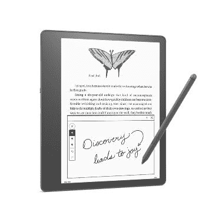

# 亚马逊的 Kindle Scribe 在这笔交易中获得了第一次折扣，最高可达 60 美元

> 原文：<https://www.xda-developers.com/amazon-kindle-scribe-60-off/>

 <picture></picture> 

Amazon Kindle Scribe

##### 亚马逊 Kindle Scribe

亚马逊首次推出了可以用笔做笔记的 Kindle。

亚马逊 Kindle Scribe 于 9 月份首次亮相，但直到几个月后才开始发售。现在这款设备已经上市一个多月了，它终于得到了第一次折扣，比零售价低了 60 美元。如果你对 Kindle 感兴趣，它还可以让你记笔记和签署文件，这将是适合你的。

Kindle Scribe 有几个不同的型号，但设备的基本功能将保持不变，主要特点是其 10.2 英寸 300 PPI 的大型 Paperwhite 显示屏。就像其他 Kindle 型号一样，你可以调整显示屏，并有灯光温暖度和亮度的校准选项。如果你不是那种喜欢拨入设置的人，Kindle 有一个选项可以自动调整这些设置。当然，像你购买的任何 Kindle 一样，你可以从 Kindle 商店轻松获得超过 1300 万本图书。

虽然 10.2 英寸的白纸显示器很重要，但 Kindle Scribe 附带的笔是记录笔记的神奇工具。虽然有两种不同的笔选项，即基本和高级笔型号，但在书写时两者都一样好，高级型号只是增加了一些功能，如橡皮擦和专用的可分配按钮，可设置为在橡皮擦、荧光笔等之间切换。最重要的是，这种笔不需要充电，这意味着你可以随时使用它，而不必担心电池寿命。

现在，就型号选择而言，当谈到存储大小时，您确实有一些选择，16GB 型号是基本型号，32GB 型号是中端型号，64GB 型号是高端型号。一旦您选择了 32GB 或 64GB 存储型号，您将自动升级到高级笔。说到折扣，你会发现基本款的折扣是 45 美元，如果你选择顶级款，折扣会高达 60 美元。如果你是第一次购买，这款 Kindle 可能有点贵，幸运的是，还有很多其他的 [Kindle 选择](https://www.xda-developers.com/best-amazon-kindle-ereader/)。