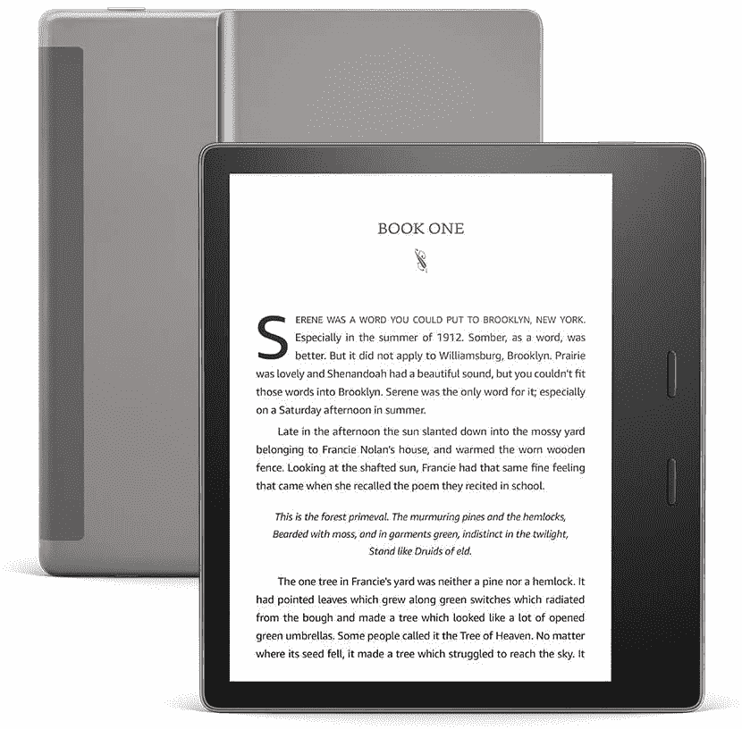

# 您从亚马逊 Kindle Unlimited 中获得了哪些好处？

> 原文：<https://www.xda-developers.com/amazon-kindle-unlimited-benefits/>

如今，订阅服务已经成为消费几乎任何类型的数字内容的标准。例如，人们现在通常为音乐和电视流媒体服务付费，而不是购买专辑或电影的真实拷贝。这样，只要支付合理的经常性费用，他们就可以访问最新版本，而不需要单独购买。亚马逊的 Kindle Unlimited 同样是一项付费订阅服务。不过，它提供电子书和有声读物，而不是歌曲和电视剧。以下是您需要了解的关于亚马逊服务的所有信息。

## 什么是亚马逊 Kindle Unlimited？

Kindle Unlimited 是亚马逊的一项订阅服务，主要围绕阅读展开。该公司每月支付 9.99 美元，使您能够:

*   超过 200 万本电子书可以阅读。
*   成千上万本书可以听。
*   最多订阅三份杂志，如《男性健康》。

可以将其视为任何付费流媒体服务。您每月支付费用，无限制地访问某个目录，而不是单独购买图书。缺点是你不拥有任何版本，当你停止支付时，你就失去了所有的东西。不过，许多人更喜欢这种商业模式。亚马逊 Kindle Unlimited 免去了你为你计划阅读的每一本书付费的麻烦。不过，值得注意的是，并不是亚马逊上的所有书籍都包含在这项服务中。

## 这项服务是为你服务的吗？

如果您是一个每月阅读几本书的活跃读者，那么订阅可能对您有意义。如果完成一本书通常需要一个多月的时间，那么您只需购买您想单独阅读的书，就可以节省更多的钱。最终，在支付订阅费之前，您将获得 30 天的免费试用，因此您可以[尝试](https://www.amazon.com/kindle-dbs/hz/subscribe/ku?tag=xda-3qgqns3-20&ascsubtag=UUxdaUeUpU42328&asc_refurl=https%3A%2F%2Fwww.xda-developers.com%2Famazon-kindle-unlimited-benefits%2F&asc_campaign=Commerce)并做出相应的决定。如果您以后改变主意，您可以在任何时候取消订阅。

注意:您实际上不需要拥有任何[优秀的 Kindle 电子书阅读器](http://www.xda-developers.com/best-amazon-kindle-ereader/)就可以享受 Kindle 无限制订阅。您可以通过手机、平板电脑和其他地方的 Kindle 应用程序访问它。然而，正如预期，Kindle 硬件和 Kindle 无限制订阅是相辅相成的。

 <picture></picture> 

Kindle Oasis

##### 亚马逊 Kindle Oasis

亚马逊 Kindle Oasis 有一个 7 英寸的 300ppi 显示屏，防水，并且有一个专为单手使用而设计的独特设计。

*您愿意订阅亚马逊 Kindle Unlimited 吗？为什么或为什么不？请在下面的评论部分告诉我们。*