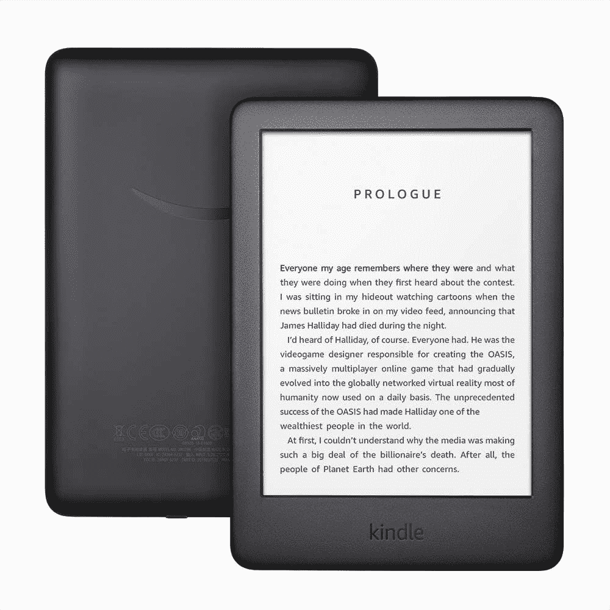

# 亚马逊 Kindle(第 10 代)vs 亚马逊 Kindle Paperwhite(第 11 代):你应该买哪个电子阅读器？

> 原文：<https://www.xda-developers.com/amazon-kindle-vs-amazon-kindle-paperwhite/>

亚马逊的 Kindle 电子阅读器有几种不同的口味可供选择。有一种基本型号，简称为 Kindle，然后是 Kindle Paperwhite，它提供了更好的屏幕、防水和更大的存储空间，然后是 Kindle Oasis，它是最高端的，提供了优雅的金属机身和更大的显示屏。

入门级的 Kindle 和 Kindle Paperwhite 是最受欢迎的选择。两者价格合理，并提供大型电子墨水显示屏。但是两人之间有一些显著的不同。如果你在基本版 Kindle(第 10 代)和 Paperwhite(第 11 代)之间犹豫不决，这里有你需要知道的一切，以便做出明智的决定。

## 亚马逊 Kindle(第 10 代)与亚马逊 Kindle Paperwhite(第 11 代):规格

| 

规格

 | 

亚马逊 Kindle 第十代

 | 

亚马逊 Kindle Paperwhite 第 11 代

 |
| --- | --- | --- |
| **尺寸&重量** |  | 

*   174.2 x 124.6 x 8.1 毫米
*   205 克

 |
| **显示** | 6 英寸无眩光电子墨水显示屏 | 6.8 英寸无眩光电子墨水显示屏 |
| **分辨率** | 167 PPI | 300 PPI |
| **前灯** |  |  |
| **可调暖灯** | 不支持 | 是 |
| **电池寿命** | 长达四周 | 长达十周 |
| **充电** | 

*   MicroUSB 端口
*   4 小时内充满电

 | 

*   USB-C 端口
*   2.5 小时内充满电

 |
| **耐水性** | 无耐水性 | IPX8 防水(高达 2 米的淡水 60 分钟) |
| **存储** |  |  |
| 连通性 |  | 

*   无线网络(2.4GHz + 5GHz)
*   可选的蜂窝连接

 |

## 设计

Kindle(第 10 代)于 2019 年推出，正如你所料，它看起来很过时，具有厚重的边框和普通的塑料机身。幸运的是，它现在已经被 Kindle(第 11 代)更新，带来了更现代的设计。

亚马逊在去年年底推出 Paperwhite(第 11 代)时更新了 Kindle Paperwhite。这款电子阅读器也是由塑料制成，但具有更薄的边框和齐平的设计，使设备具有更高级的外观和感觉。Paperwhite 比基本版 Kindle 更耐用，因为它具有 IPX8 防水性能。这意味着你可以在水中使用它，或者在自来水下清洗它，而不用担心。基本的 Kindle 第十代不提供这种便利，明智的做法是投资一个保护套。

Kindle Paperwhite(第 11 代)比基本版 Kindle 更高更重。它只有一种黑色，而入门级型号只有黑白两种颜色。

在物理控制方面，两款设备都有一个电源按钮，但没有类似于 Kindle Oasis 的专用翻页按钮。基本的 Kindle 通过古老的微型 USB 端口充电。对于 Paperwhite 来说，要看型号。旧的第 10 代 Paperwhite 有一个微型 USB 端口，而新的第 11 代型号有一个 USB-C 连接器。

## 显示

基本版 Kindle 和 Paperwhite 都使用电子墨水显示屏。但它们在大小、分辨率和照明方面有所不同。Kindle(第十代)采用 6 英寸无眩光电子墨水显示屏，每英寸 167 像素。另一方面，Paperwhite(第 11 代)有一个更大的 6.8 英寸面板，每英寸 300 像素，也更清晰。

两种型号都有一个内置的前灯，用于夜间阅读。然而，Paperwhite 在这里有一个明显的优势，因为它有 17 个 led，而基本 Kindle 只有 4 个。更多的 led 意味着显示屏可以变得更亮，并且所有亮度级别的照明更加均匀。 [Paperwhite(第 11 代)还提供暖光](https://www.xda-developers.com/how-to-enable-warm-light-amazon-kindle/)，让您可以将显示屏颜色从白色转变为琥珀色，从而在夜间获得更舒适的阅读体验。

## 电池和性能

得益于低功耗的 E Ink 显示屏，所有电子阅读器通常都有出色的电池寿命，Kinde 和 Paperwhite 也不例外。亚马逊表示，如果你每天在关闭无线和照明设置为 50%的情况下使用半小时，Kindle(第 10 代)一次充电可以持续四周。另一方面，Kindle Paperwhite(第 11 代)可以持续十周。当谈到充电端口和充电速度时，这两款设备之间也有巨大的差异。Kindle 有一个 microUSB 端口，充满电需要近 4 个小时，而 Paperwhite 有一个 USB-C 端口，需要大约 2.5 个小时来补充燃料。

电子墨水显示器的刷新率本来就很低，所以你肯定会在 Kindle 和 Paperwhite 上看到一些闪烁和滞后。如果你使用的是带有[高刷新率显示屏](https://www.xda-developers.com/smartphone-display-refresh-rates-explained/)的智能手机或平板电脑，这一点可能会特别明显。就整体性能而言，Paperwhite 第 11 代要好得多，因为它采用了更新的芯片组，并承诺翻页速度加快 20%。

## 存储和连接

Kindle(第十代)有 8GB 的存储空间，这是唯一的变化。同时，Paperwhite(第 11 代)可配置高达 8GB 或 32GB 的存储空间。如果只是想看书，8GB 绰绰有余。但是，如果您计划通过 Audible 收听有声读物，这可能会成为一个问题。

基本版 Kindle 和 Paperwhite 的另一大区别是连接性。虽然 Kindle 只有 Wi-Fi 版本，但 Paperwhite 有 Wi-Fi 版本和蜂窝版本。

## 应该买哪个 Kindle？

Kindle(第 10 代)的售价为 89 美元，而 Kindle Paperwhite(第 11 代)的售价为 139 美元。无论你买的是基本版 Kindle 还是 Paperwhite，你都会得到一个为阅读量身定制的无眩光电子墨水显示屏。

 <picture></picture> 

Amazon Kindle Paperwhite 11th Gen

##### 亚马逊 Kindle Paperwhite(第 11 代)

新的 Kindle Paperwhite(第 11 代)拥有 6.8 英寸的大型电子墨水显示屏和长达 10 周的电池寿命。

如果你只是想体验电子阅读器的好处，而没有任何额外的或花哨的功能，基本的 Kindle(第 10 代)就很好。它的显示屏与其他 Kindle 电子阅读器相同，但分辨率较低，前置灯可调，适合在黑暗中阅读。8GB 的存储空间对于存储数千本电子书来说绰绰有余，只有当你打算消费大量有声读物时才需要考虑这一点。如果你只是想尝试一下数字阅读，这也是一个不错的设备，因为它的入门成本较低。因此，如果你不确定你是否会做大量的阅读，并想先体验一下电子阅读器，我们建议坚持使用基本的 Kindle。

 <picture></picture> 

Amazon Kindle (10th Gen)

##### 亚马逊 Kindle(第十代)

Kindle 第 10 代提供了 6 英寸的电子墨水显示屏和长达 4 周的电池寿命。

如果你能多花 50 美元，Kindle Paperwhite(第 11 代)能提供更多。它有一个更大更清晰的显示屏，带有可调节的温暖光线，更薄的边框，更快的性能，IPX8 防水，更长的电池寿命，可选的蜂窝连接，以及 USB-C 端口的便利性。这是我们向大多数人推荐的 Kindle，因为它提供了更好的内聚体验。但与基本的 Kindle 相比，它相对昂贵，所以你需要对你的数字阅读需求更加自信，以证明这种溢价是合理的。我们确实认为价格上涨是合理的，所以如果你能花额外的钱，最新的 Kindle Paperwhite 仍然是我们的首选推荐。

你喜欢什么样的 Kindle？请在下面的评论中告诉我们！