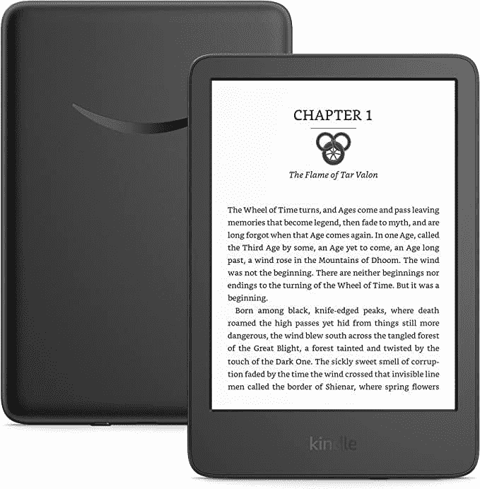

# 亚马逊 Kindle 防水吗？它有 IP 等级吗？

> 原文：<https://www.xda-developers.com/amazon-kindle-water-resistance/>

# 亚马逊 Kindle 防水吗？它有 IP 等级吗？

亚马逊 Kindle 电子阅读器是专门用于阅读的伟大设备。不过，你一定想知道，它们防水吗？

亚马逊 [Kindle 电子阅读器](http://www.xda-developers.com/best-amazon-kindle-ereader/)对于那些希望拥有一台专用于阅读的设备的人来说是极好的设备。最棒的是，你不仅可以阅读成千上万的电子书，还可以将它们随身携带。然而，关于这些设备，人们脑海中有一个共同的(也是重要的)问题。亚马逊 Kindle 防水吗？以下是你需要知道的。

## 亚马逊 Kindle 防水吗？

首先，让我们从强调没有一款 Kindle 电子阅读器是*防水的*开始。有些型号是**防水**。由于自然因素，这种阻力可能会逐渐消失。不过，回答你的问题，Kindle 第 11 代没有 IP 等级，所以它根本没有声称防水。这意味着你不应该用水溅它或在洗澡或游泳时使用它。这适用于整个系列的基础 Kindle，包括 Kindle 第 10 代(2019 年)以及最新的 Kindle 第 11 代(2022 年)版本。你可以安全地用湿布擦拭显示器，但不要让它们暴露在水流中。

如果你真的想要一个防水的 Kindle，那就买一个 Kindle Paperwhite 第 11 代或者 [Kindle Oasis](https://www.xda-developers.com/editorial-amazon-kindle-oasis-best-ever/) ，这两款都拥有 IPX8 防水等级。不过，到目前为止，该公司从未在 Kindles 的基本阵容中包括 IP 评级。如果你将防水模型浸入盐水中，最好之后用普通的清水彻底冲洗。下次你在床上看书时，你不会希望盐粒掉在床上，因为它已经干了。如果你有一个不防水的 Kindle，你可以寻找防水外壳来为你的电子阅读器提供这层保护。

 <picture></picture> 

Kindle (2022 release)

##### Kindle (2022 年发布)

新的 Kindle 提供了升级的 300 PPI 显示屏，更长的电池寿命和更高的性能。