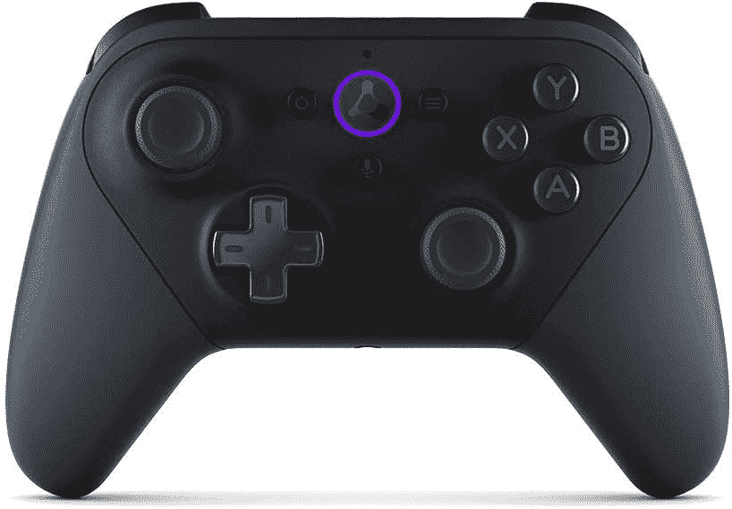

# 在亚马逊 Luna 控制器上省钱，看看云游戏是怎么回事

> 原文：<https://www.xda-developers.com/amazon-luna-early-prime-day-deal/>

尽管它仍然只在美国可用，但亚马逊 Luna 是一个快速增长的云游戏平台。作为亚马逊的产品，它与 Prime 和 Prime Gaming 有联系，现在有机会以更低的价格参与进来。在 Prime Day 之前，亚马逊对会员的 Luna 控制器降价 30 美元，降至仅 40 美元。

你不需要 Luna 控制器来尝试亚马逊的云游戏，但使用它也有一些好处。虽然它几乎是半价，但现在肯定是你买一台的时候了。

 <picture></picture> 

Amazon Luna controller ($30 off)

##### 亚马逊 Luna 控制器

玩亚马逊的云游戏服务最好的方法是用官方的控制器。因为它直接连接到服务器，你不会得到比这些更低的延迟。

亚马逊 Luna 控制器利用了与谷歌 [Stadia](https://www.xda-developers.com/stadia-appreciation-editorial/) 控制器的一个关键相似之处，这有利于云游戏玩家。控制器内置 Wi-Fi，直接连接到 Luna 服务。通过绕过你的电脑、手机或 Fire TV，延迟进一步降低。当谈到云游戏时，您需要尽可能低的延迟。亚马逊表示，与使用蓝牙控制器相比，它可以减少 30 毫秒，这是一个巨大的进步。

控制器本身有一股任天堂 Switch 专业控制器的味道，穿着黑色紫色口音。当你不玩 Luna 时，它也可以通过蓝牙或 USB 与 PC 一起用作常规控制器。

但是露娜服务怎么样，好吗？假设你能得到它，有很多喜欢的。首先，Prime 会员无需额外花费就可以玩游戏。亚马逊提供了许多可以通过 Prime Gaming 免费玩的游戏。现在，恶魔城周年纪念收集和过度烹饪 2 只是几个可用的主要游戏标题。

Luna 分为多个频道，要玩你想玩的游戏，你需要订阅相关的频道。Luna+是您可以找到最大版本的地方，但复古游戏的粉丝或那些寻求家庭友好选择的人也可以得到满足。育碧+还为 Luna 带来了发行商最大的游戏。