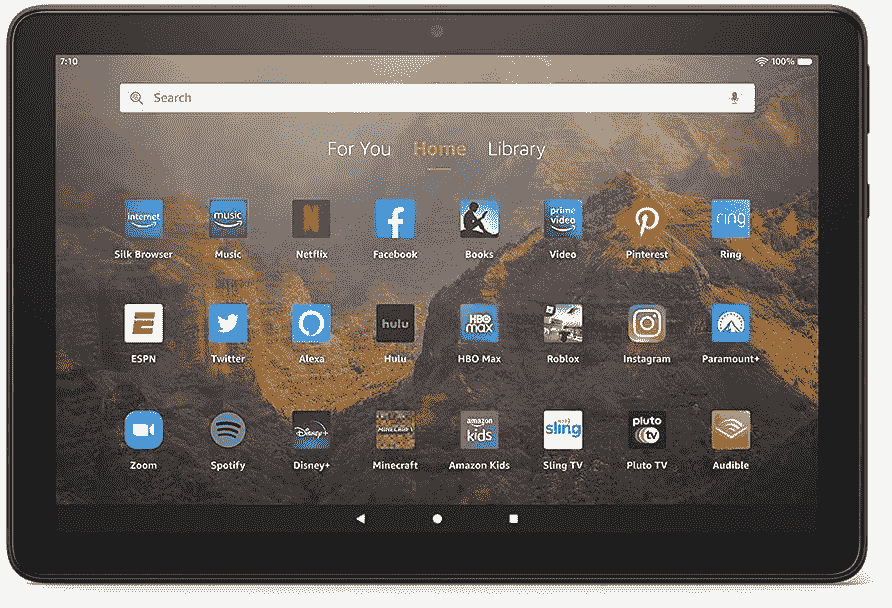

# 亚马逊宣布新的 Fire HD 10 平板电脑，预购今天开始

> 原文：<https://www.xda-developers.com/amazon-new-fire-hd-10-tablets-pre-orders-begin-today/>

亚马逊宣布了 Fire HD 10 的更新型号，修改了产品系列的设计，并引入了更强大的性能。Fire HD 10 和 Fire HD 10 Plus 今天可以预订，价格分别为 149 美元和 179 美元。这些设备将于 5 月 26 日开始发货。

新的 Fire HD 10 系列最引人注目的变化是更薄的边框。[亚马逊表示](https://www.businesswire.com/news/home/20210427005712/en/Stay-Entertained-Connected-and-Productive-with-the-All-New-Fire-HD-10-and-Fire-HD-10-Plus)10 英寸全高清显示屏也更亮，而平板电脑本身比以前更薄更轻。这两款机型都配备了八核 2.0 GHz 处理器，电池续航时间长达 12 小时；plus 型号支持无线充电。Fire HD 10 配备 3GB 内存，而 Fire HD Plus 提供 4GB 内存。

亚马逊表示，有两种存储选项:32GB 或 64GB，通过 microSD 卡支持高达 1TB 的可扩展存储。同时，这两款设备都支持杜比 Atmos 音频和对 Alexa 的免提访问，因此您可以播放音乐，获取体育比分，并控制您的智能家居。亚马逊表示，如果你不想使用语音助手，可以关闭 Alexa 麦克风。

新平板电脑还配备了一个 200 万像素的前置摄像头，可通过 Zoom、Skype 和微软团队等服务进行视频通话。虽然我们正在谈论生产力的话题，但亚马逊表示，新系列也以 219 美元起的生产力捆绑包提供，其中包括一个可拆卸的键盘壳和一个微软 365 个人订阅。这意味着您可以订阅 12 个月的高级 Office 应用程序、1TB one drive 云存储等等。

亚马逊表示，新的 Fire HD 10 阵容还支持 Fire OS 中新的分屏多任务功能。亚马逊表示，这项功能可以让你同时运行两个兼容的应用程序。“你可以在看电影时查看你的社交媒体账户，在发送信息时在 Zoom 上进行视频通话，或者在阅读 Kindle 书籍时在 OneNote 上做笔记，”亚马逊说。

当新的平板电脑系列发布时，它将有黑色、牛仔、薰衣草和橄榄色可供选择。亚马逊表示，除了新的可拆卸键盘，还有 Anker 为亚马逊定制的无线充电底座，售价 49 美元。该坞站旨在与支持无线充电的 Fire HD 10 Plus 配对。

 <picture></picture> 

Amazon Fire HD 10

##### 亚马逊 Fire HD 10

亚马逊全新的 Fire HD 10 具有 10.1 英寸的全高清显示屏，新的生产力功能，以及长达 10 小时的电池寿命。