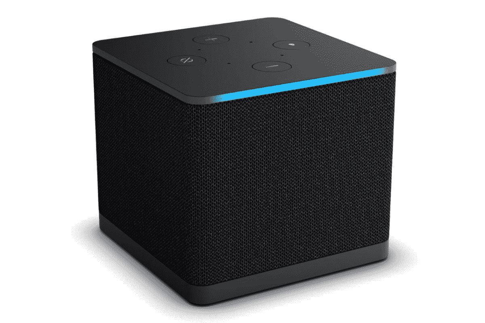

# 亚马逊新推出的 Fire TV Cube 设计新颖，支持“超分辨率升级”

> 原文：<https://www.xda-developers.com/amazon-new-fire-tv-cube/>

亚马逊的年度硬件展挤满了一吨新的硬件，其中一些已经开始预购。除了新款 [Kindle Scribe](https://www.xda-developers.com/amazon-kindle-scribe-with-pen-launch/) 和[新款 Echo 音箱](https://www.xda-developers.com/amazon-echo-dot-5th-gen-announced/)之外，该公司还宣布了第三代 Fire TV Cube。新的 Fire TV Cube 采用了全新的设计，集成了扬声器，并具有一系列新功能。现在可以以 139.99 美元的价格预订，并将于 2022 年 10 月 25 日在美国开始销售。

新的 Fire TV Cube 采用了全新的设计，前面有弯曲的边缘，扬声器上有织物罩。就像以前的 Fire TV Cube 一样，新的 Fire TV Cube 也保留了 360 度红外增强器，让您可以控制媒体设置中的其他连接设备，包括电视、条形音箱、回声扬声器等。Fire TV Cube 还配有四个麦克风，这意味着你也可以通过 Alexa 免提使用它。

新 Fire TV Cube 最有趣的功能之一是支持“超分辨率升级”，这一功能实质上是将高清内容升级到 4K。这听起来类似于英伟达在 Shield TV 上基于人工智能的升级，但升级功能在 Fire TV 上的效果如何还有待观察。亚马逊表示，它已经为新的 Fire TV Cube 配备了八核 2.0 GHz 处理器，以提高整体性能。

Fire TV Cube 现在带有 HDMI 输入和输出，这意味着您可以将它与包括机顶盒和蓝光播放器在内的其他设备配合使用。背面的其他端口包括以太网、USB 端口、IR 扩展器和电源端口。你可以在顶部看到相同的按钮——音量、选择和麦克风静音——以及标准的 Alexa LED 状态栏。还值得强调的是，新的 Fire TV Cube 还支持 Wi-Fi 6E，这应该可以帮助您满足流媒体需求。

 <picture></picture> 

Amazon Fire TV Cube

##### 亚马逊 Fire 电视魔方

新的 Fire TV Cube 采用了全新的设计，并支持新的“超分辨率放大”功能，以增强媒体效果。

新的 Fire TV Cube 现已开放，您可以点击上面提到的链接预订您的单元。