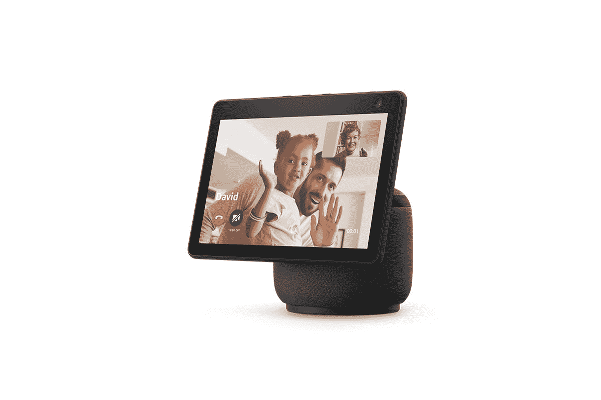
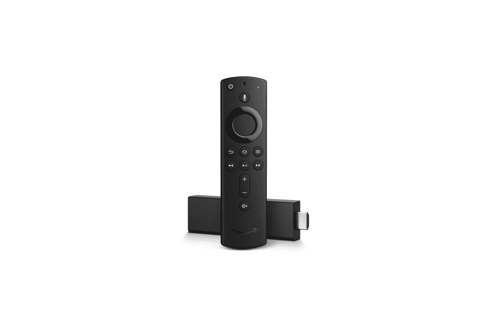
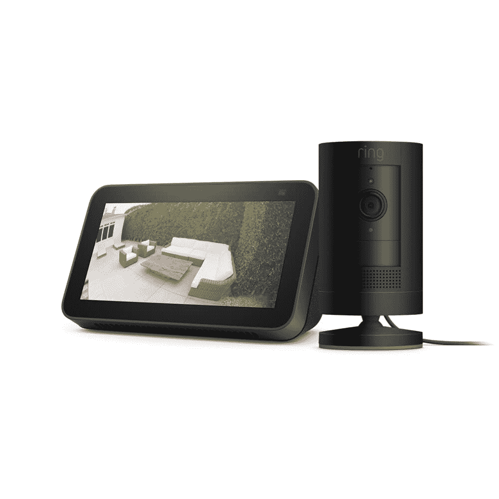
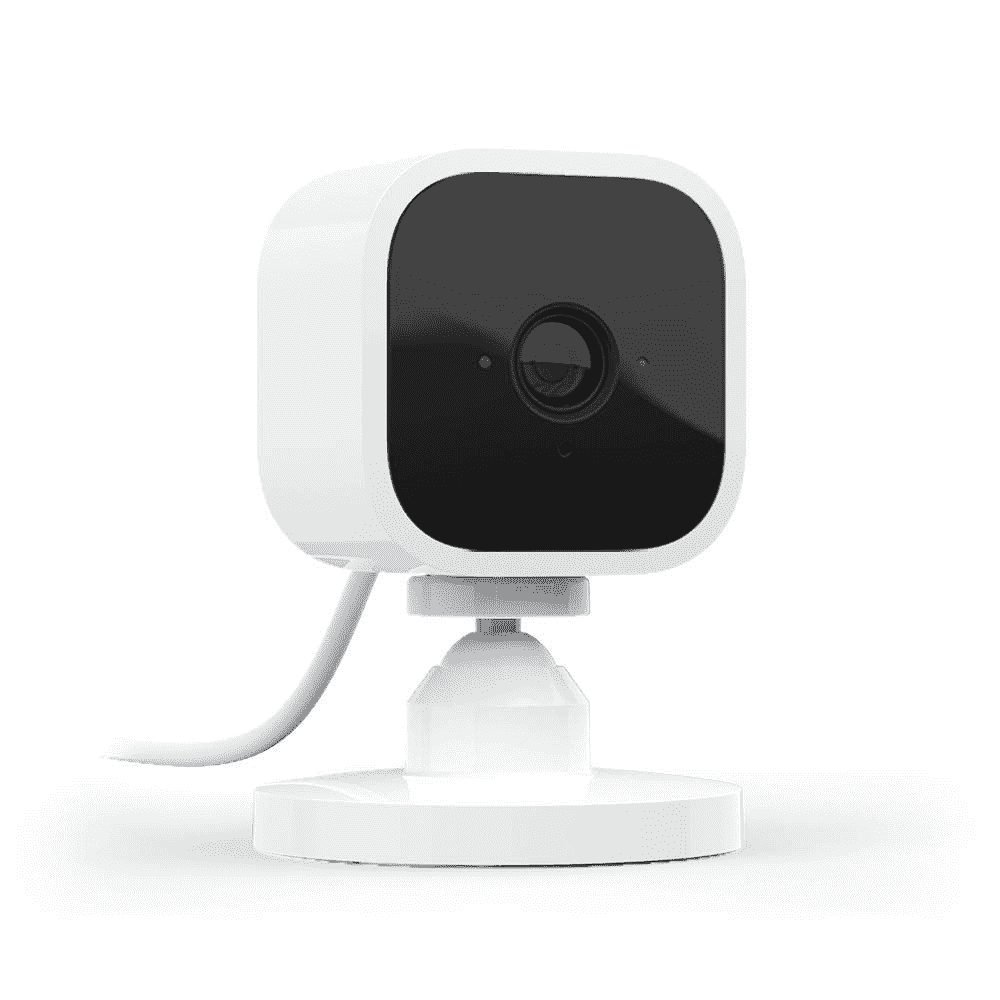
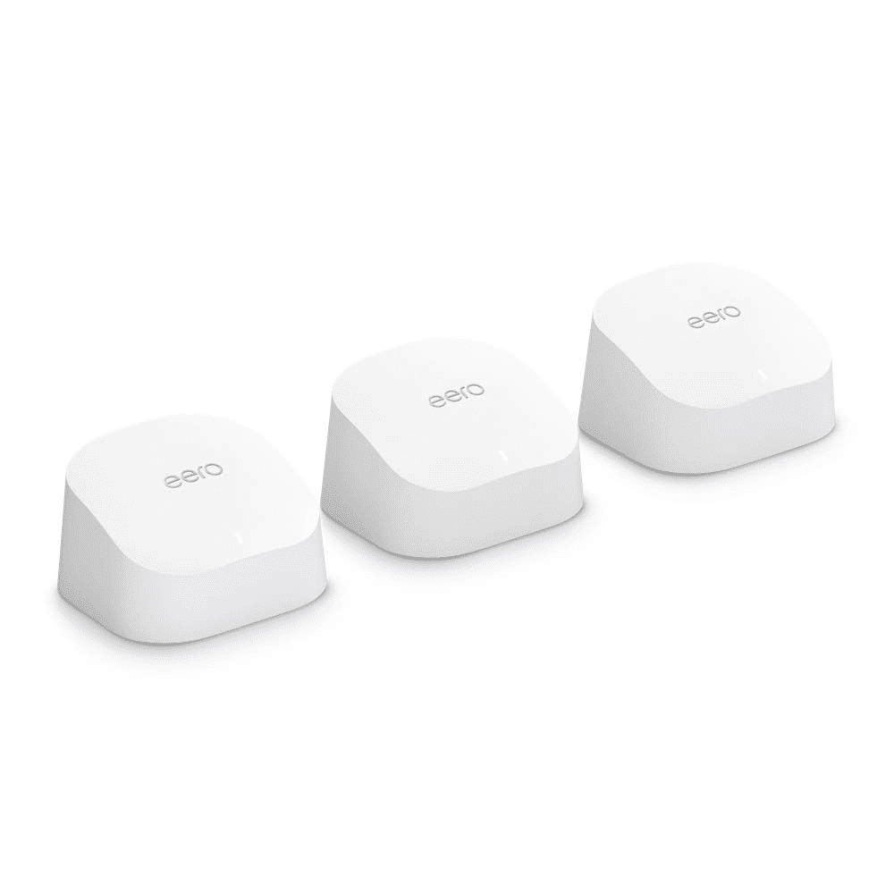
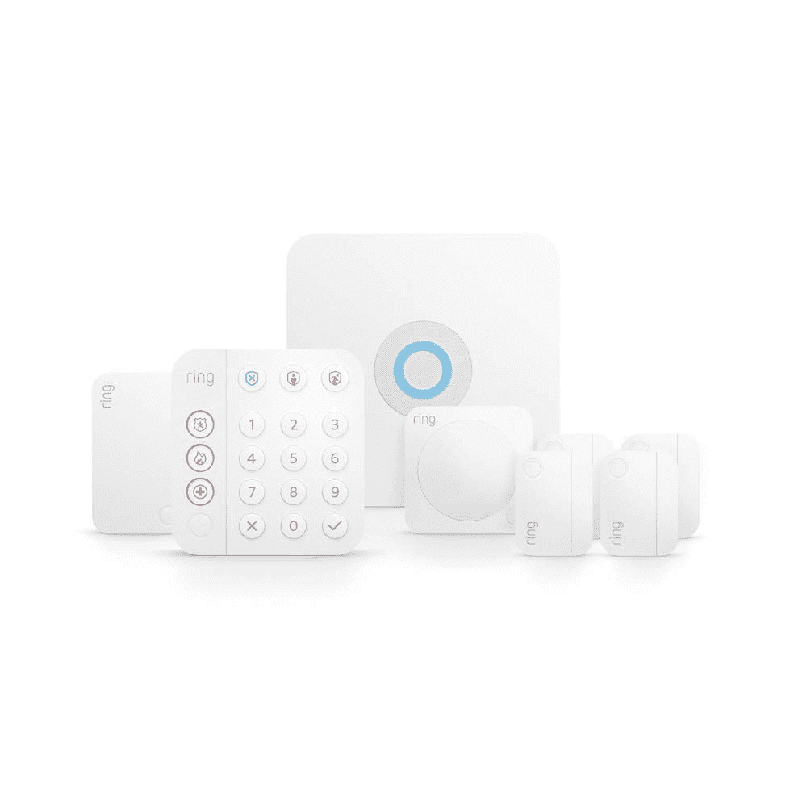
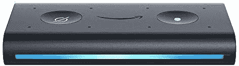

# 亚马逊 Prime Day 2021:亚马逊智能家居产品的最佳交易！

> 原文：<https://www.xda-developers.com/amazon-prime-day-2021-best-deals-amazon-products/>

# 亚马逊 Prime Day 2021:Echo 智能扬声器、安全摄像头和更多优惠！

亚马逊 Prime Day 2021 现已上线。以下是销售期间你可以买到的亚马逊产品的最优惠价格！

亚马逊 Prime Day 2021 交易现已上线，该公司正在为几乎所有最畅销的设备提供大幅折扣。该公司广受欢迎的 Echo 智能扬声器系列、Kindle 电子书阅读器、Fire 电视棒等产品目前都有诱人的折扣。在本帖中，我们列出了一些亚马逊产品的最佳交易，以帮助你在缺货前抓住它们。

 <picture></picture> 

Amazon Echo Dot 4th Gen

##### 亚马逊回声点(第四代)

亚马逊 Echo Dot 第四代售价仅为 24.99 美元，是目前你能买到的最好的入门级智能扬声器。支持 Alexa 的智能扬声器具有 1.6 英寸前置扬声器、led 指示灯和 3.5 毫米线路输出端口，这是您进入智能家庭游戏所需的全部内容。

 <picture></picture> 

Amazon Echo Dot with Clock

##### 带时钟的亚马逊回声圆点(第四代)

带时钟的 Echo Dot 第四代具有额外的 LED 显示屏，让您无需发出语音命令即可轻松查看时间、闹钟和计时器。除此之外，它与常规的回声点基本相同。

 <picture></picture> 

Amazon Echo 4th Gen

##### 亚马逊 Echo(第四代)

亚马逊 Echo 第四代采用了与 Echo Dot 相同的设计，但它提供了更好的音频输出。这款智能扬声器配有一个 3 英寸低音扬声器和两个 0.8 英寸前置高音扬声器，以及杜比音频支持，可以提供充满房间的声音。

 <picture></picture> 

Echo Show 10 3rd Gen

##### 亚马逊 Echo Show 10(第三代)

想要的不仅仅是智能音箱？Echo Show 10 可能是你的最佳选择。它配备了 10.1 英寸的显示屏，可以让您进行视频通话、观看电视节目，以及做更多事情。

 <picture></picture> 

Fire TV Stick 4K

##### 亚马逊 Fire 电视棒 4K

亚马逊 Fire 电视棒 4K 配有支持 Alexa 的遥控器、杜比视觉、HDR 和 HDR10+支持，它可以让你在任何兼容的电视上访问所有你最喜欢的流媒体服务。

 <picture></picture> 

Ring Stick up Cam and Echo Show 5 bundle

##### 环形推杆凸轮

在亚马逊的黄金日销售期间，以比单独一个 Stick up cam 低 5 美元的价格获得一个环形 Stick up 智能安全摄像机和一个 Echo Show 5，立即保护您的家！

 <picture></picture> 

Blink Mini

##### 迷你闪烁

只需 20 美元，就可以用 Blink Mini 安全摄像机保护您的家。提供 1080p 视频输出、夜视支持、运动检测、双向音频等。

 <picture></picture> 

Amazon eero 6

##### 亚马逊 Eero 6

使用 Amazon eero 6 双频网状 Wi-Fi 6 系统增强您房子周围的互联网连接。它配有一个 Wi-Fi 6 路由器和两个范围扩展器，可以轻松覆盖 5000 平方英尺，速度高达 500Mbps。

 <picture></picture> 

Ring Alarm 8-piece kit

##### 响铃报警器 8 件套

响铃警报 8 件套是一个很棒的入门级家庭安全套件，配有一个基站、一个键盘、四个接触传感器、一个运动探测器和一个扩展范围，帮助您保持家庭安全。

 <picture></picture> 

Echo Auto

##### 亚马逊 Echo 汽车(第一代)

将 Alexa 与 Echo Auto 一起带到您的汽车上，只需 15 美元，就可以控制您的音乐、安排约会以及更完全的免提操作。

* * *

除了上面提到的交易，在正在进行的 Prime Day 销售期间，亚马逊还为 [Kindle 电子书阅读器](https://www.amazon.com/All-new-Kindle-Paperwhite-Waterproof-Storage/dp/B075MWNNJG?tag=xda-45hrtsh-20&ascsubtag=UUxdaUeUpU2672&asc_refurl=https%3A%2F%2Fwww.xda-developers.com%2Famazon-prime-day-2021-best-deals-amazon-products%2F&asc_campaign=Short-Term)、 [Fire 平板电脑](https://www.amazon.com/Fire-HD-10-tablet/dp/B08BX7FV5L/?tag=xda-45hrtsh-20&ascsubtag=UUxdaUeUpU2672&asc_refurl=https%3A%2F%2Fwww.xda-developers.com%2Famazon-prime-day-2021-best-deals-amazon-products%2F&asc_campaign=Short-Term)和[智能 Fire 电视](https://www.amazon.com/Insignia-NS-32DF310NA19-32-inch-720p-Smart/dp/B07FPP6TB5/?tag=xda-45hrtsh-20&ascsubtag=UUxdaUeUpU2672&asc_refurl=https%3A%2F%2Fwww.xda-developers.com%2Famazon-prime-day-2021-best-deals-amazon-products%2F&asc_campaign=Short-Term)提供一些大折扣。但这些交易并不仅限于亚马逊的产品。其他制造商，如宏碁、雷蛇、索尼、三星等，正在为精选产品提供诱人的折扣，所以请务必查看我们 2021 年黄金日报道的其余部分。你可以购买高达 600 美元的游戏笔记本电脑，购买 Razer 的外围设备可以享受高达 25%的折扣，甚至可以节省高达 1000 美元的索尼全新 4K 120Hz 电视。