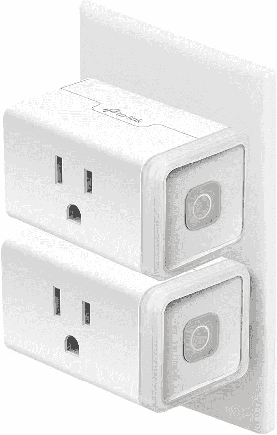
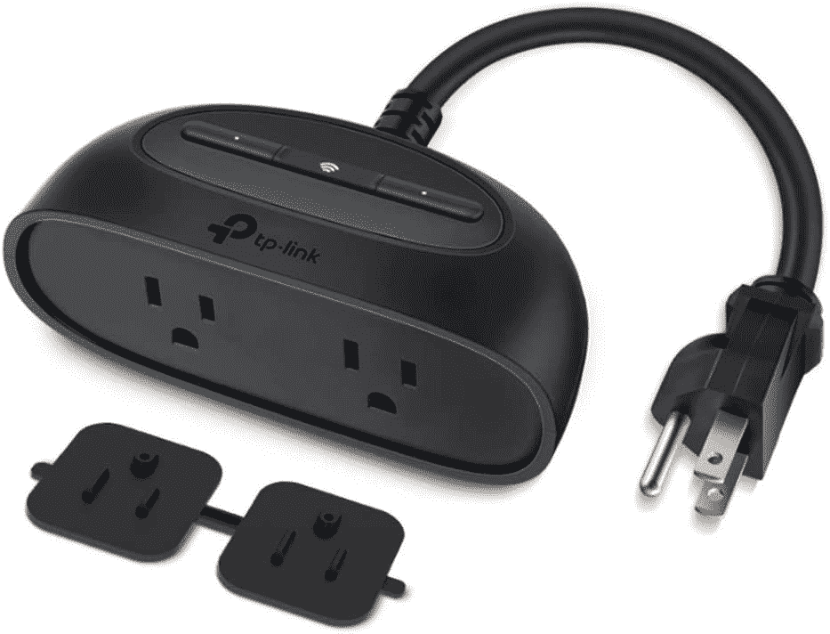
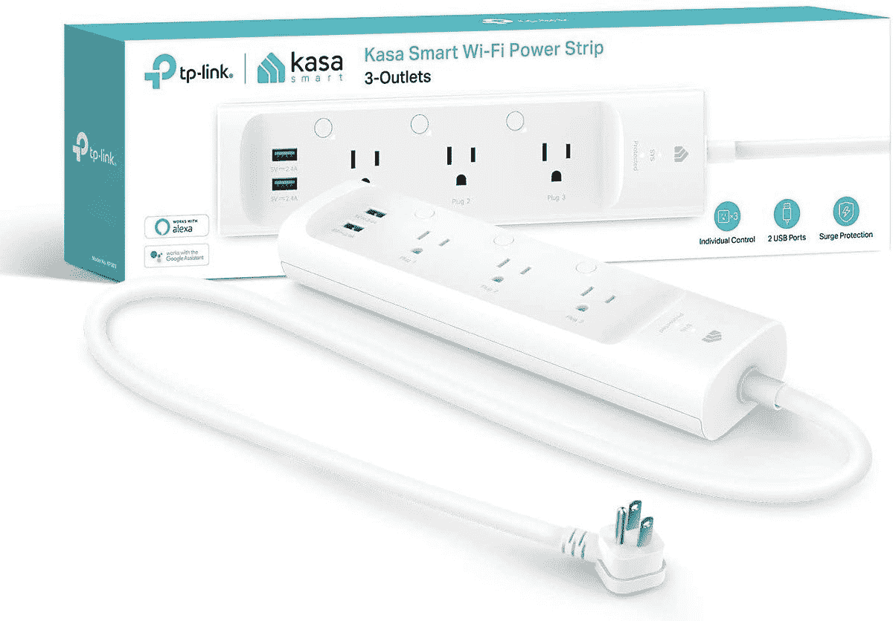

# 亚马逊 Prime Day 2021:TP-Link Kasa 智能插头最优惠

> 原文：<https://www.xda-developers.com/amazon-prime-day-2021-best-deals-kasa-smart-plugs/>

在亚马逊正在进行的 Prime Day 促销期间，TP-Link 为其 Kasa 系列智能插头提供了一些优惠活动。虽然 Kasa Smart Plug Mini HS103 的最佳交易不再可用，但您仍然可以以诱人的折扣购买 Kasa Smart Plug Mini HS103 combo、Kasa Smart Outdoor Plug KP400 和 Kasa Smart Plug Power Strip KP303。

Kasa 智能插头迷你组合仅售 12.99 美元，配有两个语音智能插头。这些插头设计紧凑，可以连接到任何 2.4GHz Wi-Fi 网络，因此您不需要单独的集线器。这些插头可以通过 Kasa 智能手机应用程序进行控制，并支持谷歌助手、亚马逊 Alexa、IFTTT 等。

 <picture></picture> 

Kasa Smart Plug HS103 combo

##### Kasa 智能插头 HS103

Kasa 智能插头 HS103 迷你组合包括两个紧凑型智能插头，仅售 12.99 美元。点击下面的链接立即获得组合！

Kasa 智能户外插头目前仅售 18.99 美元，额外的 2 美元优惠券使其价格进一步降至 16.99 美元。它采用适合户外使用的耐用设计，防尘防水等级为 IP64。智能户外插头具有两个插座，长达 300 英尺的 Wi-Fi 范围，以及设备分组支持。除此之外，该插头还提供了与 Smart Plug Mini 相同的功能。

 <picture></picture> 

Kasa Smart Outdoor Plug KP400

##### Kasa 智能户外插头 KP400

Kasa 智能户外插头是一款耐用的户外双插座智能插头，防水等级为 IP64。点击下面的按钮，在亚马逊上只需 18.99 美元就能买到。

Kasa 智能插头电源板具有三个独立控制的智能插座和两个 USB 端口，是您家庭办公室的多功能选择。它的三个智能插座都提供与智能插头 Mini 相同的功能，包括谷歌助手和 Alexa 支持。然而，这两个 USB A 端口不提供任何智能功能。它们是永远在线的端口，可以用来给智能手机或平板电脑充电。

 <picture></picture> 

Kasa Smart Plug Power Strip

##### Kasa 智能插头电源板

Kasa 智能插头电源板 KP303 具有三个独立可控的智能插座和两个始终在线的 USB 型端口。目前在亚马逊上售价仅为 22.79 美元。

如果这些交易没有引起你的兴趣，请确保查看我们剩余的 [Prime Day 2021 报道](https://www.xda-developers.com/tag/prime-day-2021/)，了解智能手机、笔记本电脑、PC 显示器、电视等的优惠。