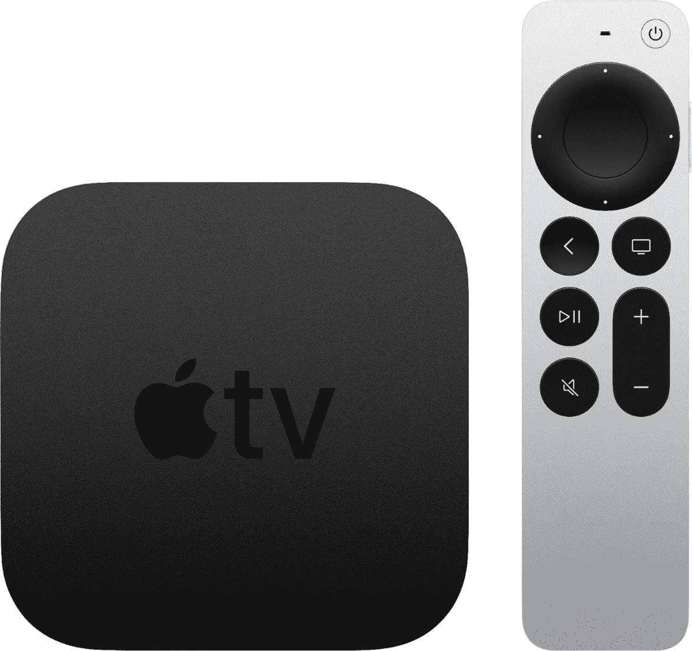

# 亚马逊 Prime Day 交易让 4K 苹果电视降价 70 美元

> 原文：<https://www.xda-developers.com/amazon-prime-day-deal-knocks-70-off-apple-tv-4k/>

任何苹果爱好者都会告诉你，在苹果产品上获得好的交易是相当困难的。虽然较小的第三方卖家有时会有促销活动，但这可能不会像从大型零售商那里购买一样给人以信心。但是每隔一段时间，你会得到一个很好的折扣。幸运的是，现在正是时候，因为亚马逊的 Prime Day 销售正在为苹果电视 4K 提供大幅折扣。

亚马逊 Prime Day 的售价比 179 美元的零售价低了 70 美元。这意味着你将获得一个全新的设备，总价为 109 美元。谢天谢地，你可以对你的购买充满信心，因为该设备最近在 2021 年更新。最新型号采用苹果 A12 仿生 SoC，内置 32GB 存储空间。你可以想象，它非常强大，由苹果 iPhone XS 和 iPhone XS Max 中的相同芯片组驱动。

可以使用物理遥控器或使用 Siri 的语音来控制盒子。此外，如果你碰巧丢失了遥控器，你也可以使用你的 iPhone。Apple TV 4K 支持杜比视界的 4K 视频和高达 60fps 的 HDR。就音频而言，它支持杜比全景声。此外，如果你想将图片质量提升到另一个水平，你会很高兴知道苹果公司提供了一个可以使用 iPhone 进行校准的模式。至于流媒体服务，该部门支持最受欢迎的，如网飞，亚马逊 Prime Video，迪士尼+，HBO Max 和 Apple TV Plus。

如果苹果电视 4K 不是你想要的，还有很多其他苹果产品，如 ai rpods Max T1 和 ai rpods Pro T3。如果这些不适合你，看看我们的[亚马逊 Prime Day](https://www.xda-developers.com/amazon-prime-day/) 交易页面，因为我们会经常更新。

 <picture></picture> 

Apple TV 4K

##### 苹果电视 4K (2021 年)

Apple TV 4K 提供 32GB 的内部存储空间，可以访问数千部电影