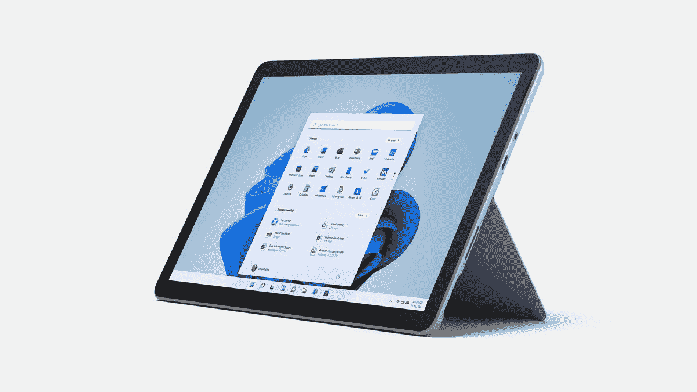
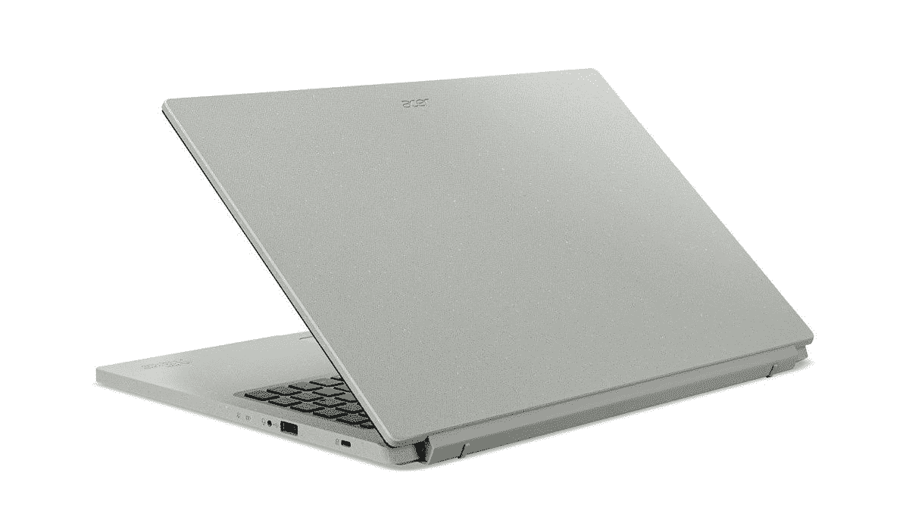

# 亚马逊 Prime Day 比顶级 Surface Laptop Studio 便宜 500 多美元

> 原文：<https://www.xda-developers.com/amazon-prime-day-over-500-off-surface-laptop-studio/>

亚马逊优惠日带来了各种各样的折扣，该公司还在气候承诺友好型电脑上开展交易。这些电脑使用了更环保的包装，打折产品的阵容包括一些大牌，如 Surface Laptop Studio，它的价格下调了近 600 美元，这对这款机器来说是一个巨大的折扣。

折扣适用于特定的配置，该配置配有英特尔酷睿 i7-11370H 处理器、Nvidia GeForce RTX 3050 Ti 显卡、32GB 内存和 1TB 固态硬盘。除了内部规格之外，Surface Laptop Studio 还配备了 2400 x 1600 分辨率的 14.4 英寸显示屏，它有一个独特的外形，允许它在不同模式下使用，并可以轻松地在模式之间切换。这种配置通常价格为 2，699.99 美元，但现在，你可以以 2，123.99 美元的价格购买它——这一价格降低了 576 美元，使这款笔记本电脑更加引人注目。你可以阅读我们的 [Surface Laptop Studio 评论](https://www.xda-developers.com/surface-laptop-studio-review/)来了解更多我们为什么喜欢它。

作为气候承诺友好销售的一部分，Surface Pro 8 也获得了重大折扣。在这种情况下，各种配置都打了折扣，顶级型号——配有酷睿 i7-1185G7、32GB 内存和 1TB 固态硬盘——比平时的价格低了 564 美元。您还可以在文章末尾查看其他配置。

*   <picture></picture>

    Surface Pro 8

    ##### 微软 Surface Pro 8

    Surface Pro 8 是微软迄今为止最高端的平板电脑，具有支持 120Hz 的高分辨率显示屏，高端英特尔处理器，以及高达 32GB 的 RAM 和 1TB 的 SSD 存储。这种配置通常需要 2599.99 美元，现在只要 2035.99 美元。

*   <picture></picture>

    宏碁 Aspire Vero(降价 200 美元)

    ##### 宏碁 Aspire Vero

    宏碁 Aspire Vero 是一款环保型产品，采用回收塑料制成的机箱，但包装依然坚固耐用。这款机型配有英特尔酷睿 i5 处理器、8GB 内存和 256GB 固态硬盘，现在售价仅为 499.99 美元。

如果我们谈论环保笔记本电脑，它不会比宏基 Aspire Vero 好多少。这款笔记本电脑完全是为了更加环保而设计的，看起来也是如此。最大的折扣是比基本配置低 200 美元，配备英特尔酷睿 i5-1155G7，8GB 内存和 256GB 固态硬盘。这使得价格从 699.99 美元降至 499.99 美元，这对你来说一点也不差。

同样，一些其他配置以及一些其他设备也不在考虑范围内。您还可以查看这些交易，它们是 Prime Day 气候承诺友好销售的一部分:

*   Surface Pro 8(英特尔酷睿 i7，16GB 内存，256GB 固态硬盘，白金)-1172.99 美元(通常为 1599.99 美元)
*   [Surface Pro 8(英特尔酷睿 i7，16GB 内存，256GB 固态硬盘，哑光黑)——1187.99 美元](https://www.amazon.com/Microsoft-Surface-Pro-8-13-Touchscreen/dp/B09DK7ZWMP?tag=xda-5i6doi9-20&ascsubtag=UUxdaUeUpU42458&asc_refurl=https%3A%2F%2Fwww.xda-developers.com%2Famazon-prime-day-over-500-off-surface-laptop-studio%2F&asc_campaign=Affiliate)(通常为 1599.99 美元)
*   [Surface Pro 8(英特尔酷睿 i7，16GB 内存，512GB 固态硬盘，白金)——1439.99 美元](https://www.amazon.com/Microsoft-Surface-Pro-8-13-Touchscreen/dp/B09DK45YW2?tag=xda-5i6doi9-20&ascsubtag=UUxdaUeUpU42458&asc_refurl=https%3A%2F%2Fwww.xda-developers.com%2Famazon-prime-day-over-500-off-surface-laptop-studio%2F&asc_campaign=Affiliate)(通常为 1899.99 美元)
*   [宏碁 Aspire Vero + Vero 套筒套装(英特尔酷睿 i7、16GB 内存、512GB 固态硬盘)——619.99 美元](https://www.amazon.com/Acer-AV15-51-7617-i7-1195G7-Graphics-Materials/dp/B09R63Z5L7?tag=xda-5i6doi9-20&ascsubtag=UUxdaUeUpU42458&asc_refurl=https%3A%2F%2Fwww.xda-developers.com%2Famazon-prime-day-over-500-off-surface-laptop-studio%2F&asc_campaign=Affiliate)(通常为 749.99 美元)
*   惠普 Envy x360 15 (AMD 锐龙 7 5825U，8GB 内存，512GB 固态硬盘)-739.99 美元(通常为 959.99 美元)
*   [戴尔 Inspiron 灵越 14 (AMD 锐龙 7 5825U，8GB 内存，512GB 固态硬盘)-832.99 美元](https://www.amazon.com/Dell-Inspiron-5425-Non-Touch-Laptop/dp/B01MXJ8DDQ?tag=xda-5i6doi9-20&ascsubtag=UUxdaUeUpU42458&asc_refurl=https%3A%2F%2Fwww.xda-developers.com%2Famazon-prime-day-over-500-off-surface-laptop-studio%2F&asc_campaign=Affiliate)(通常为 949.99 美元)
*   [宏碁 Chromebook Spin 314(英特尔奔腾银色 N6000，4GB 内存，128 GB eMMC)-314.99 美元](https://www.amazon.com/Acer-Chromebook-Convertible-Pentium-CP314-1H-P9G7/dp/B09R5WWXZG?tag=xda-5i6doi9-20&ascsubtag=UUxdaUeUpU42458&asc_refurl=https%3A%2F%2Fwww.xda-developers.com%2Famazon-prime-day-over-500-off-surface-laptop-studio%2F&asc_campaign=Affiliate)(通常为 379.99 美元)
*   [优派 VP2458 24 英寸显示器(全高清 IPS，60Hz)——219.99 美元](https://www.amazon.com/ViewSonic-VP2458-Professional-Monitor-Accuracy/dp/B07JR9R5YS?tag=xda-5i6doi9-20&ascsubtag=UUxdaUeUpU42458&asc_refurl=https%3A%2F%2Fwww.xda-developers.com%2Famazon-prime-day-over-500-off-surface-laptop-studio%2F&asc_campaign=Affiliate)(通常为 269.99 美元)

虽然大多数笔记本电脑没有最新的硬件，但它们仍然非常现代，而且以你现在能买到的价格来看，它们非常划算。虽然 Surface 设备似乎有最大的折扣，但就个人而言，Surface Laptop Studio 仍然是最引人注目的，这要归功于它的外形。