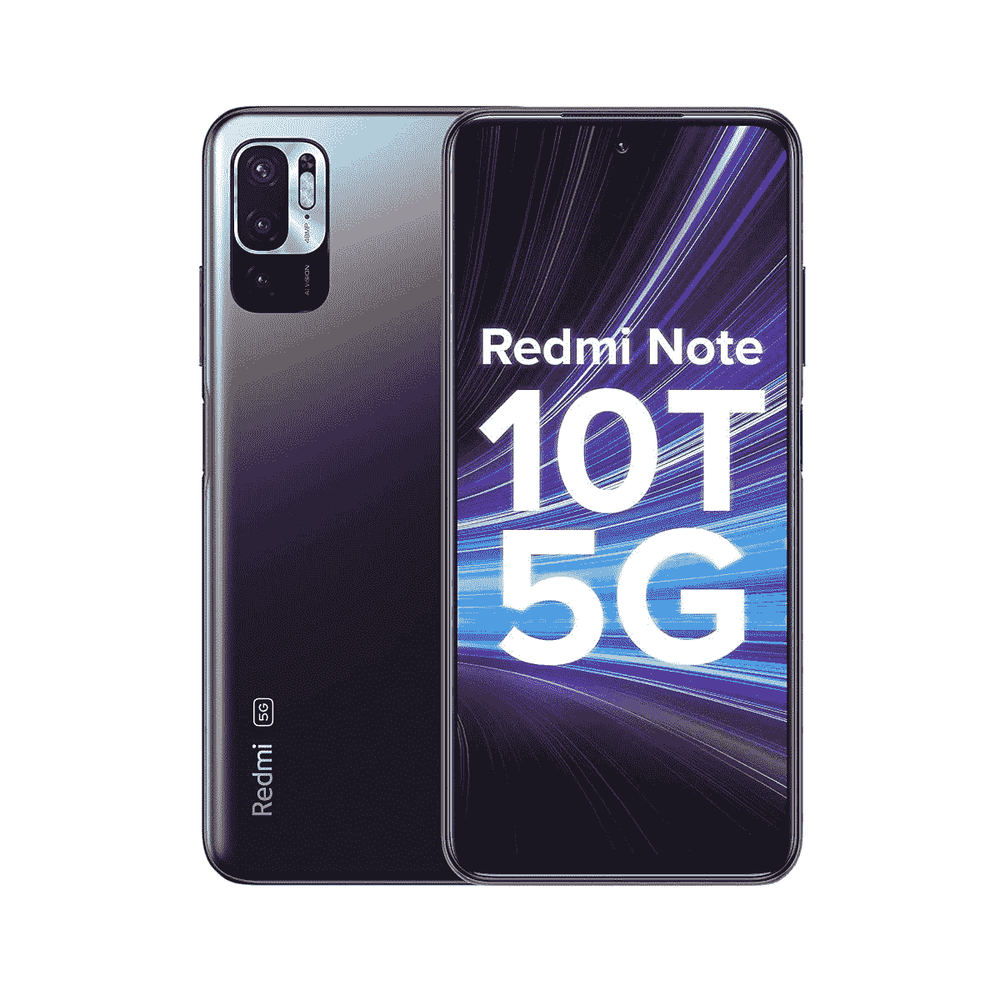
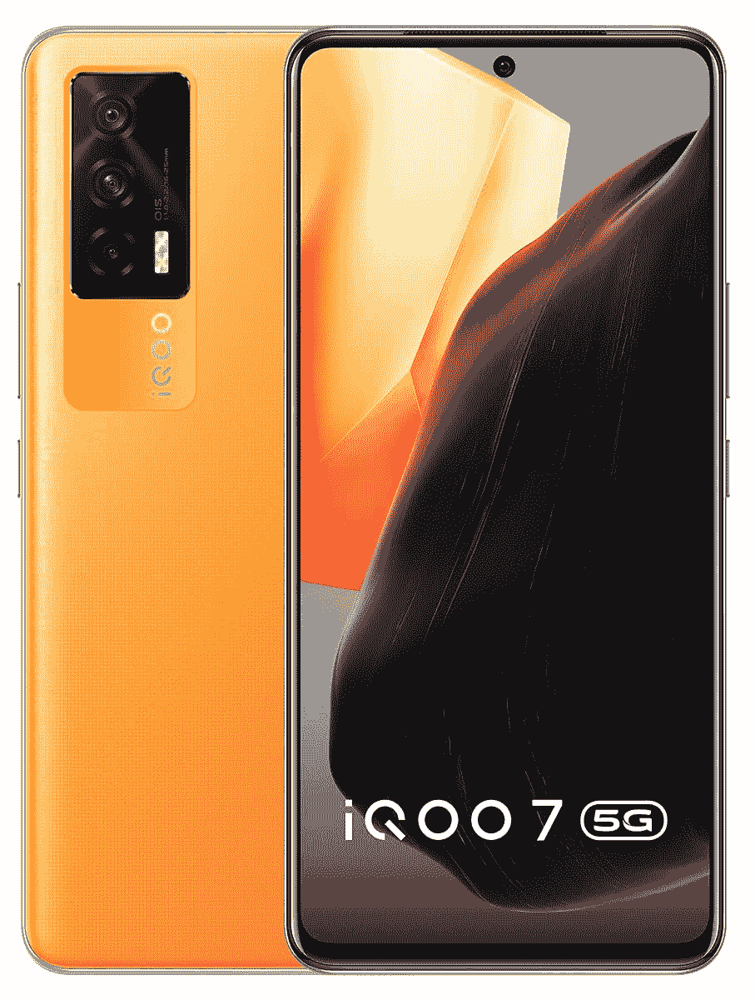
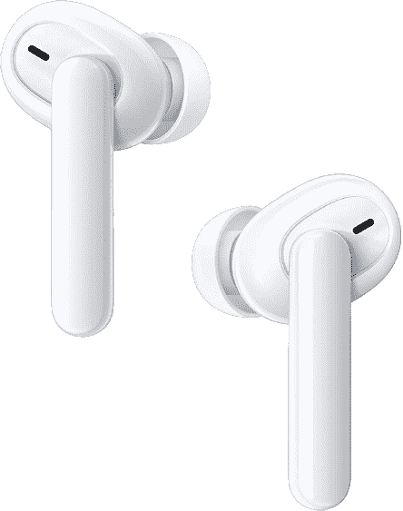
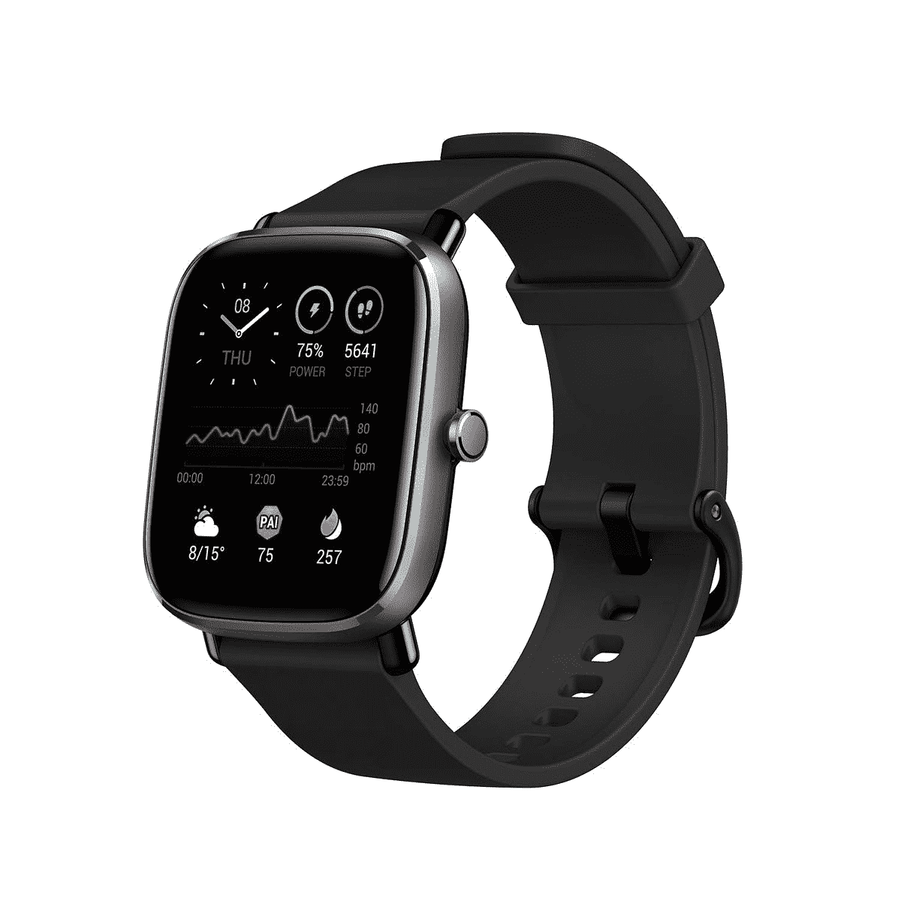
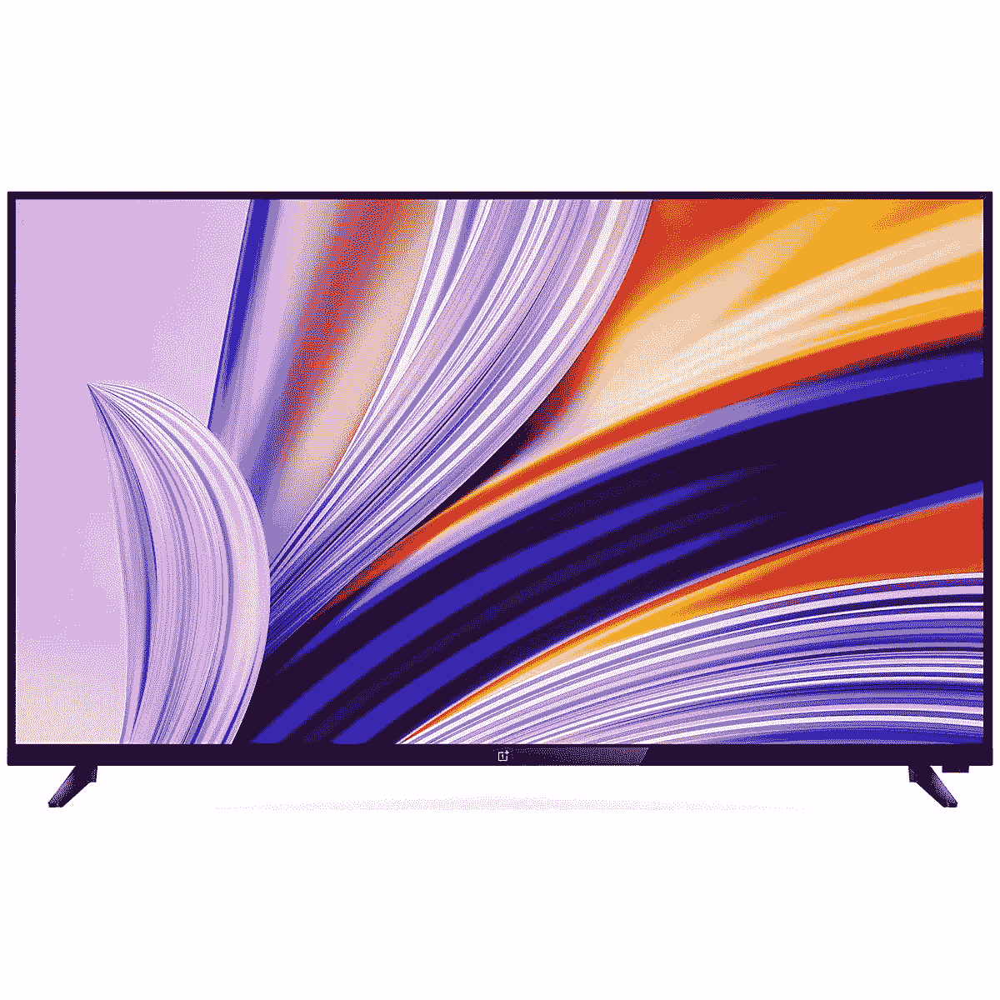
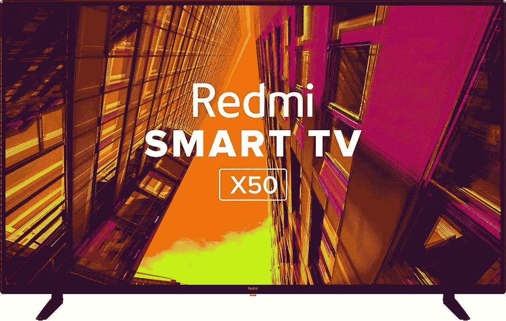
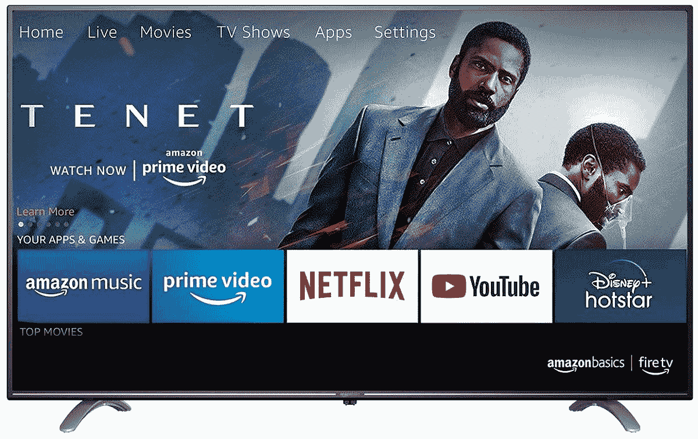
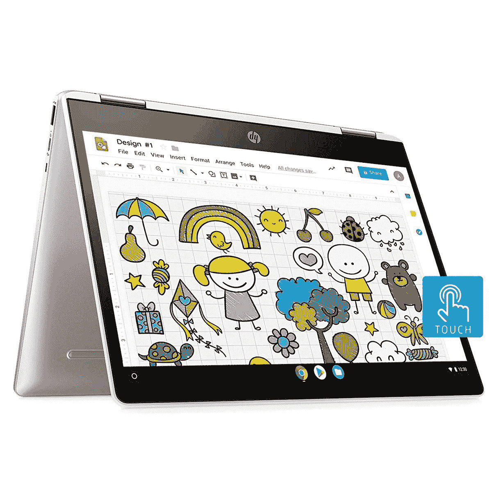
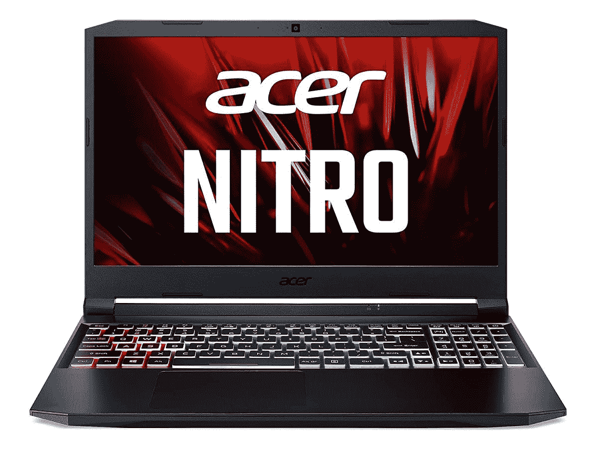
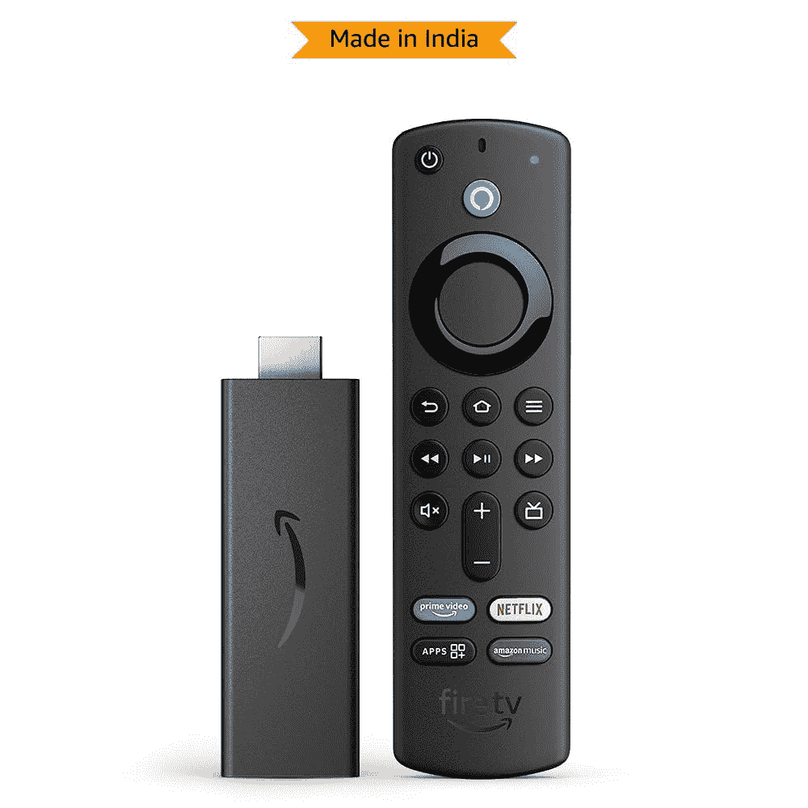

# 印度亚马逊黄金日销售的最佳交易:智能手机和更多！

> 原文：<https://www.xda-developers.com/amazon-prime-day-sale-best-deals-india/>

亚马逊的 Prime Day 销售在印度每隔几个月举行一次，提供各种类别的一些最佳交易。当然，我们只对销售的技术部分感兴趣，这也是大多数人感兴趣的，尤其是如果你想买一部新的智能手机、笔记本电脑，甚至是一个配件。然而，多年来，这种销售的吸引力已经大大降低，折扣也没有以前那么高了。然而，仍然有一些好的交易可以帮你节省几千美元，特别是当你考虑到额外的卡折扣和返现时。我们收集了一些我们在印度 2021 年 Prime Day 期间在亚马逊上发现的最佳交易，以帮助你以最优惠的价格挑选最适合你的产品。

我们将这个列表分为多个部分，从智能手机到电视，以及智能手表和 TWS 耳机等配件。请注意，该列表将在销售日不断更新，因此请确保您经常查看是否添加了任何新的交易。另一件需要注意的事情是，你需要成为亚马逊的 Prime 会员才能参与早期的销售。此外，就像 XDA 的其他地方一样，你从这篇文章中获得的链接是附属链接:我们从你的购买中获得(非常小的)百分比。这有助于支持网站。

## 亚马逊 Prime Day 销售的卡优惠和返现

除了许多产品通常的折扣价之外，如果您使用符合条件的信用卡或借记卡进行交易，还可以获得额外的折扣和返现。亚马逊与 HDFC 银行合作，为一些产品提供额外折扣。如果你有亚马逊支付信用卡与 ICICI 银行合作，你也可以获得一些额外的返现。

这些是 Prime Day 销售期间在亚马逊上购买的所有商品的通用卡优惠:

| 

卡片

 | 

无 EMI

 | 

带 EMI

 |
| --- | --- | --- |
| HDFC 银行借记卡 | 10%到₹500 | 10%到₹1,750 |
| HDFC 银行信用卡 | 10%到₹1,250 | 10%到₹1,750 |
| 亚马逊支付信用卡 | 5%返现 | 无成本 EMI |

请注意，使用任何 HDFC 银行卡都将使您有权享受上表中提到的即时折扣，而使用 Amazon Pay 信用卡将获得现金返还。这些优惠可以与购买时产品页面上的任何其他优惠券一起使用。但是，我们建议经常阅读小字，返现/折扣在此期间只能使用一次。

## 黄金日的新品发布

每个黄金日，都会有一些新品和独家产品首次上市销售。这些是你可以接触到的一些新产品发布。

 <picture></picture> 

OnePlus Nord 2

##### 一加诺德 2 5G

Nord 2 是一加的最新手机，是去年非常受欢迎的一加诺德手机的继任者。它有坚实的价格规格，并提供了一个良好的整体包装。

 <picture></picture> 

Redmi Note 10T 5G

##### 红米 Note 10T 5G

Redmi 也凭借 Note 10T 5G 进入了印度的 5G 手机市场。坦率地说，这款手机没有提供最好的价值，我们建议使用标准的 Redmi Note 10。

 <picture></picture> 

iQOO 7 Monster Orange

##### iQOO 7

iQOO 7 于今年早些时候推出，是一款预算旗舰的绝佳选择，尤其是在游戏方面。它现在有了一种新的怪物橙色，看起来既酷又时髦。

| 

Sl。号码

 | 

产品

 | 

价格

 | 

购买链接

 |
| --- | --- | --- | --- |
| 1 | 三星 Galaxy M21 2021 | ₹12,499 | [在此购买](https://www.amazon.in/dp/B098NGDNMT/?tag=xdaportalin-21) |
| 2 | Realme Watch 2 Pro | ₹4,999 | [在这里购买](https://www.amazon.in/realme-Touchscreen-Dual-Satellite-Monitoring-Resistance/dp/B094Y495LQ/?tag=xdaportalin-21) |
| 3 | Realme Buds 无线 2 Neo | ₹1,399 | [在此购买](https://www.amazon.in/realme-Wireless-Earphones-Bluetooth-Connection/dp/B0999NNBPV/?tag=xdaportalin-21) |
| 4 | FCUK 系列 2 智能手表 | ₹3,999 | [在此购买](https://www.amazon.in/FCUK-touch-Smartwatch-Color-Built/dp/B097F6JM1Q/?tag=xdaportalin-21) |
| 5 | 联想标签 P11 | ₹24,999 | [在此购买](https://www.amazon.in/Lenovo-Tab-P11-inch-Wi-fi/dp/B099ML77P9/?tag=xdaportalin-21) |

## 最佳智能手机交易

智能手机是销售季节的主要亮点，因为你会得到一些诱人的优惠以及优惠券，可以为你节省几千美元。以下是亚马逊上一些最好的智能手机交易

 <picture></picture> 

iPhone XR

##### 苹果 iPhone XR

iPhone XR 64GB 在₹37,999 可以通过 HDFC 卡获得额外折扣。如果你想买一部便宜的 iPhone，这是一笔不错的交易。

 <picture></picture> 

Apple iPhone 11

##### 苹果 iPhone 11

iPhone 11 拥有出色的摄像头，对于₹47,999 来说，这是拍照和录像的最佳选择。在 2021 年仍然很划算。

 <picture></picture> 

OnePlus 9

##### 一加 9

OnePlus 9 在₹45,999 可凭优惠券购买，还可享受附加卡优惠。那个价位的一款不错的安卓旗舰。

| 

Sl。号码

 | 

产品

 | 

价格

 | 

购买链接

 |
| --- | --- | --- | --- |
| 1 | 三星 Galaxy Note 20 | ₹54,999 | [在此购买](https://www.amazon.in/dp/B089MTFG7N/?tag=xdaportalin-21) |
| 2 | 小米 Mi 11X | ₹27,999 | [在此购买](https://www.amazon.in/gp/product/B085J1QWFV/?tag=xdaportalin-21) |
| 3 | iQOO Z3 | ₹19,500 | [在此购买](https://www.amazon.in/gp/product/B07WDKLZPN/?tag=xdaportalin-21) |
| 4 | iQOO 7 传奇 5G | ₹36,990 | [在此购买](https://www.amazon.in/dp/B08697MJFD/?tag=xdaportalin-21) |
| 5 | 小米 Mi 11X Pro 5G | ₹37,999 | [在这里购买](https://www.amazon.in/gp/product/B07WDKLZPN/?tag=xdaportalin-21) |
| 6 | 红米 Note 10 Pro Max | ₹18,999 | [在此购买](https://www.amazon.in/dp/B089MVC43X/?tag=xdaportalin-21) |

## 最佳配件交易

如果你正在寻找一些好的配件来搭配你的手机，这里有一些不错的智能手表和无线耳机，可以成为你的智能手机的好伴侣。

 <picture></picture> 

Oppo Enco M31

##### OPPO Enco M31

如果你正在寻找一副可靠的、听起来很棒的颈带耳机，Enco M31 在₹1,499.有着非凡的价值

 <picture></picture> 

Oppo Enco W51

##### OPPO Enco W51

Oppo 的 Enco W51 TWS 耳机是₹3,999.的绝佳选择他们有 ANC 和非常吸引人的声音签名。在那个价格上必须购买。

 <picture></picture> 

Amazfit GTS 2 mini

##### 亚马逊飞度 GTS 2 迷你版

Amazfit 一直在制造一些非常好的智能手表，GTS 2 Mini 就是其中之一。它以₹6,499.的价格提供了大量的功能

| 

Sl。号码

 | 

产品

 | 

价格

 | 

购买链接

 |
| --- | --- | --- | --- |
| 1 | 三星 Galaxy Buds Plus | ₹4,999 | [在此购买](https://www.amazon.in/dp/B084MXFPYQ?tag=xdaportalin-21) |
| 2 | 索尼 WH-1000XM3 | ₹17,990 | [在此购买](https://www.amazon.in/dp/B07HZ8JWCL/?tag=xdaportalin-21) |
| 3 | 船只空投炸弹 501 | ₹2,499 | [在此购买](https://www.amazon.in/gp/product/B097GLNPSK/?tag=xdaportalin-21) |
| 4 | 苹果手表 SE | ₹24,900 | [在此购买](https://www.amazon.in/gp/product/B08J6C21M2/?tag=xdaportalin-21) |
| 5 | 船只空投炸弹 391 枚 | ₹1,999 | [在此购买](https://www.amazon.in/gp/product/B08ZNNNG1Q/?tag=xdaportalin-21) |
| 6 | 噪声彩色拟合脉冲 | ₹2,499 | [在此购买](https://www.amazon.in/Noise-ColorFit-Smartwatch-Display-Monitors/dp/B097R2JBDF/?tag=xdaportalin-21) |
| 7 | 米手表旋转 | ₹7,499 | [在此购买](https://www.amazon.in/gp/product/B08GXFDT7V?tag=xdaportalin-21) |
| 8 | 苹果 AirPods Pro | ₹17,999 | [在此购买](https://www.amazon.in/Apple-MWP22HN-A-AirPods-Pro/dp/B07ZRXF7M8/?tag=xdaportalin-21) |
| 9 | Bose QC35 II | ₹18,990 | [在此购买](https://www.amazon.in/Bose-Quiet-Comfort-Wireless-Headphone/dp/B0756CYWWD/?tag=xdaportalin-21) |
| 10 | Bose SoundLink Revolve+ II | ₹17,150 | [在此购买](https://www.amazon.in/Bose-SoundLink-Speaker%C2%80%C2%94Wireless-Water-Resistant-Long-Lasting/dp/B08SCHWG3Y/?tag=xdaportalin-21) |
| 11 | DJI 奥斯莫手机 3 | ₹6,999 | [在这里购买](https://www.amazon.in/DJI-Mobile-Handheld-Smartphone-Gimbal/dp/B07RHJ7LWH?tag=xdaportalin-21) |
| 12 | 索尼 WH-1000XM4 | ₹23,990 | [在此购买](https://www.amazon.in/Sony-WH-1000XM4-Cancelling-Headphones-Bluetooth/dp/B0863TXGM3?tag=xdaportalin-21) |
| 13 | Jabra Elite 65t | ₹2,799 | [在此购买](https://www.amazon.in/dp/B079L9WYP7/?tag=xdaportalin-21) |
| 14 | HyperX 云毒刺游戏耳机 | ₹2,590 | [在此购买](https://www.amazon.in/HyperX-Cloud-Stinger-Gaming-Headset/dp/B083Q6Q41G/?tag=xdaportalin-21) |

## 最佳电视交易

由于小米、Realme 和一加等智能手机原始设备制造商进入电视市场，并以极具竞争力的价格推出优秀的智能电视，电视，尤其是智能电视在过去几年中在印度获得了疯狂的普及。以下是黄金时段销售的一些最佳电视节目。

 <picture></picture> 

OnePlus TV 43-inch

##### 一加电视 43 英寸

如果你正在寻找一台 1080p 分辨率的 43 英寸电视，OnePlus 电视可以以₹1000 更便宜的优惠卡折扣购买。如果你不想花太多钱，这是个不错的选择。

 <picture></picture> 

Redmi TV 50-inch

##### Redmi X50 50 英寸 4K LED 电视

Redmi 50 英寸电视有一个 4K 面板，如果你想在不花太多钱的情况下购买一台智能电视，这是一个不错的选择。有₹1000 的优惠，外加₹3000 的额外折扣。

 <picture></picture> 

AmazonBasics 50-inch TV

##### 亚马逊基础 50 英寸电视

AmazonBasics 是亚马逊的本土品牌，他们制造的产品质量很好。如果你不喜欢红米电视，这是另一个不错的选择，目前在₹33,999.有售

| 

Sl。号码

 | 

产品

 | 

价格

 | 

购买链接

 |
| --- | --- | --- | --- |
| 1 | 索尼 Bravia 55 英寸 4K 电视 | ₹66,490 | [在此购买](https://www.amazon.in/gp/product/B084T8MD6L/?tag=xdaportalin-21) |
| 2 | 三星 50 英寸水晶 4K 电视 | ₹48,990 | [在此购买](https://www.amazon.in/dp/B07HZ8JWCL/?tag=xdaportalin-21) |
| 3 | LG 55 英寸 4K OLED 电视 | ₹1,24,990 | [在此购买](https://www.amazon.in/gp/product/B095M4ZQ8W/?tag=xdaportalin-21) |
| 4 | 三星 Serif 系列 43 英寸电视 | ₹59,990 | [在此购买](https://www.amazon.in/dp/B086WPNHN6/?tag=xdaportalin-21) |
| 5 | 三星框架系列 4K 电视 | ₹60,990 | [在此购买](https://www.amazon.in/dp/B095P9WB6R/?tag=xdaportalin-21) |

## 最佳笔记本电脑交易

随着学校和大学在线上课和考试，笔记本电脑已经成为大多数家庭的必需品。如果你想买一台新的笔记本电脑，这里有一些不错的选择，可以帮你省下更多的钱。

 <picture></picture> 

HP Chromebook x360

##### 惠普 Chromebook X360

这款来自惠普的 Chromebook 是一款 2 合 1 设备，非常适合只需要一台笔记本电脑来进行媒体消费、视频通话和浏览网页的学生甚至老年人。

 <picture></picture> 

Acer Nitro 5

##### Acer Nitro 5

宏碁 Nitro 5 拥有第 11 代 i5 CPU 和 GTX 1650 GPU。它配有 8GB 内存和 512GB 固态硬盘。在₹65k.预算紧张的情况下，一款出色的游戏笔记本电脑

 <picture></picture> 

Lenovo IdeaPad Slim 3

##### 联想 IdeaPad Slim 3

如果您想要一台轻薄的笔记本电脑来完成网页浏览、文档编辑、参加会议/课程等基本任务。₹38,990 的这个是个不错的选择。

| 

Sl。号码

 | 

产品

 | 

价格

 | 

购买链接

 |
| --- | --- | --- | --- |
| 1 | 惠普 15 2021 | ₹39,990 | [在此购买](https://www.amazon.in/gp/product/B095YC11CF/?tag=xdaportalin-21) |
| 2 | 戴尔 Vostro 成就 3405 | ₹45,490 | [在这里购买](https://www.amazon.in/gp/product/B08X4P5TVN/?tag=xdaportalin-21) |
| 3 | 华硕 VivoBook 14 | ₹53,990 | [在此购买](https://www.amazon.in/gp/product/B08JMMP9XJ/?tag=xdaportalin-21) |
| 4 | 米笔记本 14 地平线版 | ₹51,990 | [在此购买](https://www.amazon.in/gp/product/B089F5JGM1/?tag=xdaportalin-21) |
| 5 | 华硕 TUF 游戏 F15 | ₹76,990 | [在此购买](https://www.amazon.in/gp/product/B096VKVFCN/?tag=xdaportalin-21) |
| 6 | 惠普 Pavillion 游戏笔记本电脑 | ₹56,990 | [在此购买](https://www.amazon.in/gp/product/B08CZ2KNS4/?tag=xdaportalin-21) |

## 最佳亚马逊回声和消防电视交易

当然，最好的 Prime Day 交易是亚马逊自己生产的产品。这包括带有 Alexa 的 Echo 扬声器和亚马逊的 Fire TV sticks，用于在电视上播放流媒体内容。以下是我们发现的一些最划算的交易。

 <picture></picture> 

Amazon Echo Dot (4th Gen)

##### 亚马逊回声点(第四代)

如果你想进入智能家居生态系统，Echo Dot 是一个不错的起点。音质也很好，对于₹3,249 来说，绝对值得推荐。

 <picture></picture> 

Fire TV Stick 3rd Gen

##### 亚马逊 Fire 电视棒第三代

Fire TV Stick 是市场上最好的流媒体设备之一，其折扣价为₹2,399，这是显而易见的。这是高清版。

 <picture></picture> 

Amazon Echo Show 5

##### 亚马逊 Echo Show 5(第一代)

带有内置屏幕的智能扬声器，可用于控制其他智能设备，甚至观看节目和电影。对₹4,499.来说很划算你也可以用它来进行视频通话。

| 

Sl。号码

 | 

产品

 | 

价格

 | 

购买链接

 |
| --- | --- | --- | --- |
| 1 | Fire 电视棒 Lite | ₹2,099 | [在此购买](https://www.amazon.in/Fire-TV-Stick-Lite-with-Alexa-Voice-Remote-Lite/dp/B07ZZW86G4/?tag=xdaportalin-21) |
| 2 | Echo Dot 第三代+智能灯泡 | ₹2,299 | [在此购买](https://www.amazon.in/gp/product/B096S89393?tag=xdaportalin-21) |
| 3 | Fire 电视棒 Plus | ₹3,099 | [在这里购买](https://www.amazon.in/dp/B097761D56/?tag=xdaportalin-21) |
| 4 | 消防电视立方体 | ₹8,899 | [在此购买](https://www.amazon.in/dp/B083VWSQJC/?tag=xdaportalin-21) |

## 杂项交易

这里有一些不属于上述类别的技术交易，但在当前价格下是物有所值的。游戏机、相机、电脑外设——诸如此类的东西！

| 

Sl。号码

 | 

产品

 | 

价格

 | 

购买链接

 |
| --- | --- | --- | --- |
| 1 | 任天堂 Switch 建兴 | ₹18,999 | [在此购买](https://www.amazon.in/gp/product/B092VT1JGD/?tag=xdaportalin-21) |
| 2 | 任天堂 Switch -动物穿越 | ₹36,999 | [在此购买](https://www.amazon.in/gp/product/B08L5H2NSH/?tag=xdaportalin-21) |
| 3 | 任天堂 Switch -第二版 | ₹29,999 | [在此购买](https://www.amazon.in/gp/product/B07WH14NYF/?tag=xdaportalin-21) |
| 4 | 佳能 EOS 1500D | ₹26,490 | [在此购买](https://www.amazon.in/gp/product/B07BS4TJ43/?tag=xdaportalin-21) |
| 5 | 罗技 MX Master 2S | ₹4,995 | [在此购买](https://www.amazon.in/Logitech-Wireless-Cross-Computer-Control-Sharing/dp/B071YZJ1G1/?tag=xdaportalin-21) |
| 6 | Oculus Quest 2 VR 耳机 | ₹35,699 | [在此购买](https://www.amazon.in/Oculus-Quest-Advanced-All-One/dp/B08F7PTF53?tag=xdaportalin-21) |

* * *

这些是我们在 2021 年黄金日遇到的一些最好的交易。我们将实时更新这个列表，提供更多不同类别的交易，请密切关注。