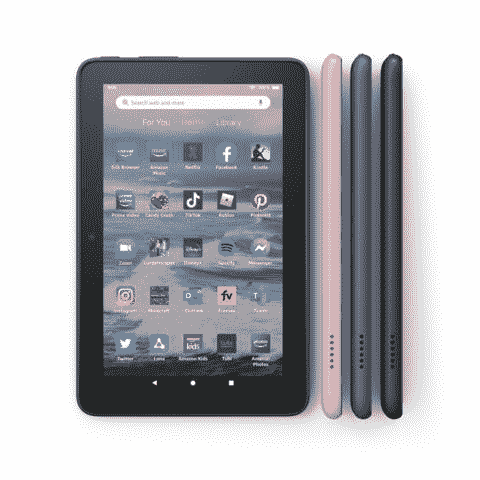

# 亚马逊更新其 Fire 7 平板电脑，带来免提 Alexa 等

> 原文：<https://www.xda-developers.com/amazon-refreshes-fire-7-2022/>

# 亚马逊更新了其 Fire 7 和 Fire 7 Kids 平板电脑，带来了免提 Alexa 等

亚马逊更新了其 Fire 7 和 Fire 7 Kids 平板电脑，带来了免提 Alexa 支持，更长的电池寿命等等。

亚马逊的 Fire 7 平板电脑是娱乐、学习等的绝佳选择。这些多功能设备的价格也很实惠——对于那些不想花大钱买平板电脑的人来说，它们是完美的选择。到目前为止，该公司自 2019 年以来一直没有刷新它们。对 Fire 粉丝来说，幸运的是，亚马逊现在带着 Fire 7 和 Fire 7 Kids 平板电脑的改进型号回来了。2022 版带来了免提 Alexa 支持、更多内存、更长的电池寿命和其他升级。

自上次更新以来的三年后，亚马逊带着新的 Fire 7 和 Fire 7 Kids 平板电脑回来了。今年的版本有很多新的变化，考虑到它们的低价格标签，使它们如此便宜。由于升级了芯片，这些平板电脑现在比 2019 年的型号快 30%。此外，它们的内存增加了一倍，从 1GB 增加到 2GB。电池寿命也受到了一些人的喜爱，现在一次充电后，平板电脑的续航时间延长了 40%左右。而且说到充电，亚马逊终于改用 USB Type-C 口了。但是，它仍然包括盒子里过时的 5W 砖。最后，它们现在都支持免提 Alexa 允许你用你的声音控制设备。

这两款 Fire 7 平板电脑几乎完全相同，儿童版的价格稍高一些，但有一些额外的好处。这些独家包括:

*   多彩、适合儿童使用的保护套，坚固耐用，为意外跌落提供额外保护。
*   2 年无忧保障。
*   Amazon Kids Plus 的一年期——该公司提供的订阅服务，包括针对儿童的教育和娱乐内容。

普通的 Fire 7 在美国的起价仅为 59.99 美元。儿童版本的价格几乎翻了一番——109.99 美元。您可以今天就预订，6 月 29 日开始发货。值得注意的是，59.99 美元的定价是针对广告支持模式的。如果你不想在锁屏上看到广告，你可以支付 74.99 美元。

 <picture></picture> 

Amazon Fire 7 (2022)

##### 亚马逊大火 7 (2022)

2022 款亚马逊 Fire 7 和 Fire 7 Kids 配备了更快的芯片、更大的内存、更长的电池寿命和免提 Alexa。您现在就可以预订，发货时间定在 6 月 29 日。

*你打算购买这两款亚马逊平板电脑中的任何一款吗？请在下面的评论区告诉我们。*

* * *

**来源:** [*亚马逊*](https://press.aboutamazon.com/news-releases/news-release-details/introducing-next-generation-fire-7-and-fire-7-kids-amazons-0)