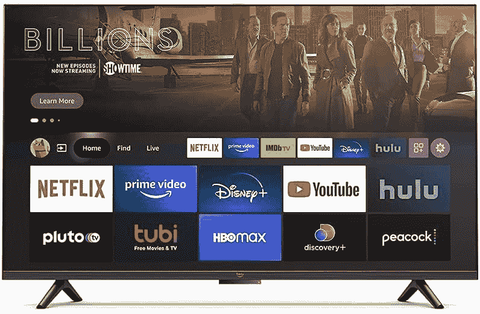
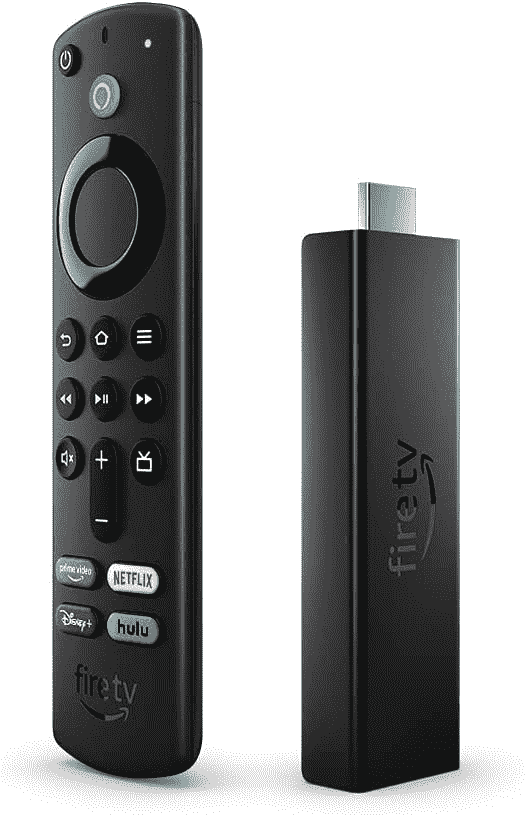

# 亚马逊展示了自己的智能电视阵容和更新的 4K Fire 电视棒

> 原文：<https://www.xda-developers.com/amazon-reveals-its-own-smart-tv-lineup-and-an-updated-4k-fire-tv-stick/>

上周，行业报告称[亚马逊正在为美国开发自有品牌的智能电视](https://www.xda-developers.com/amazon-reportedly-working-on-own-smart-tv/)，但这些电视与现有 Fire TV 产品有何不同的细节尚不清楚。亚马逊现在正式宣布了其新电视，以及为云游戏打造的更新版 Fire 电视棒。我们已经收集了亚马逊的所有新硬件，但该公司也推出了其 Luna 游戏流媒体服务的更新，你可以在这里阅读关于[的内容](https://www.amazon.com/dp/B08MQZXN1X?tag=xda-3v8gfrd-20&ascsubtag=UUxdaUeUpU4563&asc_refurl=https%3A%2F%2Fwww.xda-developers.com%2Famazon-reveals-its-own-smart-tv-lineup-and-an-updated-4k-fire-tv-stick%2F&asc_campaign=Short-Term)。

## 消防电视 Omni 系列

亚马逊将其主要电视产品系列称为“Omni 系列”，在很大程度上，它的工作方式与所有其他已经上市的 Fire 电视设备一样。它可以从亚马逊应用商店安装应用和流媒体服务，向 Alexa 提问，对选定的应用使用画中画模式，等等。你可以连接 Echo Studio 或其他 Echo 智能扬声器来改善声音，这一点[在其他 Fire TV](https://www.maketecheasier.com/setup-home-theater-system-echo-fire-tv/)上也是可行的。

 <picture></picture> 

Amazon Fire TV 55-inch Omni Series 4K UHD smart TV,

这里的主要独特之处在于，Alexa 可以在不按下或按住按钮的情况下收听命令，而大多数其他智能电视都需要这样做。亚马逊的 Omni 电视内置了用于 Alexa 的麦克风，所以你可以打开应用程序，切换输入等，而不用在附近有遥控器。当 Echo 扬声器与任何 Fire 电视配对时，同样的功能也是可能的，但将其全部内置肯定很方便。

亚马逊正在销售多种尺寸的电视，包括 34 英寸、50 英寸、55 英寸、65 英寸和 75 英寸。它们都支持 4K、HDR10、HLG 和杜比数字加。65 英寸和 75 英寸机型具有更薄的边框，并支持杜比视界，但在其他方面与其他尺寸相同。图片和规格显示背面有四个 HDMI 端口(只有一个带有 eARC/ARC)、以太网、红外发射器(用于控制其他电视设备)和电缆/天线连接。43 英寸机型的起价为 309.99 美元。

 <picture></picture> 

Amazon Fire TV 55-inch Omni Series 4K UHD smart TV,

##### 亚马逊 Fire TV Omni 系列 65 英寸 4K 电视

这一系列智能电视有免提 Alexa。43 英寸机型的起价为 410 美元。

## 消防电视 4 系列

除了全品牌电视，亚马逊还在销售另一个品牌为“4 系列”的系列。这些电视没有免持 Alexa 模式或 Omni 系列的双向视频通话，因此它们或多或少与任何其他 Fire 电视相同。你仍然可以获得所有相同的软件功能和连接选项，包括四个 HDMI 端口和以太网，外加一个带有 Alexa 按钮的遥控器。

 <picture></picture> 

Fire TV 4-Series

4 系列比 Omni 系列便宜一点，最便宜的 43 英寸型号售价为 369.99 美元。只有三种尺寸可供选择:43 英寸、50 英寸和 55 英寸。鉴于 370 美元对于一台 43 英寸的智能电视来说已经是一个颇具竞争力的价格，而且亚马逊通常会在每次“黄金日”打折时将产品打折 15-30%，我相信杰夫·贝索斯会卖出很多这样的电视。

 <picture></picture> 

Fire TV 4-Series

##### 亚马逊 Fire TV 4 系列 50 英寸 4K 电视

这是亚马逊的入门级智能电视剧，没有免提的 Alexa。43 英寸机型的起价为 370 美元。

## 消防电视棒 4K 马克斯

亚马逊的最后一款新产品是 Fire TV Stick 4K 的更新版本，于 2018 年底首次发布。新型号比当前的 Fire TV Stick 4K“多 40%的功率”，具有更新的四核 1.8GHz 芯片组、2GB 内存、8GB 内部存储和 Wi-Fi 6 支持。

这款新棒还拥有所有常见的 Fire TV 功能，包括 Alexa 语音遥控器，访问亚马逊应用商店，以及支持大多数流媒体服务。亚马逊正在用新的游戏棒强调对 Luna 的支持，因为 Wi-Fi 6 支持和“自动低延迟模式”旨在改善云游戏体验。

新款 Fire 电视棒 4K Max 将于 10 月 7 日开始在美国上市销售，零售价为 54.99 美元。似乎目前的火电视棒 4K 仍将可用，至少目前如此。

 <picture></picture> 

Fire TV Stick 4K Max

##### 亚马逊 Fire 电视棒 4K Max

这款更新的 Fire 电视棒支持 Wi-Fi 6 和 4K 视频。