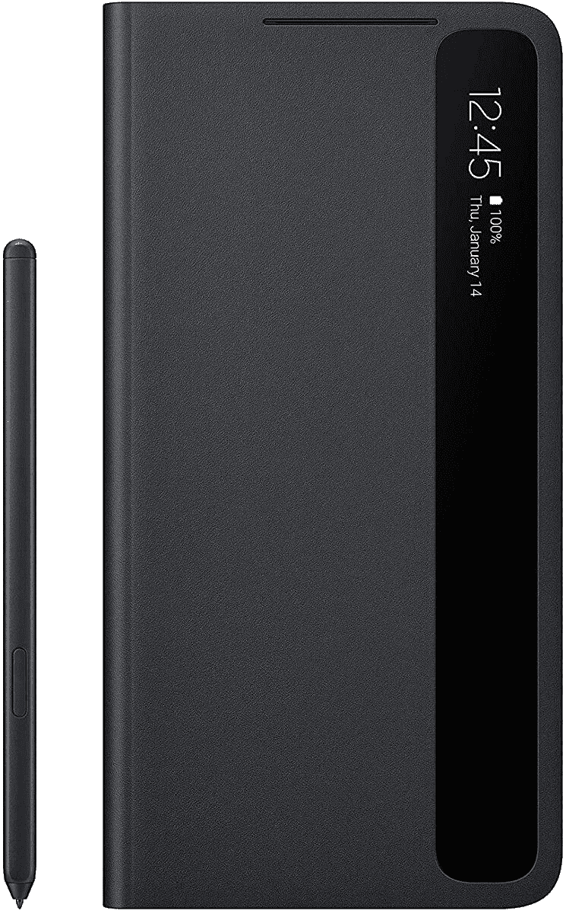
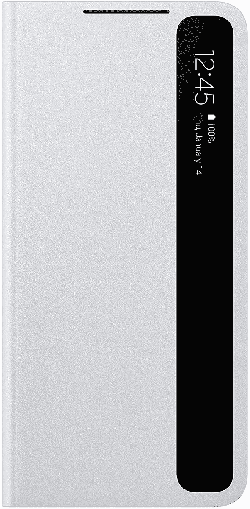
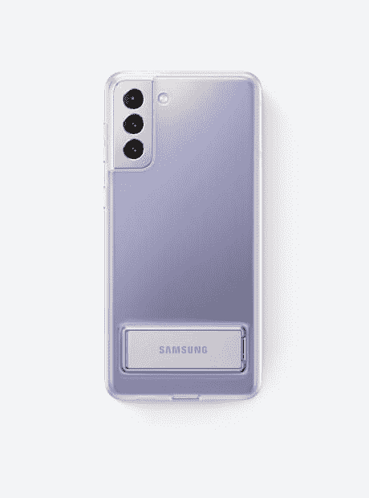
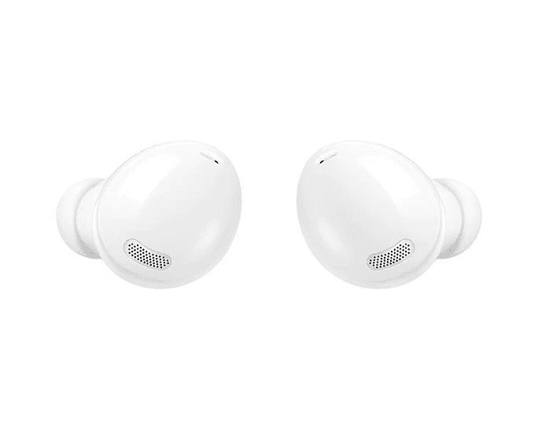
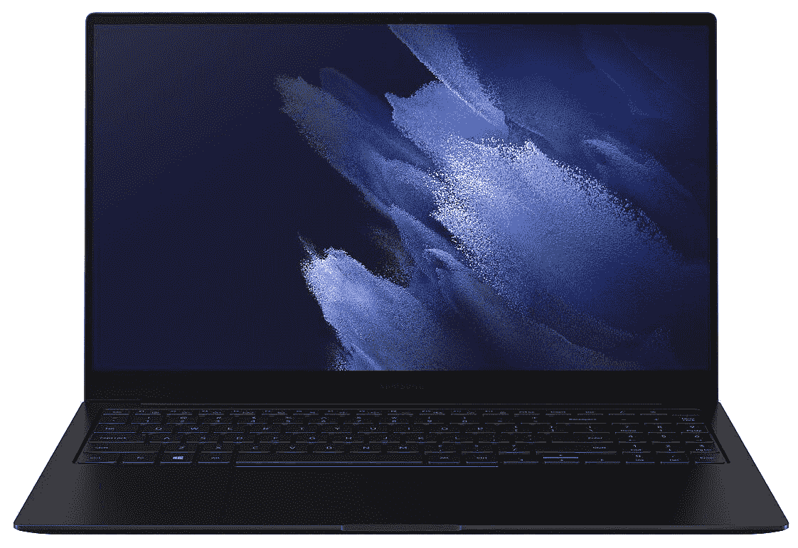
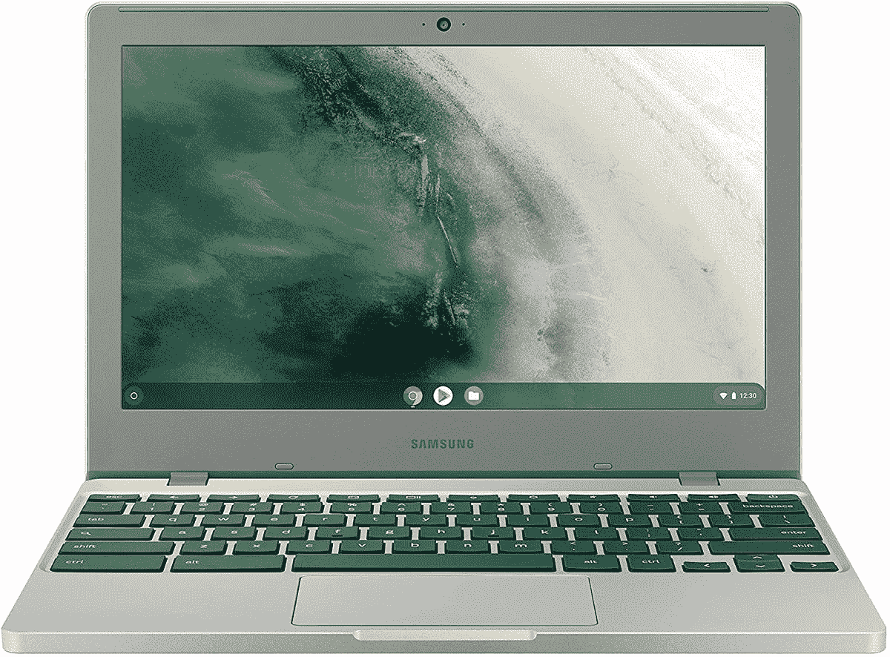
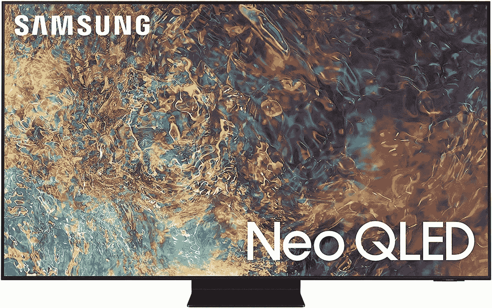
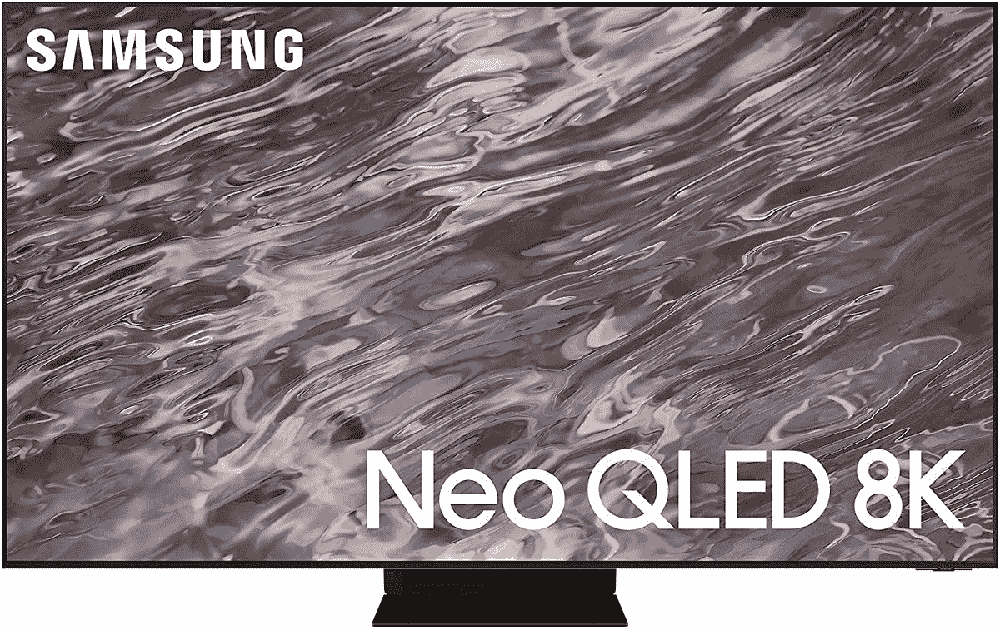
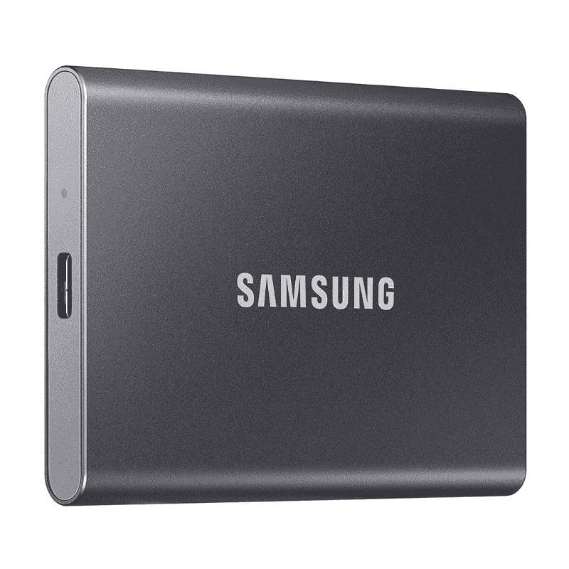
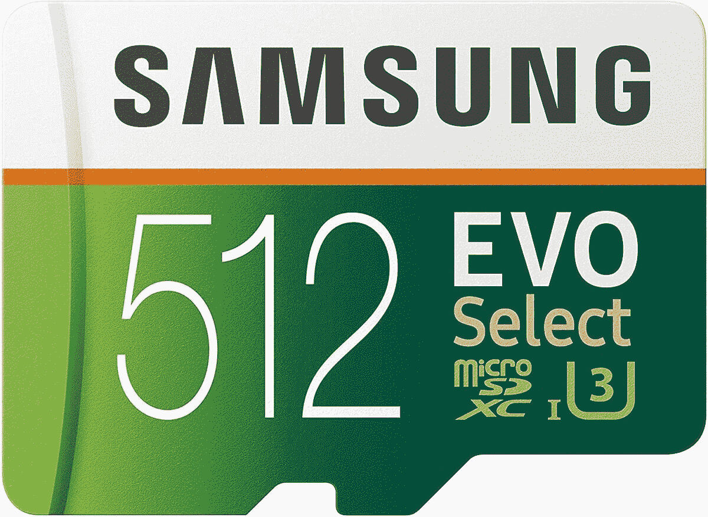

# 亚马逊三星销售包括手机、手表等商品

> 原文：<https://www.xda-developers.com/amazon-samsung-deals-oct2021/>

如果你想购买新的三星设备，亚马逊提供各种三星产品的交易，包括手机、可穿戴设备、配件、笔记本电脑和电视。许多产品都在打折，包括最近推出的产品，如三星 Galaxy Watch 4 和高级 Galaxy Book Pro 笔记本电脑。它们也是很大的折扣，所以如果你一直期待一些新的三星产品，这是完成一些假日购物的完美时间。

为了帮助你找到最完美的礼物，我们在下面列出了一些最划算的交易。我们会将它们分类，以便更容易找到。

## 三星手机和手机套的优惠

如果你正在寻找一部新手机，亚马逊的三星交易会以低得多的价格给你一部今年最好的安卓手机。你还可以以折扣价为你闪亮的新手机购买保护。

 <picture></picture> 

Galaxy S21 Ultra

三星 Galaxy S21 Ultra 是今年最好的手机之一，采用骁龙 888 芯片组和令人印象深刻的四摄像头设置。128GB 有很大的折扣，这使它更加诱人。

 <picture></picture> 

Samsung Galaxy S21 Ultra S Pen Case ($30 off)

##### 三星 S Pen Galaxy S21 Ultra S 外壳

想给你的 Galaxy S21 Ultra 加一支 S Pen？官方的笔包包括笔和保护你的手机，这也给你一个地方存放笔当你不使用它。

 <picture></picture> 

Galaxy S21 Ultra S-View Case with S Pen ($30 off)

##### 三星 S-View Galaxy S21 Ultra 外壳

如果你想要更多的保护，S-View 保护套也可以保护你的屏幕，同时给你一个简略的信息和快速的行动。你仍然可以得到笔和存放笔的地方。

 <picture></picture> 

Samsung Galaxy S21 Plus

##### 三星 Galaxy S21 Plus

如果你想要一部比 Galaxy S21 Ultra 更实惠的功能强大的手机，三星 Galaxy S21+在 256GB 型号上有更大的折扣，或者如果你想要不同颜色的话，你可以选择 128GB。

 <picture></picture> 

Galaxy S21+ S-View Flip Cover ($18 off)

##### 三星 S-View Galaxy S21 Plus 外壳

为了保护您的 Galaxy S21+免受各种跌落和碰撞，S-View 翻盖通过一个小屏幕为您提供全方位保护，以便快速访问信息。普通 S21 和 S21 Ultra 的版本也在打折。

 <picture></picture> 

Samsung Galaxy S21 Plus Official Clear Standing Cover

##### 三星 Galaxy S21 Plus

如果你有一台 Galaxy S21+,并且你希望你可以随时根据需要支撑它，这款清晰的立式保护套可以做到这一点，同时还可以保护你的手机。平时不贵，现在更便宜了。

如果你想更清楚地了解今天的交易，你可以[点击这里](https://www.amazon.com/deal/5aec9637?tag=xda-3mp56vj-20&ascsubtag=UUxdaUeUpU4909&asc_refurl=https%3A%2F%2Fwww.xda-developers.com%2Famazon-samsung-deals-oct2021%2F&asc_campaign=Short-Term)查看。

## 三星可穿戴设备和配件的交易

三星最近推出了 [Galaxy Watch 4](https://www.xda-developers.com/samsung-galaxy-watch-4/) ，这是第一款搭载谷歌和三星合作开发的新版 Wear OS 的智能手表。它现在也有最新的[银河芽](https://www.xda-developers.com/samsung-galaxy-buds-2-vs-galaxy-buds-pro/)型号打折。

 <picture></picture> 

Samsung Galaxy Watch 4 ($90 off)

##### 三星 Galaxy 手表 4

三星 Galaxy Watch 4 是最近才推出的，但它已经获得了近 30%的大折扣。折扣也适用于所有的颜色和尺寸。这款智能手表拥有全新的芯片组，运行由三星和谷歌开发的最新版本的 Wear OS，支持新的应用程序。

 <picture></picture> 

Samsung Galaxy Buds 2 ($50 off + SmartTag)

##### 三星 Galaxy 芽 2

三星 Galaxy Buds 2 也是三星最近推出的产品，它们以各种不同的颜色为您提供优质的声音。它们不仅现在便宜多了，而且你还可以免费获得一个 Galaxy SmartTag 追踪器，以跟踪贵重物品。

 <picture></picture> 

Samsung Galaxy Buds Pro

##### 三星 Galaxy Buds Pro

三星 Galaxy Buds Pro 没有 Galaxy Buds 2 那么新，但它们仍然有一些优势，包括更好的防水等级和入耳式检测等功能。另外，它们有不同的颜色，你可能会更喜欢。

## 笔记本电脑

如果你想升级你的笔记本电脑，三星 Galaxy Book Pro 是你今天能买到的最好的 Windows 设备之一，亚马逊的销售使它更有吸引力。它拥有高端规格，出色的 AMOLED 显示屏，非常轻薄，尤其是 13 英寸的机型。凭借 360 美元的巨大折扣，它绝对值得一试。

 <picture></picture> 

Samsung Galaxy Book Pro ($250 off)

##### 三星 Galaxy Book Pro

三星 Galaxy Book Pro 是一款高端笔记本电脑，采用高分辨率 AMOLED 显示屏，高端规格，包括最新的英特尔处理器，以及令人惊讶的轻质设计。这个折扣让它更加诱人，你还可以在 15.6 英寸的型号上获得折扣。

如果你正在寻找一款适合小孩子或非常轻便的廉价笔记本电脑，三星 Galaxy Chromebook 4 也有优惠。

 <picture></picture> 

Samsung Galaxy Chromebook 4 ($70 off)

##### 三星 Galaxy Chromebook 4

三星 Galaxy Chromebook 是一款廉价的入门级 Chromebook，非常适合幼儿或不需要大量电量的人。凭借英特尔赛扬处理器和 4GB 内存，它并不华丽，但对于它的目标来说已经足够好了。

## 三星电视和音频交易

 <picture></picture> 

Samsung Frame TV

##### 三星框架 65 英寸 4K QLED 电视(2021)

三星的框架电视旨在适应现代空间的室内设计，看起来像一个相框。它支持 4K HDR，是一款内置 Alexa 的智能电视。多个尺寸也有折扣，所以你可以选择适合你的空间。

 <picture></picture> 

Samsung Neo QLED 4K QN90A

##### 三星 QN90A 85 英寸 4K QLED 电视

如果你想升级你的客厅设置，三星 Neo QLED 电视也有很大的折扣，其中 85 英寸的降幅最大，达 34%。以这个价格，这绝对是你家庭影院的梦幻电视。

 <picture></picture> 

Samsung Neo QLED 8K 65-inch TV ($1,002 off)

##### 三星 QN900A 65 英寸 8K QLED 电视

想要最新最好的分辨率吗？三星的 Neo QLED 8K 电视也在打折，其中 65 英寸的降幅最大，接近 30%。这是确保您为未来做好准备的好方法。

 <picture></picture> 

Samsung The Terrace 65-inch Full Sun ($2,002 off)

##### 三星 The Terrace 65 英寸户外 4K QLED 电视

你曾经想在你的后院闲荡看电视吗？三星的 The Terrace 是为户外使用而设计的，所以在阳光下你仍然可以很容易地看到它，而不用担心被雨水损坏。多种型号都有折扣，所以你可以根据尺寸和你平时的天气情况来选择。

 <picture></picture> 

Samsung The Premiere 120 Projector ($1,002 off)

##### 三星首款 4K 激光投影仪(2020 年)

如果你想要尽可能大的屏幕，而没有安装大型电视的麻烦，三星的 Premiere 是一款高质量的投影仪，可以投影 120 英寸大小的 4K 分辨率的图像。还有一款更贵的型号，支持 HDR，图像更大。

 <picture></picture> 

Samsung S61A soundbar ($130 off)

##### 三星 S61A 条形音箱

如果你想在不进行复杂设置的情况下升级音频体验，除了支持 Alexa、AirPlay 2 和 Android 手机的即插即用功能外，这款条形音箱还将为你提供身临其境的 5 声道环绕声体验。差不多了

你可以在亚马逊这里找到[不同尺寸电视的交易，在这里](https://www.amazon.com/deal/5c70a52e?tag=xda-3mp56vj-20&ascsubtag=UUxdaUeUpU4909&asc_refurl=https%3A%2F%2Fwww.xda-developers.com%2Famazon-samsung-deals-oct2021%2F&asc_campaign=Short-Term)也有一些[三星音频产品的其他交易。](https://www.amazon.com/deal/df9a32da?tag=xda-3mp56vj-20&ascsubtag=UUxdaUeUpU4909&asc_refurl=https%3A%2F%2Fwww.xda-developers.com%2Famazon-samsung-deals-oct2021%2F&asc_campaign=Short-Term)

## 储存；储备

如果你需要额外的存储空间来存放文件或应用程序，亚马逊上有几个三星产品的交易。首先，蓝色的三星 T7 便携式固态硬盘比平时的价格低 40 美元，1TB 的存储容量只需 129 美元。速度高达 1，050MB/s，这是一款非常快速的外置固态硬盘，是备份文件或随身携带的绝佳方式。

 <picture></picture> 

Samsung T7

##### 三星 T7 便携式固态硬盘

三星 T7 便携式固态硬盘为您提供 1TB 的存储空间，您可以将它带到任何地方，它支持高达 1，050MB/s 的传输速度。它有三种不同的颜色，蓝色是目前最便宜的。

对于智能手机或任天堂 Switch 等便携式设备，也有 microSD 卡出售。你只需花 54.99 美元，而不是通常的 69.99 美元，就可以获得 512GB 的存储空间，让你有足够的空间来存储大量的应用程序、游戏和文件。

 <picture></picture> 

Samsung EVO Select MicroSDXC 512GB card ($15 off)

##### 三星 EVO Select microSD

三星 EVO elect microSD 卡具有 Class 10 和 U3 评级，适用于智能手机和任天堂 Switch 的高速性能。

## 真空吸尘器

最后，如果你正在寻找保持家里干净的方法，三星有几款电器可能会有所帮助。我们不会走到 XDA 通常覆盖范围之外很远的地方，但是你可以得到一台喷气式机器人吸尘器，它可以自动清洁你的房子。你可以通过专用的应用程序或使用 Bixby、谷歌助手或 Alexa 的语音命令来控制它。它通常售价 599.99 美元，但现在只卖 385 美元。

 <picture></picture> 

Samsung Jet Bot Robot Vaccum ($215 off)

##### 三星 Jet Bot+

三星 Jet Bot Robot Vacuum 是一款自动化真空吸尘器，可以通过 SmartThings 应用程序或使用语音命令来控制，从而更轻松地清洁您的房子。

多花 100 美元，你还可以买一个带自动清洁站的[喷射机器人](https://www.amazon.com/Automatic-Emptying-Precision-Cleaning-Intelligent/dp/B0912V3VTZ?tag=xda-3mp56vj-20&ascsubtag=UUxdaUeUpU4909&asc_refurl=https%3A%2F%2Fwww.xda-developers.com%2Famazon-samsung-deals-oct2021%2F&asc_campaign=Short-Term)，这样当它装满时就可以自动清空。如果你更喜欢手动吸尘器，你可以在亚马逊查看三星吸尘器的其他[交易。](https://www.amazon.com/deal/1f6b9291?tag=xda-3mp56vj-20&ascsubtag=UUxdaUeUpU4909&asc_refurl=https%3A%2F%2Fwww.xda-developers.com%2Famazon-samsung-deals-oct2021%2F&asc_campaign=Short-Term)