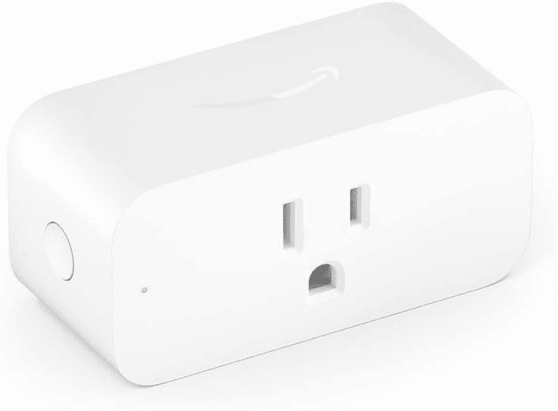

# 通过亚马逊智能插头上的一个热门交易，让您的家变得更智能

> 原文：<https://www.xda-developers.com/amazon-smart-plug-prime-day-deal/>

虽然闪亮的互联智能家居技术很有趣，但要更换家里的所有东西却是一件很麻烦的事情。因此，让家里的“笨”硬件变得更智能的方法总是受欢迎的，这就是你从亚马逊智能插头得到的。不管是什么硬件，如果它需要电，你可以把它插到其中一个上。

它所做的是将你之前断开的硬件连接到亚马逊 Alexa 生态系统。这意味着语音控制和完全集成到 Alexa 的例程。美国版本甚至被设计成可以在墙壁插座上叠放。通常，这不是最容易推荐的产品，因为它不是同类产品中最实惠的，但对于 [Prime Day](https://www.xda-developers.com/amazon-prime-day/) ，所有这些都消失了。现在是时候用几乎 50%的折扣买一堆了。

通常情况下，亚马逊智能插头的单价为 25 美元，但现在降至 13 美元，在这个价格下，这是一个完全不同的游戏。如果你已经在 Alexa 生态系统中，亚马逊智能插件很有意义，因为你不需要另一个第三方应用程序或技能。你只需在 Alexa 应用程序中进行设置。

语音控制允许你随意打开或关闭插头，但真正的力量来自 Alexa 的例程。这意味着你可以将亚马逊智能插头的操作以及与之相连的任何东西与你想在家中使用的任何其他技能或触发器集成在一起。

 <picture></picture> 

Amazon Smart Plug

##### 亚马逊智能插头

通过智能插头上的这一惊人交易，让您家中的任何东西都变得更加智能，并将您喜欢的任何东西链接到 Alexa 生态系统。

离开一段时间？将灯设置为在一天中的特定时间自动打开。插上咖啡机、电视或其他任何东西的电源。它支持高达 15A，因此适用于家庭中的大多数设备。我在早上例行公事时使用一个，当闹钟响起时，它会触发插头打开，这样我办公室里的一切都为工作日做好了准备。

亚马逊 Prime 会员的优惠活动一直持续到 Prime Day 结束，所以一定要抓住机会，让你现有的家用电器变得更加智能。