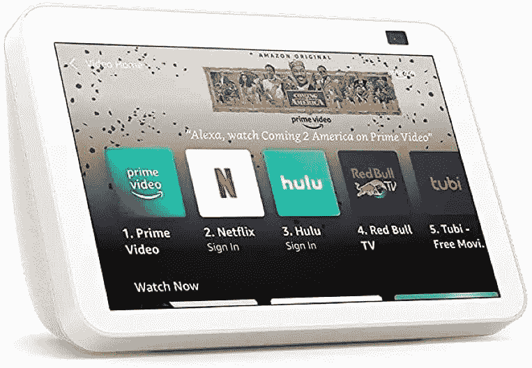

# 亚马逊的 Echo Show 15 和 Echo Show 8 创下了有史以来的最低价

> 原文：<https://www.xda-developers.com/amazons-echo-show-15-and-echo-show-8-hit-their-lowest-prices-ever/>

# 亚马逊的 Echo Show 15 和 Echo Show 8 创下了有史以来的最低价

黄金日要到 7 月份，但这并没有阻止亚马逊将 Echo Show 15 和 Echo Show 8 降至历史最低价格。

亚马逊制造了一些用钱可以买到的最好的智能扬声器和智能显示器。最好的购买时间是在打折的时候，这是亚马逊不忌讳的。现在就是这样一个时机，这是一个好时机，因为亚马逊已经将 Echo Show 15 和 Echo Show 8 的价格分别降至[的历史低点](https://www.amazon.com/introducing-echo-show-15-smart-display-with-alexa/dp/B08MQLDFF6?tag=xda-17a3kp7-20&ascsubtag=UUxdaUeUpU41269&asc_refurl=https%3A%2F%2Fwww.xda-developers.com%2Famazons-echo-show-15-and-echo-show-8-hit-their-lowest-prices-ever%2F&asc_campaign=Short-Term)。下一次达成这样一笔交易的机会可能是在 7 月份的黄金日。

通常情况下，你要为回声秀 15 支付 250 美元，为回声秀 8 支付 130 美元。但由于高达 31%的折扣，你现在支付的价格要比这低得多。

 <picture></picture> 

Amazon Echo Show 15

##### 亚马逊回声秀 15

作为亚马逊迄今为止最大的智能显示器，Echo Show 15 非常适合组织家庭，就像它是你的智能家居一样。

Echo Show 15 是亚马逊迄今为止最大的 15 英寸显示器。您可以垂直或水平使用它，甚至可以将其安装在墙上。随着尺寸的增加，它变成了您全家的数字公告板，或者是您智能家居的一个非常出色的控制面板。增加的不动产让你可以访问 Alexa 驱动的小工具，如便笺、提醒和待办事项。它也是一个不错的 1080p 分辨率的小媒体设备。把它放在厨房里，在你做饭的时候，用 Prime Video 让孩子们开心。Alexa 也非常适合烹饪，通过内置的 500 万像素摄像头，你还可以通过 Echo Show 15 进行变焦通话。

Echo Show 15 目前售价 200 美元，可打八折。

 <picture></picture> 

Amazon Echo Show 8

##### 亚马逊回声秀 8

Echo Show 8 是一款理想的智能显示器，适用于任何配有大显示屏、内置视频通话和 Alexa 生态系统所有功能的房间。

Echo Show 8 更加小巧，更易于在家中的任何房间使用。它没有与 Echo Show 15 完全相同的功能集，但它本身就很强大。显示屏可能会更小，但你仍然可以享受视频内容和通话，以及几乎任何其他具有视频功能的 Alexa 技能。想看看谁在门口吗？没问题。为晚餐准备一份食谱？你打赌。

更好的是，31%的折扣让它降到了 90 美元，这真是购买它的最佳时机。