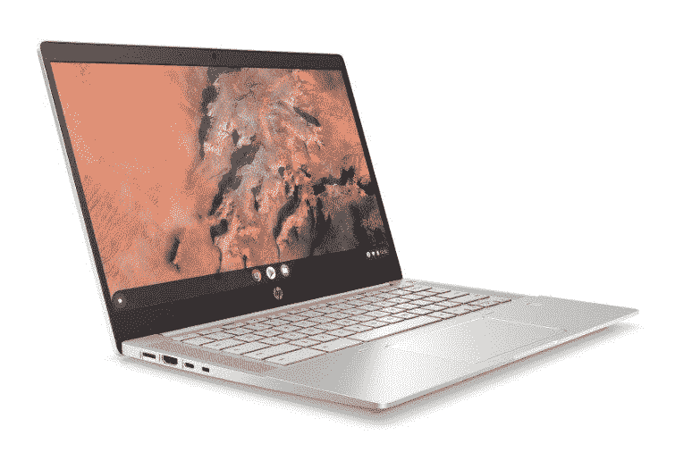

# AMD 为 Chromebooks 推出新的 Zen 锐龙处理器

> 原文：<https://www.xda-developers.com/amd-launches-zen-based-ryzen-processors-chromebooks/>

在凭借其基于“zen”的[锐龙台式机](https://www.xda-developers.com/amd-3rd-gen-ryzen-5-3600x-3400g-review/)和笔记本电脑芯片风靡全球之后，AMD[现在宣布了其基于 Zen 架构的第一系列 Chromebook 移动处理器。新的处理器阵容是与](https://ir.amd.com/news-events/press-releases/detail/969/amd-launches-first-zen-based-chromebook-mobile)[谷歌](https://www.xda-developers.com/tag/google/)合作设计的，与上一代相比，它承诺将网页浏览速度提高 178%。作为新产品线的一部分，AMD 提供了两个不同的处理器系列 Athlon 3000 C 系列和锐龙 3000 C 系列。

在这两个新系列中，AMD 锐龙 3000 C 系列与上一代 AMD Chromebooks 相比，在多任务处理和内容创建方面的性能提高了 212%。锐龙 3000 C 系列还内置 AMD [镭龙显卡](https://www.xda-developers.com/samsung-amd-partnership-hatch-game-streaming-galaxy-s10-5g/)，AMD 声称它是*“chrome book 中最强大的显卡”锐龙 3000 C 系列包括三个处理器:锐龙 7 3700C、锐龙 5 3500C 和锐龙 3 3250C。另一方面，AMD 速龙 3000 C 系列包括两个处理器:速龙 Gold 3150C 和速龙 Silver 3050C。有关新处理器的更多信息，请查看下表:*

| 

模型

 | 

核心/线程

 | 

TDP(瓦特)

 | 

升压/基本频率。(千兆赫)

 | 

GPU 核心

 | 

缓存(MB)

 |
| --- | --- | --- | --- | --- | --- |
| AMD 锐龙 7 3700C | 4C/8T | 15W | 高达 4.0 / 2.3 GHz | 10 | 6MB |
| AMD 锐龙 5 3500C | 4C/8T | 15W | 高达 3.7 / 2.1 GHz | 8 | 6MB |
| AMD 锐龙 3 3250C | 2C/4T | 15W | 高达 3.5 / 2.6 GHz | 3 | 5MB |
| AMD 速龙金牌 3150C | 2C/4T | 15W | 高达 3.3 / 2.4 GHz | 3 | 5MB |
| AMD 速龙银 3050C | 2C/2T | 15W | 高达 3.2 / 2.3 GHz | 2 | 5MB |

AMD 声称，与上一代 AMD Chromebooks 相比，其顶级的锐龙 7 3700C 芯片将为用户提供高达 251%的图形性能，高达 104%的办公效率性能，以及高达 152%的照片编辑性能。搭载这些新处理器的 Chromebook 将瞄准更高端的 chrome book 市场，而 AMD 的 A 系列仍将是入门级 chrome book 的首选处理器。

在谈到新的产品线时，AMD 公司的 SVP 和通用客户端计算部门的赛义德·莫什克拉尼说:*“无论用户是在线、离线、在旅途中还是在家，基于 AMD 锐龙处理器和 Athlon 处理器的 Chromebooks 都能提供保持高工作效率和轻松应对远程学习和远程工作的高要求所需的综合 CPU、显卡和整体性能...我们很高兴能够与宏碁、华硕、谷歌、惠普和联想合作，大幅增加 based Chromebook 的数量，并为众多基于 AMD 锐龙的 Chromebook 系统中的第一批提供更强大的选项。”*

由新的 AMD C 系列产品驱动的 Chromebooks 预计将在未来几个月上市。HP Pro c645 将是第一款采用新处理器的 Chromebook，它将与 Athlon C 系列和锐龙 C 系列处理器一起提供。Chromebook 将采用惠普的隐私相机快门、可选的指纹传感器和板载 Titan C 芯片，用于企业环境中的外部管理。

 <picture></picture> 

HP Pro c645

HP Pro c645 将包括一个可选触摸的 14 英寸 1080p 或 768p 显示器，高达 16GB 的 DDR4 RAM 和高达 128GB 的 NVMe 存储。Chromebook 重 3.4 磅，已经过 MIL-STD 810H 规范测试。它将提供 10.5 小时的电池寿命，支持可选的快速充电，两个 USB Type-C 5 Gbps 端口，两个 USB Type-A 5 Gbps 端口，并支持 2x2 Wi-Fi 6。Chromebook 还将包括一个 microSD 卡插槽和一个 HDMI 1.4 端口。HP Pro c645 将提供消费者和企业型号，并将于 12 月开始购买。价格和供货信息将在稍后发布。

除了 HP Pro c645，AMD 声称它已经与惠普、[、联想](https://www.xda-developers.com/tag/lenovo/)和[华硕](https://www.xda-developers.com/tag/asus/)合作开发了另外六款 C 系列 Chromebooks。Chromebooks 预计也将于今年晚些时候上市。