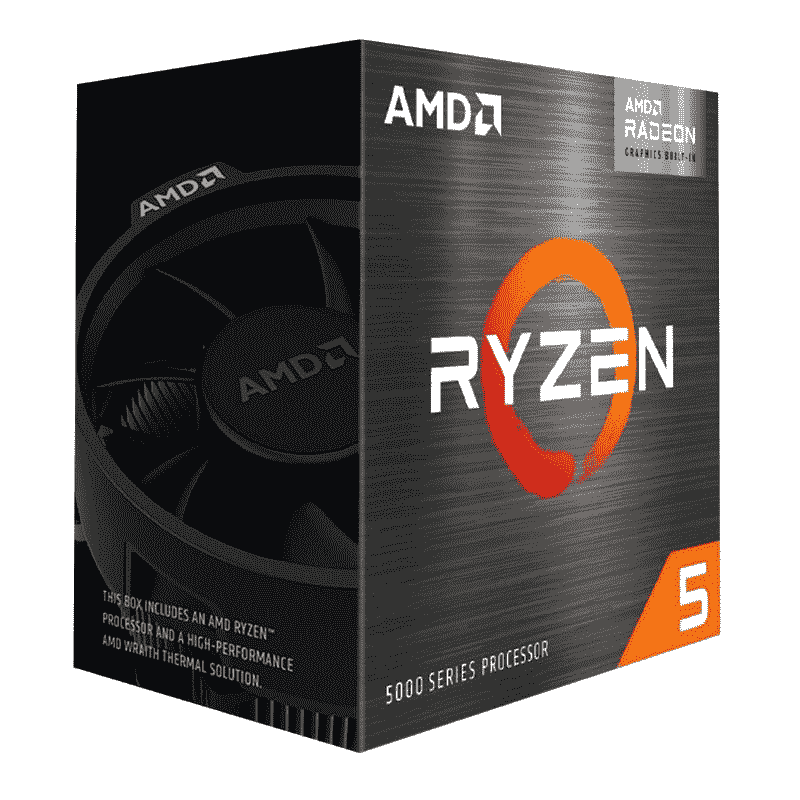

# AMD 锐龙 5 5500 vs 锐龙 5 5600:买哪个入门级 CPU？

> 原文：<https://www.xda-developers.com/amd-ryzen-5-5500-vs-5600/>

AMD 宣布了一些新的锐龙 CPU 作为其春季更新的一部分。除了功能更强大的锐龙 7 5800X3D 处理器，我们还获得了几个功能相对较弱的入门级芯片。锐龙 5 5500 和锐龙 5 5600 是我们本周从 AMD 获得的新入门级处理器。在这篇文章中，我们将看看 AMD 锐龙 5 5500 与锐龙 5 5600 CPUs，找出哪一个是 2022 年更好的入门级 CPU。

**浏览这篇文章:**

## 规范

在我们开始比较之前，让我们快速浏览一下每款处理器的规格，看看每款芯片都有哪些特点:

| 

**规格**

 | 

**AMD 锐龙 5 5500**

 | 

AMD 锐龙 5 5600

 |
| --- | --- | --- |
| **CPU 插座** | AMD AM4 | AMD AM4 |
| **内核** | 6 | 6 |
| **螺纹** | 12 | 12 |
| **光刻** | 7nm 纳米 FinFET | 7nm 纳米 FinFET |
| **基频** | 3.6 千兆赫 | 3.5 千兆赫 |
| **升压频率** | 高达 4.2GHz | 高达 4.4GHz |
| **为了超频而解锁？** | 是 | 是 |
| **三级高速缓存** | 16MB | 32MB |
| **默认 TDP** | 65W | 65W |
| 最大值。工作温度(Tjmax) | 90 摄氏度 | 90 摄氏度 |
| **内存支持** | DDR4 最高 3200MHzUp 最高 128GB | DDR4 最高 3200MHzUp 最高 128GB |
| **集成显卡** | 钠 | 钠 |

## 性能差异

正如您所见，锐龙 5 5500 和锐龙 5 5600 处理器在规格方面非常相似。我们看到的是一个具有 12 个线程的六核处理器。实际上，我们现在看到的是锐龙 5 5600X 的两个较低时钟版本。甚至当你比较锐龙 5 5500 和锐龙 5 5600 时，你会注意到 5600 的升压时钟略高，而 5500 的基频较高。这意味着锐龙 5 5600 可能会产生略好的整体性能，由于短脉冲升压频率。

为了客观地看待问题，[锐龙 5 5600X](https://www.xda-developers.com/amd-ryzen-5-5600x-vs-intel-core-i5-12600k/) 也是一个六核十二线程处理器。然而，它拥有略快的时钟速度，基本频率为 3.6Ghz，提升频率为 4.6Ghz。然而，值得指出的是，它并不与股票冷却器捆绑在一起。看看锐龙 5 5600 与锐龙 5 5600X 处理器的对比会很有趣。还有配备集成 GPU 的锐龙 5 5600G，这使事情在选项方面变得更加有趣。

锐龙 5 5600 芯片也有 32MB 的双高速缓冲存储器。这也意味着锐龙 5 5600 芯片应该更适合游戏和其他类似的线程任务。高速缓存在提高整体性能输出方面发挥着巨大的作用，这也是为什么新的[锐龙 7 5800X3D](https://www.xda-developers.com/amd-ryzen-7-5800x-vs-amd-ryzen-7-5800x3d/) 据说比锐龙 7 5800X 有显著的性能提高的主要原因之一。我们还没有得到这两种芯片中的任何一种，一旦我们有机会测试它们，我们将有一个更详细的比较。

关于这些处理器需要注意的另一点是，它们都捆绑了一个幽灵的隐形 CPU 冷却器。这种特殊的 CPU 冷却器应该完全没有问题，可以控制这些处理器的热输出。不必为你的电脑购买单独的 CPU 冷却器，肯定会为你节省很多钱。众所周知，AMD 幽灵隐形冷却器在控制热量输出方面也非常强大，所以我们认为你在库存设置下运行这些芯片没有问题。

## 锐龙 5 5500 有限公司 PCIe 3.0

虽然锐龙 5 5500 会吸引很多人的注意，但有一件事我们想指出来。这种特殊的 CPU 在 PCIe 3.0 中达到顶峰，这意味着你将无法利用 PCIe 4.0 外设，包括新的固态硬盘。甚至很多显卡在运行 PCIe 3.0 时性能也有限。相比之下，锐龙 5 5600 支持 PCIe 4.0，是一个更好的选择。我们建议选择锐龙 5 5600，而不是锐龙 5，假设你想建立一个至少可以使用几年的电脑，然后才放弃你。

## 定价和可用性

AMD 锐龙 5 5500 的售价为 159 美元，而锐龙 5 5600 的价格略高，为 199 美元。然而，这两款芯片都是入门级到中档电脑的理想选择。它们最好与经济型 B550 主板搭配使用。锐龙 5 5500 和锐龙 5 5600 处理器将于 4 月初上市。一旦新芯片可供购买，我们将添加购买链接。与此同时，你可以看看锐龙 5 5600G，它配有 219 美元的集成显卡。

 <picture></picture> 

AMD Ryzen 5 5600G Processor

##### AMD 锐龙 5 5600G

AMD 锐龙 5 5600G 是一个伟大的 APU，对于那些目前正在努力购买市场上的 GPU。

## 应该买哪个？

正如我们上面提到的，这两种入门级芯片的主要区别之一是，锐龙 5 5500 在 PCIe 3.0 上领先。这可能会成为许多寻求建立持久游戏平台的人的绊脚石。但是，如果这对你来说还不算什么，那么我们认为锐龙 5 5500 是一款稳定的入门级处理器，可以让你进入 PC 游戏世界。您可以轻松地将它与一个预算 B550 甚至一个旧的主板配对，以构建一个坚固的 PC，将设置你很好。这两款芯片肯定会成为我们收集的 2022 年你能买到的最好的 CPU。如果这些芯片都没有引起你的注意，那么我们建议你等待新的[锐龙 7000 系列处理器](https://www.xda-developers.com/amd-ryzen-7000/)，它们将在几年后问世。或者，您也可以查看各种口味的[锐龙 6000 系列移动式处理器](https://www.xda-developers.com/amd-ryzen-6000/)。