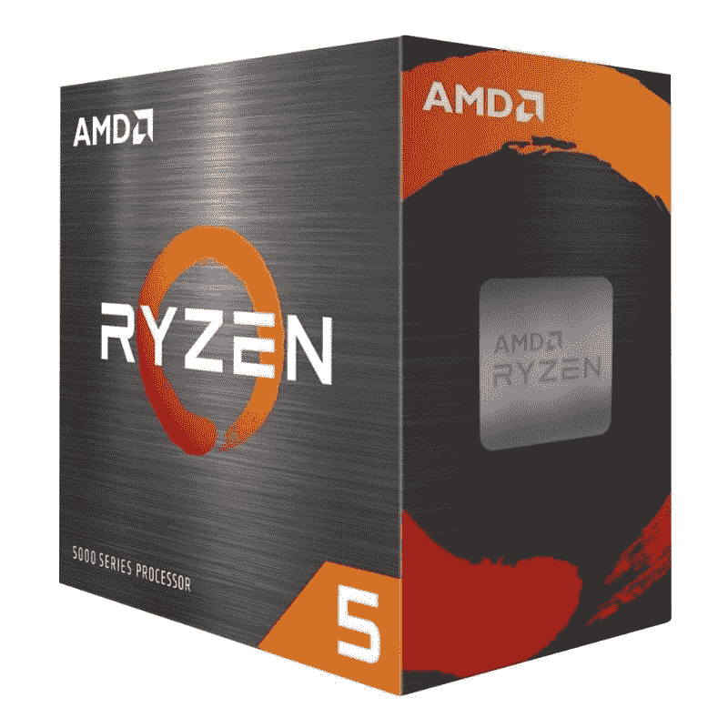
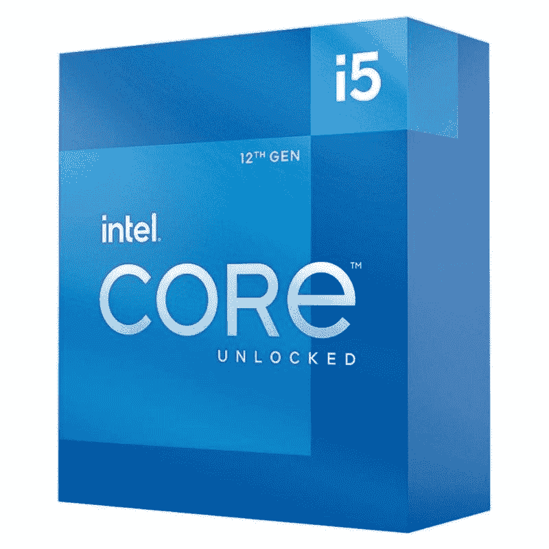

# AMD 锐龙 5 5600X vs 英特尔酷睿 i5-12600K:最好的主流 CPU

> 原文：<https://www.xda-developers.com/amd-ryzen-5-5600x-vs-intel-core-i5-12600k/>

不可否认，英特尔酷睿 i5-12600K 和 AMD 锐龙 5 5600X 都是你在 2021 年可以买到的最好的 CPU。您可以使用这两种处理器中的任何一种来构建任何东西，从坚固的游戏装备到内容创作工作站，而无需投入太多资金。但是现在买哪种 CPU 更好才是更大的问题。在本文中，我们将看看 AMD 锐龙 5 5600X 与英特尔酷睿 i5-12600K 的比较，看看我们能否回答这个问题。因此，不浪费更多的时间，让我们深入了解这两个 CPU，找出哪一个适合您的下一个 PC 版本。

**浏览本文:**

## AMD 锐龙 5 5600X 与英特尔酷睿 i5-12600K:规格

在我们开始比较之前，让我们快速浏览一下这些处理器的规格，看看它们各自带来了什么。

| 

**规格**

 | 

**AMD 锐龙 5 5600x**

 | 

**英特尔酷睿 i5-12600K**

 |
| --- | --- | --- |
| **CPU 插座** | AMD AM4 | LGA 1700 |
| **内核** | 6 | 10 英镑(6 便士+ 4E) |
| **螺纹** | 12 | 16 |
| **光刻** | 7nm 纳米 FinFET | 英特尔 7(10 纳米) |
| **基频** | 3.7 千兆赫 | 3.7GHz (P 内核)&#124; 2.8GHz (E 内核) |
| **升压频率** | 4.6 千兆赫 | 4.9GHz (P 内核)&#124; 3.6GHz (E 内核) |
| **为了超频而解锁？** | 是 | 是 |
| **三级高速缓存** | 32MB | 20MB |
| **默认 TDP** | 65W | 125 瓦 |
| 最大。工作温度(Tjmax) | 95 摄氏度 | 100 摄氏度 |
| **内存支持** | DDR4 最高 3200MHzUp 最高 128GB | DDR4 3200MT 公吨/秒&#124; DDR 5-4800 公吨/秒至 128GB |
| **集成显卡** | 钠 | UHD 图形 770 |

英特尔酷睿 i5-12600K 采用英特尔的大。小混动设计。新的第 12 代 Alder Lake CPUs 采用了这种特殊的设计。虽然这是桌面领域的新事物，但我们已经在 ARM 和 Apple CPUs 中看到了类似的实现。我们主要关注的是性能内核(P 内核)和效率内核(E 内核)的组合。英特尔酷睿 i5-12600K 碰巧有六个性能内核和四个效率内核，与锐龙 5 5600X 的六核配置针锋相对。酷睿 i5-12600K 还拥有更多线程，因为它有四个效率更高的内核来应对竞争。

## AMD 锐龙 5 5600X 与英特尔酷睿 i5-12600K:性能

英特尔酷睿 i5-12600K 在性能方面处于领先地位。事实上，它远远超过了 AMD 的芯片。酷睿 i5-12600K 在几乎所有单线程和多线程基准测试中均胜出。当我们为我们的[阿尔德湖评论](https://www.xda-developers.com/intel-alder-lake-review/)测试时，该芯片设法提供了快速的性能。它很好地融合了单线程和多线程性能，在不同的工作负载中脱颖而出。

大的。很少的设计肯定有利于英特尔，但还有更多。英特尔的线程总监也在 [Windows 11](https://www.xda-developers.com/windows-11/) OS 中幕后动针，仔细调度任务，发挥最佳性能。拥有额外的 E-core 来卸载低优先级的任务，有利于提高整体性能。举例来说，用 OBS 传输你的游戏，可以用更高的帧数获得更好的游戏性能。这是因为英特尔的线程控制器巧妙地将 OBS 放在了更小的 E 核上，让 P 核来承担游戏的重担。

Core i5-12600K 在 Windows 10 中往往会受到一些影响，因为在区分任务优先级方面存在困难，但我们预计这些问题会尽快得到解决。可以肯定地说，如果你想搭乘阿尔德湖宣传列车，升级到 Windows 11 可能是值得的。锐龙 5 5600X 用户可以转向超频作为填补性能差距的解决方案，但值得指出的是，酷睿 i5-12600K 也是一款支持超频的未锁定 CPU。

酷睿 i5-12600K 的游戏性能也更好。仍然有一些游戏的性能相当，一些游戏更喜欢一种架构，但 12600K 似乎通过保持领先优势赢得了很多战斗。还值得指出的是，英特尔酷睿 i5-12600K 采用了集成的 UHD 图形 770 引擎和 32 个执行单元。这款 iGPU 拥有 300MHz 的基础时钟和 1,450MHz 的升压时钟。如果你计划用集成的 GPU 玩游戏，那么默认情况下英特尔会赢，因为锐龙 5 5600X 没有集成的 GPU。如果你想要集成显卡，你唯一的选择就是看看 AMD 的 APU。

英特尔的 Alder Lake CPUs 在功耗方面也取得了一些进展。该公司针对新芯片的新英特尔 7 工艺降低了功耗，提高了效率。与前代产品相比，酷睿 i5-12600K 在完成相同工作量的情况下耗电量更低。尽管如此，锐龙 5 5600X 在能效方面仍是无可争议的冠军。在这方面，锐龙 5 5600X 继续保持着 CPU 的主导地位。即使采用新的英特尔 7 工艺，酷睿 i5-12600K 也比锐龙 5 5600X 耗电更多。这意味着它也将产生更多的热量，从而提高了 [CPU 冷却器](https://www.xda-developers.com/best-cpu-coolers/)的门槛。Core i5-12600K 甚至没有配备股票冷却器，所以你必须花更多的钱来购买一个优质的 CPU 冷却器。

## 平台和兼容性

如果你想要一台经得起未来考验的电脑，英特尔无疑是更好的选择。它支持 DDR5 内存模块和 PCIe 5.0，这两者都不被目前市场上的 AMD 锐龙 CPU 所支持。也就是说，你也应该准备好花大价钱来利用所有这些特性。新的 Alder Lake 芯片不能与市场上现有的主板一起使用。新的芯片需要一个新的 [LGA 1700 CPU 插座](https://www.xda-developers.com/cpu-coolers-socket-lga-1700/)，只适用于新的 Z690 主板。

没错，你需要一个新的 Z690 主板来使用英特尔的第 12 代芯片。虽然市场上有价格实惠的 Z690 主板，但您仍然需要购买全新的主板。除了新的 DDR5 内存模块之外，这势必会大大削减您的预算。还值得指出的是，[最好的 DDR5 RAM](https://www.xda-developers.com/best-ddr5-ram/) 套件相当昂贵，在市场上很难找到。

另一方面，从现有的锐龙 3000 系列芯片升级到锐龙 5 5600X 将需要较少的初始投资。由于锐龙 5000 系列芯片落在现有的带有 AM4 插槽的主板上，您不会看到昂贵的平台入门成本。虽然 DDR5 内存模块比现有的更强大，但它们仍有时间成熟。PCIe 5.0 作为一个标准不太可能成为自己的标准，至少在更多的 CPU 和外设为新标准做好准备之前。虽然英特尔在面向未来方面是一个明显的赢家，但我们仍然向那些希望节省成本的人推荐锐龙 5 5600X。

## 定价和可用性

说到定价，可以肯定地说，你基本上要花同样多的钱去买 CPU 本身。英特尔建议酷睿 i5-12600K 的最高零售价为 299 美元，这也是市场上锐龙 5 5600X 的零售价。英特尔酷睿 i5-12600K 的性能优于相同价格的锐龙 5 5600X，但事情不止于此。英特尔芯片的初始平台入门成本要高得多。你需要一个新的主板，新的 DDR5 内存来发挥芯片的性能，还需要一个新的 CPU 冷却器。

就锐龙 5 5600X 而言，如果你要升级现有系统，你需要支付新芯片的费用。您可以使用现有的 AMD 主板，并为该芯片使用相同的 [DDR4 RAM](https://www.xda-developers.com/best-ddr4-ram/) 套件。见鬼，AMD 还将 CPU 冷却器与锐龙 5 5600X 捆绑在一起，如果你打算超频并超越 CPU 的极限，这本身就很好。它们现在都可以在市场上买到，我们可以在不同的在线零售商那里看到大量的库存。

## AMD 锐龙 5 5600X 与英特尔酷睿 i5-12600K:最终想法

如果你不介意支付更多的平台入门费用，那么我们认为英特尔酷睿 i5-12600K 是一个显而易见的选择。这款 CPU 将在未来许多年为您提供良好的配置，对于游戏和内容创作工作负载来说，它都是一款出色的 CPU。它在自己的地盘上统治着锐龙 5 5600X。英特尔酷睿 i5-12600K 是我们为您挑选的目前市场上可以买到的最佳 CPU。这并不是说 AMD 锐龙 5 5600X 是一个坏的 CPU 无论如何。这个特殊的 CPU 也不是无精打采的。它可能没有 12600K 那么强大，但它消耗的能量更少，并能控制热量。选择这种 CPU 比酷睿 i5-12600K 便宜，但你将无法获得像 DDR5 和 PCIe 5.0 支持这样的好处。

好了，这就结束了锐龙 5 5600X 与英特尔酷睿 i5-12600K 的比较。如果你倾向于高端 PC 构建，那么你可能想看看我们的[英特尔酷睿 i9-12900K 与 AMD 锐龙 9 5950X](https://www.xda-developers.com/intel-core-i9-12900k-vs-amd-ryzen-5950x/) 的比较，看看哪一个是目前市场上更好的高端 CPU。

 <picture></picture> 

AMD Ryzen 5 5600X processor

##### AMD 锐龙 5 5600X

AMD 锐龙 5 5600X 仍然是一个野兽的 CPU。升级到锐龙 5 5600X 也比英特尔酷睿 i5-12600K 便宜。

 <picture></picture> 

Intel Core i5-12600K processor

##### 英特尔酷睿 i5-12600K

英特尔酷睿 i5-12600K 在每个单线程和多线程基准测试中都优于锐龙 5 5600X，成为我们现在可以购买的最佳 CPU。