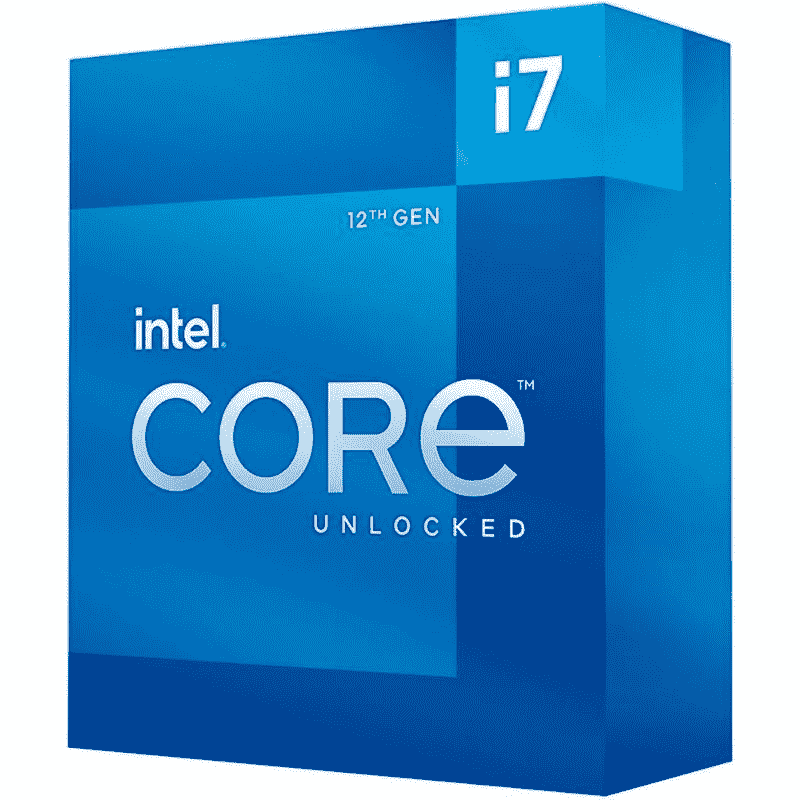
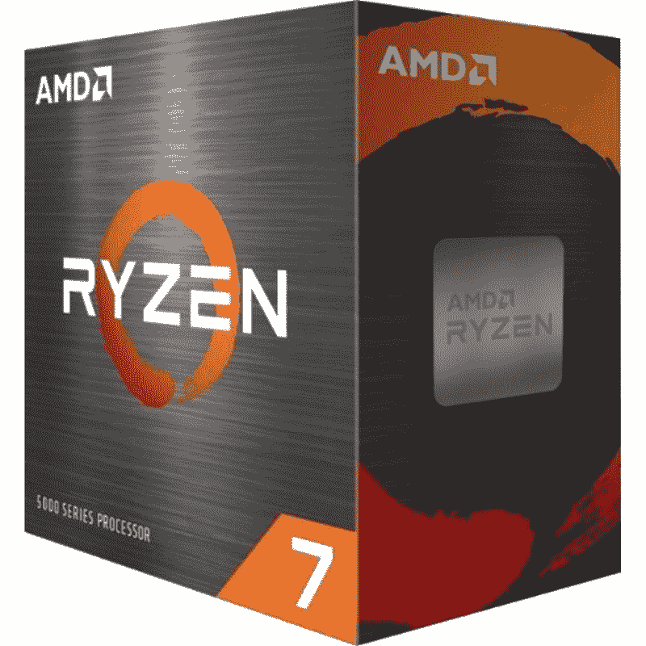

# AMD 锐龙 7 5800X vs 英特尔酷睿 i7-12700K:高端 CPU 之战

> 原文：<https://www.xda-developers.com/amd-ryzen-7-5800x-vs-intel-core-i7-12700k/>

英特尔可能很难保持 AMD 在 CPU 市场的主导地位，但随着新的 Alder Lake 芯片的到来，情况肯定发生了变化。到目前为止发布的所有三款 Alder Lake 芯片——酷睿 i5-12600K、酷睿 i7-12700K 和酷睿 i9-12900k——在理论上看起来非常有前途。正如我们在 [Alder Lake review](https://www.xda-developers.com/intel-alder-lake-review/) 中详细描述的那样，酷睿 i5-12600K 和酷睿 i9-12900K 在竞争中占据主导地位，成为我们目前在市场上挑选的[最佳 CPU](https://www.xda-developers.com/best-cpus/)。在本文中，我们将看看 AMD 锐龙 7 5800X 与英特尔酷睿 i7-12700K 的比较，以找出哪种 CPU 最适合您的下一代电脑。

**浏览这篇文章:**

## 锐龙 7 5800X 与英特尔酷睿 i7-12700K:规格

在我们开始比较之前，让我们快速浏览一下规格表，看看每一项都有哪些特点:

| 

**规格**

 | 

**AMD 锐龙 7 5800X**

 | 

**英特尔酷睿 i7-12700K**

 |
| --- | --- | --- |
| **CPU 插座** | AMD AM4 | LGA 1700 |
| **内核** | 8 | 12(8 便士+ 4E) |
| **螺纹** | 16 | 20 |
| **光刻** | 7nm 纳米 FinFET | 英特尔 7(10 纳米) |
| **基频** | 3.8GHz | 3.60GHz (P 内核)&#124; 2.70GHz (E 内核) |
| **升压频率** | 4.7 千兆赫 | 4.90GHz (P 内核)&#124; 3.80GHz (E 内核) |
| **为了超频而解锁？** | 是 | 是 |
| **三级高速缓存** | 32MB | 25MB |
| **默认 TDP** | 105 瓦 | 125 瓦 |
| 最大值。工作温度(Tjmax) | 90 摄氏度 | 100 摄氏度 |
| **内存支持** | DDR4 最高 3200MHzUp 最高 128GB | DDR4 3200MT 公吨/秒&#124; DDR 5-4800 公吨/秒至 128GB |
| **集成显卡** | 钠 | 英特尔 UHD 770 |

英特尔酷睿 i7-12700K 是新的奥尔德湖 CPU 家族的一部分，它带来了一种混合核心架构，与标准的八核锐龙 7 5800X 形成对比。八个高性能内核和四个高效内核的组合将使 Core i7-12700K 在游戏和内容创作等高性能任务中提供显著的性能提升。然而，新的英特尔芯片使用新的 LGA 1700 CPU 插槽，我们将在本文的平台和兼容性部分看到其含义。

## AMD 锐龙 7 5800X 与英特尔酷睿 i7-12700K:性能

 <picture></picture> 

Intel Core i7-12700K

不可否认，这两款 CPU 在游戏和内容创作工作负载方面都将提供令人印象深刻的性能。我们看到的是两个高端 CPU 针锋相对，在纸面上有一套坚实的规格。Core i7 的性能内核的基本时钟为 3.60GHz，而锐龙 7 的标准八核配置则采用 3.8GHz 的基本时钟。当进行提升时，酷睿 i7-12700K 的 P 内核可以达到 4.7GHz 的提升时钟速度，而锐龙 7 5800X 也可以达到 4.7GHz 的最大提升时钟速度。它帮助酷睿 i7-12700K 支持睿频加速最大 3.0，以在单线程任务的某些内核中达到 5.0GHz 的障碍。

在现实世界的基准测试中，所有这些原始数据都有利于酷睿 i7-12700K。虽然两种 CPU 在不同的基准测试中表现出色，但与锐龙 7 5800X 相比，酷睿 i7-12700K 的性能高出 15-20%。在性能图表中，英特尔酷睿 i7-12700K 在英特尔酷睿 i5-12600K 和酷睿 i9-12900K 之间找到了一个最佳位置。考虑到酷睿 i7-12700K 本身在许多情况下足以匹配锐龙 7 5800X 的总体性能，酷睿 i7-12700k 领先于锐龙 7 5800X 并不令人惊讶。

从新的英特尔 7 工艺到该公司新的智能线程控制器应用，有许多因素有利于酷睿 i7-12700K 产生稳定的性能。在这次比较中，两个 CPU 都支持超频，这意味着您可以进一步提高性能上限，以推动这些芯片的极限。您的性能可能会因几个外部因素而异，但在这次比较中，酷睿 i7-12700K 是最受欢迎的。

 <picture></picture> 

AMD Ryzen 7 5800X CPU

游戏性能也有利于酷睿 i7-12700k 大由于大的事实。小混动核心设计。能够将任务优先分配给 P-core 和 E-core 使 12700K 的性能提升了 10%。虽然 DDR5 和 DDR4 系统之间的差异相当小，但至少在 DDR5 生命周期的这一点上，我们看到了 12700K 的一些令人印象深刻的结果。在游戏性能方面，更令人印象深刻的是，酷睿 i7-12700K 接近酷睿 i9-12900K，而成本却明显更低。由于额外的 E 核，12900K 在处理后台任务方面肯定会更好，但 P 核的性能似乎更具可比性。

还值得指出的是，英特尔酷睿 i7-12700K 配备了集成显卡-英特尔 UHD 770。iGPU 拥有 32EUs，基础时钟为 300MHz，增强时钟为 1,500MHz。如果你没有独立的 GPU，英特尔 CPU 将赢得与无显卡的锐龙 7 5800X 的战斗。

包括 Core i7-12700K 在内的新英特尔芯片显示了功耗部门的显著改善。我们认为这在很大程度上是由于新架构和英特尔 7 工艺降低了功耗并提高了效率。话虽如此，它仍然比锐龙的同类产品更具吸引力。AMD 的锐龙芯片在能效方面表现出了巨大的进步，仍然遥遥领先于竞争对手。酷睿 i7-12700K 可以说是这场战斗中性能更好的 CPU，但你肯定需要一个结实的 CPU 冷却器来抑制这个特定 CPU 的热输出。然而，值得指出的是，新的英特尔酷睿 i7-12700K 比上一代的 11700K 更节能。

## 平台和兼容性

英特尔酷睿 i7-12700K 增加了对新 DDR5 内存模块和 PCIe 5.0 标准的支持。另一方面，锐龙 7 5800X 的上限是 DDR4 和 PCIe 4.0 标准。虽然这使得 Core i7-12700K 成为未来更好的 CPU，但它们都没有比旧标准更快的优势。DDR5 内存有点悬而未决，主要是因为新的 [DDR5 RAM](https://www.xda-developers.com/best-ddr5-ram/) 套件既贵又难买。此外，我们认为 DDR5 作为标准需要更多的时间来成熟，因为与 DDR4 内存标准相比，我们没有看到明显的性能提升。

PCIe 5.0 也是如此，至少在兼容的 PCIe 5.0 外设开始出现在市场上之前是如此。目前市场上以 PCIe 5.0 为名的产品很少，当然不足以保证立即上市。也就是说，如果你的预算允许，最好是建造一台经得起未来考验的机器。在锐龙的情况下，你至少要等一年才能享受到 DDR5 和 PCIe 5.0 以及即将到来的 [AM5 平台](https://www.xda-developers.com/amds-am5-platform-will-launch-in-2022-with-support-for-ddr5-and-pcie-5-0/)的好处。

我们提到了预算，因为构建一台采用英特尔酷睿 i7-12700K 处理器的新电脑将比采用锐龙 7 5800X 处理器的电脑花费更多。虽然锐龙 7 5800X 在市场上现有的 AMD 主板中脱颖而出，但你必须为英特尔芯片购买新的 [LGA 1700 主板](https://www.xda-developers.com/best-lga-1700-motherboard/)。更不用说，你还需要更多的钱来购买 DDR5 内存和一个新的 [LGA 1700 CPU 冷却器](https://www.xda-developers.com/cpu-coolers-socket-lga-1700/)用于 12700K。升级到锐龙 7 5800X 相对便宜，尤其是如果你已经是 AMD 的用户。这可以归结为个人偏好，即在更好的性能和面向未来的预算之间做出选择。

## AMD 锐龙 7 5800X 与英特尔酷睿 i7-12700K:价格和可用性

英特尔酷睿 i7-12700K 的价格与前代 11700K 一样，为 409 美元。锐龙 7 5800X 也很容易买到，价格差不多，有时甚至更便宜，这使得它在定价方面是一个更好的选择。与 Alder Lake 12700K 相比，锐龙芯片更加经济实惠，平台入门成本也更低。两者都没有与股票冷却器捆绑在一起，所以你必须购买市场上最好的 CPU 冷却器之一-就超频而言，越强越好。幸运的是，这两种 CPU 在市场上都很容易买到，所以当你决定选择哪一种时，你不必担心缺货。

## AMD 锐龙 7 5800X 与英特尔酷睿 i7-12700K:最终想法

综合考虑所有因素，可以肯定地说，英特尔酷睿 i7-12700K 处理器的大尺寸。小架构和英特尔 7 工艺以及其他许多东西，已经成功击败了锐龙 7 5800X。购买和制造一台 12700K 的个人电脑将花费你更多的钱，但它将在未来的许多年里为你做好准备。我们正在讨论一些下一代功能，包括 DDR5 和 PCIe 5.0 支持。锐龙 7 5800X 也是一个很好的选择，通过提供相当的性能，同时消耗更少的功率，与阿尔德湖芯片相抗衡。如果你不想支付巨大的平台入门成本来建立一个强大的钻机，锐龙 7 5800X 值得购买。如果您想了解目前市场上英特尔和 AMD 的最佳产品，您也可以查看我们的[英特尔酷睿 i9-12900K 与 AMD 锐龙 9 5950X](https://www.xda-developers.com/intel-core-i9-12900k-vs-amd-ryzen-5950x/) 对比。

 <picture></picture> 

Intel Core i7-12700K

##### 英特尔酷睿 i7-12700K

英特尔酷睿 i7-12700K 击败了锐龙 7 5800X，成为市场上最好的高端 CPU 之一。它还支持下一代功能，包括 DDR5 和 PCIe 5.0。

 <picture></picture> 

AMD Ryzen 7 5800X CPU

##### AMD 锐龙 7 5800X

AMD 锐龙 7 5800X 可能不如 12700K 强大，但它提供了相当的性能，同时消耗更少的功率，以提高能效。