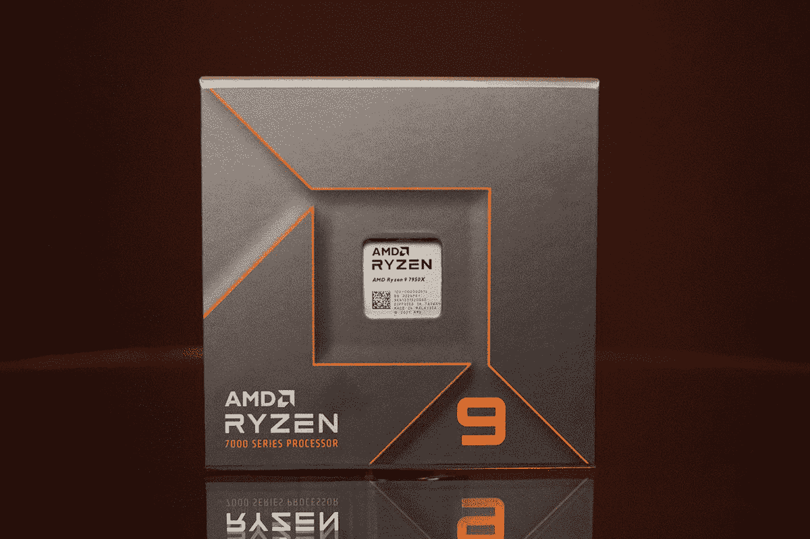

# AMD 锐龙 9 7900X 和 7950X 评测:不出所料，它们是最强大的处理器

> 原文：<https://www.xda-developers.com/amd-ryzen-7900x-7950x-review/>

任何人都不应该感到惊讶，但 AMD 的新锐龙 7000 处理器是目前你能得到的最好的 CPU。毕竟，这些东西往往会循环往复，所以新芯片轻松超越英特尔上一代 CPU 也就不足为奇了。

这不仅仅是关于 CPU 性能。 [AMD](https://www.xda-developers.com/best-amd-cpu/) 推出了全新的 AM5 平台。是的，这确实意味着这些处理器需要一个新的主板，但该公司承诺至少在 2025 年前继续使用 AM5。AM4 持续了五年五代，因此有了 AM5，您还可以随着时间的推移升级您的 CPU，而不必购买新的主板。

虽然不得不购买带有新一代 CPU 的[主板](https://www.xda-developers.com/best-motherboard/)总是一个痛点，但这是有充分理由的。这个新平台支持 [DDR5](https://www.xda-developers.com/best-ddr5-ram/) 和 PCIe 5.0，所以它不仅仅是一个新的插座(现在是 LGA)。

然而，我最大的问题是锐龙 9 7950X。无论我做什么，它都会时不时地随机重启我的电脑。没有蓝屏，事件查看器中什么也没有。我试着用 AMD 解决这个问题，但是没有成功。

另一方面，锐龙 9 7900X 是一款令人欣喜的产品。来自 Core i9-12900K，我的电脑立即感觉更快了，无论我在做什么，我都没有一点头痛。这是我不得不推荐的一款，即使它不像锐龙 9 7950X 那样高规格。

 <picture></picture> 

AMD Ryzen 9 7900X and 7950X

##### AMD 锐龙 9 7900X

AMD 锐龙 7000 提供你现在能得到的最好的性能，包装多达 32 个核心和更多。

## AMD 锐龙 9 7900X 和 7950X 定价和可用性

*   AMD 锐龙 9 7900X 和 7950X 的价格分别为 549 美元和 699 美元
*   它们将于 9 月 27 日上市

AMD 的高端锐龙 7000 阵容截至 9 月 27 日发布，现在就可以拿到。该系列目前由更强大的处理器组成，倾向于面向游戏玩家。

从售价 299 美元的锐龙 5 7600X 开始，然后是售价 399 美元的锐龙 7 7700X。对于我们在这里讨论的真正高端的器件，你可以花 549 美元买到锐龙 9 7900X，花 699 美元买到锐龙 9 7950X。从 Amd.com 到百思买，你可以从很多零售商那里买到它们。

## AMD 锐龙 9 7900X 和 7950X 规格

|  | 

AMD 锐龙 9 7900X

 | 

AMD 锐龙 9 7950X

 |
| --- | --- | --- |
| 

CPU 内核数量

 | 12 | 16 |
| 

线程数量

 | 24 | 32 |
| 

最大升压时钟

 | 高达 5.6GHz | 高达 5.7GHz |
| 

基准时钟

 | 4.7 千兆赫 | 4.5 千兆赫 |
| 

L1 高速缓存

 | 768KB | 1MB |
| 

L2 高速缓存

 | 12MB | 16MB |
| 

L3 缓存

 | 64MB | 64MB |
| 

默认 TDP

 | 170 瓦 | 170 瓦 |
| 

CPU 内核的处理器技术

 | 5nm 纳米 FinFET | 5nm 纳米 FinFET |
| 

为超频解锁

 | 是 | 是 |
| 

CPU 插座

 | AM5 | AM5 |
| 

热解决方案

 | 未包括在内 | 未包括在内 |
| 

最大值工作温度(Tjmax)

 | 95 摄氏度 | 95 摄氏度 |
| 

记忆通道

 | 2 | 2 |
| 

最大内存速度

 | 1X1R 5200MT 公吨/秒 1X2R 5200MT 公吨/秒 2X1R 3600MT 公吨/秒 2X2R 3600MT 公吨/秒 | 1X1R 5200MT 公吨/秒 1X2R 5200MT 公吨/秒 2X1R 3600MT 公吨/秒 2X2R 3600MT 公吨/秒 |
| 

制图法

 | AMD 镭龙，双核 | AMD 镭龙，双核 |
| 

图形频率

 | 2200 兆赫 | 2200 兆赫 |
| 

GPU 基础

 | 400 兆赫 | 400 兆赫 |
| 

价格

 | $549 | $699 |

## AMD 锐龙 9 7900X 和 7950X 构建规格

| 

成分

 | 

使用的零件

 | 

价格

 | 

零售商

 |
| --- | --- | --- | --- |
| 

中央处理器

 | AMD 锐龙 9 7900X AMD 锐龙 9 7950X | $549 $699 | [百思买](https://shop-links.co/1787038585134696236?u1=79d76fa7-e4a1-4a4c-beef-eb095aad2910)T2【百思买 |
| 

图形卡

 | 英伟达 GeForce RTX 3090 | $1,200 | [亚马逊](https://www.amazon.com/EVGA-GeForce-Technology-Backplate-24G-P5-3987-KR/dp/B08J5F3G18/?tag=xda-7fqvv6q-20&ascsubtag=UUxdaUeUpU43879&asc_refurl=https%3A%2F%2Fwww.xda-developers.com%2Famd-ryzen-7900x-7950x-review%2F&asc_campaign=Authority) |
| 

情况

 | 海盗船 iCUE 4000X RGB | $129.99 | [亚马逊](https://www.amazon.com/dp/B08C76W2WM?tag=xda-7fqvv6q-20&ascsubtag=UUxdaUeUpU43879&asc_refurl=https%3A%2F%2Fwww.xda-developers.com%2Famd-ryzen-7900x-7950x-review%2F&asc_campaign=Authority) |
| 

CPU 冷却器

 | Noctua NH-U12A 海盗船 H150i Elite Capellix | $109.95 $184.99 | [亚马逊](https://www.amazon.com/NOCTUA-NH-U12A-Ventilateurs-NF-A12x25-performants/dp/B07PN4RDW3/?tag=xda-7fqvv6q-20&ascsubtag=UUxdaUeUpU43879&asc_refurl=https%3A%2F%2Fwww.xda-developers.com%2Famd-ryzen-7900x-7950x-review%2F&asc_campaign=Authority) [亚马逊](https://www.amazon.com/dp/B08Q86DSTX?tag=xda-7fqvv6q-20&ascsubtag=UUxdaUeUpU43879&asc_refurl=https%3A%2F%2Fwww.xda-developers.com%2Famd-ryzen-7900x-7950x-review%2F&asc_campaign=Authority) |
| 

（同 solid-statedisk）固态（磁）盘

 | 三星 980 1TB | $99.99 | [亚马逊](https://www.amazon.com/SAMSUNG-MZ-V8V1T0B-AM-980-SSD/dp/B08V83JZH4/?tag=xda-7fqvv6q-20&ascsubtag=UUxdaUeUpU43879&asc_refurl=https%3A%2F%2Fwww.xda-developers.com%2Famd-ryzen-7900x-7950x-review%2F&asc_campaign=Authority) |
| 

记忆

 | 2x16GB Trident Z5 Neo DDR5-6000 | $229.99 | 新蛋 |
| 

母板

 | 华硕 X670E 太极 | $499.99 | 新蛋 |
| 

电源

 | 华硕 ROG 雷神 1200W 80+白金 | $349.99 | [亚马逊](https://www.amazon.com/dp/B07JZHLC4M?tag=xda-7fqvv6q-20&ascsubtag=UUxdaUeUpU43879&asc_refurl=https%3A%2F%2Fwww.xda-developers.com%2Famd-ryzen-7900x-7950x-review%2F&asc_campaign=Authority) |
| 

操作系统（Operating System）

 | Windows 11 专业版 | $199.99 | [亚马逊](https://www.amazon.com/Microsoft-Windows-11-Pro-USB/dp/B09V71FYGS/?tag=xda-7fqvv6q-20&ascsubtag=UUxdaUeUpU43879&asc_refurl=https%3A%2F%2Fwww.xda-developers.com%2Famd-ryzen-7900x-7950x-review%2F&asc_campaign=Authority) |

自从我上次构建以来，有些事情已经发生了变化，那是在我审查[英特尔的第 12 代处理器](https://www.xda-developers.com/intel-alder-lake-review/)的时候。我已经放弃了我的旧华硕 TUF 的情况下，因为海盗船送来了这个惊人的 iCUE 4000X，它有白色或黑色(我选择了白色)。我还向海盗船公司要了一个 H150 Elite Capellix 液体冷却器。并不是说我的老 Noctua U12A 不够用。这很好，事实上，球迷们像承诺的那样安静。只是有点难看。这东西太大了，我想要更小更时尚的。为了保持我的 Core i9-12900K 测试的公平性，我在 AMD 测试的初始阶段使用了 Noctua，然后改用 Corsair H150i。

然后，当然，我们有 AMD 发给我的部件，包括两个锐龙 9 处理器，ASRock X670E Taichi 主板，以及 32GB 的新 Expo 内存。

## 新主板和新内存

你可能已经听说过，AMD 锐龙 7000 使用新的 AM5 平台。这是好消息也是坏消息。坏消息是，如果你有一个 AM4 板，你想升级，最新的你可以去是锐龙 5000。好消息是 AM5 将至少被支持到 2025 年。AM4 被支持了五年，跨越了五代，所以 AMD 确实喜欢让这些东西存在一段时间。

AMD 支持 AM5 至少到 2025 年，这是英特尔没有对 LGA 1700 承诺的。

还有一点需要注意的是，AM5 只支持 DDR5 内存，不像英特尔最新一代，同时支持 DDR4 和 DDR5。这意味着如果你要升级，你需要为 CPU、主板和内存买单。虽然该板将支持 PCIe 5.0 固态硬盘，但你仍然可以使用 PCIe 4.0 单元；PCIe 5.0 固态硬盘甚至还没有出来。

## 基准

### 极客工作台 5

Geekbench 是 CPU 测试。明确地说，CPU 是我们在这里关注的东西。稍后还会有其他图形测试，但我在构建中使用 RTX 3090 是有原因的。AMD 表示，集成的镭龙显卡基本上能够点亮显示器。换句话说，你可以完成生产任务，但公司没有做出其他承诺。

| 

酷睿 i9-12900K

 | 

锐龙 9 7900X

 | 

锐龙 9 7950X

 | 

锐龙 9 7950X 带海盗船 H150i

 |
| --- | --- | --- | --- |
| 1,989 / 17,794 | 2,204 / 18,833 | 2,172 / 21,766 | 2,155 / 21,896 |

*列出的分数是单核/多核*

如你所见，这些分数确实令人印象深刻。所有的分数都超过了 Core i9-12900K，这是意料之中的。是的，[英特尔已经宣布了它的第 13 代处理器](https://www.xda-developers.com/intel-13th-gen-raptor-lake/)，但是现在，我们有 i9-12900K 与之比较。

请注意，锐龙 9 7900X 的单核性能更好，而锐龙 9 7950X 的多核性能更好。后者的基础时钟更低，内核数量也多了 33%。

Geekbench 的一个好处是，你还可以查找已经测试过的许多其他产品。上一代车型[锐龙 9 5900X](https://browser.geekbench.com/processors/amd-ryzen-9-5900x) 和[锐龙 9 5950X](https://browser.geekbench.com/processors/amd-ryzen-9-5950x) 的得分分别为 1669/13946 和 1684/16477。我特别兴奋地看到单线程性能的提升，这对许多工作流来说至关重要。

### Cinebench R23

Cinebench 是另一个测试 CPU 性能的基准测试应用程序，但这一个侧重于渲染。

| 

酷睿 i9-12900K

 | 

锐龙 9 7900X

 | 

锐龙 9 7950X

 | 

锐龙 9 7950X 带海盗船 H150i

 |
| --- | --- | --- | --- |
| 2,017 / 26,802 | 2,005 / 28,893 | 1,917 / 36,364 | 1,941 / 37,327 |

*列出的分数是单核/多核*

锐龙 9 7950X 拥有目前市场上最好的多线程性能。

显然，锐龙 9 7950X 拥有目前市场上最好的多线程性能。

我还用 NZXT Cam 记录了系统状态。运行 Cinebench 多核实际上是将 CPU 温度提高到 Tjmax(95 摄氏度)的最佳方式。如果它试图超过这一点，它将开始节流。这是你应该开始受益于一个更好的 CPU 冷却器。

此外，要澄清的是，我没有记录 NZXT 凸轮，而运行测试，你看到以上。这些是分开运行的。

如您所见，多核测试轻松达到 95 度大关。当 AMD 在德克萨斯州奥斯汀首次向我们展示这一点时，它设法获得了 48k 的 Cinebench 多核分数，并通过使用液氮冷却和超频来改变它。那是一项世界纪录。事实上，AMD 最近通过将锐龙 9 7950X 在所有核心上提升到 6.45GHz，并使用 Reaktor 2.1 LN2 pot，以及我们在此版本中使用的相同主板和内存，在 Cinebench R23 多核中拥有 48，235 个处理器。使用常规冷却，该公司能够获得 40，498 的分数。

### PCMark 10

PCMark 10 更多的是一般的测试。它检查所有的东西，所以 GPU 在这里比在 Cinebench 和 Geekbench 更重要。这些测试，以及 3DMark 和 VRMark，是我确保三个处理器之间保持平等的原因。显卡是一样的，电源和冷却器也是一样的。当然，所有测试都是在锐龙 9 7950X 和一个新的冷却器上进行的。

| 

酷睿 i9-12900K

 | 

锐龙 9 7900X

 | 

锐龙 9 7950X

 | 

锐龙 9 7950X 带海盗船 H150i

 |
| --- | --- | --- | --- |
| 8,067 | 9,151 | 9,160 | 9,204 |

你大概可以在这里看到主题。锐龙 7000 抽英特尔第 12 代，虽然有趣的是，从锐龙 9 7900X 到锐龙 9 7950X 并没有太大的收益。

| 

锐龙 9 7900X

 | 

锐龙 9 7950X

 | 

锐龙 9 7950X 带海盗船 H150i

 |
| --- | --- | --- |
|  |  |  |

如前所述，这些处理器被设计为在高达 95 摄氏度的温度下运行，只要温度保持在这一温度以下，这就是在这些测试期间所做的，芯片就不会节流。这就是为什么 CPU 时钟速度保持相对不间断的原因。

### 3DMark

虽然 3DMark 的 Time Spy 测试确实使用了 CPU 和 GPU，但它确实为每一项提供了单独的分数。下面是总成绩/ GPU 成绩/ CPU 成绩。

|  | 

酷睿 i9-12900K

 | 

锐龙 9 7900X

 | 

锐龙 9 7950X

 | 

锐龙 9 7950X 带海盗船 H150i

 |
| --- | --- | --- | --- | --- |
| 

时间间谍

 | 17,571 / 17,561 / 17,633 | 17,741 / 18,636 / 13,947 | 17,980 / 18,721 / 14,690 | 17,972 / 18,671 / 14,830 |
| 

时间间谍极限

 | 9,182 / 9,183 / 9,179 | 9,439 / 9,443 / 9,419 | 9,812 / 9,539 / 11,719 | 9,731 / 9,464 / 11,590 |

有趣的是，酷睿 i9-12900K 在 Timy Spy 测试中表现更好，而锐龙 9 单元在 Time Spy Extreme 上表现更好。同样值得注意的是，无论使用哪种冷却器，锐龙 9 7950X 的表现都比锐龙 9 7900X 好得多。

### 弗尔马克

VRMark 非常简单。它提供了三种不同复杂程度的测试。橙色房间测试将在具有普通专用显卡的笔记本电脑上实现目标。蓝色房间测试需要高端硬件。

|  | 

酷睿 i9-12900K

 | 

锐龙 9 7900X

 | 

锐龙 9 7950X

 | 

锐龙 9 7950X 带海盗船 H150i

 |
| --- | --- | --- | --- | --- |
| 

橙色房间

 | 15,419 | 18,546 | 20,313 | 20,272 |
| 

青色房间

 | 14,954 | 17,844 | 12,743 | 12,868 |
| 

蓝色房间

 | 5,809 | 6,159 | 6,210 | 6,085 |

同样，相比第 12 代英特尔处理器，这款处理器有很大的进步，在最复杂的测试中，分数都达到了目标。当然，其中很大一部分是 GPU 性能。

### MaxxMEM2

我用 MaxxMEM2 测试内存。不出所料，更新更快的内存...更快。

|  | 

海盗船复仇 2x32GB DR5 DRAM 4400MHz

 | 

G.SKILL Trident Z5 Neo 系列 AMD EXPO 2 x 16GB DDR5-6000

 |
| --- | --- | --- |
| 

全部的

 | 38.59 | 50.82 |
| 

阅读

 | 28,756 | 51,956 |
| 

写

 | 46,762 | 43,855 |
| 

复制

 | 40,249 | 56,638 |
| 

潜伏

 |  | 84.00 |

这里真正的新东西是 AMD Expo，它基本上是 AMD 版本的英特尔极限内存配置文件，或 XMP。与 Nvidia 推出其专有的 G-Sync 时对 FreeSync 所做的类似，AMD Expo 对任何人开放使用。

## AMD 锐龙 9 7950X 的问题

AMD 最初给我送来了锐龙 9 7900X 和锐龙 9 7950X 以供审查，尽管后来它也送来了锐龙 5 7600X 和锐龙 7 7700X。我从 7900X 开始，到 7950X，当我写这篇文章时，我已经使用锐龙 5 7600X 大约 48 小时了。锐龙 9 7950X 是我唯一有问题的。

我说的是随机重启，我仍然不知道是什么导致的。我联系了 AMD 公司，他们说这可能是我的 1200 瓦 PSU，需要做一些调整。虽然我做了建议的调整，但它们不起作用，而且要明确的是，当 PC 处于负载状态时，这种情况不会发生。没有蓝屏，事件查看器中什么也没有。此外，我过去遇到的 PSU 问题导致机器关机，而不是重启。

我也尝试重新安置 CPU。那也没用。

我有时会注意到一些模式。在一个工作日内，电脑随机重启了三次，而碰巧这三次都是在谷歌会议期间。这对于其他日子来说是不正确的，因为就像我说的，我仍然不能声明问题是什么或者重现它。

## 第 13 代英特尔也在这里

虽然我们所有的测试都将这两款处理器与英特尔酷睿 i9-12900K 进行了比较，但我们不应该忘记英特尔刚刚发布了第 13 代处理器。我们将很快测试这些，但这里有一个产品的纲要。

| 

处理器

 | 

核心/线程

 | 

基本/最大时钟速度(GHz)

 | 

隐藏物

 | 

尖端扭转型室性心动过速

 | 

价格

 |
| --- | --- | --- | --- | --- | --- |
| 

AMD 锐龙 5 7600X

 | 6 / 12 | 4.7 / 5.3 | 38MB | 105 瓦 | $299 |
| 

英特尔酷睿 i5-13600K

 | 14 (6P +8E) / 20 | 3.5 (P) 2.6 (E) / 5.1 (P) 3.9 (E) | 44MB | 125 瓦-181 瓦 | $319 |
| 

英特尔酷睿 i5-13600KF

 | 14 (6P +8E) / 20 | 3.5 (P) 2.6 (E) / 5.1 (P) 3.9 (E) | 44MB | 125 瓦-181 瓦 | $294 |
| 

AMD 锐龙 7 7700X

 | 8 / 16 | 4.5 / 5.4 | 40MB | 105 瓦 | $399 |
| 

英特尔酷睿 i7-13700K

 | 16 (8P + 8E) / 24 | 3.4 (P) 2.5 (E) / 5.4 (P) 4.2 (E) | 54MB | 125 瓦-253 瓦 | $409 |
| 

英特尔酷睿 i7-13700KF

 | 16 (8P + 8E) / 24 | 3.4 (P) 2.5 (E) / 5.4 (P) 4.2 (E) | 54MB | 125 瓦-253 瓦 | $384 |
| 

AMD 锐龙 9 7900X

 | 12 / 24 | 4.7 / 5.6 | 76MB | 170 瓦 | $549 |
| 

AMD 锐龙 9 7950X

 | 16 / 32 | 4.5 / 5.7 | 80MB | 170 瓦 | $699 |
| 

英特尔酷睿 i9-13900K

 | 24 (8P + 16E) / 32 | 3.0 (P) 2.2 (E) / 5.8 (P) / 4.3 (E) | 68MB | 125 瓦-253 瓦 | $589 |
| 

英特尔酷睿 i9-13900KF

 | 24 (8P + 16E) / 32 | 3.0 (P) 2.2 (E) / 5.8 (P) / 4.3 (E) | 68MB | 125 瓦-253 瓦 | $564 |

英特尔的处理器使用混合架构，因此它们都有不同数量的性能内核(即 P 内核)和效率内核(即 E 内核)。显然，那些有不同的频率；此外，只有 P 内核是超线程的，这就是线程数的来源。

除了规格之外，有一点非常重要，那就是虽然 AMD 已经承诺在未来几年(至少到 2025 年)使用其新的 AM5 平台，但英特尔并没有这样做。它开始使用带有第 12 代芯片的 LGA 1700 插座，而之前的 LGA 1200 插座只持续了两代。事实上，如果你计划升级你的 CPU，并且不想在升级的时候买新的主板，AMD 比英特尔有更好的记录。

## 谁应该购买 AMD 锐龙 9 7900X 或锐龙 9 7950X

**你应该买 AMD 锐龙 9 7900X 或者锐龙 9 7950X 如果:**

*   您是一名希望获得最高 CPU 性能的游戏玩家
*   你计划从现在到 2025 年底再次升级你的 CPU
*   您也愿意购买新的主板和内存

**你不应该购买 AMD 锐龙 9 7900X 或锐龙 9 7950X，如果:**

*   你不做 CPU 密集型的任务，在这种情况下，你最好用锐龙 5 或锐龙 7
*   你不想为锐龙 9 7950X 多花一点钱，还得买 DDR5 内存

让我们面对现实吧。是的，你将不得不购买一个新的主板，但是除非你升级到上一代产品，否则无论你选择英特尔还是 AMD，你都会这样做。与 AMD 的区别在于，AM5 可能比英特尔的 LGA 1700 插座寿命更长。

 <picture></picture> 

AMD Ryzen 9 7900X and 7950X

##### AMD 锐龙 9 7900X

AMD 锐龙 7000 提供你现在能得到的最好的性能，包装多达 32 个核心和更多。