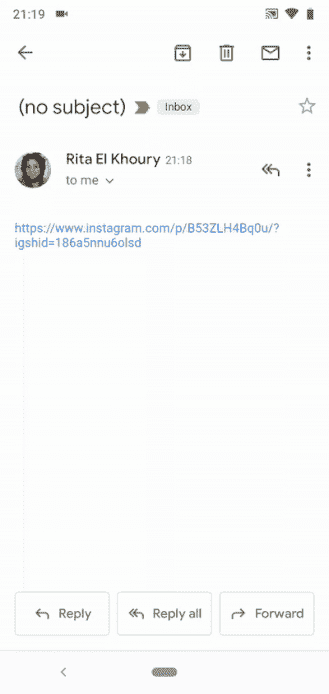

# 谷歌正在修复 Android 10 的默认链接

> 原文：<https://www.xda-developers.com/android-10-fix-open-links-default-app/>

# 谷歌正在修复 Android 10 在默认情况下打开链接的复杂过程

Android 10 在选择默认应用打开链接的过程中倒退了一大步。谢天谢地，谷歌正在解决这个问题。

谷歌的目标是在每一个 Android 版本中更新和改进尽可能多的领域。然而，操作系统是巨大的，某些年某些领域比其他领域得到更多的关注。询问你想用哪个应用程序打开某个东西的弹出窗口已经被调整了很多次，但是在 Android 10 中它后退了一大步。谢天谢地，谷歌正在解决这个问题。

这是大多数人都熟悉的过程:你点击一个 Instagram 链接，弹出窗口询问你是否想用 Chrome 或 Instagram 打开它。你可以选择用你想要的应用程序打开它一次(下一次会被询问)或者设置为默认。如果你选择将 Instagram 设为默认，你只需按下按钮就可以了。Instagram 打开，以后每次都会打开。很简单。

| <picture></picture>

安卓 9

 | <picture></picture>

安卓 10

 |
| --- | --- |

不管出于什么原因，谷歌决定在 Android 10 中增加更多的步骤。最初，它看起来和我们习惯的过程一样。然而，当你按下“设置为总是打开”来选择默认应用程序时，它会带你到应用程序信息页面，你必须从“打开链接”对话框中手动选择“每次打开”。在经历了这一切之后，它甚至可能不会带你去你最初想去的地方。这个过程需要更长的时间，需要更多的互动。

这种变化感觉像是反方向的进步。Android 10 程序成为过时的方法，以前的单击程序成为“新的和改进的”方法，这将更有意义。人们一直在抱怨这种变化，看起来谷歌正在进行“修复”安卓设计总监格伦·默菲在推特上表示对当前系统不满意，他们正在努力改进。

* * *

**Via: [安卓警察](https://www.androidpolice.com/2019/12/10/google-wants-to-fix-android-10s-terrible-workflow-for-opening-links-by-default-in-your-chosen-apps/)**