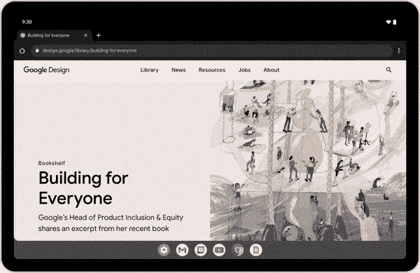

# Android 12L 从今天开始向谷歌 Pixel 手机推出

> 原文：<https://www.xda-developers.com/android-12l-rollout/>

谷歌多年来一直没有发布 Android 的小更新，而是坚持每年的大更新，并在每月的安全更新中全年修复漏洞。然而，随着 Android 12L 的发布，谷歌又回到了这个想法，Android 12L 主要专注于对可折叠和其他大屏幕设备的改进。经过几个月的测试，Android 12L 现在正在推出支持像素设备。

Android 12L 在整个系统和核心应用程序中引入了两栏布局和其他大屏幕优化，最重要的是在快速设置/通知面板中。还有一个用于大屏幕设备的任务栏，其功能类似于 Chrome OS 和 Windows 上的任务栏，以及 macOS 上的 dock。你可以点击应用程序来打开它们，或者将图标拖到屏幕的一侧，以分屏模式打开它们。

 <picture></picture> 

Source: Google

分屏模式本身也进行了更新，有一个更突出的 divder 线(类似于三星 One UI 和其他第三方皮肤上已经有一段时间了)。还有一些其他有益的变化，比如平板电脑上只有肖像的应用程序的信箱，以及新的通知手势。

稳定版是在几个开发者预览版和测试版发布之后推出的，包括 12 月的第一个测试版、1 月的测试版 2 和 2 月的测试版 3。谷歌已经表示，最终版本将在 2 月后的某个时候发布，而[的其他报道](https://www.xda-developers.com/android-12l-release-timeline/)表明它将在第一季度结束前(3 月 31 日结束)发布，所以这次发布非常及时。

 <picture></picture> 

Source: Google

谷歌在其博客文章中写道，“从今年晚些时候开始，我们将为您最喜爱的平板电脑和可折叠平板电脑带来 12L，并计划从三星、联想和微软进行更新。我们将继续开发更多特性和功能，以帮助您在 Android 13 及以后的版本中充分利用您的大屏幕设备。”

## 为谷歌像素设备下载 Android 12L

Android 12L 现在正在向大多数当前支持的 Pixel 手机( [RIP Pixel 3](https://www.xda-developers.com/google-pixel-3-end-of-life-february-patch/) )推出，作为[三月功能下降](https://www.xda-developers.com/pixel-feature-drop-march-2022/)。谷歌告诉 9to5Google 说，Pixel 6 和 Pixel 6 Pro 将于“本月晚些时候”发布。谷歌似乎也没有为最终的稳定版本提供通用系统映像(GSI)版本，至少现在还没有。