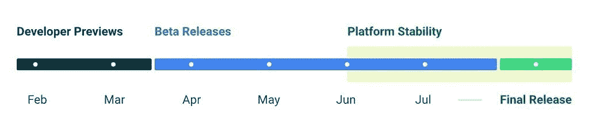

# Android 13“提拉米苏”:关于谷歌 2022 年的重大更新，你需要知道的一切

> 原文：<https://www.xda-developers.com/android-13/>

一个大的 Android 更新最令人兴奋的事情是能够遵循一个可预测的发布模式来体验所有的新功能。谷歌的 [Android 12](https://www.xda-developers.com/android-12/) 更新标志着自 Android 5 Lollipop 以来操作系统最大的视觉重新设计，这要感谢 [Material You](https://www.xda-developers.com/material-you/) 。新的设计理念，以及详尽的新功能列表，使 Android 12 的外观和感觉与以前的版本完全不同。

就整体美学而言，Android 13 在很大程度上与之前的版本相似，但在引擎盖下有大量新东西。它已经测试了很长时间，每个新版本都增加了功能，并对 Android 系统的不同元素进行了较小的改进。Android 13 已经正式成为金色，现在可用于所有支持的 Pixel 设备和其他一些非 Pixel 手机。如果你想在一个地方找到所有 Android 13 的信息，那么你来对了页面。这里有你需要知道的关于 Android 13 的一切！

## Android 13 叫什么？

两年前，随着 Android 10 的品牌重新设计，谷歌[放弃了其 Android 甜点命名方案](https://www.xda-developers.com/android-10-android-q-brand-redesign/)。然而，公司内部的开发团队继续使用甜点的名称。例如，Android 11 在内部被称为“红色天鹅绒”，而 Android 12 在内部被称为“雪锥”。同样，Android 13 也叫[提拉米苏](https://www.xda-developers.com/google-android-13-t-tiramisu-dessert-name/)。谷歌不再对此保密，因为它是在去年 7 月 AOSP 精神的一次提交中被发现的。

对于那些好奇的人来说，这些是迄今为止所有 Android 版本的甜点名称(内部或公开):

*   安卓 1.5:纸杯蛋糕
*   安卓 1.6:甜甜圈
*   安卓 2.0:艾克蕾尔
*   安卓 2.2: Froyo
*   安卓 2.3:姜饼
*   安卓 3.0:蜂巢
*   安卓 4.0:冰淇淋三明治
*   安卓 4.1:果冻豆
*   安卓 4.4: KitKat
*   安卓 5.0:棒棒糖
*   安卓 6.0:棉花糖
*   安卓 7.0:牛轧糖
*   安卓 8.0:奥利奥
*   安卓 9:馅饼
*   安卓 10:木瓜馅饼
*   安卓 11:红色天鹅绒蛋糕
*   安卓 12:雪锥
*   安卓 13:提拉米苏

值得一提的是，我们已经知道 Android 14 的名字是什么。Android Gerrit 上弹出的一些与 Android 14 相关的首批提交已经揭示了下一版本 Android 的[代号“颠倒蛋糕”](https://www.xda-developers.com/google-codename-android-14/)。

## Android 13 发布日期

谷歌于 2022 年 8 月 15 日向公众发布了稳定的 Android 13 更新。该更新与[源代码](https://www.xda-developers.com/android-13-source-code/)一起提供给该公司的 Pixel 手机。谷歌的 Android 13 开发者预览计划于 2022 年 2 月开始，自那以来发生了很多变化，导致了 2022 年 8 月的最终发布。以下是谷歌为 Android 13 测试版发布的原始路线图:

 <picture></picture> 

© Android Developers

正如预期的那样，Android 13 在两次开发者预览版和两次完整测试版发布后，于 2022 年 6 月达到了“平台稳定性”。该公司随后在 2022 年 7 月发布了 Android 13 Beta 4，也就是最终的候选版本。

谷歌目前正在推出季度平台发布(QPR)版本。我们刚刚在本月早些时候收到了 Android 13 QPR1 Beta 2 更新，预计未来几个月将有更多版本到来。我们建议您查看上面的文章索引，以了解构建变更日志。

### Android 13 开发者预览版

2022 年 2 月 10 日，当谷歌开始推出[第一个开发者预览版](https://www.xda-developers.com/android-13-developer-preview-1/)时，我们第一次尝到了 Android 13“提拉米苏”的味道。与去年不同，我们没有获得 Android 13 的开发者预览版 1.1 补丁。而是在 2022 年 3 月 17 日直接收到了 [Android 13 开发者预览版 2](https://www.xda-developers.com/android-13-developer-preview-2/) 。

正如标题“开发者预览版”所暗示的，这些版本仅供开发者使用。它为世界上最大的操作系统的下一次迭代奠定了基础，并允许应用程序开发人员测试新功能，并开始平台迁移，直至最终发布。对我们来说，这些预览版让我们看到了未来稳定版本的一瞥。我们在下面的章节中详细介绍了 Android 13 开发者预览版 1 更新带来的所有新特性和功能，请务必查看。

### 安卓 13 测试版

谷歌跳过了 Android 13 的开发者预览版 3，并随着 2022 年 4 月 26 日 Android 13 Beta 1 的[首次发布退出了“开发者预览”阶段。第二个 Android 13 测试版](https://www.xda-developers.com/android-13-beta-1-released/)于 2022 年 5 月 11 日作为谷歌 I/O 2022 的一部分到来，而第三个则于 2022 年 6 月 8 日问世。第四个也是最后一个发布候选于 2022 年 7 月 13 日发布。然后，谷歌在 2022 年 8 月正式推出了公开的 Android 13 build。

## 我的设备会得到 Android 13 吗？

谷歌的 Pixel 智能手机是今年晚些时候推出的首批 Android 13“提拉米苏”智能手机之一。没有办法知道非像素设备何时会收到 Android 13 更新，因为这在很大程度上取决于各个原始设备制造商决定他们要花多少时间来开发他们的 UX 皮肤。可以肯定的是，UX 皮肤较浅的智能手机，如华硕的 Zen UI，将在相对较重的皮肤(如小米的 MIUI)之前收到 Android 13 更新。

不过目前，谷歌已经通过开发者预览计划为一些非 Pixel 设备打开了 Android 13 测试版的大门。如果你有下面提到的符合条件的设备之一，你现在就可以加入 Android 13 派对，体验一下未来会发生什么:

### 这是目前符合 Android 13 测试版条件的所有设备

*   谷歌像素 7/7 专业版
*   谷歌 Pixel 6/6 Pro/6a
*   谷歌像素 5/5a
*   谷歌像素 4/4 XL
*   谷歌像素 4a/4a 5G
*   华硕 ZenFone 8
*   Vivo X80 Pro
*   联想 P12 Pro
*   一加 10 专业版
*   小米 12
*   小米 12 Pro
*   小米 Pad 5
*   Oppo Find X5 Pro
*   Oppo Find N(仅限中国)
*   中兴 Axon 40 Ultra
*   皇家 GT2 专业版
*   AQUOS sense6
*   卡蒙 19 Pro 5G
*   诺基亚 X20

如果/当他们有资格接收 Android 13 测试版更新时，我们将继续向该列表添加更多设备。如果你没有 Pixel 手机或上述 OEM 设备之一，那么你可以通过安装通用系统映像(GSI)来尝试 Android 13 测试版。

## 我从哪里下载 Android 13 测试版？

一旦稳定的 Android 13 包向公众发布，我们将更新这一部分，提供下载这些包的链接。与此同时，你可以查看我们的专门文章，找到迄今为止所有 Android 13 版本的[最新下载链接。您可以从列表中找到适用于您的合格设备的正确软件包，手动安装，然后尝试新软件。](https://www.xda-developers.com/how-to-download-android-13/)

## 如何安装 Android 13 测试版？

一旦你为你的智能手机下载了正确的软件包，你就可以通过几个额外的安装步骤来试用 Android 13 了。我们建议你去看看我们的 [Android 13 安装指南](https://www.xda-developers.com/how-to-install-android-13/)来详细了解这个过程。

警告:预览版/测试版仅供开发人员使用，所以我们不建议将它们安装在您的日常驱动程序上。这些早期版本可能会有一些破坏系统的错误和其他不稳定性。还强烈建议您在继续之前备份您的数据。建议用户谨慎使用。

## Android 13 有什么新功能？

Android 13 的更新可能没有 Android 12 大，但它仍然带来了许多新功能和变化。由于开发人员预览版和测试版的发布，我们已经有机会体验这些新特性，但是许多未宣布的变化仍然隐藏在幕后。我们将尽最大努力强调 beta 2 更新之前的每一个变化，但可以肯定地说，所有功能的完整列表只有在我们拿到最终版本后才能得到。

到目前为止，谷歌已经发布了一系列 Android 13 的开发者预览版和测试版。我们将深入研究一长串特性，其中一些比其他的更有纪念意义。该公司还倾向于在这些版本中发布许多隐藏的功能。在我们为最终版本添加更多细节之前，我们将在每一节中包括一些我们认为值得一提的重要内容。

### Android 13 开发者预览版 1:公布的功能

正如我们之前提到的，Android 13 开发者预览版 1 build 于 2022 年 2 月 10 日发布。下面快速浏览一下引起我们注意的一些重要功能:

**Android 的蓝牙和超宽带堆栈现在是主线模块**

谷歌宣布将[在 Android 13 中制造蓝牙和超宽带栈主线模块](https://www.xda-developers.com/bluetooth-ultra-wideband-mainline-modules-android-13/)。这使得该公司能够推出新的蓝牙和超宽带功能以及针对这些组件的安全补丁，而无需依赖原始设备制造商来推出软件更新。对于外行人来说，这是[谷歌项目主线](https://www.xda-developers.com/android-project-mainline-modules-explanation/)的一部分，允许它负责关键的框架组件和系统应用。

**更快的断字速度**

当文本到达 TextView 或容器中的行尾时，可以插入连字符。它本质上是一个换行符，使文本在下一行换行。Android 可以为您处理断字，但这是以性能为代价的。因此，默认情况下它是关闭的。然而，在 Android 13 中，谷歌表示已经改进了这一功能，性能提升了 200%。这意味着开发人员现在可以在他们的文本视图中启用断字，而对渲染性能几乎没有影响。

**Wi-Fi 的附近设备许可**

在 Android 13 之前，需要连接附近 Wi-Fi 设备的应用程序必须请求位置许可。这是一个多余的请求，因为应用程序并不真正需要设备的位置才能运行。谷歌正在通过 Android 13 改变这一状况，将该功能拆分为新的运行时权限，名为 NEARBY _ WIFI _ DEVICES。面向 Android 13 应用的开发者现在可以使用“neverForLocation”标志请求 NEARBY _ WIFI _ DEVICES 权限。

**OpenJDK 11 更新**

正如我们在 Android 13 DP1 报道中提到的，Android 13 的核心库更新到了最新的 open JDK 11 LTS 版本。我们正在考虑为应用和平台开发者提供库更新和 Java 11 编程语言支持。谷歌还指出，这些变化将通过对 ART 模块的更新被反向移植到 Android 12 设备上。

**新的快速设置磁贴**

Android 13 DP1 版本的另一个有趣之处是新的快速设置磁贴。该公司增加了一系列这样的功能，包括扫描二维码、切换颜色校正、启用单手模式等。

**注意:**作为 Android 13 新 API 变化的一部分，谷歌还增加了一个新的[磁贴放置 API](https://developer.android.com/reference/android/app/StatusBarManager#requestAddTileService(android.content.ComponentName,%20java.lang.CharSequence,%20android.graphics.drawable.Icon,%20java.util.concurrent.Executor,%20java.util.function.Consumer%3Cjava.lang.Integer%3E)) ，它将让应用程序提示用户直接将他们的自定义磁贴添加到活动快速设置磁贴集中。

**每个应用程序的语言偏好**

多语言用户可以在 Android 12 的设置 app 中**系统>语言&输入**下选择自己喜欢的语言。然而，语言设置目前是在系统范围内应用的，这对于那些想要使用一种语言的一些应用程序和另一种语言的其他应用程序的人来说可能不是理想的。Android 13 借助[新平台 API](https://developer.android.com/reference/android/app/LocaleManager) 改变了这一点。用户只需进入设置>系统>语言&输入>应用程序语言，即可为每个应用程序设置首选语言。

**主题应用图标**

谷歌在 Android 12 自带的主题选择器应用中引入了“实验性”主题图标功能。作为测试版功能，它在本质上非常有限，但谷歌已经更新了 AdaptiveIconDrawable API，以支持 Android 13 中的主题应用图标。有了这一点，现在积极鼓励应用程序开发者提供兼容的图标，以允许用户更好地定制他们的主屏幕。

除此之外，谷歌还添加了一个新的照片选择器 API，无需访问设备上的所有照片、可编程着色器等即可调用。你可以查看我们的 [Android 13 DP1 报道](https://www.xda-developers.com/android-13-developer-preview-1/)来详细了解这些变化。

* * *

### Android 13 开发者预览版 1:未宣布的变化

正如我们之前提到的，谷歌也在每个新的 Android 版本中发布了很多未经宣布的变化。让我们快速浏览一下在开发者预览版 1 中发现的一些隐藏特性:

**像素启动器的两个主屏幕布局**

Android 13 DP1 [在 Pixel 手机上增加了对多个主屏幕布局](https://www.xda-developers.com/android-13-two-home-screen-layouts-pixel-launcher/)的支持，允许 Pixel launcher 支持两个独立的布局。除了标准布局，一些用户还可以通过将 Pixel 手机的 DPI 设置为 600 或更高来触发大屏幕布局。

**剪贴板自动清除功能**

另一个没有发布在官方公告上的有趣功能是[新的剪贴板自动清除](https://www.xda-developers.com/android-13-clipboard-auto-clear/)。Android 13 带来了一个新的剪贴板自动清除功能，可以在一段时间后从全局剪贴板中删除主剪辑，很像 Gboard。更有趣的是，Android 13 中的这个新功能还提供了一个选项，让你可以更改剪辑被清除后的持续时间。

**新用户档案切换器**

Android 13 DP1 版本配备了一个新的键盘守卫配置文件切换器，它作为一个下拉菜单出现在锁屏 PIN/密码/模式输入页面上。这将允许用户甚至在解锁设备之前切换配置文件。keyguard 配置文件切换器默认是禁用的，但下面是启用时的样子:

**数据保留时间更长的隐私仪表盘**

Android 13 的 DP1 版本在隐私仪表盘中引入了一个新的[“显示 7 天”按钮，将显示过去 7 天的权限访问数据。如果你想知道有什么新功能，Android 12 引入的原始隐私仪表盘功能只能显示过去 24 小时的数据。然而，这个功能在 Android 13 DP1 中是默认不启用的，尽管这可能会随着最终版本的发布而改变。](https://www.xda-developers.com/android-13-dp1-privacy-dashboard/)

**LED 闪光灯亮度控制 API**

Android 13 DP1 版本为 CameraManager 类引入了两个新的 API——getTorchStrengthLevel 和 turnOnTorchWithStrengthLevel。简而言之，这些新的 API 将让用户[调整手机闪光灯的亮度](https://www.xda-developers.com/android-13-flashlight-brightness-adjustment/)，就像一些原始设备制造商已经在做的定制 Android 皮肤一样。

**平板电脑的中枢模式**

Android 13 DP1 版本中宣布的一系列变化中的最后一个包括关于平板电脑的新[中枢模式的暗示。这种新模式将允许用户在不同档案间共享应用，而无需借用登录数据或在档案间切换。值得注意的是，Hub 模式还允许用户建立“可信网络”，从而防止其他人访问共享的应用程序/数据，除非连接到指定的网络。](https://www.xda-developers.com/android-13-might-include-a-new-hub-mode-for-tablets/)

* * *

### Android 13 开发者预览版 2:公布的功能

Android 13 开发者预览版 2 于 2022 年 3 月 17 日发布，它在之前的开发者预览版基础上增加了一堆新功能和大量改进。让我们来看看正式发布时宣布的变化:

**通知权限**

如果你讨厌在手机上收到太多不需要的应用程序的通知，这个功能将是你的救星。Android 13 的 DP 版本带有新的运行时权限，可以从应用程序发送通知。针对 Android 13 的应用程序将需要向用户请求权限才能推送通知。谷歌表示，它正在积极鼓励开发者尽早将 Android 13 作为目标，并为各自的应用程序请求通知权限。

这将是一个很棒的功能，因为它直接让最终用户负责选择他们希望看到通知的应用程序。你很快就可以阻止一个随机的应用程序向你发送通知，包括促销信息。

**开发商降级权限**

Android 13 引入了一个[新的 API](https://developer.android.com/reference/android/content/Context#revokeOwnPermissionsOnKill(java.util.Collection%3Cjava.lang.String%3E)) ，允许开发者降级之前授予的运行时权限，这些权限在应用的更新版本中不再需要。

**改进的日语文本换行**

正如我们之前提到的，Android 13 DP1 引入了更快断字的文本换行改进。这一次，该公司正在对 DP2 版本进行更多的改进，特别是针对日语文本。TextViews 现在可以通过 Bunetsu(连贯单词的最小单位)而不是字符来换行。这应该为一些精致易读的日语应用程序让路。开发人员可以使用 TextViews 启用 Android:lineBreakWordStyle = " phrase "来利用这一点。

**改进了非拉丁文字的行高**

谷歌在 Android 13 中改进了对泰米尔语、缅甸语、泰卢固语和藏语等非拉丁文字的支持。新版本现在使用适应每种语言的行高，从而防止字符的剪裁和定位。

**MIDI 2.0**

Android 13 增加了对新的 MIDI 2.0 标准的支持，包括通过 USB 连接 MIDI 2.0 硬件的能力。对于外行来说，MIDI 2.0 提供了对控制器分辨率的改进，对非西方语调的支持，以及使用每个音符控制器的更富表现力的性能。

**蓝牙 LE 音频支持**

蓝牙低能耗(LE)音频通过使用低复杂度通信编解码器(LC3)承诺更低的功耗和更高的音频质量。市场上有很多支持 BLE 音频的硬件产品，所以我们很高兴看到谷歌在 Android 13 中增加了对乐音频的支持。

**彩色矢量字体**

Android 13 可以渲染 COLR 版本 1 字体，这是一种新的高度紧凑的字体格式，支持颜色分级。Android 13 DP2 build 还将系统表情符号更新为 COLRv1 格式。你可以在 Chrome [公告](https://developer.chrome.com/blog/colrv1-fonts/)中了解更多关于 COLRv1 的信息。

**新前台服务(FGS)任务经理**

Android 13 DP2 包括一个新的前台服务(FGS)任务管理器，它显示了当前运行前台服务的应用程序列表。它还允许用户停止前台服务，而不管目标 SDK 版本如何。新的“活动应用程序”列表可以通过向下滑动通知抽屉并点击设置目录旁边的新图标来访问。点击它将打开一个卡片，上面有应用程序的名称，在前台活跃的时间，还有一个停止按钮。然而，值得指出的是，通过 FGS 任务管理器停止应用程序与从最近屏幕关闭应用程序或使用“强制停止”选项没有相同的效果。你可以在这里了解更多关于这个特殊功能[的信息。](https://www.xda-developers.com/android-13-foreground-services-task-manager/)

Android 13 开发者预览版 2 也带来了大量其他开发者生产力的提高。我们建议您查看我们的 [Android 13 DP2 报道](https://www.xda-developers.com/android-13-developer-preview-2/)以详细了解这些公告。

* * *

### Android 13 开发者预览版 2:未宣布的变化

就像第一个开发者预览版一样，Android DP2 版本也充满了许多隐藏的功能，这些功能不是谷歌官方声明的一部分。来，看一看:

**任务栏中的应用抽屉**

谷歌在一些大屏幕设备的底部添加了任务栏，包括一些平板电脑和可折叠手机，作为其中一个 [Android 12L](https://www.xda-developers.com/android-12l/) 更新的一部分。在 Android 13 DP2 版本中也可以看到相同的任务栏，但它带有一个额外的图标，可以让你打开[应用程序抽屉](https://www.xda-developers.com/android-13-app-drawer-taskbar/)。

 <picture></picture> 

Credit: Mishaal Rahman

**更新了媒体控件和输出选择器**

随着一系列新功能和 API 的变化，Android 13 的第二个开发者预览版也带来了[更新的媒体控件](https://www.xda-developers.com/android-13-media-controls/)。Android 13 的媒体控件仍然位于快速设置菜单和通知面板之间，但小工具本身现在大了很多。虽然这意味着更少的点击来控制你的媒体，但也留给通知更少的空间。值得注意的是，更新的媒体控制也更容易挑选输出。现在，轻按媒体控制右上角的按钮即可访问新的输出选取器，它会显示所有可用输出设备的列表以及“配对新设备”按钮。

**一个新的剪贴板弹出**

谷歌在 Android 11 中调整了截图功能，增加了一个覆盖图，给你一个缩略图预览、一个分享按钮和一个编辑按钮。该公司现在正在将这一概念扩展到 Android 13 中的剪贴板内容。现在，每次你复制一个文本或图像，[新的剪贴板覆盖图](https://www.xda-developers.com/android-13-dp2-clipboard-popup/)将出现在左下角，带有复制内容的预览和一个编辑按钮。如果复制的内容包含任何可操作的信息，那么您会看到一个附加按钮，可以选择使用关联的应用程序打开它。例如，如果你复制地图坐标，那么你会看到一个按钮来打开谷歌地图中的特定位置。

**注意:**尽管新的剪贴板弹出功能在 Android 13 的 DP2 版本中被发现，但直到 2022 年 4 月的 beta 1 版本才启用。

**壁纸特效生成 API**

壁纸效果生成 API 本质上是一个新的设备个性化功能，允许用户在他们的壁纸上应用各种有趣的效果。这是一个正在开发的特性，但是我们希望它能在今年晚些时候为最终版本做好准备。很难说这看起来像什么，或者它如何帮助用户定制他们的壁纸，因为它现在被禁用了。值得注意的是，还有一个壁纸变暗的功能，预计将在最终版本中推出。这个特殊的功能将允许你调暗壁纸的亮度，而不改变设备本身的亮度。壁纸效果 API 对原始设备制造商开放，这意味着我们最终可能会在定制的 Android 皮肤中看到壁纸定制功能。

**无需解锁即可控制智能家居设备**

谷歌在 Android 11 中添加了设备控制快速设置磁贴和锁屏快捷方式，让用户无需打开应用程序即可控制他们的智能家居设备。但要通过快速设置磁贴或锁屏快捷方式使用这些控件，用户首先必须解锁他们的设备。然而，在 Android 13 中，应用程序可以让用户[控制他们的智能家居设备，而无需解锁他们的设备](https://www.xda-developers.com/android-13-smart-home-device-controls-unlocking/)。值得一提的是，这一特殊功能不会让用户在手机锁定时选择可用的设备控制。Google 在 Control 类中加入了 isAuthRequired 方法，如果它返回“true”，那么用户就可以与控件进行交互，而无需进行身份验证。这里有一个快速的视频来展示这个特殊的 API 的运行:

**注意:**新的“从锁定设备控制”开关仅在 2022 年 4 月的 Android 13 beta 1 版本中面向所有用户推出。

**颗粒振动滑块**

Android 13 带有一个颗粒振动滑块，用于不同的振动场景，包括警报、电话、通知等。许多 Android 设备允许你改变电话和通知的振动强度，但没有额外的粒度。此外，您还可以启用一个选项，当您接到电话时，设备会在逐渐响铃之前振动。

**像素启动器中的新搜索栏**

Android 13 DP2 搭载的 Pixel launcher 自带[一个更新的搜索栏](https://www.xda-developers.com/google-pixel-launcher-search-bar/)。一旦启用，这个搜索栏可以通过主屏幕和应用程序抽屉访问，它可以获得小工具、保存的截图、谷歌搜索等结果。这一更新的搜索栏有望让人们在自己的设备上搜索商品变得更加容易。无需打开 Google Photos 应用程序或文件目录就能搜索图片，这让搜索变得更加方便。这种新的搜索栏预计将与 Android 13 的最终版本一起发布，或者更快推出像素功能。

**支持 Wi-Fi 7**

IEEE 802.11be，或我们所知的 Wi-Fi 7，是下一代 Wi-Fi 标准，承诺提供令人难以置信的快速和非常低的延迟。第一套 Wi-Fi 7 产品预计将在今年年底或明年年初进入市场。好消息是 Android 13 增加了对 Wi-Fi 7 的初步支持。Android 13 的 DeviceWiphyCapabilities 类在其标准和支持的信道宽度列表中分别有 802.11be 和 320MHz。

**更多材质颜色可选**

谷歌在 Android 12 中引入了动态颜色，作为其新材料 You design 语言的关键功能之一。谷歌的主题引擎，代号为“莫奈”生成了丰富的彩色调色板，这些颜色来自你的壁纸。然后将这些颜色应用于系统的不同部分，以获得更统一的外观。你引擎的材料在 Android 12 中已经有一个很长的颜色列表，但看起来谷歌正在为另外五种风格腾出空间，这五种风格分别叫做 TONAL_SPOT，VIBRANT，EXPRESSIVE，SPRITZ，RAINBOW 和 FRUIT_SALAD。

**面向开发人员的带宽调节选项**

Android 13 终于增加了一个备受开发者欢迎的功能，这些开发者希望为他们的应用程序模拟缓慢的网络条件。Android 13 的开发者选项中现在有了一个新的设置，允许开发者为所有能够提供互联网接入的网络设置带宽速率限制。它被称为“网络下载速率限制”，它有六个不同的选项可供选择，从“无限制”到“15Mbps”

**改进的屏幕保护程序**

谷歌在 Android Jelly Bean 中添加了屏幕保护程序。这是很好的几年，但屏幕保护程序从未真正起飞，也没有得到重大检修。随着 Android 13 的发布，这种情况似乎正在改变，因为 DP2 版本似乎引入了许多新的屏幕保护程序相关代码。看起来谷歌正在努力改进屏幕保护程序，可以显示额外的信息叠加，类似于 Wear OS 上的复杂功能。斯珀的米沙·拉赫曼设法使隐藏的并发症。除了“颜色”、“时钟”和“照片”屏幕保护程序之外，您还可以激活复杂功能来查看屏幕保护程序顶部覆盖的“一览”小工具、日期和时间、天气和电池信息。

**多 eSIM 支持**

据报道，Android 13 DP2 版本包括对[启用多 SIM 卡配置文件](https://www.xda-developers.com/android-13-esim-report/)的多启用配置文件(MEP)实现。其工作原理是将调制解调器和 eSIM 芯片之间的单个物理数据总线分成多个逻辑接口，这些接口在单个物理接口上多路复用。你可能不知道，eSIM 模块在设备中占用的空间更少，从而在机箱中留出更多空间来放置更大的电池、更好的摄像头硬件等。新的功能可能会使 eSIM 在手机上得到更广泛的支持，但这可能需要一段时间，因为大多数运营商仍然不支持 eSIM。

**游戏加载时间改进**

Android 13 在 GameManager API 中增加了一个名为 setGameState 的新方法，可以用来向 power HAL 发送加载时间提示，以激活新的 GAME_LOADING 模式，提升 CPU 性能。虽然这可能会对[游戏加载时间](https://www.xda-developers.com/android-13-game-loading-mode-improvements/)产生积极影响，但当 GAME_LOADING 模式处于活动状态时，OEM 将如何调整 CPU 性能仍有待观察。值得指出的是，许多原始设备制造商已经实施了各种优化来改善他们设备上的游戏加载时间。

**camera 2 API 中的 HDR 视频**

Camera2API 允许开发人员检查设备上有哪些相机功能，并向应用程序公开粒度相机功能。谷歌正在为 Camera2API 添加更多功能，以使它变得更好。Android 13 的 HAL 允许智能手机制造商将 10 位视频输出暴露给 Camera2 API。如果 OEM 设备支持其他 HDR 格式，如 HDR10+和 Dolby Vision，设备制造商可以使用 camera characteristics # REQUEST _ RECOMMENDED _ TEN _ BIT _ DYNAMIC _ RANGE _ PROFILE 常量向应用程序发布推荐的配置文件。此外，值得一提的是，Camera2 API 还包括对“流用例”的支持，允许 OEM 在不同的流场景中优化相机性能。

设备制造商需要实施以下流用例:

*   实时取景器预览和应用内图像分析
*   静态照片捕捉的静态 _ 捕捉
*   VIDEO_RECORD 用于录制视频片段
*   PREVIEW_VIDEO_STILL 用于取景器、视频录制和静态图像捕捉的单个视频流。
*   用于长时间视频通话的 VIDEO_CALL

**HTTPS 域名系统**

Android 13 终于增加了对 HTTPS 域名系统(DoH)的原生支持。早在 2021 年 9 月，就首次发现了针对 HTTPS 本地 DNS 的代码更改。它现在终于作为 Android 13 DP2 版本的一部分出现了。TLS 上的 DNS 使用 TLS(也称为 SSL)来加密流量，而 HTTPS 上的 DNS 使用 HTTP 或 HTTP/2 协议来发送 DNS 查询和响应。使用 DoH 优于 DoT 的一个主要优点是，后者使用一个专用端口，网络层的任何人都可以看到进出的流量。另一方面，DoH 使用端口 443，这是 HTTPS 流量的标准端口。这意味着通过 DoH 发送的请求和流量可以隐藏在其余的 HTTPS 流量中，使得攻击者或网络管理员几乎不可能监控或阻止 DoH 查询。

**从通知分屏启动应用**

Android 13 DP2 版本的用户现在可以直接从通知面板以分屏多任务模式启动应用程序。这可以通过长按通知，然后将其拖放到屏幕的任一半来实现。这一特殊功能最早是在 Android 12L 中推出的，该公司通过这一功能开始关注大屏幕设备上的 Android。

**更好的内存管理防止应用程序杀人**

正如你可能已经知道的那样，许多 Android 设备都面临着内存管理的问题。这导致延迟通知或应用程序在后台被杀死。一些原始设备制造商更好地调整了他们的软件来处理这个问题，但像 Vivo 这样的制造商的许多设备都深受其害。但看起来 Android 13 可能会永久解决这个问题，这要归功于一个名为“多代最近最少使用”(或 MGLRU)的功能。

这个特别的特性实现了几个目标，包括总体上减少了内存不足(OOM)应用程序查杀。早在今年 4 月份，当我们第一次听说“[多代最近最少使用的](https://www.google.com/url?q=https://www.xda-developers.com/future-android-versions-app-killing/&sa=D&source=docs&ust=1654509028617474&usg=AOvVaw1kITyyut-3U7jQg2PQCBmQ)”功能进入 Android 时，我们就详细地写了它，所以请务必查看更多细节。

* * *

### Android 13 Beta 1:宣布的功能

谷歌在 2022 年 4 月 26 日随着 Android 13 Beta 1 的首次发布退出了 Android 13 的“开发者预览”阶段。beta 版本比 DP 版本更稳定，但是在日常驱动中安装它的时候还是要小心。话虽如此，让我们快速浏览一下随着 Android 13 beta 1 版本的到来，我们看到的一些官方宣布的功能:

**对媒体文件访问的更精细的许可**

目前，Android 设备上的所有应用程序都可以在 READ_EXTERNAL_STORAGE 权限的帮助下访问手机存储上的文件。然而，该权限将允许应用程序访问存储上的所有类型的媒体文件。例如，一个音频播放应用程序可以通过这个权限访问你的照片，这是完全没有必要的。但谷歌正在改变这一点，在 Android 13 中引入了三个新的权限:

*   READ_MEDIA_IMAGES(用于图像和照片)
*   READ_MEDIA_VIDEO(视频)
*   READ_MEDIA_AUDIO(用于音频文件)

如果一个特定的应用。请求访问一种以上的媒体文件类型，然后您会看到一个对话框，用于授予两种权限，如下所示:

**预期音频路由**

Google 在 AudioManager 类中添加了一组新的音频路由 API，允许媒体应用程序识别音频将如何路由。getAudioDevicesForAttributes()和 getDirectProfilesForAttributes()API 可用于收集指定音频的可用设备列表，并检查音频流是否可以直接播放。

* * *

### Android 13 Beta 1:未宣布的变更

谷歌官方的 Android 13 beta 1 公告让它看起来对新功能很容易，但许多新的未记录的功能都是从新版本中提取的。来，看一看:

**请勿打扰模式将持续存在**

Android 13 DP2 版本附带了“优先模式”，这实际上是“请勿打扰”模式的重命名版本。结果是，谷歌不喜欢这个名字，因为它最终在 Beta 1 版本中恢复了这个变化。优先模式有可能在未来的 Android 13 测试版更新中回归，或者在未来的 Android 版本中被重命名。不过，现在“请勿打扰”还会继续存在。

**媒体控制中的新动画**

Android 13 的 DP1 版本更新了快速设置下媒体控件的设计。你可以在上面的 Android 13 DP1:未宣布的变化部分了解更多信息。嗯，beta 1 版本有一点额外的特色:一个弯曲的进度条。

 <picture></picture> 

Android 13 Beta 1 media animation (Credit: Mishaal Rahman)

**壁纸&风格应用**的新颜色和主题选项

Android 13 beta 1 为 Pixel 设备上的 Wallpaper & style 应用程序添加了几个新的颜色和主题选项。更新的 beta 1 版本包括四页墙纸颜色和基本颜色，墙纸颜色和基本颜色的总数达到 16 种。相比之下，Android 13 开发者预览版 2 中的 Wallpaper & style 应用程序只提供了四种颜色。

**屏幕分辨率设置**

Android 13 更容易在设置应用中切换分辨率。Android 13 beta 1 build 在“设置”>“显示”下新增了一个“屏幕分辨率”页面。不言而喻，这将只适用于支持用户在 FHD+ (1080p)或 QHD+ (1440p)之间选择的设备。这实际上是一个额外的定制层，它位于允许您更改当前刷新率的功能之上。

 <picture></picture> 

Credit: Esper

另外值得一提的是，Android 的一些自定义皮肤，比如三星的 One UI，已经有了改变当前屏幕分辨率的选项。

**无法访问侧装应用的可访问性 APIs】**

正如您可能已经知道的，可访问性 API 是强大的工具，旨在帮助开发人员帮助残疾用户。但最近，我们已经看到了许多恶意软件，如 FluBot 利用这些 API 进行恶意攻击。然而，谷歌正在通过阻止侧装应用程序访问这些 API 来打击这种恶意软件。没错，来自 app store 之外的任何侧装应用都将无法启用其辅助功能服务。

轻按该选项以启用它时，您的设备将显示一个弹出窗口，说明“为了您的安全，此设置目前不可用”。

**塔雷:安卓资源经济**

Android 13 带来了新的能源管理功能，让应用程序充分利用设备上的可用电池寿命。TARE 主要关注设备上的能源使用管理，该功能通过 AlarmManager 和 JobScheduler 策略工作。TARE 本质上将“信用”委托给应用程序，然后它们可以在排队任务上“花费”作为付款。分配给特定应用程序的积分数量将取决于电池寿命等因素。

这项功能最初是在去年发现的，但据报道，Android 13 Beta 1 改变了 TARE 在引擎盖下的工作方式。据斯珀的米沙·拉赫曼称，谷歌已经改变了安卓资源积分分配给各种应用的方式。配额的“最大流通”限制了分配给所有应用程序的配额数量，现在已经取消。它已被一个“消费限额”所取代，该限额限制了在一个放电周期内所有应用程序可以消费的积分。简而言之，如果/当电池电量低时，您的设备将执行较少的操作。

谷歌在 Android 13 beta 1 版本中添加了一些其他值得注意的功能，所以请务必查看我们的报道以了解更多信息。

* * *

### Android 13 Beta 2:宣布的功能

谷歌在谷歌 I/O 2022 上发布了 Android 13 的第二个公测版本。Android 13 beta 2 版本带来了一些有趣的功能，包括预测性的背部手势。让我们来看一看:

**安全和隐私设置在同一页面**

谷歌宣布将在 Android 13 中引入统一的安全和隐私设置页面。这个新页面将所有的安全和隐私设置放在一个屋檐下，使人们更容易找到他们需要的东西。虽然这个页面是在 Google I/O 上发布的，但看起来它在 beta 2 版本中是不可用的。我们将密切关注此页面，并在它上线后报告/更新此空间。

* * *

### Android 13 Beta 2:未宣布的变更

与 Android 13 的其他版本一样，第二次公开测试版也添加了一系列未经宣布的功能。让我们来看看:

**指定支持的应用程序语言的资源文件**

有了 Android 13 beta 2 版本，开发者[现在可以指定他们的应用](https://developer.android.com/about/versions/13/features/app-languages#use-localeconfig)可以支持哪些语言，这样用户就可以基于每个应用选择语言。你可以在上面的 Android 13 DP1 部分了解更多关于基于每个应用程序使用语言的信息。

**预测性后退手势**

谷歌在 Android 13 中引入了“预测性背部手势”，允许用户在完成之前预览背部手势的目的地或其他结果。这将使您能够决定是继续使用该手势还是停留在当前视图中。应用程序开发人员也可以轻松地将其集成到他们的应用程序中。

一旦这一特殊功能完全可用，您可以前往设置>系统>开发者选项，选择预测背景动画，并查看它的行动。

**支持蓝牙 LE Audio 的广播**

Android 13 beta 2 build 增加了对 Bluetooth LE Audio 的[广播音频功能](https://www.xda-developers.com/android-13-beta-2-broadcast-audio/)的支持，基本上可以让用户通过蓝牙将支持设备的音频广播给附近的用户。这是一个很棒的功能，因为附近的其他设备可以使用蓝牙来收听您的广播。想要广播媒体的用户将在媒体输出选择器中找到一个广播媒体的选项，而想要收听其他广播的用户必须扫描 QR 码或输入广播的名称和密码。

**安卓电视的扩展画中画模式**

Android TV 多年来一直支持画中画模式，但值得一提的是，Android 13 将是第一个允许开发者创建[扩展 PiP 窗口](https://www.xda-developers.com/android-tv-13-beta-2-pip/)的版本。这将允许用户无缝地改变画中画窗口的大小。Google 没有在 beta 1 版本中发布扩展的 PiP。然而，它终于随着一个新的停靠模式出现了，该模式可以调整主应用程序的大小，以允许 PiP 窗口位于边缘。

**Gboard 的表情厨房获得新表情**

谷歌的表情厨房是我们最喜欢的 Gboard 功能之一。如果你想知道，它可以让你结合两个不同的表情符号来创建一个全新的。Gboard 的表情厨房中并不缺少表情符号，但 Android 13 Beta 2 提供了对四种额外表情符号的支持，包括爪印、樱桃、西瓜和岩石。

* * *

### Android 13 Beta 2.1:错误修复

Android 13 Beta 2.1 与之前的开发者预览版和测试版更新相比是一个较小的版本。因此，beta 2.1 更新包了一些软件修复，以提高软件的整体稳定性。

**安卓 13 Beta 2.1 bug 修复**

*   修正了在搜索栏中输入会导致空白建议列表的问题。
*   修复了当打开热点时设备会崩溃和重启的问题。
*   修正了一个问题，在打电话时，可以听到连续的电话拨号声。
*   修复了一个问题，设备将崩溃，并重新启动后，从机器人自动断开。

* * *

## Android 13 Beta 3:公布的功能

谷歌于 2022 年 6 月 8 日发布了 Android 13 Beta 3 build。正如最初的平台路线图中提到的，第三个测试版将 Android 13 带到了平台稳定性的里程碑。这意味着*“Android 13 已经达到最终的内部和外部 API，最终的面向应用的行为，以及最终的非 SDK API 列表(灰名单)。”*现在让我们来快速浏览一下这个版本中官方宣布的一些特性:

**应用兼容性**

由于 Android 13 现在已经达到了平台稳定性的里程碑，现在开发者可以测试他们的应用了。谷歌基本上希望所有的开发者在运行 Android 13 beta 3 的设备上测试他们的应用程序，以确保最大限度的兼容性。开发人员应该以新的 API 为目标，并加入对所有行为变化的支持。事实上，谷歌已经强调了应用程序开发人员在 Android 13 beta 3 上测试应用程序时应该注意的几个变化，包括通知的运行时权限、剪贴板预览、作业调度器预取等。

**平板电脑和大屏幕支持**

此外，谷歌还强调，开发者应该将平板电脑和其他大屏幕设备作为测试的一部分。这可以通过在 Android Studio 中设置 Android 模拟器或使用兼容的大屏幕设备来完成，如联想 Tab P12 Pro。谷歌在其官方公告中强调的一些变化如下:

*   多窗口模式:这种模式现在默认为所有应用程序启用，该公司希望开发者确保他们的应用程序正确处理分屏。
*   **任务栏交互:**谷歌还希望开发者能够检查他们的应用在大屏幕上使用新任务栏时的反应。Android 13 DP2 首次亮相的任务栏现在将在大屏幕设备上持续存在。
*   **媒体投影:**开发者需要检查他们的应用程序如何响应媒体投影，以便在大屏幕上播放、播放或播放媒体。

你可以查看我们的 [Android 13 Beta 3 报道](https://www.xda-developers.com/android-13-beta-3-released/)，更详细地了解平板电脑和大屏幕设备即将发生的所有变化。

* * *

## Android 13 Beta 3:未宣布的变化

除了谷歌在其官方帖子中宣布的新功能和变化，新的 Android 13 Beta 3 版本还包括一些未记录的变化。在这里，看看他们:

**提示查看通知设置**

在启动 Android 13 Beta 3 版本后，你首先会注意到的一件事是一个查看通知设置的提示。这有助于用户了解新的通知模式在 Android 13 中是如何工作的，让最终用户负责选择他们希望看到通知的应用程序。

**在搜索设置中切换网页建议**

谷歌在 Android 13 Beta 3 中的 Pixel Launcher 设置包括一个[“网页建议”](https://www.xda-developers.com/android-13-pixel-launcher-web-suggestions/)切换。这可以在主页设置的*搜索您的手机*选项中找到。启用后，Pixel Launcher 还会在主屏幕或应用抽屉的搜索栏中输入时显示 web 结果。

**每应用语言功能推送**

Android 13 DP1 版本引入了一个选项来启用每个应用程序的语言偏好，以允许用户为每个应用程序设置他们喜欢的语言。针对 Android 13 的应用程序开发人员应该在 locales_config.xml 资源文件中列出他们的应用程序实际支持的语言。正如斯珀的 Mishaal Rahman 在 Twitter 上指出的那样，从 Android 13 Beta 3 版本开始，不提供 locales_config.xml 资源文件的应用将不会显示在每个应用的语言首选项页面中。虽然你可以强制系统显示所有的应用程序，但它显示了谷歌如何推动面向 Android 13 的开发者主动列出支持的语言。

**名为“儿童模式”的新导航栏模式**

Android 13 中现在有一个新的导航栏模式，称为“儿童模式”，可以在大屏幕设备上启用。它具有不同的可绘制性和导航栏上的 back 和 home 图标的新布局。值得注意的是，最近的应用程序图标在这种模式下消失了，这可能是有原因的。更有趣的是，当应用程序进入沉浸式模式时，导航栏保持可见。作为 Android 13 Beta 3 版本改进的一部分，它们现在即使在全屏模式下播放视频时也能持续显示在屏幕上。然而，当几秒钟没有按下时，按钮确实会逐渐消失。来，看一看:

* * *

### Android 13 Beta 3.1:恢复 Android Beta 反馈 app

就在推出 Android 13 Beta 3 版本的几天后，谷歌以 [Android 13 Beta 3.1 更新](https://www.xda-developers.com/a-minor-issue-fix-arrives-in-android-13-beta-3-1-update/)的形式推出了一个小补丁。这个版本的软件恢复了 Android Beta 反馈应用程序，在第三次测试更新中发现有些应用程序丢失了。Android Feedback 应用程序对于测试版来说至关重要，因为它是提交 bug、请求功能和其他关于当前测试版或开发者预览版的反馈的最佳方式。

* * *

### Android 13 Beta 3.2:主要错误修复

谷歌于 2022 年 6 月 16 日向符合条件的设备推出了 [Android 13 Beta 3.2 版本](https://www.xda-developers.com/android-13-beta-3-2-released/)。这个特别的构建包含了一些主要的错误修复，以提高软件的整体稳定性。

**安卓 13 Beta 3.2: Bug 修复变更日志:**

*   修正了后退手势在某些应用中不起作用的问题。
*   修正了浏览设置页面在滚动时会不一致地折叠的问题。
*   修正了一些应用程序在打开时会立即崩溃的问题。
*   修正了一个问题，在不相关的设备使用期间，麦克风会意外地打开和关闭。
*   修正了谷歌照片应用程序经常崩溃的问题。

* * *

### Android 13 Beta 3.3:错误修复

Android 13 Beta 3.3 是另一个增量版本，作为 Android 13 第三个测试分支的扩展。此更新于 2022 年 6 月 27 日推送，内部版本号为 TPB3.220617.002。您可以在我们专门的 [Android 13 Beta 3.3 帖子](https://www.xda-developers.com/android-13-beta-3-3-released/)中找到此特定版本的变更日志，其中我们已经详细强调了每个修复以及其他一些相关信息。

## Android 13 Beta 4:发布候选版本

2022 年 7 月 13 日发布的 Android 13 Beta 4 是谷歌 Pixel 设备和 Android 模拟器的候选版本。这一特殊版本标志着 Android 13 预发布测试软件之路的结束，因此它更多地关注于漏洞修复和完善，而不是推出新功能。以下是谷歌在 Android 13 Beta 4 版本中强调的一些关键变化:

*   **通知的运行时权限:**最新版本的 Android 引入了从应用程序发送通知的新运行时权限。
*   **剪贴板预览:**谷歌指出，开发者必须确保他们的应用在 Android 13 的新剪贴板预览中隐藏敏感数据，如密码或信用卡信息。
*   **JobScheduler 预取:** [JobScheduler](https://developer.android.com/reference/android/app/job/JobScheduler) 现在会尝试预测应用程序的下一次启动时间，并在该时间之前运行任何相关的预取作业。Google 建议开发人员测试他们的预取作业功能在这个版本中是否如预期的那样工作。

## Android 13:最终版本

经过数月的开发者预览和测试版发布，谷歌终于在 2022 年 8 月 15 日为谷歌 Pixel 智能手机发布了稳定的 Android 13 build。这是 Android 13 的最终版本，最终将在今年晚些时候和 2023 年进入其他 Android 旗舰。谷歌没有给这个特别的版本添加任何新功能，因为它本质上是我们过去收到的版本的改进版本。

然而，首次公开推出 Android 13 并不标志着 Android 13 测试版计划的结束。谷歌计划通过与那些已经注册 Android 13 测试版项目的人分享其季度平台发布(QPR)版本来继续测试修复和改进。该公司将在明年预览 Android 14 之前发布 Android 13 QPR1、Android 13 QPR2 和 Android 13 QPR3 版本。我们在下面强调了 QPR 版本的变更日志。

## Android 13 QPR1 Beta 1

第一个[Android 13 13 qpr 1 Beta](https://www.xda-developers.com/google-has-released-android-13-qpr1-beta-1/)build 于 2022 年 9 月 8 日针对支持的 Pixel 设备发布。这个版本进行了一些修复和改进，这些在当时并不是公共版本的一部分。下面快速浏览一下 Android 13 QPR1 Beta 1 的变更日志:

*   修复了一些设备的问题，当设备在他们的口袋里时，错误地导致用户的紧急联系人从锁定屏幕上被拨打。
*   修复了 Pixel 6a 设备的各种问题，这些问题使用户难以解锁他们的设备或设置指纹解锁。
*   修复了在某些情况下导致系统界面崩溃的问题，例如从屏幕边缘打手势返回。
*   修复了有时导致显示 5G 图标而不是 5G UW 图标的问题，即使受影响的设备已经成功连接到 5G UW 网络。

## Android 13 QPR1 Beta 2

Android 13 QPR1 Beta 2 于 10 月 5 日发布，适用于谷歌支持的像素设备，如 Pixel 4a、Pixel 4a 5G、Pixel 5、Pixel 5a 和 Pixel 6。谷歌尚未分享 Android 13 QPR1 Beta 2 变更日志，其中突出了修复和改进，因此一旦我们有了更多明确的信息，我们将更新这个空间。

## Android 13 QPR1 Beta 3

谷歌于 2022 年 10 月 20 日发布了 Android 13 QPR1 Beta 3，这是第一个与 Pixel 7 和 Pixel 7 Pro 相匹配的 QPR1 Beta 版本。除了我们在这些测试版中常见的一系列错误修复之外，QPR1 Beta 3 还带来了一些新功能。

*   **谷歌 Pixel 7 和 Pixel 7 Pro 的清晰通话:**谷歌承诺的清晰通话功能在发布时没有出现在新的 Pixel 手机上，但它是 QPR1 Beta 3 的一部分。
*   **电池共享开关:**qp R1 Beta 3 版本增加了电池共享开关，让你更容易控制反向充电功能。

谷歌还在 2022 年 11 月 7 日推出了相对较小的 Android 13 QPR1 Beta 3.1 版本。它旨在粉碎一些臭名昭著的错误，你可以在 [Android 开发者平台发布说明](https://developer.android.com/about/versions/13/release-notes#beta3)中了解更多信息。

## Android 13 QPR2 Beta 1

谷歌第二个 Android 13 季度平台发布(QPR)的第一个测试版于 2022 年 12 月 13 日开始推出。它在同一天推广到所有受支持的 Pixel 智能手机，包括新的 Pixel 7 和 Pixel 7 Pro。这个特别版本的一个亮点是它在 Pixel 6 Pro 上启用了 1080p 支持。

行业专家很快发现了这一特殊变化，你可以在谷歌发布的官方数据中看到[承诺](https://android.googlesource.com/kernel/google-modules/display/+/b4bd65659595b2a44e224915a441e49aa50f5b95)。这实质上允许谷歌 Pixel 6 Pro 用户从 1440p 显示分辨率切换到 1080p，而不依赖于[自定义内核](https://www.xda-developers.com/google-pixel-6-and-pixel-6-pro-gain-1080p-support-with-android-13/)。T2B1.221118.006 版本的大小为 192MB，现在可供注册该计划的人接收测试版。它有相当多的错误，你可以通过前往谷歌官方[发布说明](https://developer.android.com/about/versions/13/release-notes)了解更多。

## Android 13 QPR2 Beta 2

谷歌在 2023 年推出了另一个 Android 13 季度平台发布(QPR)测试版更新。它于 1 月 9 日以软件版本 **T2B2.221216.006\.** 的形式向符合条件的 Pixel 手机(Pixel 4a 和更新版本)发布了 [QPR2 Beta 2 更新](https://www.xda-developers.com/android-13-qpr2-beta-2-google-pixel/)，它主要专注于修复之前测试版中发现的问题。我们没有获得任何新功能，但 2023 年 1 月的安全补丁提供了更新。以下是完整的变化列表:

*   修正了系统界面有时会导致主屏幕无响应的问题。
*   修复了一个问题，即在谷歌相机应用程序中从慢动作模式切换回正常视频捕捉模式后，如果在慢动作模式下捕捉速度在 1/8 倍和 1/4 倍之间变化，应用程序会继续捕捉慢动作视频。

此外，QPR2 Beta 2 更新将 Google Play 服务版本从 22.39.10 提升至 22.41.13。

## Android 13 QPR2 Beta 2.1

谷歌推出了 QPR2 Beta 2 的后续更新，修复了一些有用的漏洞。1 月 20 日， [Beta 2.1 补丁](https://www.xda-developers.com/android-13-qpr2-beta-21-update-google-pixel/)以更新 T2B2.221216.008 的形式对所有兼容的 Pixel 设备可用。此次更新中最值得注意的错误修复解决了一个问题，即即使网络可用，设备有时也无法连接到 5G。它还解决了加密蓝牙连接将无限期保持连接的问题。你可以在[谷歌的开发者门户](https://developer.android.com/about/versions/13/release-notes)查看这个特别更新的发布说明。

## Android 13 QPR2 Beta 3

Android 13 QPR2 Beta 3 更新于 2023 年 2 月 1 日推出，面向所有参加测试计划的合格 Pixel 手机。这一空中(OTA)更新解决了许多问题，为 2023 年 3 月的稳定发布做了最后的润色。此次更新没有带来任何安全补丁，但它将 Google Play 服务版本从 22.41.13 升级到了 23.03.13。以下是一些变更/修复的快速浏览:

*   修复了通知组中的通知有时显示为直角而不是圆角的问题。([期号 264287776](https://issuetracker.google.com/issues/264287776) ，[期号 265529116](https://issuetracker.google.com/issues/265529116) )
*   修复了一个问题，即通知阴影中的消息表明一个活跃的 VPN 连接与关于应用程序与活跃的前台服务的消息重叠。([问题编号 266075977](https://issuetracker.google.com/issues/266075977)
*   修复了编辑快速设置图块时无法访问溢出菜单的问题。([问题编号 263484657](https://issuetracker.google.com/issues/263484657)
*   修正了一个问题，有时会导致一个设备的振动启用振动太长时间后，它收到了通知。([问题#239676913](https://issuetracker.google.com/issues/239676913)

你可以在我们的 [Android 13 QPR2 Beta 3 帖子](https://www.xda-developers.com/android-13-qpr2-beta-3-google-pixel/)查看此次更新的完整变更日志。

## Android 13 QPR2 Beta 3.1 和 3.2

谷歌很快跟进了 QPR2 Beta 3 的更新，做了一些小的更新。这两次更新只相隔了几周，它们解决了一些关键的错误，改善了整体用户体验。Android 13 QPR2 Beta 3.1 更新 **T2B3.230109.004** 修复了系统蓝牙模块的一个问题，该问题“可能允许由于内存损坏而可能出现的越界写入。”值得注意的是，它还发布了对系统映像中一些缺失的罗马尼亚语翻译的修复。

另一方面，Android 13 QPR2 Beta 3.2 更新修复了一些 Pixel 设备的屏幕会闪烁绿色或包含其他视觉伪像的问题。这次特别的更新还为 Pixel 6 和 Pixel 7 系列带来了对 Jio 5G 网络的支持。如果你想阅读其他微小变化的完整列表，你可以前往我们的 [Android 13 QPR2 Beta 3.2 帖子](https://www.xda-developers.com/android-13-qpr2-beta-32-display-fix/)。

* * *

Android 13 的最终版本已经出来了，并在各种旗舰设备上运行。然而，在明年 Android 14 预览版发布之前，你可以期待谷歌每月发布 QPR 测试版。当新的 QPR 建筑曝光时，我们将继续更新这篇文章。同时，我们想知道您对 Android 13 的看法。你的智能手机已经有了吗？如果是，那么你已经在你的设备上安装了吗？请在下面的评论中告诉我们！