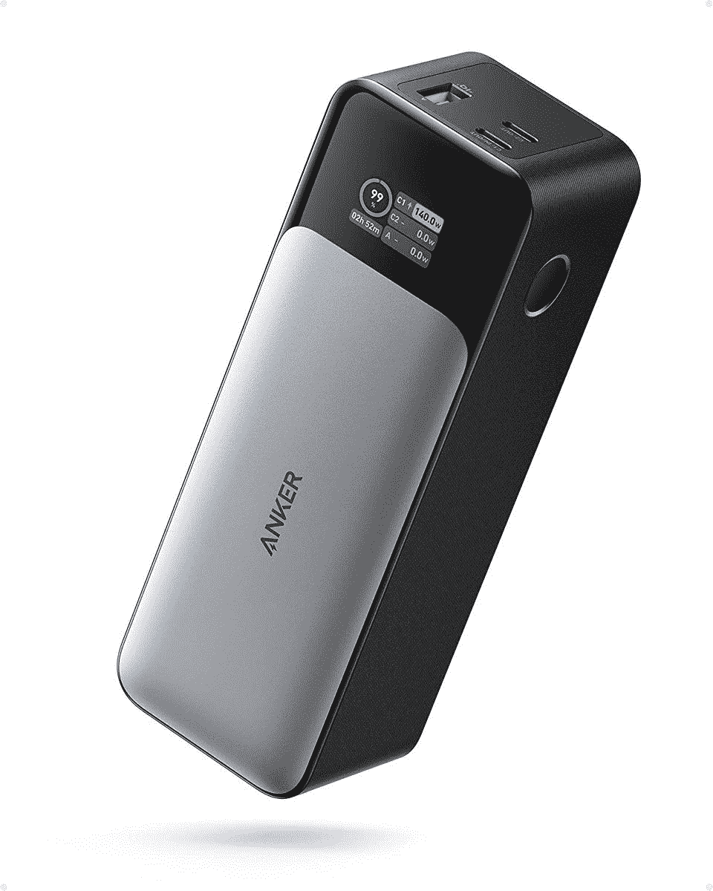

# Anker 的 737 power bank 首次打折，零售价降低了 50 美元

> 原文：<https://www.xda-developers.com/anker-737-power-bank-prime-day-early-access/>

# Anker 的 737 power bank 首次打折，零售价降低了 50 美元

如果你一直在寻找一个可以做到这一切的电源库，带数字显示屏的 Anker 737 可能正合你的胃口。

有时候，在旅途中有很多东西需要充电。通常情况下，设备附带的充电器是不够的。这就是第三方适配器和电源组派上用场的地方，在您需要的时候给您额外的电力。Anker 生产充电器和充电配件已经有一段时间了。该公司在过去几年中一直在提升其产品，宣传其氮化镓(GaN)充电解决方案。早在 7 月，Anker 推出了一系列新的 GaNPrime 产品，其中最令人印象深刻的产品之一是其 737 Power Bank。

虽然从那时起，电力银行已经出现在许多评论中，但直到现在它才开始销售。在亚马逊的 Prime Early Access 销售活动期间，Anker 737 Power Bank(Power core 24K)终于打折了，零售价降低了 50 美元，价格降至 99.99 美元。如果有时间去买一个，那就是现在。如果不熟悉的话，t he Anker 737 拥有 24,000mAh 的电池容量，并具有功率传输 3.1 和双向充电技术，使其能够快速充电和再充电。也许这个电源库最棒的地方在于它提供了一个可以显示输出和输入的数字显示器。

显示屏还可以显示剩余电量以及电池充电需要多长时间。如果说 Anker 737 电源组有什么缺点的话，那就是它的尺寸。一些人可能会有另一个抱怨，那就是它不是一个适配器，只能用作电源存储库。无论如何，如果你正在寻找一个有很多功能和动力的恒星电源库，Anker 737 可能是你最好的选择。如前所述，这是它第一次获得折扣，所以这是相当罕见的事情。因此，如果你有兴趣，你可以使用下面的链接购买设备。

 <picture></picture> 

Anker 737 24,000mAh power bank

##### Anker 737 24，000mAh 电源组

Anker 737 24，000mAh 带数字显示的电源组。