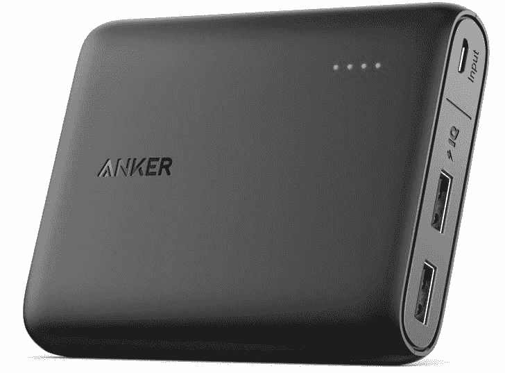
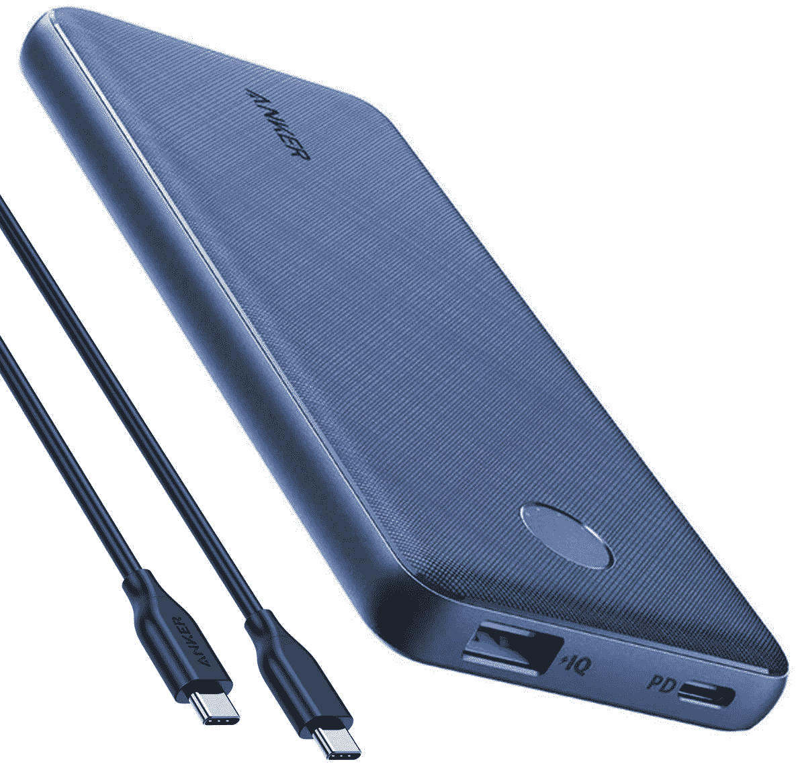
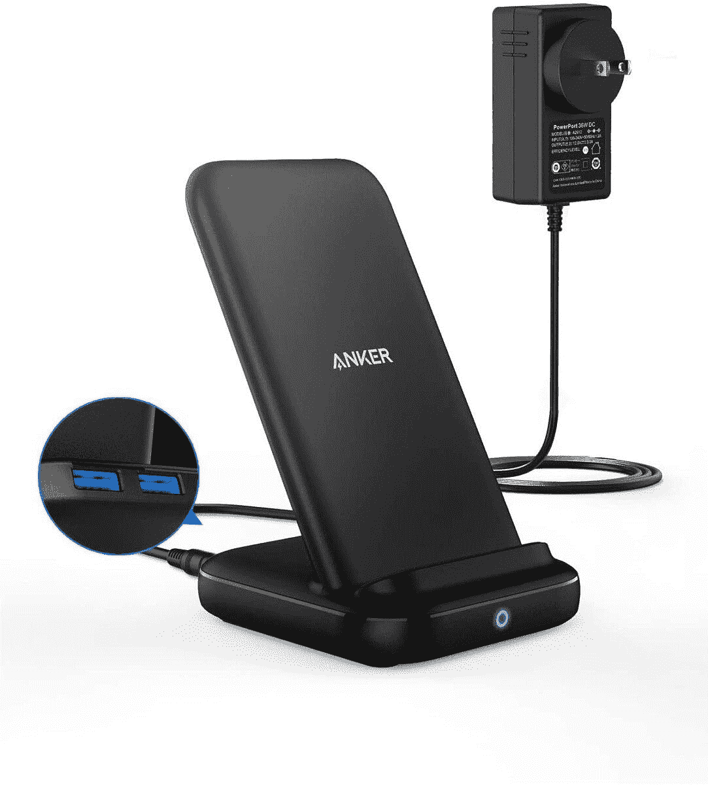
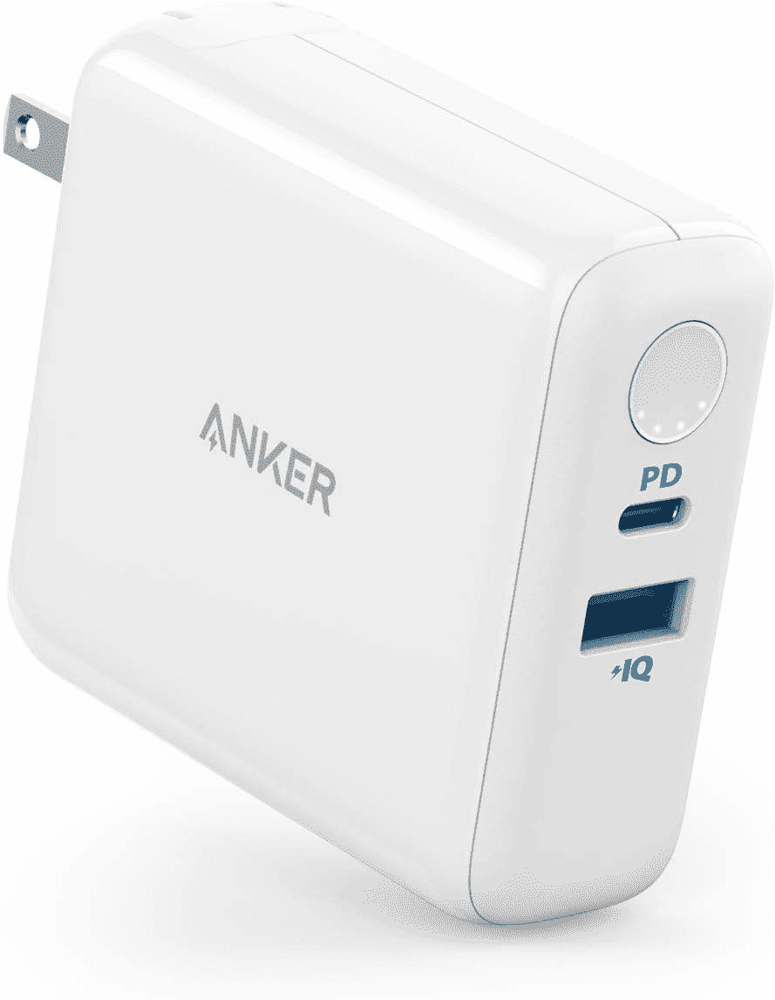
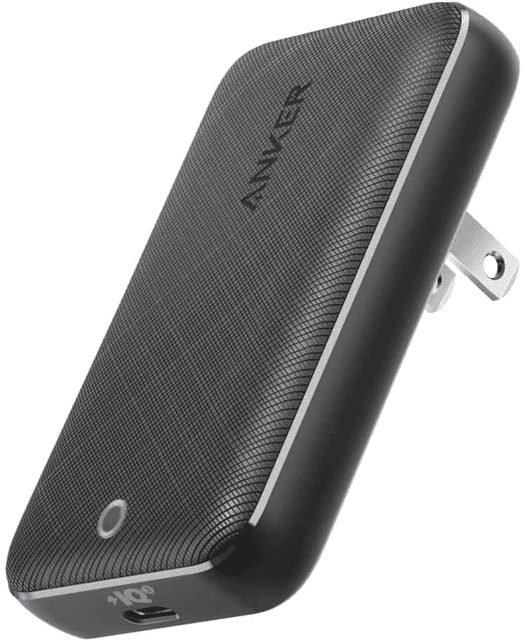
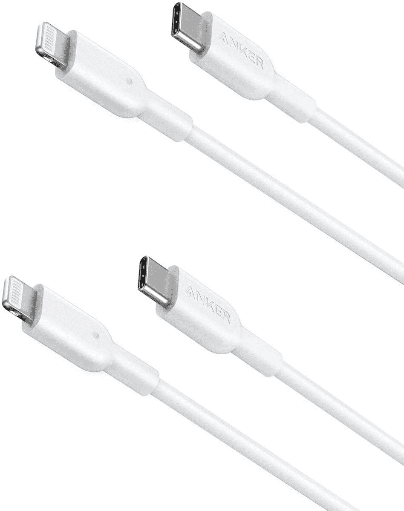

# Anker 的便携式电池、充电器和电缆仅在今天就降价 38%

> 原文：<https://www.xda-developers.com/anker-deal-of-the-day/>

# Anker 的便携式电池、充电器和电缆仅在今天就降价 38%

Anker 在亚马逊的“今日交易”中出售便携式电池、墙壁适配器、电缆和其他配件。

Anker 生产一些当今最好的充电配件。我为需要更多充电端口的家庭成员购买了一些他们的墙壁适配器，我经常在笔记本电脑和手机上使用 Anker 的 60W PowerPort Atom III 墙壁充电器。如今，该公司正在为亚马逊的“今日交易”(Deal of the Day)对其部分产品进行打折，有些产品的价格比正常价格低 38%。

下面列出了所有有价值的物品，其中包括电池、墙壁适配器和电缆。其中最划算的可能是 10，000 毫安时便携式电池，因为它支持 USB Type-A 和 Type-C(并用后者充电)。如果你需要同时给几个设备充电，比如智能手表和手机旁边的耳塞，3 合 1 充电站也是一个不错的选择。

 <picture></picture> 

Anker PowerCore 13000

##### Anker PowerCore 13000

这是一个 13000 毫安的便携式电池。然而，没有快速充电支持(只有两个 USB Type-A)。

 <picture></picture> 

Anker PowerCore Slim 10000 PD

##### Anker PowerCore 超薄 10000 PD

这款便携式电池采用超薄设计，18W 快速充电，USB Type-A 和 Type-C 连接器。

 <picture></picture> 

Anker 3-in-1 Charging Station

##### Anker PowerWave 10 三合一充电器

这是一个 10W 无线充电座，背面有两个 USB Type-A 端口，用于为其他设备充电。

 <picture></picture> 

Anker PowerCore Fusion III

##### Anker PowerCore Fusion III 18W 充电器

这款壁式充电器可以通过 USB Type-C 提供 18W 的功率，并且它还内置了 5,000mAh 的电池。

 <picture></picture> 

Anker 45W Fast Charger

##### Anker 45W 超薄充电器

如果典型的砖形 USB 壁式适配器不适合你，这款扁平的 45W 充电器可能是一个不错的选择。

 <picture></picture> 

USB-C to Lightning cables (2-pack)

##### Anker USB-C 至 Lightning 电缆

这些 3 英尺长的电缆将为任何使用 Lightning 电源连接器的设备提供最快的充电速度。

这些交易只在今天有效，所以如果你对某样东西感兴趣，不要等太久。