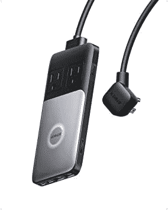
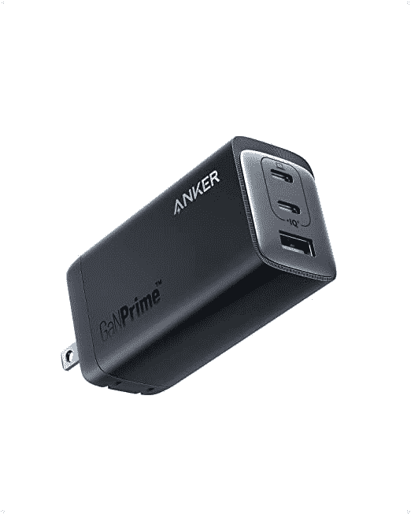

# 购买 Anker 的 100 瓦和 120 瓦 GaN 充电器可节省 30%的费用

> 原文：<https://www.xda-developers.com/anker-gan-charger-deal-amazon-prime-early-access-sale/>

# Anker 的 100W 和 120W GaN 充电器在亚马逊的 Prime Early Access 销售中降价 30%

在亚马逊的 Prime Early Access 销售期间，Anker 727 充电站和 Anker 737 USB C 充电器以 30%的价格出售。

如果你讨厌为所有的电子产品携带多个充电器，你可能会想看看 Anker 的多端口 GaN 充电器上的这些 Prime Early Access 交易。亚马逊现在对 Anker 727 充电站和 Anker 737 USB C 充电器提供 30%的折扣，这可以解决你的充电问题，而不会在你的口袋里烧一个洞。

Anker 727 充电站和 Anker 737 USB C 充电器通常零售价为 95 美元，但你可以通过下面的链接只需 66.49 美元就能买到。如果你随身携带笔记本电脑，你应该选择 Anker 727 充电站，而不是 Anker 737 USB 充电器，尽管后者的额定功率为 120W。这是因为充电站让你可以使用两个交流插座，如果你使用的是不支持 USB C 充电的 Windows 笔记本电脑，这将派上用场。除了交流插座，充电器还具有两个 USB-C 和两个 USB-A 端口，这对于你的其他设备来说应该足够了。

 <picture></picture> 

Anker 727 Charging Station

##### Anker 727 充电站

Anker 727 充电站提供两个交流电源插座、两个 USB-C 端口和两个 USB-A 端口。

不过，如果你拥有一台 MacBook，你可以选择 Anker 737 USB-C 充电器，因为最近发布的所有 MacBook 型号都支持 USB-C 充电。该充电器具有两个 USB-C 端口，其中一个可以以高达 100W 的功率为设备充电。这对 MacBook Air 来说应该绰绰有余(这款产品在亚马逊上也有 200 美元的折扣)，你可以使用另一个 USB-C 端口给智能手机充电。剩余的 USB-A 端口可用于智能手表或其他仍配有 USB-A 充电器的设备。

 <picture></picture> 

Anker 737 USB C Charger

##### Anker 737 USB C 充电器

Anker 737 是一款紧凑型 120W GaN 充电器，带有两个 USB-C 端口和一个 USB-A 端口。

两款充电器均采用 Anker 专有的 ActiveShield 2.0 技术，用于智能温度监控和电力传输，以保护您的连接设备。Anker 为这两种充电器提供 24 个月的保修，确保您高枕无忧。

*这两款 Anker GaN 充电器中，你会为你的设备选择哪一款？请在下面的评论区告诉我们。*