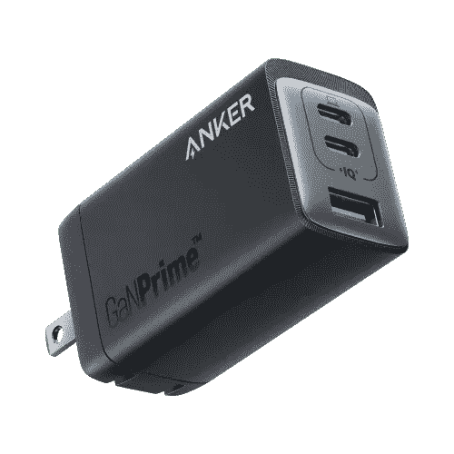
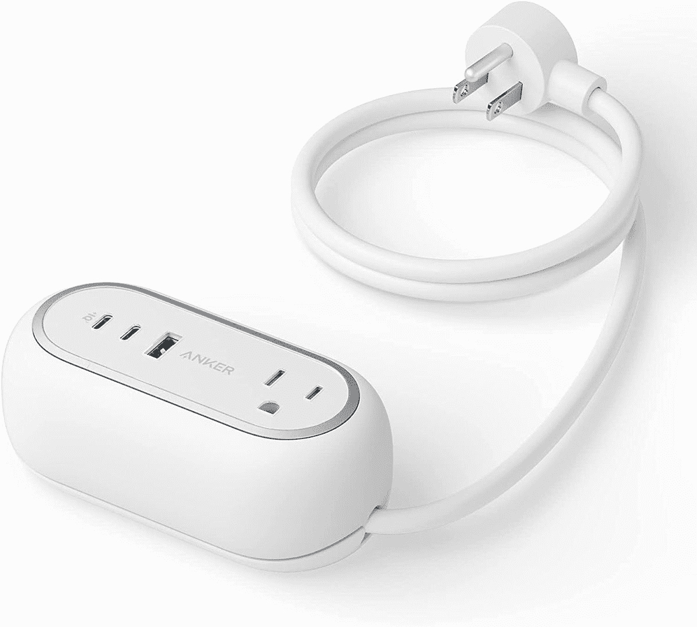
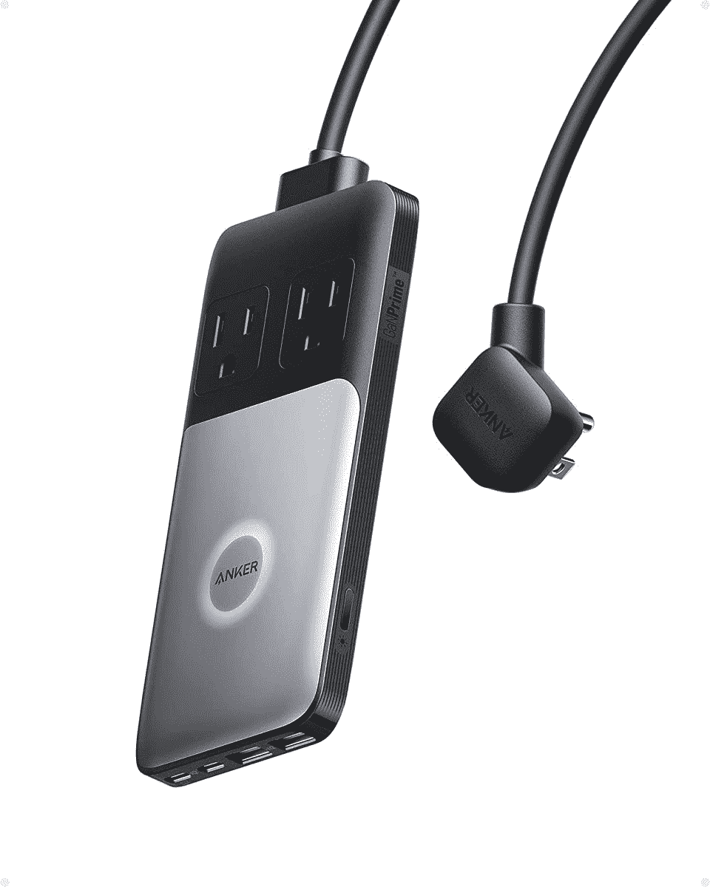

# Anker 提供 GaNPrime 系列，提供高达 150W 的充电功率

> 原文：<https://www.xda-developers.com/anker-ganprime-charging-solutions/>

对于大多数人来说，充电器只是你的设备附带的东西，你永远不会再真正考虑它。但对其他人来说，这是一个探索第三方配件世界的机会，这些配件可能会与第一方的产品竞争或超过第一方的产品。Anker 是一家建立了相当声誉的公司，在网上甚至在零售店销售移动充电解决方案。今天，该公司在其 GaNPrime 旗下宣布了一系列新的 GaN 充电器。

GaNPrime 将是该公司过去几年来一直在建设的延伸，结合了 GaN 和专有的 Anker 技术。这种结合将为更安全、更可持续、充电更快的解决方案让路。GaNPrime 将通过专注于节能、在需要时将电力输送到需要的地方的能力、改进的主动热监控和紧凑型充电器设计来实现上述要点。

GaN 或氮化镓是一种自 20 世纪 90 年代开始使用的化合物，最近已被用于移动充电器。这种化合物有很多好处，主要是它能在更高的温度下工作。Anker 利用了这项技术，提供的充电器可以远远超过你的标准充电器的能力。虽然额外的充电功率是受欢迎的，但有些人可能不会对价格感兴趣，因为基本 Anker GaN 充电器的成本远远高于你的库存充电器。虽然这可能是一个很高的价格，但它确实有很多优势，尤其是对那些拥有多台设备的人来说。

## Anker 735 充电器(GaNPrime 65W) $59.99

 <picture></picture> 

Anker 735 Charger (GaNPrime 65W)

##### Anker 735 GaNPrime 65W 充电器

## Anker 615 USB 插线板(GaNPrime 65W) $69.99

 <picture></picture> 

Anker 615 USB Power Strip (GaNPrime 65W)

##### Anker 615 GaNPrime 电源板

## Anker 727 充电站(GaNPrime 100W) $94.99

 <picture></picture> 

Anker 727 Charging Station (GaNPrime 100W)

##### Anker 727 GaNPrime 100W 充电器

如果你对 Anker 的新 GaNPrime 移动充电解决方案感兴趣，你可以点击上面的链接订购。Anker 更强大的 GaNPrime 充电解决方案，如 120W Anker 737 充电器、733 电源组和 150W 747 充电器，目前不可从亚马逊预购。它们将于 2022 年第三季度开始发货。预购链接将在可用时添加。你也可以直接从 Anker 订购。

* * *

**来源** : [安克尔](https://shop-links.co/1784345781633701992?u1=d4fac8a4-b963-4727-bbf8-5a58419276e5)