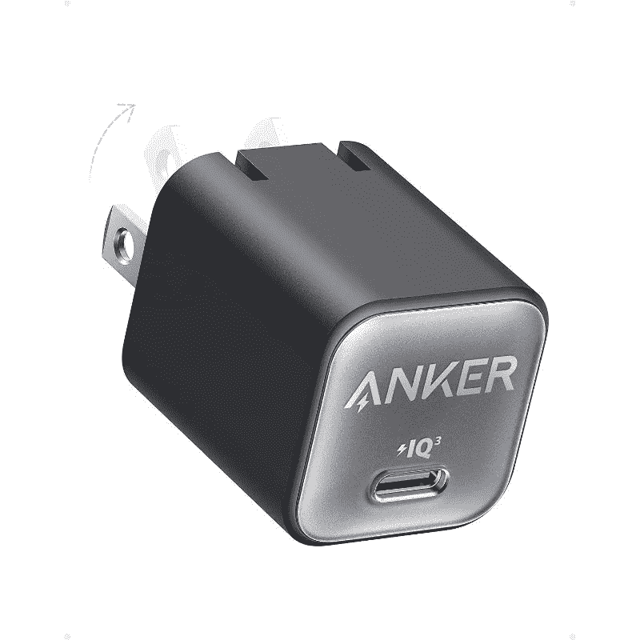
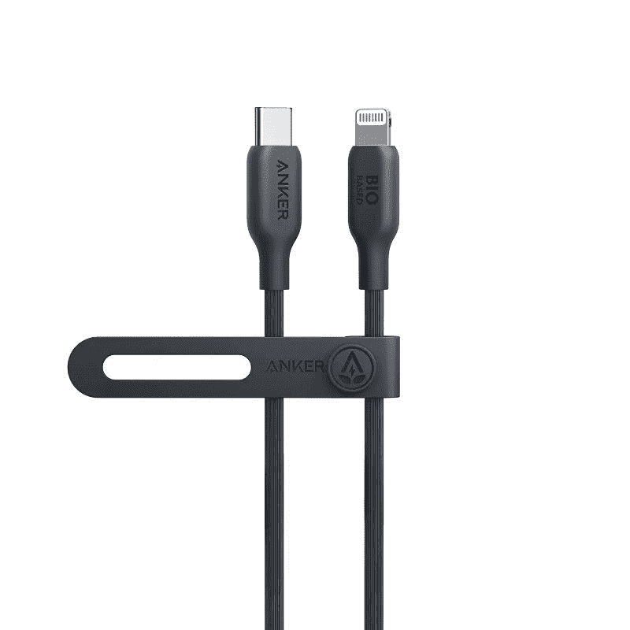

# 新的 Anker Nano 3 和生物基充电电缆减少了石油基塑料的使用

> 原文：<https://www.xda-developers.com/anker-nano-3-bio-based-charging-cable/>

随着 iPhone 14 即将发布，Anker 宣布了一款新的快速充电器和充电电缆。新的充电器和电缆是 Anker 新的环保配件系列的一部分，包括大幅减少石油基塑料使用的创新。

新的 Anker Nano 3 是一款 30W 的充电器，比 Nano 系列中以前的型号更紧凑，因此使用的塑料更少。另一方面，生物基充电电缆利用植物基材料来减少塑料的使用。

## 安科纳米 3

新款 Anker Nano 3 比上一代 Nano 2 更紧凑，塑料用量减少了 30.9 克，但充电速度相同。比苹果原装的 30W 充电砖小了 70%，甚至还有点实惠。

 <picture></picture> 

Anker Nano 3

售价仅为 22 美元的 Anker Nano 3 是苹果原装 30W 充电器的绝佳替代品，如果你打算买一部新 iPhone，应该马上订购一个。那些在供货前两周订购的人将在价格上获得额外的 10%的折扣，进一步增加了交易的甜头。

 <picture></picture> 

Anker Nano 3

##### Anker Nano 3 30W GaN 充电器

Anker Nano 3 是一款紧凑型 30W GaN 充电器，比苹果的 30W 充电砖小 70%。

Anker Nano 3 有五种颜色可供选择，它采用 Anker 的 ActiveShield 2.0 技术来调节温度，PowerIQ 3.0 为各种设备提供优化的充电，并支持 PPS。

## 生物基充电电缆

如果你没有充电线来搭配新的 Anker Nano 3，你可以考虑选择新的生物充电线。充电电缆的设计考虑到了可持续性，并使用来自玉米和甘蔗的植物材料，以减少石油基塑料的使用。

 <picture></picture> 

Anker Bio-based charging cable

这种基于生物的充电电缆有 USB Type-C 到 Lightning 和 USB Type-C 到 USB Type-C 两种型号，因此对 Android 用户来说也是一个很好的选择。它有两种尺寸和多种颜色，价格从 17 美元到 22 美元不等。与 Nano 3 一样，Anker 将在上市前两周内对所有购买提供 10%的折扣。

 <picture></picture> 

Anker Bio-based charging cable

##### Anker USB-C 至照明电缆

Anker 公司的新型生物充电电缆用石油基塑料代替了来自玉米和甘蔗的植物基材料。

Anker 的新配件采用了重新设计的包装，减少了 90%的塑料用量，并配有由纸浆制成的内托盘。包装纸是 FSC 认证的 100%可回收，所有的印刷使用可回收大豆油墨。