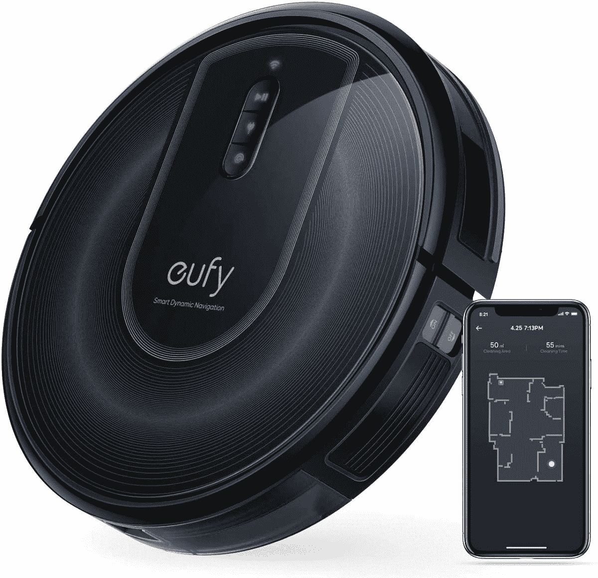

# Shark 和 Anker 的智能机器人吸尘器有很大折扣！

> 原文：<https://www.xda-developers.com/anker-shark-smart-robot-vacuum-cleaner-deals-prime-day-2021/>

智能吸尘器作为人们智能家居设置的一部分越来越受欢迎，这是有充分理由的。这些智能机器涉及一次性设置，但之后，它们基本上无需持续努力或监督即可运行。如果你一直在寻找一个智能机器人吸尘器，Anker 和 Shark 都在他们的产品上有一些很大的折扣，作为 2021 年黄金日的一部分。

## Anker Eufy RoboVac G30 (T2250)

Eufy 是 Anker 的一个子品牌，销售机器人吸尘器，RoboVac G30 是该产品线中的一个好产品。这款机器人吸尘器是一款基于应用的吸尘器，兼容 Wi-Fi，同时支持亚马逊 Alexa 和谷歌助手。它有 2000 帕的最大吸力，适用于硬木、瓷砖、强化地板和中厚地毯。但是，请记住，这种清洁剂不适用于高绒地毯和深色地毯。

 <picture></picture> 

Anker Eufy RoboVac G30

##### Anker Eufy RoboVac G30

Anker Eufy RoboVac G30 是智能机器人吸尘器的良好开端，为您提供清洁、功能和价格的良好组合。

像许多其他吸尘器一样，这款吸尘器可以自我管理电池和充电，这意味着当电池电量低时，它会返回基站，并在电池电量充足时从上一个位置恢复工作。机器人吸尘器还能够爬过高达 0.63 英寸的台阶，如果你的家里有地毯和非地毯区域，这就方便了。

这种机器人吸尘器通常售价 320 美元。但对于 2021 年的 Prime Day，它获得了 120 美元的折扣，使其价格降至 200 美元。

## 鲨鱼 AV1010AE 机器人真空吸尘器，带自排空底座

你知道什么比帮你打扫卫生的吸尘器更好吗？这款吸尘器还会定期清空，所以你不需要每天都清理。Shark AV1010AE 是一款带有自排空基站的机器人吸尘器，这意味着与常规机器人吸尘器相比，该机器人具有更大的灰尘容纳能力。有了这种特殊的机器人吸尘器，你可以收集长达 45 天的灰尘和碎片，这意味着你几乎每月不到一次需要清空工作站。

 <picture></picture> 

Shark AV1010AE Robot Vacuum Cleaner

##### 鲨鱼 AV1010AE 智商机器人真空

Shark AV1010AE 机器人吸尘器配有一个自排空基站，允许吸尘器在不需要人工干预的情况下工作很长一段时间。你可以获得长达 45 天的灰尘收集，而不需要清空吸尘器或站。当然，你也可以获得智能机器人吸尘器的所有功能。

除了自动清空功能，你还可以获得机器人吸尘器的预期优势，包括亚马逊 Alexa 和谷歌助理支持，充电的自我管理，多表面清洁等等。这种特殊的型号通常在亚马逊上卖 600 美元，但现在在 2021 年的 Prime Day 打折到 320 美元，给我们节省了 280 美元的巨大优惠。

* * *

你用机器人吸尘器吗？请在下面的评论中告诉我们！