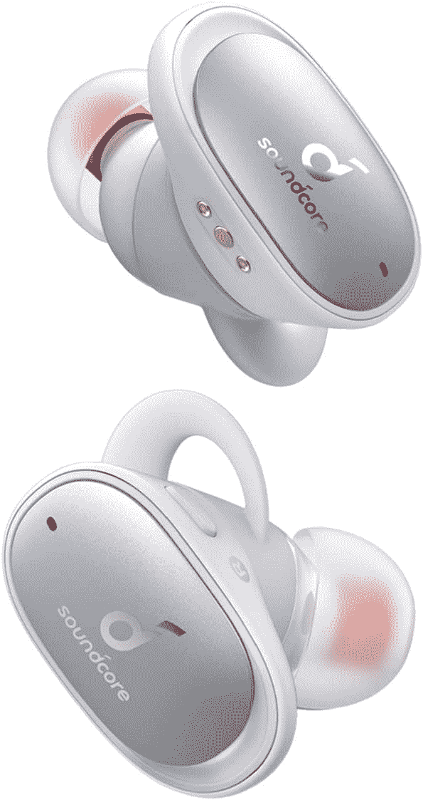

# 以英国最低的价格购买 Anker Soundcore Liberty 2 Pro TWS 耳机

> 原文：<https://www.xda-developers.com/anker-soundcore-liberty-2-pro-tws-lowest-uk-49/>

# 以英国最低的价格购买 Anker Soundcore Liberty 2 Pro TWS 耳机

Anker Soundcore Liberty 2 Pro TWS 耳机是英国目前价格最低的耳机，仅售 49.99 英镑。看看他们！

Anker 是周围最好的配件公司之一，拥有数十种充电器、电缆、支架和其他技术，适合每种使用情况。Anker 定期推出新的销售产品，不同的产品打折出售。今天，Anker Soundcore Liberty 2 Pro TWS 耳机在亚马逊英国的价格最低，为 49.99 英镑。

 <picture></picture> 

Anker Soundcore Liberty 2 Pro TWS

##### Anker Soundcore 自由 2 专业版

Anker Soundcore Liberty 2 Pro TWS 是一对 TWS 耳机，在评论中备受推崇。他们在亚马逊英国网站上的价格是最低的！

如果你想尝试一副真正的无线耳机，那么 Anker Soundcore Liberty 2 Pro 绝对不会错。Anker 现在已经在游戏中很长时间了，根据这些耳机的评论，他们之前 89.99 的价格已经非常好了。

就功能而言，Anker 表示，这些耳机有 11 毫米的驱动器，可实现出色的低音和高音。这些耳机通过 USB-C 充电，据说在外壳中十分钟可以给他们两个小时的收听时间。它们也与 Qi 兼容，可以进行无线充电，如果你感兴趣，绝对值得看看我们的[最佳无线充电板](https://www.xda-developers.com/best-qi-wireless-charger/)列表。

他们还拥有单耳听力，该公司的 HearID 可根据您的喜好调节音频，以及大量的液体硅胶耳塞和耳翼，以确保您从这些耳机中获得您想要的精确配合。它们支持蓝牙 5.0，在充满电的情况下，每个耳机可以播放 8 小时，充电外壳可以延长至 32 小时。这是一副绝对值得一试的耳机！