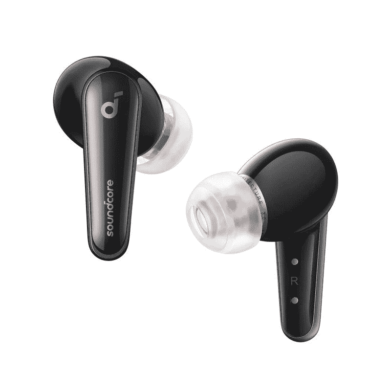

# 新款 Anker Soundcore Liberty 4 配备了心率传感器

> 原文：<https://www.xda-developers.com/anker-soundcore-liberty-4-launch/>

# Anker 最新的 TWS 耳塞具有心率传感器和空间音频支持

Anker 最新的优质 TWS 耳塞 Soundcore Liberty 4 具有心率传感器和空间音频支持。请继续阅读，了解更多信息。

尽管苹果最新的旗舰耳塞比最初的 AirPods Pro 带来了几项改进，但 [AirPods Pro 2](https://www.xda-developers.com/airpods-pro-2-review/) 不包括之前传言的心率传感器。虽然对大多数人来说，这可能不是一个交易破坏者，但如果你想在耳塞上安装心率跟踪功能，Anker 可以满足你。其最新的 Soundcore Liberty 4 耳塞具有心率传感器和空间音频支持，比 AirPods Pro 2 便宜 100 美元。

全新的 Anker Soundcore Liberty 4 是 Anker Soundcore Liberty 系列中的第一款耳塞，具有双动态驱动器和更新的茎部设计。Liberty 4 售价 149.99 美元，几乎拥有你期望在一副优质 TWS 耳塞上看到的一切，包括 ANC 支持和身临其境的空间音频。此外，耳塞还为健身爱好者配备了心率追踪器。

Soundcore Liberty 4 还配备了新的 CloudComfort 耳塞，确保舒适安全的佩戴，高分辨率音频无线认证，增强声音输出的 ACAA 3.0 同轴音响系统，以及 LDAC 支持。就电池寿命而言，Anker 声称 Liberty 4 在 ANC 关闭的情况下一次充电可持续 9 小时，在 ANC 下可持续 7 小时。这款充电保护套支持无线充电，在没有 ANC 的情况下可延长 28 小时的游戏时间，在有 ANC 的情况下可延长 24 小时。

Anker Soundcore Liberty 4 可通过 Anker 的网站购买，您可以点击下面的链接立即订购。这款耳塞也将于 10 月 10 日在亚马逊和 10 月底在百思买上市。

 <picture></picture> 

Anker Soundcore Liberty 4

##### Anker Soundcore 自由 4

Anker 的全新 Soundcore Liberty 4 具有心率传感器和空间音频支持。

请注意，Liberty 4 并不是市场上第一款带有心率传感器的 TWS 耳塞。Amazfit PowerBuds 和 [Jabra Elite Sports 耳塞](https://www.amazon.com/dp/B072ZH4NTR/?tag=xda-2hkt1di-20&ascsubtag=UUxdaUeUpU43873&asc_refurl=https%3A%2F%2Fwww.xda-developers.com%2Fanker-soundcore-liberty-4-launch%2F&asc_campaign=Short-Term)也配有心率传感器，比 Anker 的最新产品更实惠。