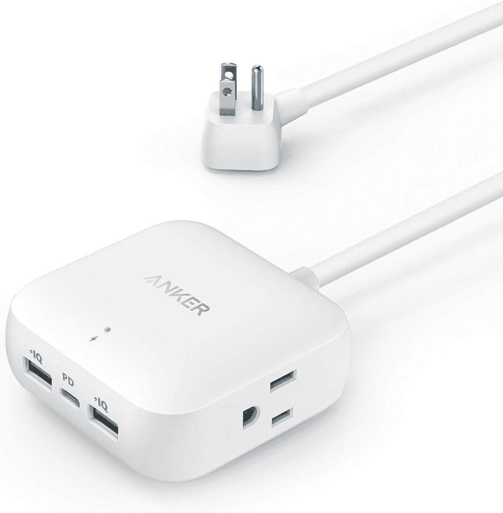
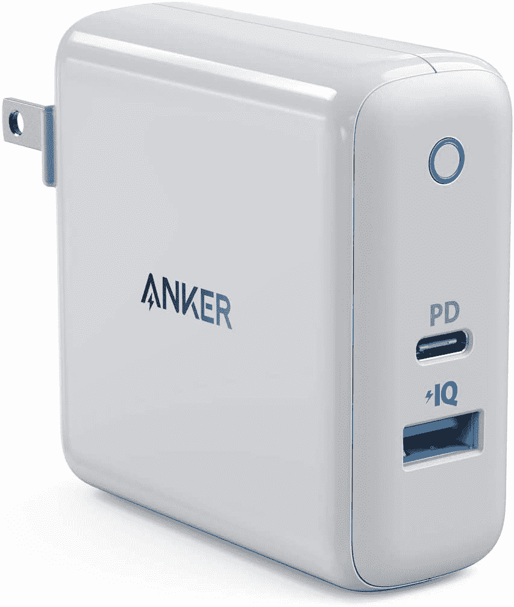
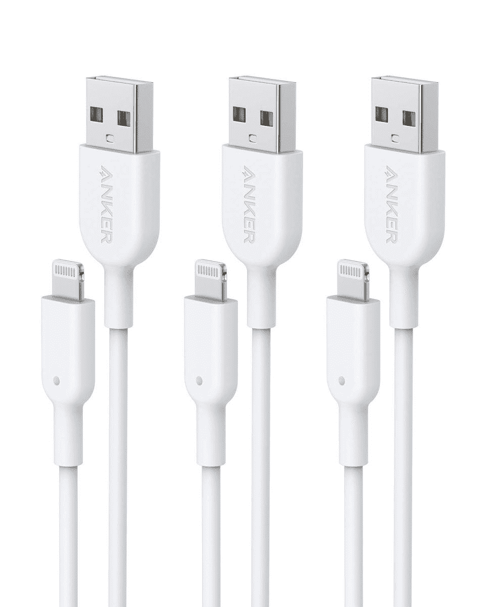
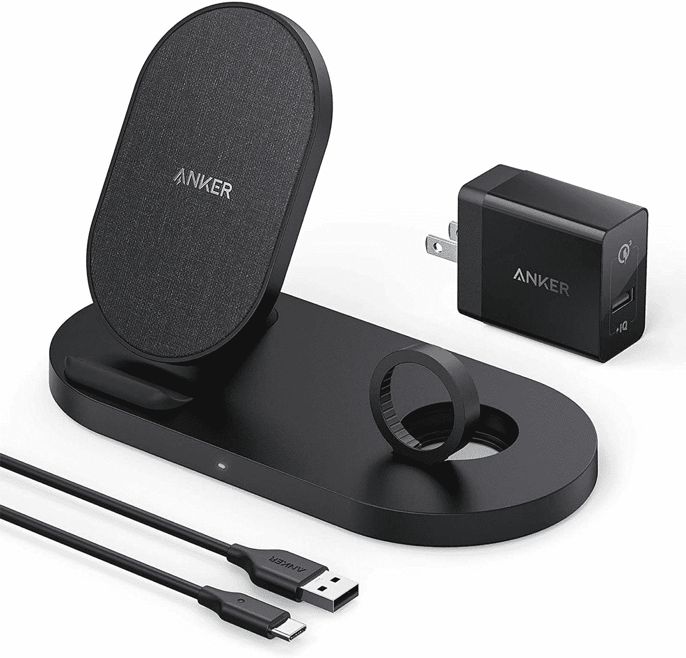
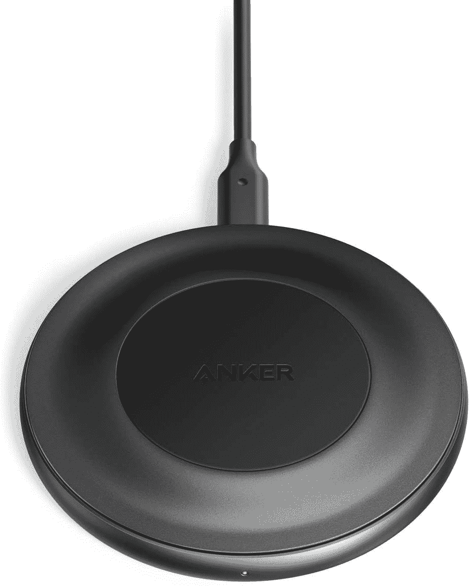

# Anker 的电缆、充电器和便携式电池今天降价高达 35%

> 原文：<https://www.xda-developers.com/ankers-cables-chargers-and-portable-batteries-are-up-to-35-off-today/>

# Anker 的电缆、充电器和便携式电池今天降价高达 35%

Anker 今天的销售包括无线充电座、30W USB Type-C 墙壁适配器、苹果 Lightning 电缆和便携式电池。

Anker 是周围最好的配件公司之一，拥有数十种充电器、电缆、支架和其他技术，适合每种使用情况。Anker 定期有新的销售，不同的产品在打折和打折之间打转，今天亚马逊有几款 Anker 电缆和充电器出售到午夜。

大部分销售是便携式电池和壁式充电器，但 Anker 也有一些闪电电缆出售给苹果粉丝。最有趣的在售产品可能是售价 18.19 美元(7 折)的 Powerport Speed+，它既有 USB Type-C 插头，也有 Type-A 插头，最大充电速度为 30W。这是同时为手机和配件(如智能手表)充电的绝佳选择。

我们已经链接了以下所有打折商品供您浏览。这些销售在今晚午夜结束，所以如果你想要什么，不要等太久。

 <picture></picture> 

Anker Power Strip

##### Anker 30W 电源插座条

这个电源板有一根 5 英尺长的电线，带有一个标准的墙上插座、一个 USB C 类端口和两个 USB A 类端口。这是 26 美元，比正常价格低 10 美元。

 <picture></picture> 

Anker Powerport Speed+

##### Anker PowerPort Speed+ 30W 充电器

这款 30W USB 充电器非常适合手机、平板电脑和许多笔记本电脑。这是 18.19 美元，比通常的价格节省了 7.8 美元。

 <picture></picture> 

Anker Power bank + charger

##### Anker 737 PowerCore 26K

这是一个 25，600mAh 便携式电池，捆绑了 65W USB-PD 充电器。它是 110 美元，比正常价格低 50 美元。

 <picture></picture> 

Anker Lightning Cable

##### Anker USB-C 至照明电缆

这种 3 包闪电线是替换苹果自己制作的劣质电缆的一个很好的选择。

 <picture></picture> 

Anker Wireless Charging Station

##### Anker PowerWave Sense 二合一无线充电座

这个坞站可以同时为一部 iPhone 和 Apple Watch 无线充电。它是 30 美元，比正常价格低 13 美元。

 <picture></picture> 

Anker 15W Wireless Charger

##### Anker 15W 无线充电器

这款充电板最高可为 iPhones 和三星手机充电 15W。它是 20 美元，比正常价格低 10 美元。