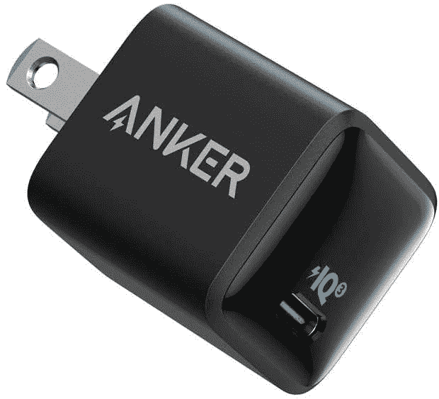

# Anker 的紧凑型 USB Type-C 充电器降至仅 14 美元

> 原文：<https://www.xda-developers.com/ankers-compact-usb-type-c-charger-drops-to-just-14/>

# Anker 的紧凑型 USB Type-C 充电器降至仅 14 美元

Anker 的超级微型 PowerPort III 纳米充电器，功率为 20W，目前在亚马逊上售价为 13.59 美元。

Anker 出售一些最好的移动配件，包括电池、充电器、电源适配器等等。仅该公司收集的电源适配器就可以写一本书，但最小的型号之一是 PowerPort III Nano，目前在亚马逊仅售 13.59 美元。这比通常的价格低了 3.40 美元，也符合之前从 6 月份开始的折扣。

Anker PowerPort III Nano 可以为任何支持 USB 电力传输(简称 USB-PD)的设备提供高达 20W 的电力。这包括大多数 Android 设备、最近的 iPads 和 iPhones、任天堂 Switch 以及大多数其他 C 类设备。这里的主要卖点是尺寸——砖的宽度刚刚超过 1 英寸。许多移动设备的充电速度可以超过 20W，但 PowerPort 的超级紧凑设计使其成为一个很好的备用充电器，可以放在包或手提箱中。

 <picture></picture> 

Anker PowerPort III Nano

##### Anker 511 20W 纳米充电器

这款超微型 USB Type-C 充电器最高支持 20W。

这里的主要缺点是只有一个 Type-C 端口，所以你不能轻松地为多个设备充电。插入带有标准 USB 型电缆的设备(像大多数智能手表一样)也需要[一个加密狗](https://www.amazon.com/AmazonBasics-Type-C-Gen1-Female-Adapter/dp/B01GGKYXVE?tag=xda-209qf63-20&ascsubtag=UUxdaUeUpU4476&asc_refurl=https%3A%2F%2Fwww.xda-developers.com%2Fankers-compact-usb-type-c-charger-drops-to-just-14%2F&asc_campaign=Short-Term)，盒子里没有 C 型电缆。如果你周围没有足够的 C 型线缆， [Anker 也卖这些](https://www.amazon.com/Anker-Powerline-Certified-Delivery-Chromebook/dp/B085HN59D3?tag=xda-209qf63-20&ascsubtag=UUxdaUeUpU4476&asc_refurl=https%3A%2F%2Fwww.xda-developers.com%2Fankers-compact-usb-type-c-charger-drops-to-just-14%2F&asc_campaign=Short-Term)。