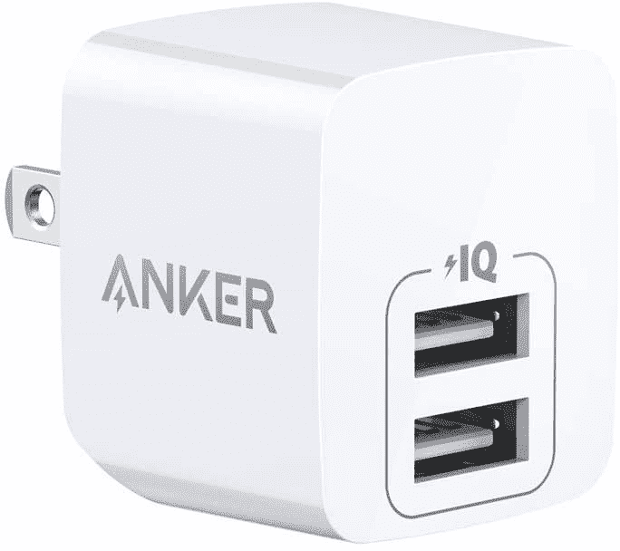

# Anker 的双端口 USB 充电器目前仅售 11 美元

> 原文：<https://www.xda-developers.com/ankers-dual-port-usb-charger-is-just-11-right-now/>

# Anker 的双端口 USB 充电器目前仅售 11 美元

Anker 的微型 PowerPort Mini 有两个 USB 端口，售价仅为 11.19 美元，充电速度高达 12W。

Anker 是周围最好的移动配件公司之一，销售几十种优秀的无线充电器、电缆、墙壁适配器和其他有用的设备。Anker 有很多充电器，但最小的型号之一是 PowerPort Mini Dual Port，这是一种超级紧凑的墙上适配器，有两个 USB 端口。这款充电器通常售价 14 美元，但现在特价 11.19 美元。这不是这款充电器有史以来的最低价格，但仍然很划算。

这款充电器的主要卖点是尺寸——只有 30 x 33 x 38 毫米，比美国的四分之一高不了多少。你可以在前面获得两个“power IQ”USB Type-A 插头，最大充电功率为 12W(同时使用两个端口意味着每个设备 6W)。但是，这两个连接器都不是 USB Type-C 端口。

 <picture></picture> 

Anker PowerPort Mini

##### Anker PowerPort 迷你双

这款带有两个 USB 端口的超微型充电器在亚马逊上的售价为 11.19 美元，比通常价格低 2.80 美元。

正常速度充电和无 C 型连接器的组合使这种适配器成为小型配件(如智能手表和电子阅读器)和不需要快速充电的手机的绝佳选择。如果快速充电对你来说比两个连接器更重要，那么 Anker 的 20W 单 C 型端口充电器也在销售[，价格多几美元](https://www.amazon.com/Charger-Anker-Adapter-PowerPort-iPhone/dp/B07WRKXQ8W?tag=xda-26cmv9h-20&ascsubtag=UUxdaUeUpU3523&asc_refurl=https%3A%2F%2Fwww.xda-developers.com%2Fankers-dual-port-usb-charger-is-just-11-right-now%2F&asc_campaign=Short-Term)。