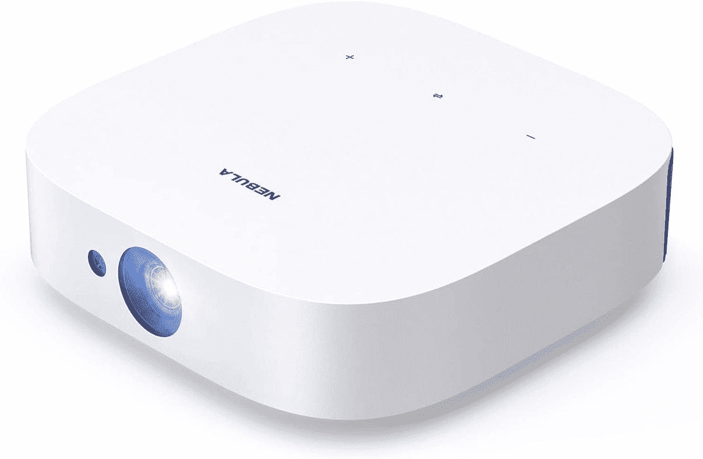

# Anker 的带安卓电视的星云太阳能便携式投影仪优惠 80 美元

> 原文：<https://www.xda-developers.com/ankers-nebula-solar-portable-projector-with-android-tv-is-80-off/>

# Anker 的带安卓电视的星云太阳能便携式投影仪优惠 80 美元

这款便携式投影仪具有 Android TV 9.0、400 ANSI 流明灯、可充电电池、全尺寸 HDMI 等等。

Anker 销售基于 Android 的投影仪已经有几年了，该公司最近的一个型号是 Nebula Solar。这是一款运行 Android TV 9.0 的便携式投影仪，完全支持数千种流行的电视应用，原生分辨率为 1080p。Anker 现在已经将投影仪的价格降到了 520 美元，比正常价格节省了 80 美元。

Nebula Solar Portable 有一个 400 ANSI 流明的灯(中等亮度，尽管户外观看将限于夜间)，分辨率为 1920 x 1080，两个 3W 扬声器，一个可持续 3 小时的内置电池，以及杜比数字增强支持。主要卖点是它运行带有谷歌 Play 商店的 Android TV，所以你可以安装流行的媒体应用程序，如 Disney+、Hulu、HBO Max、YouTube 和 Pluto TV。有一个内置的“星云经理”应用程序用于安装网飞和亚马逊视频。

 <picture></picture> 

Anker Nebula Solar Portable

##### 安克尔星云太阳能便携式 1080p 投影仪

这款便携式投影仪可以做到这一切，这要归功于它的内部电池和 Android TV 软件。点击产品页面上的优惠券按钮获得全额折扣。

与其他 Android 电视设备一样，您可以通过附带的遥控器使用谷歌助手，投影仪可以作为 Chromecast 目标。还有一个全尺寸的 HDMI 端口，所以你可以连接游戏控制台、其他流媒体设备或任何其他插入电视的设备。最后，背面的 USB 端口可用于连接外部存储驱动器，非常适合在没有可靠互联网连接的地方(如野营)随身携带电影和电视节目。