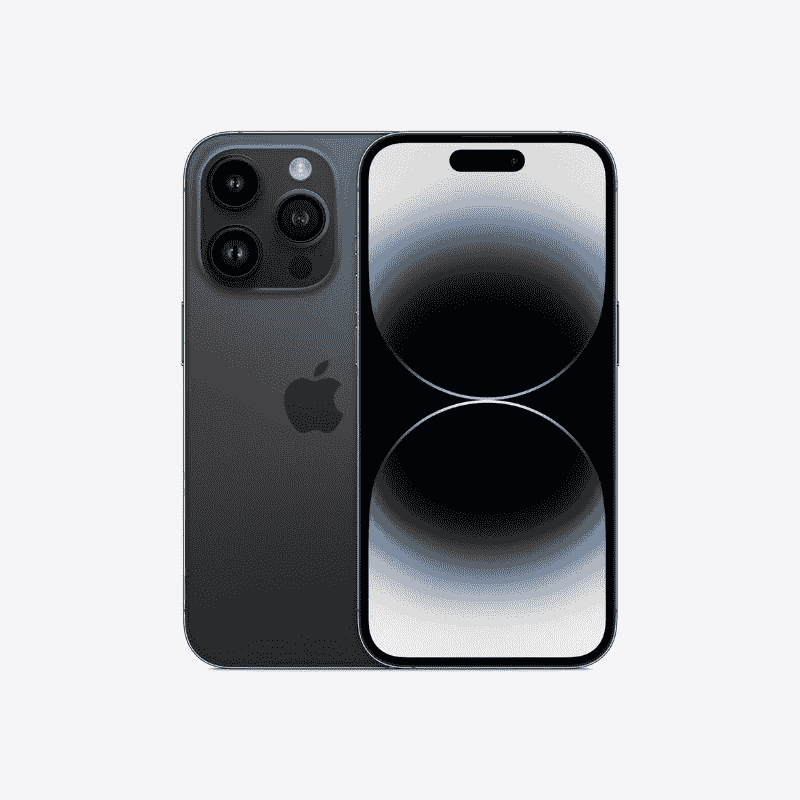

# 苹果发布了其最强大的移动芯片 A16 Bionic

> 原文：<https://www.xda-developers.com/apple-a16-bionic-launch/>

# 苹果公司发布了新的 A16 仿生，这是最新款 iPhones 中最强大的移动芯片

苹果公司发布了新的 A16 Bionic，这是最新 iPhone 14 Pro 和 iPhone 14 Pro Max 最强大的移动芯片。

苹果新的 [iPhone 14 Pro 和 iPhone 14 Pro Max](https://www.xda-developers.com/apple-iphone-14-pro/) 由该公司新的 A16 仿生芯片组驱动。它是 A15 Bionic 的继任者，它集成了更多晶体管和新组件，以进一步提高人工智能等关键领域的整体性能。新的 A16 Bionic 是苹果的第一款 4 纳米工艺芯片，它拥有 160 亿个晶体管，是 iPhone 中最多的。这款新的多核芯片配备了多达六个高性能内核和两个高效内核。

据苹果公司称，A16 Bionic 上的高性能核心比 A15 Bionic 的高性能核心耗电少 30%。效率核心还使用了竞争对手三分之一的功率，该公司没有透露名称。所有这些都意味着新的 iPhone 14 Pro 和 iPhone 14 Pro Max 将更加节能。新芯片还具有强大的五核 GPU，内存带宽增加了 50%，以及 16 核神经引擎，用于加速机器学习工作负载。

A16 仿生芯片还拥有一个新的显示引擎，为今年 Pro 型号的新显示器提供动力。它有助于实现高达 2000 尼特的峰值亮度，并允许它们降低到 1Hz 的刷新率。新的显示引擎也有助于抗锯齿和 iPhone 14 系列的新功能。

 <picture></picture> 

Apple iPhone 14 Pro

苹果的新 iPhone 14 Pro 代表了该公司所能提供的最佳产品。它由新的 A16 仿生芯片组提供动力，并提供诸如永远在线显示、更高的峰值亮度等功能。

 <picture></picture> 

Apple iPhone 14 Pro

新款 iPhone 14 Pro Max 采用了苹果新的 A16 仿生芯片组，并提供了一些令人兴奋的新功能，包括永远在线的显示屏。由于采用了新的芯片，你还可以期待它有更长的电池寿命。

如果你错过了公告，普通 iPhone 14 和 iPhone 14 Plus 型号将继续使用 A15 仿生芯片。他们将使用去年 iPhone 13 Pro 系列中的 5 核版本 A15 芯片，因此这仍然是对常规 iPhone 13 系列的升级。除了新的芯片组，新的 iPhone 14 Pro 型号还有许多其他新功能，包括新的药丸形状的切口。然而，这个剪切块将动态调整，以显示各种信息，如充电状态、通话、AirPod 配对等。