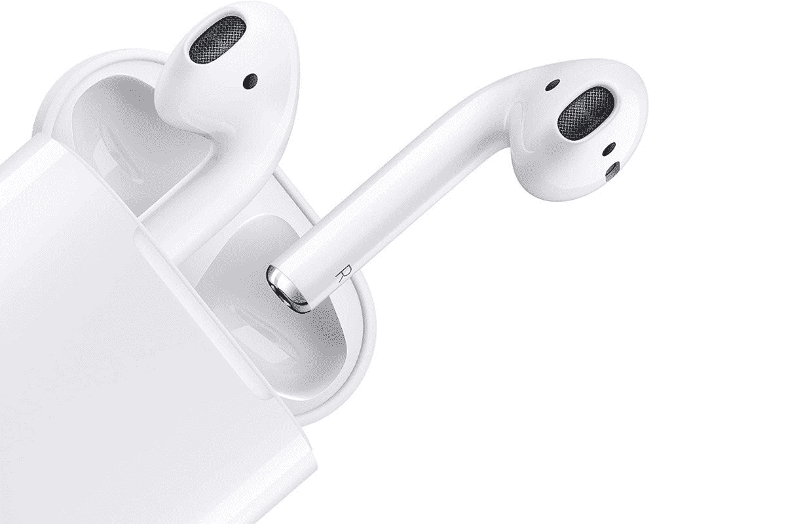

# 苹果第二代 AirPods 获得 Prime 早期访问的大幅折扣

> 原文：<https://www.xda-developers.com/apple-airpods-2-prime-early-access-sale/>

有时候很容易忘记苹果有一整条线的 AirPods 产品。尽管最初是在 2019 年发布的，但苹果仍然保留了第二代 AirPods，为用户提供了更实惠的无线耳塞选择。虽然它们的零售价通常为 129 美元(亚马逊的标价为 159 美元)，但在亚马逊的 Prime Early Access 销售活动中，这款设备获得了令人印象深刻的折扣，折扣至 89.99 美元。

谈到功能，第二代 AirPods 提供了很多功能，苹果公司声称它提供了“令人难以置信的无线耳机体验”。在很大程度上，这仍然是正确的，但这主要归功于它简单的配对系统和在它们被放入耳朵的那一刻立即连接的能力。如果你喜欢使用苹果的数字助理，无线耳塞还将支持 Siri。这听起来令人印象深刻，这都要归功于苹果的 H1 芯片，使更快的连接、访问 Siri 等成为可能。

虽然有触摸控制，但你必须使用耳塞上的轻拍来激活播放、跳过或接听电话等操作。不幸的是，AirPods 没有无线充电外壳，这意味着你必须使用 Lightning 电缆充电。有一个无线充电盒，但需要额外付费。令人欣慰的是，AirPods 提供了长达 5 小时的听音时间或 3 小时的通话时间，附带的外壳可以提供长达 25 小时的使用时间。如果你遇到没电的情况，你可以给 AirPods 充电 15 分钟，使用三个小时。

如果第二代 AirPods 听起来像是你需要的东西，你可以使用下面的链接前往亚马逊，以 89.99 美元的折扣价购买它们。如果你正在寻找一个替代来源，我们还包括一个到百思买的链接，但价格稍微高一点，在 99.99 美元。

 <picture></picture> 

Apple AirPods (2nd Generation)

##### 苹果 AirPods(第二代)

搭载 H1 芯片的苹果第二代 AirPods。