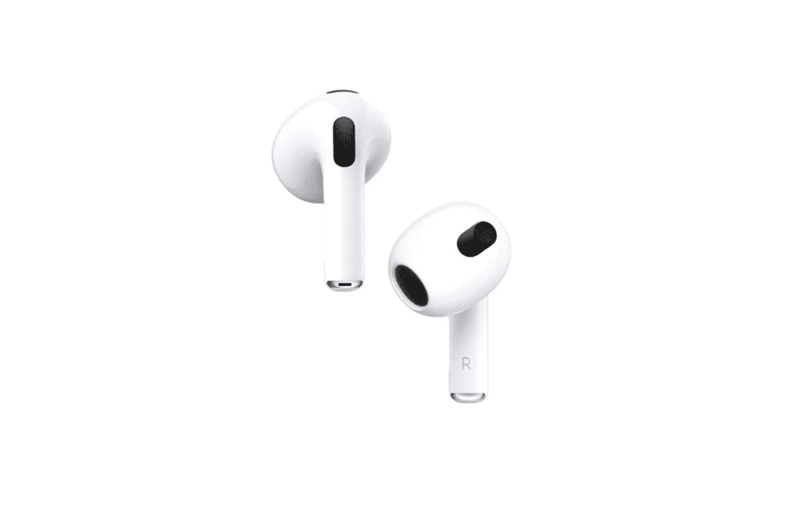

# 苹果新的 AirPods 3 拥有 AirPods Pro 般的设计，空间音频，售价 179 美元

> 原文：<https://www.xda-developers.com/apple-airpods-3-announced/>

在今天的 Unleashed 活动上，苹果发布了其入门级 AirPods 的最新版本。新款 AirPods 3 借鉴了更高端的 AirPods Pro 的许多设计线索，同时也带来了一些改进，如新的无线芯片、更长的电池寿命、无线充电支持作为标准功能等等。

就设计而言，AirPods 3 看起来一点也不像 AirPods 2。新型号的特点是茎较短，使其外观与 AirPods Pro 相同。然而，与 Pro 型号不同的是，AirPods 3 采用了开放式设计，没有硅胶尖端。它们还具有新的力触摸传感器控制。

为了获得强劲的低音和清脆的高音，新款 AirPods 3 配备了定制的低失真驱动器。此外，耳塞还借用了高级 AirPods Pro 的自适应均衡器功能，该功能可以实时自动调整频率，以获得更好的音频。

与传言相反，AirPods 3 没有配备主动噪音消除(ANC)，鉴于其开放式设计，这是可以理解的。不过 AirPods 3 确实支持空间音频，这是在 AirPods Pro 上推出的。此外，还支持杜比全景声。

虽然第二代 AirPods 支持无线充电，但你必须为无线充电外壳支付额外费用。有了 AirPods 3，无线充电现在是一个标准功能，你还可以获得 MagSafe 支持。照明口还在，有线充电。在电池寿命方面，苹果公司声称可长达 6 小时的收听时间，比以前的型号有所提高，外壳进一步将电池寿命延长至 30 小时。最后，AirPods 3 还具有 IPX4 防水防汗功能。

### 定价和可用性

 <picture></picture> 

AirPods 3

##### 苹果 AirPods 3

AirPods 3 是苹果公司最新的入门级耳塞，采用 AirPods Pro 般的设计，改善了音质，空间音频，防水防汗，电池续航时间长达 30 小时。

苹果 AirPods 3 售价 179 美元，将于下周上市。预购从今天开始。和以前的 AirPods 一样，新的[耳塞](https://www.xda-developers.com/best-wireless-earbuds/)只有一种白色。

*敬请关注 XDA 门户网站，了解关于新发布的 MacBook Pro 系列、新的 M1 芯片组等的更多报道。*