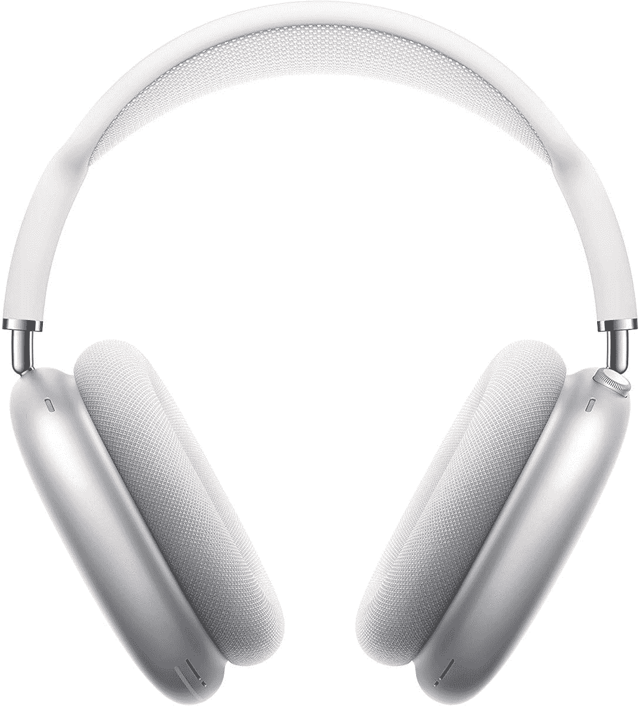

# 苹果 AirPods Max 在亚马逊 Prime Day 销售中降价 100 美元

> 原文：<https://www.xda-developers.com/apple-airpods-max-prime-day-deal/>

# 苹果 AirPods Max 在亚马逊 Prime Day 销售中降价 100 美元

苹果的 AirPods Max 高级无线耳机在正在进行的亚马逊 Prime Day 销售期间以折扣价出售。

亚马逊的 Prime Day 交易正在全面展开，为智能手机、配件、智能家居设备等提供巨大折扣。苹果产品——尤其是相对较新的产品——通常不会在季节性销售期间得到很大的折扣，但你现在可以在一些 AirPods 上节省很多钱。在有限的时间内，你可以在亚马逊上购买苹果的高级无线耳机，节省 100 美元。

多亏了黄金日促销活动，[苹果 AirPods Max](https://www.xda-developers.com/apple-airpods-max-launch-premium-over-ear-headphones-anc/) 的所有五种颜色都降到了 449 美元。这听起来可能不是一个巨大的折扣，但考虑到 AirPods Max 很少以折扣价出售，这绝对值得一看。事实上，这些耳机的所有颜色都可以购买，让您更容易选择风格，而不必担心错过折扣。

苹果的 AirPods Max 是目前市场上最好的无线耳机之一。它展示了苹果公司所谓的“定制声学设计”，包括一个不锈钢头带和一个透气的针织网格天篷。耳罩上还有记忆泡沫，佩戴舒适。AirPods Max 还配备了受 Apple Watch 启发的数字表冠，用于控制音量、音乐播放等。值得注意的是，还有一个传统的按钮，用于在主动噪声消除(ANC)和透明模式之间切换。这对耳机还装有苹果强大的 H1 芯片，以及其他值得注意的功能，如自适应均衡器，空间音频和 20 小时的电池寿命。

 <picture></picture> 

Apple AirPods Max

##### 苹果 AirPods Max

苹果 AirPods Max 是一副非常昂贵的耳机，尽管它们带有 AirPods 的名字，并且在苹果生态系统中运行良好。

虽然这不是我们在亚马逊上看到的 AirPods Max 的最低价格，但我们认为如果你想买一副高级无线耳机，它们仍然值得考虑。如果你不想在 AirPods Max 上花那么多钱，那么你也可以考虑看看 [AirPods Pro](https://www.xda-developers.com/apple-airpods-pro-170-prime-day/) 无线耳塞。它们在黄金日销售时也会打折，所以不要错过这些苹果的优秀音频产品。