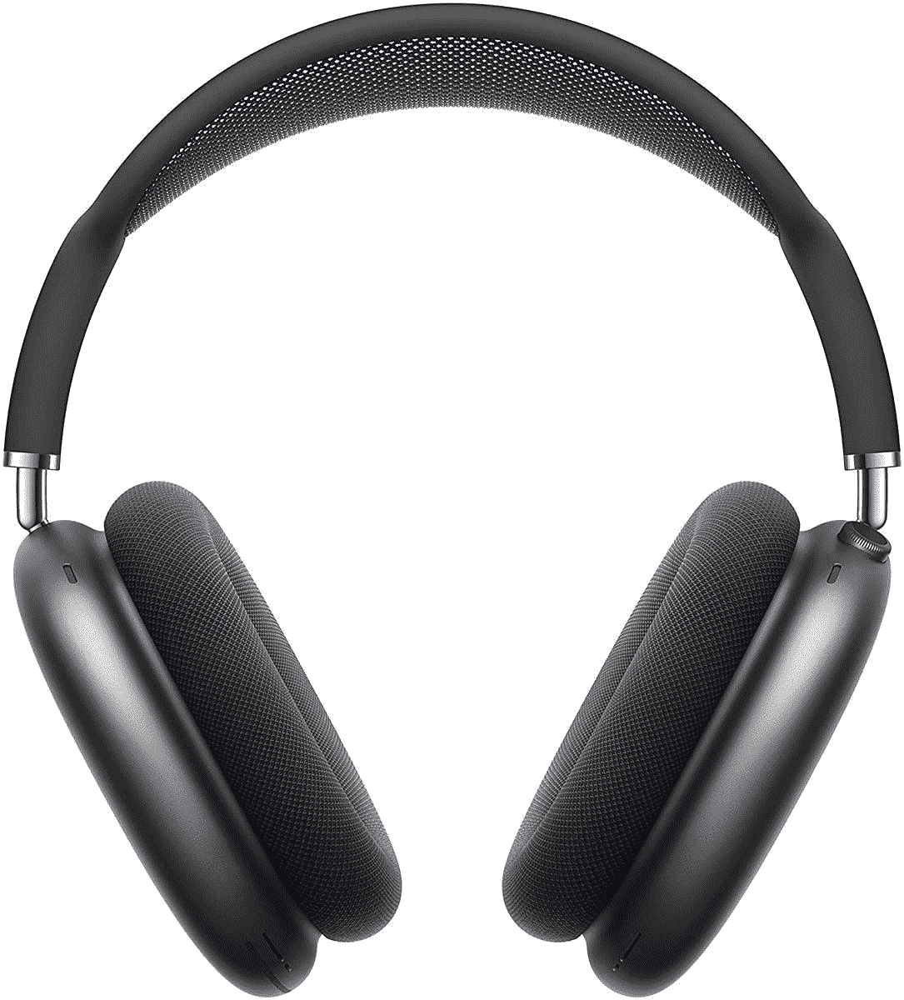

# 苹果 AirPods Max 现在售价 449 美元，这是迄今为止的最低价(低 100 美元)

> 原文：<https://www.xda-developers.com/apple-airpods-now-on-sale-for-449-the-lowest-price-yet-100-off/>

# 苹果 AirPods Max 现在售价 449 美元，这是迄今为止的最低价(低 100 美元)

苹果的高端耳机在多家零售商处售价 449 美元，比原价低 100 美元。

AirPods Max 是苹果最高端的无线耳机，最初于去年发布，售价高达 549 美元。这对任何一副耳机来说都是一大笔钱，但随着最近的销售，价格已经慢慢下降，AirPods Max [上个月在英国创下了历史新低](https://www.xda-developers.com/apple-airpods-max-402-lowest-price/)。现在你可以在多家零售店买到一双 449 美元的鞋子，这是美国有记录以来的最低价格(至少在主要零售商那里)，比原价低 100 美元。

这是苹果的第一款，也是目前唯一的一款耳挂式耳机。它有一个由透气针织网罩制成的头带，一个受 Apple Watch 启发的控制音量和播放的表盘，主动噪音消除(ANC)和 40 毫米动态驱动器。AirPods Max 无疑拥有出色的音质，尽管它并不完美——仍然不支持[无损苹果音乐](https://www.xda-developers.com/airpods-max-wont-support-apple-music-lossless-streaming/)。

 <picture></picture> 

Apple AirPods Max

##### 苹果 AirPods Max

苹果的高端耳机在多家零售商处售价 449 美元，比原价低 100 美元。

自发布以来，苹果已经对 AirPods Max 进行了几次更新。虽然硬件没变，但对“查找我的”网络的支持已于上周(T7)到来，因此如果你碰巧丢失了耳机，其他苹果设备可以帮助你找到它们。

目前尚不清楚目前的销售何时结束——百思买表示折扣将在今天之后结束，而亚马逊的商品清单上没有结束日期。截至本文发表时，所有颜色都在出售:太空灰、天蓝、绿色、粉色和银色。